# Simple To-Do App - Fullstack Architecture

**Version:** 1.0
**Date:** 2026-01-19
**Author:** Winston (Architect)
**Status:** Draft - In Progress

---

## 1. Introduction

This document outlines the complete fullstack architecture for **Simple To-Do App**, including backend systems, frontend implementation, and their integration. It serves as the single source of truth for AI-driven development, ensuring consistency across the entire technology stack.

This unified approach combines what would traditionally be separate backend and frontend architecture documents, streamlining the development process for modern fullstack applications where these concerns are increasingly intertwined.

### Starter Template or Existing Project

**N/A - Greenfield project**

The Simple To-Do App is a greenfield development with no starter template or existing codebase. The architecture will be designed from scratch based on PRD requirements and technical assumptions (Node.js/TypeScript monolith, Express + React, JSON file storage for MVP).

### Change Log

| Date | Version | Description | Author |
|------|---------|-------------|--------|
| 2026-01-19 | v1.0 | Initial fullstack architecture document | Winston (Architect) |

---

## 2. High Level Architecture

### Technical Summary

The Simple To-Do App implements a **monolithic Node.js/TypeScript architecture** running as a single process on localhost, serving both a React-based web interface and REST API endpoints. The backend executes business logic services (TaskService, CelebrationService, PromptingService, WIPLimitService) in-process, with local JSON file storage for data persistence. A background scheduler manages proactive task prompting via Server-Sent Events (SSE) for real-time browser push notifications. The frontend uses React 18 with TypeScript, Vite for fast builds, and CSS Modules/Tailwind for styling, communicating with the backend through a simple REST API. This architecture achieves the PRD's goal of rapid MVP development (4-6 weeks) while maintaining clean separation of concerns and enabling future migration to hosted deployment.

### Platform and Infrastructure Choice

After reviewing the PRD requirements (localhost-only MVP, 5-10 pilot users, privacy-first, 4-6 week timeline), I recommend the following platform:

**Platform:** Local Development Environment (No Cloud)
**Key Services:**
- **Runtime:** Node.js 18+ LTS (local process)
- **Web Server:** Express.js (serves both static frontend and API)
- **Data Storage:** Local filesystem (JSON files in `./data/` directory)
- **Build System:** Vite (development server + production build)
- **Process Management:** npm scripts (`npm run dev`, `npm start`)

**Deployment Host and Regions:** N/A - Runs locally on user's machine (Windows 10+, macOS 12+, Linux Ubuntu 20.04+)

**Rationale:**
- **No Cloud Hosting Needed:** PRD specifies localhost-only for MVP; hosting adds complexity and cost with zero benefit
- **Privacy Compliance:** All data stays local (NFR4: no external data transmission)
- **Simplicity:** Single process monolith is fastest path to validation within timeline
- **Future Path:** Architecture supports future migration to Vercel/AWS/Azure in Phase 2 if needed

**Alternative Considered:** Vercel + Supabase - Rejected for MVP as it requires authentication, cloud storage, and hosting setup that delays validation of core hypotheses

### Repository Structure

**Structure:** Monorepo with single Git repository
**Monorepo Tool:** npm workspaces (built into npm 7+, no additional tooling needed)
**Package Organization:** Organized by concern with clear boundaries:
- `/apps/web` - React frontend application
- `/apps/server` - Express backend application
- `/packages/shared` - Shared TypeScript types, constants, and utilities
- `/packages/config` - Shared ESLint, TypeScript, and testing configurations

**Rationale:**
1. **MVP Simplicity:** PRD technical assumptions recommend monorepo for ease of development and refactoring
2. **Type Safety:** Shared types package ensures frontend/backend contract consistency
3. **No Over-Engineering:** npm workspaces provide sufficient monorepo features without adding Nx/Turborepo complexity
4. **Fast Iteration:** All code in one place, easy to search and ensure consistency
5. **Future-Ready:** Structure supports extraction of services or deployment as separate packages if needed in Phase 2

#### Frontend Directory Structure (`/apps/web`)

**Detailed Organization:**

```
apps/web/
├── public/                          # Static assets served directly
│   ├── favicon.ico
│   ├── robots.txt
│   └── manifest.json
│
├── src/
│   ├── components/                  # Reusable UI components
│   │   ├── TaskCard.tsx            # Individual task display
│   │   ├── TaskCard.module.css     # Component-specific styles
│   │   ├── AddTaskInput.tsx        # Task creation form
│   │   ├── TaskList.tsx            # Task list container
│   │   ├── CelebrationOverlay.tsx  # Celebration modal
│   │   ├── PromptToast.tsx         # Proactive prompt notification
│   │   ├── SettingsModal.tsx       # Settings dialog
│   │   ├── WIPCountIndicator.tsx   # WIP limit progress bar
│   │   ├── EmptyState.tsx          # Empty state displays
│   │   └── shared/                 # Shared/foundational components
│   │       ├── Button.tsx
│   │       ├── Modal.tsx
│   │       └── Icon.tsx
│   │
│   ├── views/                       # Page-level components (routes)
│   │   ├── TaskListView.tsx        # Main task list page (/)
│   │   ├── SettingsView.tsx        # Settings page (/settings)
│   │   └── AnalyticsView.tsx       # Analytics page (/analytics)
│   │
│   ├── hooks/                       # Custom React hooks
│   │   ├── useTasks.ts             # Task state management
│   │   ├── useSSE.ts               # Server-Sent Events connection
│   │   ├── useConfig.ts            # Configuration state
│   │   ├── useTaskSearch.ts        # Search/filter logic (future)
│   │   └── useKeyboardShortcuts.ts # Keyboard navigation
│   │
│   ├── services/                    # API client layer
│   │   ├── api.ts                  # Base API client (fetch wrapper)
│   │   ├── tasks.ts                # Task API calls
│   │   ├── config.ts               # Config API calls
│   │   ├── celebrations.ts         # Celebration API calls
│   │   └── prompts.ts              # Prompt API calls
│   │
│   ├── context/                     # React Context providers
│   │   ├── TaskContext.tsx         # Global task state
│   │   ├── ConfigContext.tsx       # Global config state
│   │   └── UIContext.tsx           # UI state (modals, toasts)
│   │
│   ├── utils/                       # Helper functions and utilities
│   │   ├── announceToScreenReader.ts  # Accessibility helper
│   │   ├── formatDuration.ts       # Time formatting
│   │   ├── performanceMonitoring.ts # Performance tracking
│   │   └── validation.ts           # Client-side validation
│   │
│   ├── styles/                      # Global styles
│   │   ├── global.css              # Global styles and resets
│   │   ├── colors.css              # CSS variables for colors
│   │   ├── typography.css          # Font and text styles
│   │   ├── focus.css               # Focus indicator styles
│   │   ├── accessibility.css       # Accessibility utilities (.sr-only)
│   │   └── animations.css          # Animation utilities
│   │
│   ├── types/                       # Frontend-specific TypeScript types
│   │   └── index.ts                # Extended types not in shared package
│   │
│   ├── App.tsx                      # Root component with routing
│   ├── main.tsx                     # Entry point
│   └── vite-env.d.ts               # Vite type definitions
│
├── tests/                           # Frontend tests
│   ├── unit/
│   │   ├── components/
│   │   │   ├── TaskCard.test.tsx
│   │   │   ├── TaskCard.a11y.test.tsx  # Accessibility tests
│   │   │   └── AddTaskInput.test.tsx
│   │   └── hooks/
│   │       ├── useTasks.test.ts
│   │       └── useSSE.test.ts
│   ├── integration/
│   │   ├── TaskListFlow.test.tsx
│   │   ├── WIPLimitFlow.test.tsx
│   │   └── SettingsFlow.test.tsx
│   ├── mocks/
│   │   └── handlers.ts             # MSW API handlers
│   └── helpers/
│       ├── testSetup.ts
│       └── renderWithProviders.tsx
│
├── index.html                       # HTML entry point
├── vite.config.ts                   # Vite configuration
├── tsconfig.json                    # TypeScript configuration
├── tsconfig.node.json               # TypeScript for Node (Vite config)
└── package.json                     # Frontend dependencies
```

**File Placement Guidelines:**

| New File Type | Where to Place | Naming Convention |
|--------------|----------------|-------------------|
| React Component | `src/components/` | `ComponentName.tsx` |
| Page/Route Component | `src/views/` | `PageNameView.tsx` |
| Custom Hook | `src/hooks/` | `useFeatureName.ts` |
| API Service | `src/services/` | `resourceName.ts` |
| Utility Function | `src/utils/` | `functionName.ts` |
| Context Provider | `src/context/` | `FeatureContext.tsx` |
| Component Styles | Same directory as component | `ComponentName.module.css` |
| Global Styles | `src/styles/` | `purpose.css` |
| Component Test | `tests/unit/components/` | `ComponentName.test.tsx` |
| Integration Test | `tests/integration/` | `FeatureFlow.test.tsx` |

**Import Path Examples:**

```typescript
// Component imports another component (relative)
import { Button } from '../shared/Button';
import styles from './TaskCard.module.css';

// Component uses hook (relative)
import { useTasks } from '../../hooks/useTasks';

// Component uses API service (relative)
import { tasks } from '../../services/tasks';

// Component uses shared types (absolute from package)
import type { Task } from '@simple-todo/shared/types';
import { TaskHelpers } from '@simple-todo/shared/utils';

// Component uses context (relative)
import { useTaskContext } from '../../context/TaskContext';
```

#### Backend Directory Structure (`/apps/server`)

**Detailed Organization:**

```
apps/server/
├── src/
│   ├── routes/                      # API route handlers
│   │   ├── tasks.ts                # Task endpoints
│   │   ├── config.ts               # Config endpoints
│   │   ├── celebrations.ts         # Celebration endpoints
│   │   ├── prompts.ts              # Prompt/SSE endpoints
│   │   ├── analytics.ts            # Analytics endpoints (Phase 2)
│   │   └── health.ts               # Health check endpoint
│   │
│   ├── services/                    # Business logic layer
│   │   ├── TaskService.ts          # Task CRUD operations
│   │   ├── WIPLimitService.ts      # WIP limit enforcement
│   │   ├── CelebrationService.ts   # Celebration message generation
│   │   ├── PromptingService.ts     # Proactive prompting logic
│   │   ├── AnalyticsService.ts     # Analytics calculations
│   │   └── DataService.ts          # Data persistence abstraction
│   │
│   ├── middleware/                  # Express middleware
│   │   ├── errorHandler.ts         # Global error handling
│   │   ├── validation.ts           # Zod validation middleware
│   │   ├── performanceMonitoring.ts # Request timing
│   │   └── logging.ts              # Request logging
│   │
│   ├── utils/                       # Helper functions
│   │   ├── logger.ts               # Winston logger setup
│   │   └── asyncHandler.ts         # Async route wrapper
│   │
│   ├── types/                       # Backend-specific types
│   │   └── index.ts                # Extended types
│   │
│   ├── app.ts                       # Express app setup
│   └── index.ts                     # Server entry point
│
├── tests/                           # Backend tests
│   ├── unit/
│   │   ├── services/
│   │   │   ├── TaskService.test.ts
│   │   │   ├── WIPLimitService.test.ts
│   │   │   └── CelebrationService.test.ts
│   │   └── utils/
│   │       └── TaskHelpers.test.ts
│   ├── integration/
│   │   ├── api/
│   │   │   ├── tasks.test.ts
│   │   │   ├── config.test.ts
│   │   │   └── celebrations.test.ts
│   │   └── data/
│   │       └── DataService.test.ts
│   ├── fixtures/
│   │   ├── tasks.json
│   │   └── config.json
│   └── helpers/
│       ├── testSetup.ts
│       └── factories.ts            # Test data factories
│
├── tsconfig.json                    # TypeScript configuration
├── jest.config.js                   # Jest configuration
└── package.json                     # Backend dependencies
```

#### Shared Packages Structure

**`/packages/shared` - Shared Types and Utilities:**

```
packages/shared/
├── src/
│   ├── types/                       # Shared TypeScript types
│   │   ├── Task.ts                 # Task interface
│   │   ├── Config.ts               # Config interface
│   │   ├── CelebrationMessage.ts   # Celebration types
│   │   ├── PromptEvent.ts          # Prompt types
│   │   ├── AnalyticsData.ts        # Analytics types
│   │   └── index.ts                # Barrel export
│   │
│   ├── utils/                       # Shared utility functions
│   │   ├── TaskHelpers.ts          # Task computation helpers
│   │   ├── constants.ts            # Shared constants
│   │   └── index.ts                # Barrel export
│   │
│   └── index.ts                     # Main barrel export
│
├── tsconfig.json
└── package.json
```

**`/packages/config` - Shared Configurations:**

```
packages/config/
├── eslint/
│   └── base.js                      # Base ESLint config
├── typescript/
│   ├── base.json                    # Base TypeScript config
│   ├── react.json                   # React-specific overrides
│   └── node.json                    # Node-specific overrides
└── package.json
```

### High Level Architecture Diagram


### Architectural Patterns

**Overall Architecture Patterns:**
- **Monolithic Architecture:** Single Node.js process serves all concerns - _Rationale:_ MVP with 5-10 users doesn't justify microservices complexity; enables rapid development and simple deployment
- **Layered Architecture:** Clear separation of API routes → Services → Data access - _Rationale:_ Testability and future migration flexibility (can extract layers later)

**Frontend Patterns:**
- **Component-Based UI:** Reusable React components with TypeScript - _Rationale:_ Maintainability, type safety, component reuse across screens
- **Unidirectional Data Flow:** React Context API for global state (WIP config, task list) - _Rationale:_ Simpler than Redux for MVP, sufficient for limited global state needs
- **Optimistic UI Updates:** Update UI immediately, revert on API failure - _Rationale:_ Achieves <100ms perceived response time (NFR2)

**Backend Patterns:**
- **Service Layer Pattern:** Business logic encapsulated in services (TaskService, CelebrationService, etc.) - _Rationale:_ Separation of concerns, unit testable, reusable across API endpoints
- **Repository Pattern:** DataService abstracts storage implementation - _Rationale:_ Enables future JSON → SQLite migration without changing business logic (PRD Phase 2 consideration)
- **Singleton Services:** Services instantiated once, shared across requests - _Rationale:_ Localhost single-user app has no concurrency concerns, simplifies architecture

**Integration Patterns:**
- **REST API:** Simple JSON-based HTTP endpoints - _Rationale:_ Standard, well-supported, sufficient for CRUD operations
- **Server-Sent Events (SSE):** Backend pushes prompts to frontend - _Rationale:_ Simpler than WebSockets for one-way server→client push, PRD recommends for proactive prompting
- **Atomic File Writes:** DataService uses temp file + rename pattern - _Rationale:_ Prevents JSON corruption on write failures (NFR6: data integrity)

**Proactive Prompting Pattern:**
- **Event-Driven Scheduling:** Background scheduler emits events via SSE when interval elapsed - _Rationale:_ Decouples prompt generation from HTTP request/response cycle, enables real-time delivery

**Configuration Management Pattern:**
- **Distributed Config Handling:** Config API routes to different services based on business logic needs:
  - `/api/config/wip-limit` → WIPLimitService (validation, business logic, helpful messages)
  - `/api/config/prompting` → PromptingService (update config + restart scheduler)
  - `/api/config/celebrations` → DataService (simple validation + persistence)
  - `/api/config` GET → DataService (read entire config object)
- _Rationale:_ Services own their configuration updates when side effects are needed (scheduler restart, validation logic), otherwise direct DataService access keeps it simple

---

## 3. Tech Stack

### Technology Stack Table

| Category | Technology | Version | Purpose | Rationale |
|----------|-----------|---------|---------|-----------|
| **Frontend Language** | TypeScript | 5.3+ | Type-safe frontend development | Type safety prevents bugs, enables shared types with backend, excellent React support, PRD specifies TypeScript 5+ |
| **Frontend Framework** | React | 18.2+ | UI component library and rendering | PRD specifies React, component-based architecture, large ecosystem, hooks API for state management |
| **UI Component Library** | Headless UI + Custom | 1.7+ | Accessible UI primitives | Minimal bundle size, accessibility built-in, works with Tailwind, allows custom styling per brand guidelines |
| **State Management** | React Context API | Built-in | Global state (tasks, config, UI) | Sufficient for MVP scope, no Redux complexity needed (YAGNI), built into React (0KB overhead) |
| **Backend Language** | TypeScript | 5.3+ | Type-safe backend development | Shared types with frontend, prevents runtime errors, PRD specifies TypeScript 5+ |
| **Backend Framework** | Express.js | 4.18+ | HTTP server and REST API routing | PRD recommends Express, minimal and proven, excellent middleware ecosystem, simple to learn |
| **API Style** | REST | N/A | HTTP JSON API for CRUD operations | Simple CRUD operations don't need GraphQL complexity, standard HTTP verbs, easy to test with curl/Postman |
| **Database** | JSON Files | N/A | Local file storage for tasks/config | PRD specifies "JSON for MVP simplicity", no database server needed, easy to inspect/debug |
| **Cache** | In-Memory (Node.js) | N/A | Active tasks cached in memory | Fast access, localhost single-user has no cache invalidation issues, read from file on startup |
| **File Storage** | Node.js fs module | Built-in | JSON file read/write operations | Built into Node.js, async/await support, atomic writes via temp file + rename pattern |
| **Authentication** | None | N/A | Not needed for MVP | PRD: single-user localhost app, no login required, all data local |
| **Frontend Testing** | Vitest + React Testing Library | 1.0+ / 14.0+ | Component and integration tests | Fast (Vite-powered), modern test runner, RTL for user-centric tests |
| **Backend Testing** | Jest | 29.7+ | Unit and integration tests for services | PRD specifies Jest, TypeScript support, mocking capabilities, 70%+ coverage target |
| **E2E Testing** | Playwright | 1.40+ (Phase 2) | End-to-end browser tests | Deferred to Phase 2 per PRD, fast and reliable, multi-browser support |
| **Build Tool** | Vite | 5.0+ | Frontend dev server and bundler | PRD recommends Vite, instant HMR, optimized builds, native ESM support |
| **Bundler** | Rollup (via Vite) | Built-in | Production bundling | Built into Vite, tree-shaking, code splitting, small bundle output |
| **IaC Tool** | None (Phase 2) | N/A | No infrastructure for localhost MVP | Localhost deployment, no cloud infrastructure, consider for Phase 2 if migrating to hosted |
| **CI/CD** | GitHub Actions | N/A | Automated testing on push/PR | Free for public repos, runs tests and coverage checks, PRD specifies CI/CD pipeline |
| **Monitoring** | None (MVP) / Console | N/A | Development console logging | Localhost MVP doesn't need external monitoring, console.log sufficient for debugging |
| **Logging** | Winston | 3.11+ | Structured logging to file | Persistent logs for debugging, log levels (error/warn/info/debug), JSON format for parsing |
| **CSS Framework** | Tailwind CSS | 3.4+ | Utility-first styling | Rapid UI development, matches Front-End Spec design system, tree-shaking removes unused styles |
| **Real-Time Communication** | Server-Sent Events (SSE) | Native | Server→client prompting push | Built into browsers and Node.js, simpler than WebSockets for one-way push, auto-reconnection |
| **Task Scheduling** | node-schedule | 2.1+ | Proactive prompt scheduling | Cron-like syntax, in-process scheduling, PRD recommends for periodic prompts |
| **Date/Time Utilities** | date-fns | 3.0+ | Time formatting and calculations | Lightweight (tree-shakeable), modern API, used for task age calculations and timestamps |
| **Input Validation** | Zod | 3.22+ | Runtime type validation | TypeScript-first schema validation, validates API inputs, prevents injection attacks (NFR10) |
| **Process Manager** | npm scripts | Built-in | Development and production scripts | Simple for MVP, `npm run dev` (concurrent frontend+backend), `npm start` (production) |

---

## 4. Data Models

### Task

**Purpose:** Represents a single to-do item with lifecycle tracking

**Key Attributes:**
- **id:** string (UUID) - Unique identifier for the task
- **text:** string - Task description (1-500 characters per PRD validation)
- **status:** TaskStatus - Current state of the task ('active' | 'completed')
- **createdAt:** string (ISO 8601) - Timestamp when task was created (FR13)
- **completedAt:** string | null (ISO 8601) - Timestamp when task was completed (FR14), null if active

**Computed Properties (not stored):**
- **duration:** number | null - Milliseconds from creation to completion, computed from timestamps
- **age:** number - Milliseconds since creation, computed from current time
- **textLength:** number - Character count, computed from text.length

#### TypeScript Interface

```typescript
/**
 * Task status type - single source of truth
 */
export type TaskStatus = 'active' | 'completed';

/**
 * Core task entity - minimal, normalized design
 */
export interface Task {
  id: string;
  text: string;
  status: TaskStatus; // Uses named type, not inline union
  createdAt: string; // ISO 8601 format
  completedAt: string | null; // ISO 8601 format, null if active
}

/**
 * Payload for creating a new task (client sends this)
 */
export interface CreateTaskDto {
  text: string;
}

/**
 * Payload for updating task text (client sends this)
 */
export interface UpdateTaskDto {
  text: string;
}

/**
 * Helper functions for computed task properties
 */
export const TaskHelpers = {
  /**
   * Calculate task lifetime duration (creation to completion)
   * @returns Duration in milliseconds, or null if task not completed
   */
  getDuration(task: Task): number | null {
    if (task.status === 'active' || !task.completedAt) {
      return null;
    }
    return new Date(task.completedAt).getTime() - new Date(task.createdAt).getTime();
  },

  /**
   * Calculate task age (creation to now)
   * @returns Age in milliseconds
   */
  getAge(task: Task): number {
    return Date.now() - new Date(task.createdAt).getTime();
  },

  /**
   * Get task text length
   * @returns Character count
   */
  getTextLength(task: Task): number {
    return task.text.length;
  },

  /**
   * Format duration for display (e.g., "2 days", "3 hours")
   */
  formatDuration(milliseconds: number): string {
    const seconds = Math.floor(milliseconds / 1000);
    const minutes = Math.floor(seconds / 60);
    const hours = Math.floor(minutes / 60);
    const days = Math.floor(hours / 24);

    if (days > 0) return `${days} day${days > 1 ? 's' : ''}`;
    if (hours > 0) return `${hours} hour${hours > 1 ? 's' : ''}`;
    if (minutes > 0) return `${minutes} minute${minutes > 1 ? 's' : ''}`;
    return `${seconds} second${seconds !== 1 ? 's' : ''}`;
  },

  /**
   * Get task age category for visual indicators
   */
  getAgeCategory(task: Task): 'fresh' | 'recent' | 'aging' | 'old' | 'stale' {
    const ageMs = TaskHelpers.getAge(task);
    const ageDays = ageMs / (1000 * 60 * 60 * 24);

    if (ageDays < 1) return 'fresh';
    if (ageDays < 3) return 'recent';
    if (ageDays < 7) return 'aging';
    if (ageDays < 14) return 'old';
    return 'stale';
  },
};
```

#### Relationships

- **One-to-Many with PromptEvents:** A task can be prompted multiple times (tracked in PromptEvent model)
- **No foreign keys:** JSON file storage doesn't enforce referential integrity, handled in application logic

---

### Config

**Purpose:** User configuration for WIP limits, prompting preferences, and celebration settings

#### TypeScript Interface

```typescript
/**
 * User configuration and preferences
 */
export interface Config {
  wipLimit: number; // 5-10 range
  promptingEnabled: boolean;
  promptingFrequencyHours: number; // 1-6 range
  celebrationsEnabled: boolean;
  celebrationDurationSeconds: number; // 3-10 range
  browserNotificationsEnabled: boolean;
  hasCompletedSetup: boolean;
  hasSeenPromptEducation: boolean;
}

/**
 * Payload for updating WIP limit
 */
export interface UpdateWipLimitDto {
  limit: number; // Must be 5-10
}

/**
 * Payload for updating prompting config
 */
export interface UpdatePromptingConfigDto {
  enabled: boolean;
  frequencyHours: number; // Must be 1-6
}

/**
 * Payload for updating celebration config
 */
export interface UpdateCelebrationConfigDto {
  enabled: boolean;
  durationSeconds: number; // Must be 3-10
}

/**
 * Default configuration values
 */
export const DEFAULT_CONFIG: Config = {
  wipLimit: 7,
  promptingEnabled: true,
  promptingFrequencyHours: 2.5,
  celebrationsEnabled: true,
  celebrationDurationSeconds: 7,
  browserNotificationsEnabled: false,
  hasCompletedSetup: false,
  hasSeenPromptEducation: false,
};
```

---

### CelebrationMessage

**Purpose:** Represents a celebration message variant with metadata for display

#### TypeScript Interface

```typescript
/**
 * Celebration message variant type - single source of truth
 */
export type CelebrationVariant =
  | 'enthusiastic'
  | 'supportive'
  | 'motivational'
  | 'data-driven';

/**
 * Celebration message with variant for styling
 */
export interface CelebrationMessage {
  message: string;
  variant: CelebrationVariant; // Uses named type, not inline union
  duration?: number; // Optional override for display duration (ms)
}

/**
 * Example celebration messages pool (at least 10 per FR10)
 */
export const CELEBRATION_MESSAGES: CelebrationMessage[] = [
  { message: "Amazing! You crushed it! 🎉", variant: "enthusiastic" },
  { message: "One more done! You're making progress.", variant: "supportive" },
  { message: "Task completed! Keep the momentum going!", variant: "motivational" },
  { message: "Great work! That's progress!", variant: "supportive" },
  { message: "Boom! Another one bites the dust! ✨", variant: "enthusiastic" },
  { message: "Well done! You're on a roll!", variant: "motivational" },
  { message: "Task complete! Nice job staying focused.", variant: "supportive" },
  { message: "Excellent! You're building momentum!", variant: "motivational" },
  { message: "Crushed it! Keep going! 🚀", variant: "enthusiastic" },
  { message: "Progress made! You're doing great.", variant: "supportive" },
  // Data-driven messages dynamically include task count
];
```

---

### PromptEvent

**Purpose:** Analytics tracking for proactive prompt interactions (FR11-FR12 response tracking)

#### TypeScript Interface

```typescript
/**
 * Prompt response type - single source of truth
 */
export type PromptResponse = 'complete' | 'dismiss' | 'snooze' | 'timeout';

/**
 * Proactive prompt event for analytics tracking
 */
export interface PromptEvent {
  promptId: string;
  taskId: string;
  promptedAt: string; // ISO 8601
  response: PromptResponse; // Uses named type, not inline union
  respondedAt: string | null; // ISO 8601, null if timeout
}

/**
 * Payload for prompt generation (server → client via SSE)
 */
export interface ProactivePrompt {
  taskId: string;
  taskText: string;
  promptedAt: string; // ISO 8601
}

/**
 * Payload for snoozing a prompt (client → server)
 */
export interface SnoozePromptDto {
  taskId: string;
}
```

---

### AnalyticsData

**Purpose:** Computed analytics metrics (not persisted, calculated on-demand from tasks/prompts)

#### TypeScript Interface

```typescript
/**
 * Analytics data computed from tasks and prompt events
 */
export interface AnalyticsData {
  completionRate: number; // Percentage (0-100)
  averageTaskLifetime: number; // Milliseconds (computed using TaskHelpers.getDuration)
  taskCountByStatus: {
    active: number;
    completed: number;
  };
  oldestActiveTask: Task | null; // For age indicators
}

/**
 * Prompt analytics (separate from task analytics)
 */
export interface PromptAnalytics {
  promptResponseRate: number; // Percentage (0-100)
  promptResponseBreakdown: Record<PromptResponse, number>; // Uses PromptResponse type
  averageResponseTime: number; // Milliseconds
}
```

---

### Data Model Diagram


---

## 5. API Specification

### REST API Endpoints Summary

| Endpoint | Method | Purpose |
|----------|--------|---------|
| `/api/tasks` | GET | Get all tasks (optional status filter) |
| `/api/tasks` | POST | Create new task (409 if WIP limit reached) |
| `/api/tasks/:id` | GET | Get task by ID |
| `/api/tasks/:id` | PUT | Update task text |
| `/api/tasks/:id` | DELETE | Delete task |
| `/api/tasks/:id/complete` | PATCH | Mark task as complete |
| `/api/config/wip-limit` | GET | Get WIP limit configuration |
| `/api/config/wip-limit` | PUT | Update WIP limit (5-10) |
| `/api/config/prompting` | GET | Get prompting configuration |
| `/api/config/prompting` | PUT | Update prompting settings |
| `/api/config/celebrations` | GET | Get celebration configuration |
| `/api/config/celebrations` | PUT | Update celebration settings |
| `/api/config` | GET | Get all configuration |
| `/api/celebrations/message` | GET | Get random celebration message |
| `/api/prompts/stream` | GET | SSE stream for proactive prompts |
| `/api/prompts/snooze` | POST | Snooze a prompt for 1 hour |
| `/api/analytics/tasks` | GET | Get task analytics (Phase 2) |
| `/api/analytics/prompts` | GET | Get prompt analytics (Phase 2) |

**Complete OpenAPI 3.0 specification available in separate section above.**

---

## 6. Components

### Backend Components

#### 1. DataService

**Responsibility:** Abstract data persistence layer for JSON file storage. Handles atomic file operations with data integrity guarantees.

**Key Interfaces:**
- `loadTasks(): Promise<Task[]>` - Read tasks from tasks.json
- `saveTasks(tasks: Task[]): Promise<void>` - Write tasks to tasks.json with atomic writes
- `loadConfig(): Promise<Config>` - Read config from config.json
- `saveConfig(config: Config): Promise<void>` - Write config to config.json
- `loadPromptEvents(): Promise<PromptEvent[]>` - Read prompt events from prompts.json
- `savePromptEvents(events: PromptEvent[]): Promise<void>` - Write prompt events
- `ensureDataDirectoryExists(): Promise<void>` - Create ./data directory if missing

**Dependencies:**
- Node.js `fs/promises` module (filesystem operations)
- No service dependencies (lowest layer)

**Technology Stack:** TypeScript, Node.js fs/promises, atomic write pattern (temp file + rename)

**Implementation Details:**
```typescript
// Atomic write pattern to prevent corruption
async saveTasks(tasks: Task[]): Promise<void> {
  const tempFile = `${this.tasksFilePath}.tmp`;
  await fs.writeFile(tempFile, JSON.stringify(tasks, null, 2));
  await fs.rename(tempFile, this.tasksFilePath);
}
```

---

#### 2. TaskService

**Responsibility:** Core business logic for task CRUD operations. Encapsulates all task management rules and metadata calculation.

**Key Interfaces:**
- `getAllTasks(status?: TaskStatus): Promise<Task[]>` - Retrieve tasks, optionally filtered
- `getTaskById(id: string): Promise<Task | null>` - Find task by ID
- `createTask(text: string): Promise<Task>` - Create new task (generates UUID, timestamps, metadata)
- `updateTask(id: string, text: string): Promise<Task>` - Update task text
- `deleteTask(id: string): Promise<void>` - Remove task permanently
- `completeTask(id: string): Promise<Task>` - Mark task complete, set completedAt timestamp
- `getActiveTaskCount(): Promise<number>` - Count active tasks for WIP limit checks

**Dependencies:**
- DataService (for persistence)

**Technology Stack:** TypeScript, uuid library for ID generation, date-fns for timestamp handling

**Business Rules Enforced:**
- Task text must be 1-500 characters (validated before creation)
- createdAt set to current ISO timestamp on creation
- completedAt set when status changes to 'completed'
- Only active tasks can be edited (completed tasks are immutable)

---

#### 3. WIPLimitService

**Responsibility:** Enforce Work In Progress limit with helpful messaging. Manage WIP configuration.

**Key Interfaces:**
- `canAddTask(): Promise<boolean>` - Check if new task can be added (active count < limit)
- `getCurrentWIPCount(): Promise<number>` - Get current active task count
- `getWIPLimit(): Promise<number>` - Get configured limit
- `setWIPLimit(limit: number): Promise<void>` - Update limit (validates 5-10 range)
- `getWIPLimitMessage(): Promise<string>` - Generate encouraging message when limit reached

**Dependencies:**
- TaskService (to get active task count)
- DataService (to read/write config)

**Technology Stack:** TypeScript

**Sample Messages:**
- "You have 7 active tasks - complete one before adding more to maintain focus!"
- "You have 10 tasks in progress. Research shows limiting WIP improves completion rates."

---

#### 4. CelebrationService

**Responsibility:** Generate varied celebration messages with rotation to minimize repetition (FR10: 10+ distinct messages).

**Key Interfaces:**
- `getCelebrationMessage(taskId?: string): CelebrationMessage` - Get random celebration, optionally with task context
- `getRecentMessages(): string[]` - Track last 3-5 messages to avoid immediate repetition

**Dependencies:**
- TaskService (optional, for data-driven messages like "That's 5 tasks this week!")
- No persistence (messages hardcoded, recent tracking in-memory)

**Technology Stack:** TypeScript

**Message Pool Strategy:**
- Maintains array of 10+ CelebrationMessage objects with variants
- Random selection weighted to avoid repeating last 3 messages
- Data-driven variant dynamically inserts task count: "Task completed! That's {count} this week!"

---

#### 5. PromptingService

**Responsibility:** Background scheduler for proactive task prompting. Manages prompt lifecycle (schedule, deliver, track responses) and prompting configuration updates.

**Key Interfaces:**
- `startScheduler(): void` - Begin periodic prompting (runs in-process)
- `stopScheduler(): void` - Stop prompting when disabled
- `generatePrompt(): Promise<ProactivePrompt | null>` - Select random active task and create prompt
- `selectTaskForPrompt(): Promise<Task | null>` - Random selection from active tasks
- `snoozePrompt(taskId: string): Promise<void>` - Reschedule prompt for 1 hour later
- `logPromptResponse(promptId: string, response: PromptResponse): Promise<void>` - Track analytics
- `updatePromptingConfig(dto: UpdatePromptingConfigDto): Promise<void>` - Update config and restart scheduler

**Dependencies:**
- TaskService (to get active tasks)
- DataService (to save prompt events for analytics, read/write config)
- node-schedule library (for interval scheduling)
- EventEmitter (to emit prompt events for SSE)

**Technology Stack:** TypeScript, node-schedule, Node.js EventEmitter

**Scheduling Logic (CORRECTED):**
```typescript
// Uses configured frequency from config (1-6 hours per PRD FR17)
async scheduleNextPrompt(): Promise<void> {
  const config = await this.dataService.loadConfig();

  if (!config.promptingEnabled) {
    return; // Don't schedule if disabled
  }

  // Use configured frequency as base, add slight randomness (±15 minutes)
  const baseHours = config.promptingFrequencyHours; // e.g., 2.5
  const randomOffsetMinutes = (Math.random() - 0.5) * 30; // -15 to +15 minutes
  const totalHours = baseHours + (randomOffsetMinutes / 60);

  const milliseconds = totalHours * 60 * 60 * 1000;

  setTimeout(() => this.generatePrompt(), milliseconds);
}
```

---

#### 6. AnalyticsService

**Responsibility:** Calculate behavioral metrics on-demand from task and prompt data (no persistence).

**Key Interfaces:**
- `getCompletionRate(): Promise<number>` - Calculate (completed / total) × 100
- `getAverageTaskLifetime(): Promise<number>` - Mean duration using TaskHelpers.getDuration
- `getTaskCountByStatus(): Promise<{active: number, completed: number}>` - Count by status
- `getOldestActiveTask(): Promise<Task | null>` - Find oldest active task for age indicators
- `getPromptResponseRate(): Promise<number>` - Calculate (responses / total prompts) × 100
- `getPromptResponseBreakdown(): Promise<Record<PromptResponse, number>>` - Count by response type
- `getAverageResponseTime(): Promise<number>` - Mean time from prompt to response

**Dependencies:**
- TaskService (read tasks)
- DataService (read prompt events)
- TaskHelpers (compute durations)

**Technology Stack:** TypeScript

**Performance:** Computes from <10k tasks/events in <10ms, acceptable for MVP

---

### Frontend Components

#### 7. API Client Layer

**Responsibility:** Centralized HTTP client for all backend communication. Provides type-safe API calls with error handling.

**Key Interfaces:**
- `tasks.getAll(status?: TaskStatus): Promise<Task[]>`
- `tasks.create(dto: CreateTaskDto): Promise<Task>`
- `tasks.update(id: string, dto: UpdateTaskDto): Promise<Task>`
- `tasks.complete(id: string): Promise<Task>`
- `tasks.delete(id: string): Promise<void>`
- `config.getWipLimit(): Promise<{limit: number, currentCount: number, canAddTask: boolean}>`
- `config.updateWipLimit(dto: UpdateWipLimitDto): Promise<void>`
- `celebrations.getMessage(taskId?: string): Promise<CelebrationMessage>`
- `prompts.snooze(dto: SnoozePromptDto): Promise<void>`

**Dependencies:**
- Fetch API (native browser)
- Shared types from `/packages/shared/types`

**Technology Stack:** TypeScript, native fetch, Zod for response validation

---

#### 8. Task Management Components (React)

**Responsibility:** UI components for task list display and interactions

**Key Components:**
- **TaskList** - Renders list of tasks with age indicators
- **TaskCard** - Individual task item with actions (edit, complete, delete)
- **AddTaskInput** - Input field and "Add Task" button
- **TaskEditMode** - Inline edit form for task text
- **WIPCountIndicator** - Visual indicator of active tasks vs limit
- **WIPLimitMessage** - Encouraging message when limit reached

**Dependencies:**
- API Client Layer
- React Context (TaskContext for global task state)
- TaskHelpers (for age calculation, duration formatting)

**Technology Stack:** React 18, TypeScript, Tailwind CSS

---

#### 9. Settings Components (React)

**Responsibility:** Configuration UI for WIP limit, prompting, and celebrations

**Key Components:**
- **SettingsModal** - Modal container for all settings
- **WIPLimitConfig** - Slider for WIP limit (5-10)
- **PromptingConfig** - Enable/disable toggle, frequency slider (1-6 hours)
- **CelebrationConfig** - Enable/disable toggle, duration slider (3-10s), preview button
- **BrowserNotificationToggle** - Request permission and enable browser notifications

**Dependencies:**
- API Client Layer
- React Context (ConfigContext for global config state)

**Technology Stack:** React 18, TypeScript, Tailwind CSS, Headless UI for accessible controls

---

#### 10. Celebration Components (React)

**Responsibility:** Display celebration overlays with animations and confetti

**Key Components:**
- **CelebrationOverlay** - Center-screen modal with celebration message
- **ConfettiEffect** - Canvas-based confetti animation (using canvas-confetti library)
- **InboxZeroCelebration** - Special celebration when all tasks completed

**Dependencies:**
- canvas-confetti library (lazy-loaded when celebration triggers)
- API Client Layer (fetch celebration message)
- ConfigContext (celebration duration setting)

**Technology Stack:** React 18, TypeScript, canvas-confetti, CSS animations

---

#### 11. Proactive Prompt Components (React)

**Responsibility:** Display toast notifications for proactive prompts with SSE connection management

**Key Components:**
- **PromptToast** - Toast notification in bottom-right corner with action buttons
- **SSEConnectionManager** - Manages EventSource connection to `/api/prompts/stream`
- **PromptQueue** - Queue multiple prompts, show one at a time

**Dependencies:**
- EventSource API (native browser)
- API Client Layer (for snooze, complete actions)
- TaskContext (to complete task from prompt)

**Technology Stack:** React 18, TypeScript, EventSource, Tailwind CSS

**SSE Connection:**
```typescript
useEffect(() => {
  const eventSource = new EventSource('/api/prompts/stream');

  eventSource.addEventListener('message', (event) => {
    const prompt: ProactivePrompt = JSON.parse(event.data);
    showPromptToast(prompt);
  });

  return () => eventSource.close();
}, []);
```

---

#### 12. Empty State Components (React)

**Responsibility:** Display welcoming or celebratory empty states

**Key Components:**
- **QuickStartGuide** - First-time user empty state with 3-step guide
- **InboxZeroState** - Returning user empty state with completion stats

**Dependencies:**
- AnalyticsService (via API for stats)
- ConfigContext (to check hasCompletedSetup flag)

**Technology Stack:** React 18, TypeScript, Tailwind CSS

---

### Component Diagrams


### Sequence Diagram: Task Completion Flow

```mermaid
sequenceDiagram
    participant User
    participant TaskCard
    participant APIClient
    participant TaskAPI
    participant TaskSvc
    participant DataSvc
    participant CelebSvc
    participant Celebration

    User->>TaskCard: Click "Complete" button
    TaskCard->>APIClient: tasks.complete(taskId)
    Note over TaskCard: Optimistic UI: Remove task from list

    APIClient->>TaskAPI: PATCH /api/tasks/:id/complete
    TaskAPI->>TaskSvc: completeTask(taskId)
    TaskSvc->>DataSvc: loadTasks()
    DataSvc-->>TaskSvc: Task[]

    TaskSvc->>TaskSvc: Find task, set status='completed'<br/>Set completedAt timestamp
    TaskSvc->>DataSvc: saveTasks(updatedTasks)
    DataSvc-->>TaskSvc: void

    TaskSvc-->>TaskAPI: completedTask
    TaskAPI-->>APIClient: 200 OK {task}

    APIClient->>APIClient: Fetch celebration message
    APIClient->>CelebAPI: GET /api/celebrations/message
    CelebAPI->>CelebSvc: getCelebrationMessage()
    CelebSvc-->>CelebAPI: {message, variant}
    CelebAPI-->>APIClient: 200 OK {celebration}

    APIClient->>Celebration: Show celebration overlay
    Celebration->>User: Display "Amazing! You crushed it! 🎉"

    Note over TaskCard: If API failed, revert optimistic update
```



---

## 7. External APIs & Integrations

### Overview

The Simple To-Do App is designed as a **privacy-first, localhost-only application** with **zero external API dependencies** for MVP. This architectural decision aligns with PRD NFR4 (privacy-first design) and ensures the application functions completely offline.

### External Dependencies: None for MVP

**Current State:** No external APIs or third-party services are used.

**Rationale:**
1. **Privacy First (NFR4):** All data remains local, no transmission to external servers
2. **Offline Capability:** App works without internet connection
3. **Simplicity:** Reduces dependencies, attack surface, and complexity
4. **Rapid MVP:** No API key management, rate limits, or third-party integration testing
5. **Localhost Performance:** No network latency from external calls

### Browser APIs Used (Client-Side Only)

| Browser API | Purpose | Browser Support |
|-------------|---------|-----------------|
| **Fetch API** | HTTP requests to localhost Express API | Modern browsers (Chrome 100+, Firefox 100+, Safari 15+, Edge 100+) |
| **EventSource (SSE)** | Real-time prompt notifications from server | Modern browsers, native auto-reconnection |
| **localStorage** | Potential frontend caching (optional) | Universal browser support |
| **Notification API** | Browser notifications for prompts (opt-in) | Modern browsers, requires user permission |
| **Date API** | Timestamp parsing and formatting | Universal browser support |

**Note:** These are native browser APIs, not external services. No data leaves the user's machine.

### Third-Party JavaScript Libraries

**All libraries run entirely client-side or server-side locally** with no network requests:

**Backend (Node.js):**
- express, uuid, date-fns, zod, winston, node-schedule

**Frontend (Browser):**
- react, react-dom, canvas-confetti

**All libraries:** Run locally, no network requests, no telemetry, no external dependencies.

### Explicitly Excluded Integrations

| Service Type | Examples | Why Excluded |
|--------------|----------|--------------|
| **Analytics** | Google Analytics, Mixpanel | Privacy violation (NFR4), not needed for 5-10 pilot users |
| **Error Tracking** | Sentry, Rollbar | Localhost debugging sufficient |
| **Authentication** | Auth0, Firebase Auth | Single-user localhost app, no auth needed |
| **Cloud Storage** | AWS S3, Google Cloud Storage | Local JSON files sufficient for MVP |
| **Cloud Database** | Supabase, Firebase | JSON file storage meets MVP needs |

### Network Architecture


**Key Points:**
- ✅ All communication stays on localhost (127.0.0.1)
- ✅ No external network requests
- ❌ No internet connection required or used

---

## 8. Security & Compliance

### Threat Model

**Application Context:**
- **Deployment:** Localhost-only, single-user application
- **Network Exposure:** None (no external network access)
- **Data Sensitivity:** Personal task data (non-critical, but private)
- **Attack Surface:** Limited to local machine access

**Threat Actors:**

| Threat Actor | Likelihood | Impact | Mitigation |
|--------------|------------|--------|------------|
| **Remote Attacker** | None | N/A | Not exposed to internet |
| **Malicious Software on User's Machine** | Low | High | Rely on OS security, file permissions |
| **Malicious Input (User or Clipboard)** | Medium | Medium | Input validation with Zod |
| **Accidental Data Loss** | Medium | Medium | Atomic file writes, backup recommendation |
| **Physical Access to Machine** | Low | High | Out of scope (OS-level security) |

**Out of Scope for MVP:**
- Network-based attacks (no network exposure)
- Multi-user access control (single-user app)
- Encryption at rest (acceptable for localhost MVP)
- Secure credential storage (no credentials used)

---

### Security Controls Implemented

#### 1. Input Validation & Sanitization

**Backend - Zod Schema Validation:**

All API endpoints validate input using Zod schemas before processing:

```typescript
// Example: Task creation validation
const CreateTaskDtoSchema = z.object({
  text: z.string()
    .min(1, "Task cannot be empty")
    .max(500, "Task text too long (max 500 characters)")
    .trim() // Remove leading/trailing whitespace
});

// In API route
app.post('/api/tasks', async (req, res) => {
  try {
    const dto = CreateTaskDtoSchema.parse(req.body);
    // dto is now validated and type-safe
  } catch (error) {
    if (error instanceof z.ZodError) {
      return res.status(400).json({
        error: "Validation failed",
        details: error.errors
      });
    }
  }
});
```

**Validation Rules Enforced:**
- ✅ Task text: 1-500 characters, trimmed
- ✅ WIP limit: Integer 5-10
- ✅ Prompting frequency: Number 1-6
- ✅ Celebration duration: Number 3-10
- ✅ Task IDs: Valid UUIDs
- ✅ Timestamps: Valid ISO 8601 format

**Protection Against:**
- ✅ **SQL Injection:** N/A (no SQL database)
- ✅ **Command Injection:** No user input passed to shell commands
- ✅ **Path Traversal:** File paths are hardcoded, not user-controlled
- ✅ **XSS (Cross-Site Scripting):** React escapes by default, DOMPurify for edge cases

---

#### 2. Data Integrity & Atomic Writes

**Atomic File Write Pattern:**

```typescript
// DataService implementation
async saveTasks(tasks: Task[]): Promise<void> {
  const tempFile = `${this.tasksFilePath}.tmp`;

  try {
    // Write to temporary file first
    await fs.writeFile(tempFile, JSON.stringify(tasks, null, 2), 'utf-8');

    // Atomic rename (POSIX guarantees atomicity)
    await fs.rename(tempFile, this.tasksFilePath);

    // If process crashes here, worst case: temp file remains, data file is intact
  } catch (error) {
    // Clean up temp file on error
    await fs.unlink(tempFile).catch(() => {});
    throw error;
  }
}
```

**Benefits:**
- ✅ Prevents partial writes/corrupted JSON (NFR6: data integrity)
- ✅ Crash-safe: Either old data or new data, never corrupted state
- ✅ No race conditions (single-user, single-process)

---

#### 3. XSS (Cross-Site Scripting) Prevention

**React Default Escaping:**

React automatically escapes content rendered via JSX:

```typescript
// Safe - React escapes by default
<p>{task.text}</p>

// Even if task.text contains: <script>alert('xss')</script>
// React renders it as plain text, not executable code
```

**Dangerous Patterns Avoided:**

```typescript
// NEVER DO THIS (bypasses React escaping)
<div dangerouslySetInnerHTML={{ __html: task.text }} /> // ❌ DANGEROUS
```

**Current Status:** React's default escaping is sufficient for MVP. Content Security Policy deferred to Phase 2.

---

#### 4. CSRF (Cross-Site Request Forgery) Prevention

**Current Status:** CSRF protection **not needed** for MVP.

**Rationale:**
1. **Localhost-only:** No external access, no cross-site requests
2. **No authentication:** No session cookies to steal
3. **Same-origin policy:** Browser enforces origin checks

**If Phase 2 adds authentication:**
- Implement CSRF tokens for state-changing operations
- Use SameSite cookie attribute
- Verify Origin/Referer headers

---

#### 5. File System Security

**Restricted File Paths:**

```typescript
// DataService uses fixed, non-user-controlled paths
class DataService {
  private readonly dataDir = path.join(process.cwd(), 'data');
  private readonly tasksFilePath = path.join(this.dataDir, 'tasks.json');
  private readonly configFilePath = path.join(this.dataDir, 'config.json');
  private readonly promptsFilePath = path.join(this.dataDir, 'prompts.json');

  // NEVER construct paths from user input
  // ❌ BAD: path.join(this.dataDir, userInput)
}
```

**Protection Against:**
- ✅ **Path Traversal:** No user input in file paths
- ✅ **Directory Traversal:** Fixed directory structure
- ✅ **File Overwrite:** Only write to designated files

---

#### 6. Error Handling & Information Disclosure

**Production vs Development Error Messages:**

```typescript
// Error handling middleware
app.use((err: Error, req: Request, res: Response, next: NextFunction) => {
  // Log full error for debugging
  logger.error('API Error:', err);

  // Return sanitized error to client
  const isDevelopment = process.env.NODE_ENV === 'development';

  res.status(500).json({
    error: 'Internal server error',
    message: isDevelopment ? err.message : 'An error occurred',
    // Never send stack traces in production
    ...(isDevelopment && { stack: err.stack })
  });
});
```

**Sensitive Information Protection:**
- ✅ No stack traces in production responses
- ✅ No internal file paths in error messages
- ✅ No database connection strings (N/A)
- ✅ No API keys (N/A)

---

#### 7. Logging & Monitoring

**Winston Logger Configuration:**

```typescript
import winston from 'winston';

const logger = winston.createLogger({
  level: process.env.LOG_LEVEL || 'info',
  format: winston.format.combine(
    winston.format.timestamp(),
    winston.format.json()
  ),
  transports: [
    // Write to files
    new winston.transports.File({
      filename: 'logs/error.log',
      level: 'error'
    }),
    new winston.transports.File({
      filename: 'logs/combined.log'
    }),
    // Console output in development
    new winston.transports.Console({
      format: winston.format.simple()
    })
  ]
});
```

**Logged Events:**
- ✅ API requests (without sensitive data)
- ✅ Errors and exceptions
- ✅ File write operations
- ✅ Configuration changes
- ❌ Task content (privacy consideration)
- ❌ User identifiable information (none exists)

---

### Compliance & Privacy

#### GDPR / Privacy Compliance

**Current Status:** Fully compliant by design (localhost-only, no data collection)

**GDPR Principles:**

| Principle | Compliance Status |
|-----------|------------------|
| **Lawfulness, Fairness, Transparency** | ✅ User owns all data, runs on their machine |
| **Purpose Limitation** | ✅ Data used only for task management |
| **Data Minimization** | ✅ Only essential task data stored |
| **Accuracy** | ✅ User controls all data updates |
| **Storage Limitation** | ✅ User controls data retention (can delete anytime) |
| **Integrity & Confidentiality** | ✅ Data never leaves user's machine (NFR4) |
| **Accountability** | ✅ No data processing, no third parties |

**Data Subject Rights:**

| Right | Implementation |
|-------|---------------|
| **Right to Access** | User owns JSON files, can read directly |
| **Right to Rectification** | User can edit/update tasks via UI |
| **Right to Erasure** | User can delete tasks or entire data directory |
| **Right to Data Portability** | JSON files are portable, readable format |
| **Right to Object** | N/A (no automated decision-making) |

**No Privacy Policy Required:**
- No data collection or processing by third parties
- No cookies (session cookies are localhost HTTP-only, functional only)
- No tracking or analytics
- No external data transmission

---

### Security Testing Strategy

#### Static Analysis

**ESLint Security Plugin:**

```json
// .eslintrc.json
{
  "extends": ["plugin:security/recommended"],
  "plugins": ["security"]
}
```

**Checks for:**
- Command injection risks
- Unsafe regex patterns
- Non-literal fs operations
- Eval usage
- Hardcoded secrets (if any added)

#### Dependency Scanning

**npm audit:**

```bash
# Run in CI/CD pipeline
npm audit --production

# Fail build on high/critical vulnerabilities
npm audit --audit-level=high
```

**Dependabot (GitHub):**
- Automatic PR for dependency updates
- Security vulnerability alerts

#### Manual Security Testing

**Test Cases:**

| Test | Expected Behavior |
|------|------------------|
| Submit task with `<script>alert('xss')</script>` | Rendered as plain text, not executed |
| Submit task with 501 characters | Validation error returned |
| Send task with null/undefined text | Validation error returned |
| Attempt to set WIP limit to 11 | Validation error returned |
| Create task while at WIP limit | 409 Conflict with helpful message |
| Directly edit tasks.json with invalid JSON | App handles gracefully, logs error |

---

### Known Security Limitations & Accepted Risks

| Limitation | Risk Level | Mitigation | Acceptance Rationale |
|------------|------------|------------|---------------------|
| **No encryption at rest** | Low | None for MVP | Localhost-only, user's machine security responsibility |
| **No authentication** | None | N/A | Single-user localhost app by design |
| **No HTTPS** | None | N/A | Localhost HTTP is sufficient, no network exposure |
| **No rate limiting** | None | N/A | Single-user, no abuse potential |
| **File permissions rely on OS** | Low | Document recommended permissions | Trust OS-level security |
| **No automated backups** | Medium | Recommend manual backups in docs | User controls data, can copy JSON files |

**Risk Acceptance:** All limitations are acceptable for localhost MVP with 5-10 pilot users. Phase 2 deployment requires reevaluation.

---

### Security Checklist

**Implementation Status:**

- [x] Input validation on all API endpoints (Zod)
- [x] Atomic file writes for data integrity
- [x] XSS prevention (React default escaping)
- [x] File path validation (no user input in paths)
- [x] Error handling without information disclosure
- [x] Structured logging (Winston)
- [x] GDPR compliance (privacy by design)
- [x] Dependency vulnerability scanning (npm audit)
- [x] Security linting (ESLint security plugin)
- [ ] HTTPS (N/A for localhost)
- [ ] Authentication (N/A for single-user)
- [ ] CSRF protection (N/A for localhost)
- [ ] Rate limiting (N/A for single-user)
- [ ] Security headers (Deferred to Phase 2)
- [ ] Penetration testing (Deferred to Phase 2)

---

### Security Posture Summary

**Strengths:**
- ✅ **Zero network exposure** eliminates 90% of typical web app vulnerabilities
- ✅ **Privacy-first design** (NFR4) ensures no data leakage
- ✅ **Input validation** prevents injection attacks
- ✅ **Atomic writes** ensure data integrity (NFR6)
- ✅ **React escaping** prevents XSS
- ✅ **GDPR compliant** by design (localhost-only)

**Acceptable Trade-offs:**
- ⚠️ **No encryption at rest** - Acceptable for localhost MVP
- ⚠️ **No audit trail** - Acceptable for 5-10 users
- ⚠️ **Trust OS security** - Reasonable assumption for single-user machine

**Phase 2 Requirements:**
- If hosted: Add HTTPS, CSP headers, HSTS, authentication
- If multi-user: Add RBAC, audit logging, CSRF protection
- If commercial: Add SOC 2 compliance, penetration testing

**Verdict:** Security posture is **appropriate for localhost MVP** and can be enhanced for Phase 2 deployment as needed.

---

## 9. Deployment Strategy

### Deployment Model: Local Installation

**Deployment Type:** Developer-style local installation (not traditional "deployment")

**Target Environment:**
- User's local machine (Windows 10+, macOS 12+, Linux Ubuntu 20.04+)
- Node.js 18+ LTS installed
- No cloud infrastructure
- No containerization (Docker optional for development, not required)

**Rationale:**
- PRD explicitly specifies "localhost-only MVP"
- 5-10 pilot users can run locally
- Fastest path to validation (no deployment infrastructure setup)
- Zero hosting costs
- Complete privacy (NFR4)

---

### Installation Methods

#### Method 1: Git Clone + npm install (Recommended)

```bash
# 1. Clone repository
git clone https://github.com/[org]/simple-todo-app.git
cd simple-todo-app

# 2. Install dependencies
npm install

# 3. Build frontend (if needed)
npm run build

# 4. Start application
npm start

# Application runs on:
# - Frontend: http://localhost:3000 (dev) or http://localhost:3001 (prod)
# - Backend API: http://localhost:3001
```

**Prerequisites:**
- Git installed
- Node.js 18+ and npm 8+
- ~100MB disk space for dependencies

---

#### Method 2: Pre-built Release Package (Phase 2)

**Future Enhancement:** Package app as standalone executable using pkg, nexe, or Electron.

**Proposed Installation (Phase 2):**

```bash
# Download release for your platform
# simple-todo-app-v1.0.0-macos.zip
# simple-todo-app-v1.0.0-windows.zip
# simple-todo-app-v1.0.0-linux.tar.gz

# Extract and run
./simple-todo-app

# App starts automatically, opens browser to http://localhost:3000
```

**Current MVP Status:** Git clone method only, pre-built packages deferred to Phase 2.

---

### Environment Configuration

#### Environment Variables

```bash
# .env file (optional, defaults provided)

# Node environment
NODE_ENV=development  # or 'production'

# Server ports
PORT=3001            # Backend API port
VITE_PORT=3000       # Frontend dev server port

# Logging
LOG_LEVEL=info       # error | warn | info | debug

# Data directory (optional override)
DATA_DIR=./data      # Default: ./data

# Frontend API URL (for production build)
VITE_API_URL=http://localhost:3001
```

**No Secrets Required:**
- No API keys
- No database credentials
- No authentication tokens
- Environment variables are for configuration only

---

### Build Process

#### Development Build

```bash
# Start both frontend and backend in development mode
npm run dev

# Runs concurrently:
# - Backend: nodemon apps/server/src/index.ts (watches for changes)
# - Frontend: vite (hot module replacement enabled)
```

#### Production Build

```bash
# 1. Build frontend (optimized for production)
npm run build:client
# Output: apps/web/dist/ (static files)

# 2. Build backend (TypeScript → JavaScript)
npm run build:server
# Output: apps/server/dist/ (compiled JS)

# 3. Start production server
npm start
# Single server on port 3001 serves both API and frontend
```

**Production Bundle Contents:**

```
simple-todo-app/
├── apps/
│   ├── server/dist/       # Compiled backend
│   └── web/dist/          # Optimized frontend
├── data/                  # Created on first run
│   ├── tasks.json
│   ├── config.json
│   └── prompts.json
├── logs/                  # Created on first run
├── node_modules/
├── package.json
└── .env                   # Optional
```

**Target Bundle Size:**
- Frontend: ~100KB gzipped (including React)
- Backend: N/A (runs locally, not transmitted)

---

### Startup Sequence

```mermaid
sequenceDiagram
    participant User
    participant CLI
    participant Server
    participant FileSystem
    participant Browser

    User->>CLI: npm start
    CLI->>Server: node apps/server/dist/index.js

    Server->>FileSystem: Check ./data directory exists
    alt Data directory missing
        FileSystem-->>Server: Not found
        Server->>FileSystem: Create ./data directory
    end

    Server->>FileSystem: Load config.json
    alt Config not found
        FileSystem-->>Server: Not found
        Server->>FileSystem: Write DEFAULT_CONFIG to config.json
    end

    Server->>FileSystem: Load tasks.json
    alt Tasks not found
        FileSystem-->>Server: Not found
        Server->>FileSystem: Write [] to tasks.json
    end

    Server->>Server: Initialize services<br/>(TaskService, PromptingService, etc.)

    Server->>Server: Start Express server on port 3001
    Server->>Server: Start SSE endpoint

    alt Prompting enabled
        Server->>Server: Start PromptingService scheduler
    end

    Server-->>CLI: Server listening on http://localhost:3001
    CLI-->>User: ✓ Simple To-Do App running

    User->>Browser: Open http://localhost:3001
    Browser->>Server: GET /
    Server-->>Browser: index.html + assets
    Browser->>Browser: React app initializes
    Browser->>Server: GET /api/tasks
    Server-->>Browser: Task[]
    Browser->>Browser: Render task list
```



**Startup Time Target:** <2 seconds (NFR1: Fast startup)

---

### Process Management

#### Development Mode

```bash
# Using nodemon for auto-restart on file changes
npm run dev

# Auto-restart on:
# - Backend code changes (*.ts files in apps/server)
# - Frontend code changes (*.tsx, *.css files in apps/web)
```

#### Production Mode

```bash
# Simple node process (no process manager for MVP)
npm start

# To run in background (Unix):
nohup npm start > logs/app.log 2>&1 &
```

**Stopping the Server:**
- Development mode: Ctrl+C in terminal
- Production mode (if backgrounded): `kill <PID>`

**Phase 2 Enhancement:** PM2 or systemd for long-running services.

---

### Data Persistence & Backup

#### Data Directory Structure

```
./data/
├── tasks.json           # All tasks (active + completed)
├── config.json          # User configuration
├── prompts.json         # Prompt event history (analytics)
└── .backup/             # Optional: automated backups (Phase 2)
```

#### Manual Backup Strategy (MVP)

**Recommendation for Users:**

```bash
# Option 1: Simple file copy
cp -r ./data ./data-backup-$(date +%Y-%m-%d)

# Option 2: Create tarball
tar -czf simple-todo-backup-$(date +%Y-%m-%d).tar.gz ./data
```

**Automated Backup:** Deferred to Phase 2.

---

### Deployment Environments

#### Local Development

**Configuration:**
```bash
NODE_ENV=development
LOG_LEVEL=debug
```

**Characteristics:**
- Hot module replacement
- Detailed error messages
- Stack traces visible
- Concurrent frontend + backend processes

**Access:** http://localhost:3000 (Vite dev server proxies API to :3001)

---

#### Local Production (User Installation)

**Configuration:**
```bash
NODE_ENV=production
LOG_LEVEL=info
```

**Characteristics:**
- Optimized builds
- Minified code
- No stack traces in responses
- Single server process (port 3001)

**Access:** http://localhost:3001 (single server serves both API and static files)

---

### Monitoring & Health Checks

#### Application Health Endpoint

```typescript
// apps/server/src/routes/health.ts
app.get('/api/health', async (req, res) => {
  try {
    // Check data directory accessible
    await fs.access('./data');

    res.json({
      status: 'ok',
      uptime: process.uptime(),
      timestamp: new Date().toISOString(),
      nodeVersion: process.version,
      memoryUsage: process.memoryUsage(),
    });
  } catch (error) {
    res.status(503).json({
      status: 'error',
      error: 'Service unavailable',
    });
  }
});
```

**Usage:**

```bash
# Manual health check
curl http://localhost:3001/api/health
```

#### Application Logs

**Log Files:**

```
logs/
├── error.log         # Errors only
├── combined.log      # All log levels
└── app-2026-01-19.log  # Daily rotation (if enabled)
```

**Monitoring logs:**

```bash
# Tail logs in real-time
tail -f logs/combined.log

# Search for errors
grep ERROR logs/combined.log
```

---

### Deployment Checklist

**Pre-Deployment (Before giving to pilot users):**

- [ ] Run full test suite (`npm test`)
- [ ] Build production bundle (`npm run build`)
- [ ] Test production bundle locally (`npm start`)
- [ ] Verify health endpoint responds
- [ ] Test first-launch configuration flow
- [ ] Test WIP limit enforcement
- [ ] Test task CRUD operations
- [ ] Test proactive prompting
- [ ] Test celebration messages
- [ ] Verify data persists across restarts
- [ ] Document installation instructions
- [ ] Document backup recommendations
- [ ] Prepare troubleshooting guide

**Post-Deployment (User receives app):**

- [ ] User installs Node.js 18+
- [ ] User clones repository
- [ ] User runs `npm install`
- [ ] User runs `npm start`
- [ ] User opens http://localhost:3001
- [ ] User completes first-launch setup
- [ ] User creates and completes first task
- [ ] Verify data persists in `./data/`

---

### Troubleshooting Guide

**Common Issues:**

| Issue | Cause | Solution |
|-------|-------|----------|
| `npm start` fails | Node.js not installed | Install Node.js 18+ from nodejs.org |
| Port 3001 already in use | Another process using port | Change PORT in .env or kill other process |
| `Cannot find module` error | Dependencies not installed | Run `npm install` |
| Tasks not persisting | File permission issue | Check `./data` directory is writable |
| Prompts not appearing | Prompting disabled in config | Check config.json, enable prompting |
| Blank screen on localhost:3001 | Frontend build failed | Run `npm run build:client` |

**Debug Mode:**

```bash
# Enable debug logging
LOG_LEVEL=debug npm start

# Check logs for errors
cat logs/error.log
```

---

### Deployment Summary

**Current MVP Deployment:**
- ✅ **Local installation only** (git clone + npm install + npm start)
- ✅ **Single-process monolith** (Express serves both API and frontend)
- ✅ **No infrastructure required** (no cloud, no containers, no CI/CD)
- ✅ **Simple startup** (npm start, <2 seconds)
- ✅ **Manual backups** (copy ./data directory)
- ✅ **Logs to local files** (Winston)

**Phase 2 Enhancements:**
- 📦 Pre-built executables (pkg/electron)
- 🐳 Docker containerization
- ☁️ Hosted deployment (Vercel/Fly.io)
- 🔄 Automated backups
- 📊 Application monitoring
- 🚀 CI/CD pipeline (GitHub Actions)

**Verdict:** Deployment strategy is **optimized for MVP simplicity** while maintaining a clear path to hosted deployment in Phase 2.

---

## Status

**Document Status:** Draft - In Progress

**Completed Sections:**
- ✅ 1. Introduction
- ✅ 2. High Level Architecture
- ✅ 3. Tech Stack
- ✅ 4. Data Models
- ✅ 5. API Specification
- ✅ 6. Components
- ✅ 7. External APIs & Integrations
- ✅ 8. Security & Compliance
- ✅ 9. Deployment Strategy

**Remaining Sections:**
- ✅ 10. Testing Strategy
- ✅ 11. Performance Considerations
- ✅ 12. Scalability & Future Considerations

---

## 10. Testing Strategy

Based on the tech stack selections (Jest for backend, Vitest + React Testing Library for frontend, Playwright for E2E deferred to Phase 2) and PRD requirements (70%+ coverage target, NFR8), here's the comprehensive testing strategy:

### Rationale and Key Decisions:

**1. Testing Pyramid Approach**: Following the classic pyramid with heavy unit test coverage at the base (fast, cheap), moderate integration tests in the middle, and minimal E2E tests at the top. For MVP, we're deferring E2E to Phase 2 since manual testing by 5-10 pilot users provides sufficient validation.

**2. Backend Testing with Jest**: Jest chosen for Node.js/TypeScript compatibility, excellent mocking capabilities (needed for DataService file I/O mocking), and built-in coverage reporting. The PRD explicitly specifies Jest for backend testing.

**3. Frontend Testing with Vitest + React Testing Library**: Vitest chosen over Jest for frontend because it's built on Vite (already in our stack), providing instant test execution via native ESM. React Testing Library enforces user-centric testing rather than implementation details.

**4. 70% Coverage Target**: PRD specifies this threshold for business logic services (TaskService, WIPLimitService, CelebrationService, PromptingService, AnalyticsService). UI components don't need this threshold for MVP - focus on critical paths.

**5. Integration Testing Strategy**: Test API endpoints with real DataService layer (using temporary test files), not mocking file I/O. This catches JSON serialization bugs, file permission issues, and atomic write correctness that unit tests would miss.

**6. Test Data Management**: Use factory functions for creating test tasks/config to avoid brittle tests with hardcoded values. Ensures tests remain maintainable as data models evolve.

**Testing Architecture Diagram**:


### Test Organization Structure:

**Backend Tests** (`apps/server/tests/`):
```
apps/server/tests/
├── unit/
│   ├── services/
│   │   ├── TaskService.test.ts          # CRUD operations, validation
│   │   ├── WIPLimitService.test.ts      # Limit enforcement, messaging
│   │   ├── CelebrationService.test.ts   # Message variety, rotation
│   │   ├── PromptingService.test.ts     # Scheduling, task selection
│   │   └── AnalyticsService.test.ts     # Metric calculations
│   └── utils/
│       └── TaskHelpers.test.ts          # Duration, age calculations
├── integration/
│   ├── api/
│   │   ├── tasks.test.ts                # Task CRUD endpoints
│   │   ├── config.test.ts               # WIP limit, prompting config
│   │   ├── celebrations.test.ts         # Celebration message endpoint
│   │   └── prompts.test.ts              # SSE stream, snooze endpoint
│   └── data/
│       └── DataService.test.ts          # File I/O, atomic writes
├── fixtures/
│   ├── tasks.json                       # Sample task data
│   └── config.json                      # Sample config
└── helpers/
    ├── testSetup.ts                     # Jest configuration
    └── factories.ts                     # Test data factories
```

**Frontend Tests** (`apps/web/tests/`):
```
apps/web/tests/
├── unit/
│   ├── components/
│   │   ├── TaskCard.test.tsx            # Task rendering, actions
│   │   ├── AddTaskInput.test.tsx        # Input validation, submission
│   │   ├── CelebrationOverlay.test.tsx  # Display, animation, dismiss
│   │   └── PromptToast.test.tsx         # Prompt display, responses
│   └── hooks/
│       ├── useTasks.test.ts             # Task state management
│       └── useSSE.test.ts               # SSE connection handling
├── integration/
│   ├── TaskListFlow.test.tsx            # Add → complete → celebrate flow
│   ├── WIPLimitFlow.test.tsx            # Hit limit → helpful message
│   └── SettingsFlow.test.tsx            # Update config → persist
├── mocks/
│   └── handlers.ts                      # MSW API handlers
└── helpers/
    ├── testSetup.ts                     # Vitest configuration
    └── renderWithProviders.tsx          # Test utilities
```

### Test Examples:

**Backend Unit Test** (TaskService with mocked DataService):
```typescript
// apps/server/tests/unit/services/TaskService.test.ts
import { TaskService } from '../../../src/services/TaskService';
import { DataService } from '../../../src/services/DataService';

jest.mock('../../../src/services/DataService');

describe('TaskService', () => {
  let taskService: TaskService;
  let mockDataService: jest.Mocked<DataService>;

  beforeEach(() => {
    mockDataService = new DataService() as jest.Mocked<DataService>;
    taskService = new TaskService(mockDataService);
  });

  describe('createTask', () => {
    it('should create task with UUID, timestamps, and active status', async () => {
      mockDataService.loadTasks.mockResolvedValue([]);
      mockDataService.saveTasks.mockResolvedValue();

      const task = await taskService.createTask('Buy groceries');

      expect(task.id).toMatch(/^[0-9a-f]{8}-[0-9a-f]{4}-[0-9a-f]{4}-[0-9a-f]{4}-[0-9a-f]{12}$/);
      expect(task.text).toBe('Buy groceries');
      expect(task.status).toBe('active');
      expect(task.createdAt).toMatch(/^\d{4}-\d{2}-\d{2}T/); // ISO 8601
      expect(task.completedAt).toBeNull();
    });

    it('should reject empty task text', async () => {
      await expect(taskService.createTask('')).rejects.toThrow('Task text cannot be empty');
    });

    it('should reject task text exceeding 500 characters', async () => {
      const longText = 'a'.repeat(501);
      await expect(taskService.createTask(longText)).rejects.toThrow('Task text exceeds maximum length');
    });
  });

  describe('completeTask', () => {
    it('should set status to completed and record completedAt timestamp', async () => {
      const activeTask = createTestTask({ status: 'active', completedAt: null });
      mockDataService.loadTasks.mockResolvedValue([activeTask]);
      mockDataService.saveTasks.mockResolvedValue();

      const completed = await taskService.completeTask(activeTask.id);

      expect(completed.status).toBe('completed');
      expect(completed.completedAt).toMatch(/^\d{4}-\d{2}-\d{2}T/);
      expect(mockDataService.saveTasks).toHaveBeenCalledWith(
        expect.arrayContaining([
          expect.objectContaining({ id: activeTask.id, status: 'completed' })
        ])
      );
    });
  });
});
```

**Backend Integration Test** (API endpoint with real file I/O):
```typescript
// apps/server/tests/integration/api/tasks.test.ts
import request from 'supertest';
import { app } from '../../../src/app';
import { DataService } from '../../../src/services/DataService';
import fs from 'fs/promises';
import path from 'path';

const TEST_DATA_DIR = path.join(__dirname, '../../test-data');

describe('POST /api/tasks', () => {
  beforeEach(async () => {
    // Create temporary test data directory
    await fs.mkdir(TEST_DATA_DIR, { recursive: true });
    await fs.writeFile(
      path.join(TEST_DATA_DIR, 'tasks.json'),
      JSON.stringify([]),
      'utf-8'
    );
    await fs.writeFile(
      path.join(TEST_DATA_DIR, 'config.json'),
      JSON.stringify({ wipLimit: 7 }),
      'utf-8'
    );
  });

  afterEach(async () => {
    // Clean up test files
    await fs.rm(TEST_DATA_DIR, { recursive: true, force: true });
  });

  it('should create task and persist to file', async () => {
    const response = await request(app)
      .post('/api/tasks')
      .send({ text: 'Test task' })
      .expect(201);

    expect(response.body).toMatchObject({
      text: 'Test task',
      status: 'active',
    });

    // Verify task was written to file
    const fileContent = await fs.readFile(
      path.join(TEST_DATA_DIR, 'tasks.json'),
      'utf-8'
    );
    const tasks = JSON.parse(fileContent);
    expect(tasks).toHaveLength(1);
    expect(tasks[0].text).toBe('Test task');
  });

  it('should enforce WIP limit', async () => {
    // Create 7 tasks (at limit)
    for (let i = 0; i < 7; i++) {
      await request(app).post('/api/tasks').send({ text: `Task ${i}` });
    }

    // 8th task should be blocked
    const response = await request(app)
      .post('/api/tasks')
      .send({ text: 'Task 8' })
      .expect(409);

    expect(response.body.error).toContain('WIP limit');
    expect(response.body.wipLimitMessage).toContain('7 active tasks');
  });
});
```

**Frontend Unit Test** (Component with React Testing Library):
```typescript
// apps/web/tests/unit/components/TaskCard.test.tsx
import { render, screen, fireEvent } from '@testing-library/react';
import { TaskCard } from '../../../src/components/TaskCard';
import { createTestTask } from '../../helpers/factories';

describe('TaskCard', () => {
  it('should render task text', () => {
    const task = createTestTask({ text: 'Buy groceries' });
    render(<TaskCard task={task} onComplete={jest.fn()} onDelete={jest.fn()} />);

    expect(screen.getByText('Buy groceries')).toBeInTheDocument();
  });

  it('should call onComplete when complete button clicked', () => {
    const task = createTestTask();
    const onComplete = jest.fn();
    render(<TaskCard task={task} onComplete={onComplete} onDelete={jest.fn()} />);

    fireEvent.click(screen.getByRole('button', { name: /complete/i }));

    expect(onComplete).toHaveBeenCalledWith(task.id);
  });

  it('should display age indicator for old tasks', () => {
    const oldTask = createTestTask({
      createdAt: new Date(Date.now() - 10 * 24 * 60 * 60 * 1000).toISOString(), // 10 days ago
    });
    render(<TaskCard task={oldTask} onComplete={jest.fn()} onDelete={jest.fn()} />);

    expect(screen.getByText(/10 days/i)).toBeInTheDocument();
  });
});
```

**Frontend Integration Test** (Full flow with MSW):
```typescript
// apps/web/tests/integration/TaskListFlow.test.tsx
import { render, screen, fireEvent, waitFor } from '@testing-library/react';
import { rest } from 'msw';
import { setupServer } from 'msw/node';
import { App } from '../../src/App';

const server = setupServer(
  rest.get('/api/tasks', (req, res, ctx) => {
    return res(ctx.json([]));
  }),
  rest.post('/api/tasks', (req, res, ctx) => {
    return res(ctx.status(201), ctx.json({
      id: '123',
      text: req.body.text,
      status: 'active',
      createdAt: new Date().toISOString(),
      completedAt: null,
    }));
  }),
  rest.patch('/api/tasks/:id/complete', (req, res, ctx) => {
    return res(ctx.json({ status: 'completed' }));
  }),
  rest.get('/api/celebrations/message', (req, res, ctx) => {
    return res(ctx.json({ message: 'Great job!', variant: 'supportive' }));
  })
);

beforeAll(() => server.listen());
afterEach(() => server.resetHandlers());
afterAll(() => server.close());

describe('Task List Flow', () => {
  it('should add task, complete it, and show celebration', async () => {
    render(<App />);

    // Add task
    const input = screen.getByPlaceholderText(/what needs to be done/i);
    fireEvent.change(input, { target: { value: 'Test task' } });
    fireEvent.click(screen.getByRole('button', { name: /add task/i }));

    // Verify task appears
    await waitFor(() => {
      expect(screen.getByText('Test task')).toBeInTheDocument();
    });

    // Complete task
    fireEvent.click(screen.getByRole('button', { name: /complete/i }));

    // Verify celebration appears
    await waitFor(() => {
      expect(screen.getByText('Great job!')).toBeInTheDocument();
    });

    // Verify task removed from list
    expect(screen.queryByText('Test task')).not.toBeInTheDocument();
  });
});
```

### Test Data Factories:

```typescript
// apps/server/tests/helpers/factories.ts
import { Task, TaskStatus } from '@simple-todo/shared/types';
import { v4 as uuidv4 } from 'uuid';

export function createTestTask(overrides: Partial<Task> = {}): Task {
  return {
    id: uuidv4(),
    text: 'Default test task',
    status: 'active' as TaskStatus,
    createdAt: new Date().toISOString(),
    completedAt: null,
    ...overrides,
  };
}

export function createTestConfig(overrides = {}) {
  return {
    wipLimit: 7,
    promptingEnabled: true,
    promptingFrequencyHours: 2.5,
    celebrationsEnabled: true,
    celebrationDurationSeconds: 7,
    ...overrides,
  };
}
```

### Coverage Requirements:

**Minimum Coverage Targets** (per PRD NFR8):
- **TaskService**: 80%+ (core business logic)
- **WIPLimitService**: 75%+ (validation + messaging)
- **CelebrationService**: 70%+ (message rotation)
- **PromptingService**: 75%+ (scheduling logic)
- **AnalyticsService**: 70%+ (calculations)
- **DataService**: 85%+ (critical data integrity)

**Coverage Exclusions**:
- Type definitions (`shared/types`)
- Configuration files
- Development scripts
- UI component styling (CSS)

**CI/CD Coverage Enforcement**:
```yaml
# .github/workflows/ci.yaml (excerpt)
- name: Run tests with coverage
  run: npm test -- --coverage --coverageThreshold='{"global":{"lines":70,"functions":70,"branches":70,"statements":70}}'

- name: Fail if coverage below threshold
  run: |
    if [ $? -ne 0 ]; then
      echo "Coverage below 70% threshold"
      exit 1
    fi
```

### Testing Commands:

```bash
# Run all tests
npm test

# Run backend tests only
npm run test:server

# Run frontend tests only
npm run test:client

# Watch mode (for development)
npm run test:watch

# Coverage report
npm run test:coverage

# Integration tests only
npm run test:integration

# Specific test file
npm test -- TaskService.test.ts
```

---

## 11. Performance Considerations

Based on PRD performance requirements (NFR1: <2s startup, NFR2: <100ms operations, NFR3: 10k tasks without degradation) and the chosen tech stack, here's the performance strategy:

### Rationale and Key Decisions:

**1. In-Memory Caching for Active Tasks**: The most frequently accessed data (active tasks) will be cached in memory after initial file read. Since this is a single-user localhost app, cache invalidation is trivial - update cache on every write operation. This eliminates file I/O for reads, achieving <10ms response times even with 10k tasks.

**2. Lazy Loading for Completed Tasks**: Completed tasks are rarely accessed (only for analytics or history view). Load them on-demand rather than on startup, keeping initial memory footprint small and startup time under 2 seconds even with thousands of completed tasks.

**3. JSON Streaming for Large Datasets**: If task count approaches 10k, switch from `JSON.parse()` on entire file to streaming JSON parser (`stream-json` library). This prevents loading entire 5-10MB JSON file into memory at once, maintaining <2s startup time.

**4. React Virtual Scrolling**: For rendering large task lists (100+ visible tasks), implement virtual scrolling (react-window library) to render only visible DOM nodes. Rendering 1000 tasks without virtualization takes ~2-3 seconds; with virtualization, <100ms regardless of list size.

**5. Vite Code Splitting**: Frontend bundle split by route - main task view, settings, analytics loaded separately. Initial bundle <100KB, loads in <500ms on localhost. Settings/analytics lazy-loaded only when accessed.

**6. Debounced Auto-Save**: For future features like auto-save while typing, debounce writes by 500ms to prevent excessive file I/O. Current MVP doesn't need this (explicit save actions only), but architecture supports it.

**Performance Budget Diagram**:


### Backend Performance Optimizations:

**1. In-Memory Task Cache**:

```typescript
// apps/server/src/services/DataService.ts
export class DataService {
  private taskCache: Task[] | null = null;
  private cacheInitialized = false;

  /**
   * Load tasks with in-memory caching
   * First call: ~50ms (file I/O)
   * Subsequent calls: <1ms (memory access)
   */
  async loadTasks(): Promise<Task[]> {
    if (this.cacheInitialized) {
      return this.taskCache!;
    }

    const tasksJson = await fs.readFile(this.tasksFilePath, 'utf-8');
    this.taskCache = JSON.parse(tasksJson);
    this.cacheInitialized = true;

    return this.taskCache;
  }

  /**
   * Save tasks and update cache atomically
   * File write: ~20ms (atomic pattern)
   * Cache update: <1ms
   */
  async saveTasks(tasks: Task[]): Promise<void> {
    const tempFile = `${this.tasksFilePath}.tmp`;

    try {
      await fs.writeFile(tempFile, JSON.stringify(tasks, null, 2), 'utf-8');
      await fs.rename(tempFile, this.tasksFilePath);

      // Update cache after successful write
      this.taskCache = tasks;
      this.cacheInitialized = true;
    } catch (error) {
      await fs.unlink(tempFile).catch(() => {});
      throw error;
    }
  }

  /**
   * Clear cache (for testing or manual cache invalidation)
   */
  clearCache(): void {
    this.taskCache = null;
    this.cacheInitialized = false;
  }
}
```

**2. Streaming JSON Parser for Large Files** (10k+ tasks):

```typescript
// apps/server/src/services/DataService.ts
import { parser } from 'stream-json';
import { streamArray } from 'stream-json/streamers/StreamArray';
import { createReadStream } from 'fs';

export class DataService {
  /**
   * Load tasks using streaming parser for large datasets
   * Memory usage: O(1) instead of O(n)
   * Performance: ~200ms for 10k tasks vs ~500ms with JSON.parse
   */
  async loadTasksStreaming(): Promise<Task[]> {
    return new Promise((resolve, reject) => {
      const tasks: Task[] = [];

      const stream = createReadStream(this.tasksFilePath, { encoding: 'utf-8' })
        .pipe(parser())
        .pipe(streamArray());

      stream.on('data', ({ value }: { value: Task }) => {
        tasks.push(value);
      });

      stream.on('end', () => resolve(tasks));
      stream.on('error', reject);
    });
  }

  /**
   * Automatically choose best loading strategy based on file size
   */
  async loadTasks(): Promise<Task[]> {
    if (this.cacheInitialized) {
      return this.taskCache!;
    }

    const stats = await fs.stat(this.tasksFilePath);
    const fileSizeMB = stats.size / (1024 * 1024);

    // Use streaming for files >5MB (~5000 tasks)
    const tasks = fileSizeMB > 5
      ? await this.loadTasksStreaming()
      : JSON.parse(await fs.readFile(this.tasksFilePath, 'utf-8'));

    this.taskCache = tasks;
    this.cacheInitialized = true;

    return tasks;
  }
}
```

**3. Lazy Loading Completed Tasks**:

```typescript
// apps/server/src/services/TaskService.ts
export class TaskService {
  private activeTasksCache: Task[] | null = null;

  /**
   * Get only active tasks (most common operation)
   * Performance: <5ms (filtered from cache)
   */
  async getActiveTasks(): Promise<Task[]> {
    if (this.activeTasksCache) {
      return this.activeTasksCache;
    }

    const allTasks = await this.dataService.loadTasks();
    this.activeTasksCache = allTasks.filter(t => t.status === 'active');
    return this.activeTasksCache;
  }

  /**
   * Get all tasks including completed (rare operation)
   * Performance: ~50ms (full cache access)
   */
  async getAllTasks(): Promise<Task[]> {
    return this.dataService.loadTasks();
  }

  /**
   * Invalidate active cache on task status change
   */
  private invalidateActiveCache(): void {
    this.activeTasksCache = null;
  }
}
```

**4. API Response Compression** (gzip middleware):

```typescript
// apps/server/src/app.ts
import compression from 'compression';

const app = express();

// Compress responses >1KB (reduces /api/tasks payload by ~70%)
app.use(compression({
  threshold: 1024, // Only compress if >1KB
  level: 6, // Balance between compression ratio and CPU
}));

// Example: 10k tasks JSON
// Uncompressed: ~5MB
// Compressed: ~1.5MB
// Transmission time on localhost: negligible, but prepares for hosted deployment
```

### Frontend Performance Optimizations:

**1. Virtual Scrolling for Long Task Lists**:

```typescript
// apps/web/src/components/TaskList.tsx
import { FixedSizeList } from 'react-window';

interface TaskListProps {
  tasks: Task[];
}

export const TaskList: React.FC<TaskListProps> = ({ tasks }) => {
  // Render only visible rows (10-20 at a time)
  // Performance: <100ms for 10k tasks vs 3-5 seconds without virtualization
  return (
    <FixedSizeList
      height={600}
      itemCount={tasks.length}
      itemSize={80} // Height of each task card
      width="100%"
    >
      {({ index, style }) => (
        <div style={style}>
          <TaskCard task={tasks[index]} />
        </div>
      )}
    </FixedSizeList>
  );
};
```

**2. React Memo for Task Cards**:

```typescript
// apps/web/src/components/TaskCard.tsx
import { memo } from 'react';

export const TaskCard = memo<TaskCardProps>(({ task, onComplete, onDelete }) => {
  // Component only re-renders when task object changes
  // Prevents unnecessary renders when sibling tasks update
  return (
    <div className="task-card">
      <span>{task.text}</span>
      <button onClick={() => onComplete(task.id)}>Complete</button>
      <button onClick={() => onDelete(task.id)}>Delete</button>
    </div>
  );
}, (prevProps, nextProps) => {
  // Custom comparison: only re-render if task ID or text changed
  return prevProps.task.id === nextProps.task.id &&
         prevProps.task.text === nextProps.task.text;
});
```

**3. Debounced Search/Filter** (for future search feature):

```typescript
// apps/web/src/hooks/useTaskSearch.ts
import { useMemo, useState } from 'react';
import { debounce } from 'lodash-es';

export function useTaskSearch(tasks: Task[]) {
  const [searchTerm, setSearchTerm] = useState('');

  // Debounce search to avoid filtering on every keystroke
  const debouncedSearch = useMemo(
    () => debounce((term: string) => setSearchTerm(term), 300),
    []
  );

  const filteredTasks = useMemo(() => {
    if (!searchTerm) return tasks;
    return tasks.filter(t => t.text.toLowerCase().includes(searchTerm.toLowerCase()));
  }, [tasks, searchTerm]);

  return { filteredTasks, setSearch: debouncedSearch };
}
```

**4. Code Splitting by Route**:

```typescript
// apps/web/src/App.tsx
import { lazy, Suspense } from 'react';
import { BrowserRouter, Routes, Route } from 'react-router-dom';

// Main task view loaded immediately
import { TaskListView } from './views/TaskListView';

// Settings and analytics lazy-loaded (only when user navigates to them)
const SettingsView = lazy(() => import('./views/SettingsView'));
const AnalyticsView = lazy(() => import('./views/AnalyticsView'));

export const App = () => (
  <BrowserRouter>
    <Suspense fallback={<LoadingSpinner />}>
      <Routes>
        <Route path="/" element={<TaskListView />} />
        <Route path="/settings" element={<SettingsView />} />
        <Route path="/analytics" element={<AnalyticsView />} />
      </Routes>
    </Suspense>
  </BrowserRouter>
);

// Bundle sizes:
// Main bundle: ~80KB (TaskListView + React + routing)
// Settings chunk: ~20KB (loaded on /settings navigation)
// Analytics chunk: ~30KB (loaded on /analytics navigation)
```

**5. Optimized Bundle Configuration** (Vite):

```typescript
// apps/web/vite.config.ts
import { defineConfig } from 'vite';
import react from '@vitejs/plugin-react';

export default defineConfig({
  plugins: [react()],
  build: {
    rollupOptions: {
      output: {
        manualChunks: {
          // Separate vendor chunks for better caching
          'react-vendor': ['react', 'react-dom'],
          'ui-vendor': ['@headlessui/react'],
        },
      },
    },
    // Minification and tree-shaking
    minify: 'esbuild',
    target: 'es2020',
    // Source maps for production debugging
    sourcemap: true,
  },
  // Optimize deps during dev for faster cold starts
  optimizeDeps: {
    include: ['react', 'react-dom'],
  },
});
```

### Performance Monitoring Strategy:

**1. Backend Performance Metrics**:

```typescript
// apps/server/src/middleware/performanceMonitoring.ts
import { Request, Response, NextFunction } from 'express';
import { logger } from '../utils/logger';

export function performanceMonitoring(req: Request, res: Response, next: NextFunction) {
  const start = Date.now();

  res.on('finish', () => {
    const duration = Date.now() - start;

    // Log slow requests (>100ms threshold per NFR2)
    if (duration > 100) {
      logger.warn('Slow request detected', {
        method: req.method,
        path: req.path,
        duration,
        statusCode: res.statusCode,
      });
    }

    // Track metrics for analytics
    logger.info('Request completed', {
      method: req.method,
      path: req.path,
      duration,
      statusCode: res.statusCode,
    });
  });

  next();
}
```

**2. Frontend Performance Monitoring**:

```typescript
// apps/web/src/utils/performanceMonitoring.ts

/**
 * Measure React component render time
 */
export function measureRender(componentName: string, callback: () => void) {
  const start = performance.now();
  callback();
  const duration = performance.now() - start;

  if (duration > 100) {
    console.warn(`Slow render: ${componentName} took ${duration}ms`);
  }
}

/**
 * Track API call performance
 */
export async function measureApiCall<T>(
  name: string,
  apiCall: () => Promise<T>
): Promise<T> {
  const start = performance.now();
  try {
    const result = await apiCall();
    const duration = performance.now() - start;

    if (duration > 100) {
      console.warn(`Slow API call: ${name} took ${duration}ms`);
    }

    return result;
  } catch (error) {
    const duration = performance.now() - start;
    console.error(`Failed API call: ${name} after ${duration}ms`, error);
    throw error;
  }
}
```

### Performance Budget:

**Backend Operations** (NFR2: <100ms target):

| Operation | Target | Worst Case (10k tasks) | Optimization |
|-----------|--------|------------------------|--------------|
| GET /api/tasks (active only) | <10ms | <20ms | In-memory cache, filter active only |
| POST /api/tasks | <50ms | <80ms | Atomic file write, cache update |
| PATCH /api/tasks/:id/complete | <30ms | <60ms | In-memory find + update, atomic write |
| DELETE /api/tasks/:id | <30ms | <60ms | In-memory filter, atomic write |
| GET /api/config | <5ms | <10ms | Small config file, in-memory cache |
| PUT /api/config/wip-limit | <20ms | <40ms | Atomic write, cache invalidation |

**Frontend Operations** (NFR2: <100ms target):

| Operation | Target | Worst Case (1000 visible tasks) | Optimization |
|-----------|--------|--------------------------------|--------------|
| Initial render | <100ms | <150ms | Virtual scrolling, code splitting |
| Add task (optimistic UI) | <50ms | <80ms | Immediate DOM update, API async |
| Complete task | <50ms | <80ms | Optimistic removal, celebration |
| Task list scroll | <16ms (60fps) | <16ms | Virtual scrolling, debounced |
| Search/filter tasks | <50ms | <100ms | useMemo, debounced input |

**Startup Performance** (NFR1: <2s target):

| Phase | Target | Worst Case | Notes |
|-------|--------|------------|-------|
| Node.js process start | <300ms | <500ms | OS-dependent, no optimization |
| Load + parse tasks.json | <200ms | <400ms (10k tasks) | Streaming parser at 5k+ |
| Initialize services | <100ms | <150ms | Minimal setup, no external calls |
| Start Express server | <50ms | <100ms | Fast localhost binding |
| **Total Backend Startup** | **<650ms** | **<1150ms** | Within 2s budget |
| Load React bundle | <200ms | <300ms | Code splitting, <100KB main bundle |
| React hydration + first render | <150ms | <250ms | Virtual scrolling enabled |
| Fetch initial data (/api/tasks) | <20ms | <40ms | In-memory cache on backend |
| **Total Frontend Ready** | **<370ms** | **<590ms** | Within 2s budget |
| **TOTAL STARTUP TIME** | **<1020ms** | **<1740ms** | ✅ Well under 2s (NFR1) |

### Load Testing Approach:

**Testing 10k Task Threshold** (NFR3):

```bash
# Generate 10k test tasks
npm run generate-test-data -- --count 10000

# Measure startup time
time npm start

# Expected: <2 seconds even with 10k tasks
```

**Load Testing Script** (Artillery or custom):

```yaml
# load-test.yaml
config:
  target: 'http://localhost:3001'
  phases:
    - duration: 60
      arrivalRate: 10 # 10 requests/second
      name: Sustained load

scenarios:
  - name: Task CRUD operations
    flow:
      - get:
          url: '/api/tasks'
      - post:
          url: '/api/tasks'
          json:
            text: 'Load test task'
      - patch:
          url: '/api/tasks/{{ taskId }}/complete'

# Run: artillery run load-test.yaml
# Verify: All responses <100ms even under load
```

### Performance Acceptance Criteria:

**Must Meet** (blocking for release):
- ✅ Cold startup <2s with empty data
- ✅ Cold startup <2s with 1k tasks
- ✅ Task operations (add/complete/delete) <100ms with 1k tasks
- ✅ UI remains responsive (60fps scrolling) with 100 visible tasks

**Should Meet** (warning if not met):
- ⚠️ Cold startup <2s with 10k tasks (fallback: streaming parser)
- ⚠️ Task operations <100ms with 10k tasks (acceptable degradation to 150ms)
- ⚠️ Virtual scrolling maintains 60fps with 1000+ tasks

**Nice to Have** (future optimization):
- 📊 Startup time <1s with realistic data (100-500 tasks)
- 📊 All operations <50ms (2x faster than requirement)
- 📊 Bundle size <50KB (currently ~80KB)

---

## 12. Scalability & Future Considerations

Based on the PRD's phased approach (MVP localhost → Phase 2 potential hosted deployment → Phase 3+ intelligent features) and current architecture decisions, here's the scalability roadmap and migration strategy:

### Rationale and Key Decisions:

**1. MVP Scalability is Intentionally Limited**: The localhost single-user architecture is designed for 5-10 pilot users with <1000 tasks each. This is appropriate for hypothesis validation. We're explicitly NOT optimizing for web-scale because it would add 4-6 weeks of unnecessary complexity.

**2. JSON → SQLite Migration is Straightforward**: The DataService abstraction means swapping storage backends requires changing only one service. All business logic (TaskService, WIPLimitService, etc.) remains unchanged. Estimated migration effort: 2-3 days.

**3. Localhost → Hosted Migration Requires Authentication**: Moving to hosted deployment necessitates adding user authentication, database per-user isolation, and infrastructure setup. This is a Phase 2+ decision dependent on MVP success. Estimated effort: 2-4 weeks.

**4. Proactive Prompting is the Hardest to Scale**: Background scheduling works trivially for single-user localhost but requires rethinking for multi-tenant hosted (worker queues, user timezone handling, distributed locking). This is the primary technical risk for scaling.

**5. Data Retention Strategy Deferred**: MVP has no archival or deletion policies. As users accumulate thousands of completed tasks, we'll need tiered storage (hot/cold data) or user-controlled cleanup. Not critical until Phase 2.

### Current Architecture Limitations:

**MVP Scalability Boundaries**:

| Metric | MVP Capacity | Degradation Point | Hard Limit | Migration Trigger |
|--------|--------------|-------------------|------------|-------------------|
| **Users** | 1 (single-user localhost) | N/A | 1 | Any multi-user need → Phase 2 |
| **Active Tasks** | 10 (WIP limit enforced) | N/A | 10 | User can adjust 5-10 |
| **Total Tasks** | 10,000 | 5,000 (switch to streaming parser) | ~50,000 (JSON file limits) | 10k+ → migrate to SQLite |
| **Concurrent Requests** | 1 (single user) | N/A | No limit (Express handles) | N/A for localhost |
| **File Size (tasks.json)** | ~500KB (1k tasks) | 5MB (5k tasks) | 50MB (parsing becomes slow) | 5MB → SQLite migration |
| **Startup Time** | <1s typical | <2s at 10k tasks | ~5s at 50k tasks (violates NFR1) | 2s exceeded → optimize |
| **Prompt Frequency** | Configurable 1-6 hours | N/A | 1 hour minimum (avoid annoyance) | N/A |

**When to Migrate from MVP Architecture**:


### Migration Path 1: JSON → SQLite

**Trigger Conditions**:
- Total task count exceeds 10,000
- User requests data export/import features
- Analytics queries become slow (>500ms)
- Need for relational queries (e.g., "tasks created this month by tag")

**Migration Effort**: 2-3 days (1 developer)

**ORM Decision**:

**MVP (Current):** Use **better-sqlite3** with raw SQL for simplicity and performance.

**Phase 2+ (Hosted):** Migrate to **Prisma** when moving to PostgreSQL or team grows beyond 2 developers.

**Rationale:** Current data model is simple enough that ORM overhead (learning curve, performance, bundle size) outweighs benefits. However, Prisma becomes valuable for hosted deployment with complex relationships and multi-developer teams.

**Migration Effort:** Raw SQL → Prisma takes 1-2 days using automated schema introspection.

**Implementation Approach**:

```typescript
// New: apps/server/src/services/SQLiteDataService.ts
import Database from 'better-sqlite3';
import { Task, Config, PromptEvent } from '@simple-todo/shared/types';
import { IDataService } from './IDataService';

export class SQLiteDataService implements IDataService {
  private db: Database.Database;

  constructor(dbPath: string = './data/tasks.db') {
    this.db = new Database(dbPath);
    this.initializeSchema();
  }

  private initializeSchema() {
    this.db.exec(`
      CREATE TABLE IF NOT EXISTS tasks (
        id TEXT PRIMARY KEY,
        text TEXT NOT NULL,
        status TEXT NOT NULL CHECK(status IN ('active', 'completed')),
        created_at TEXT NOT NULL,
        completed_at TEXT
      );

      CREATE INDEX IF NOT EXISTS idx_tasks_status ON tasks(status);
      CREATE INDEX IF NOT EXISTS idx_tasks_created_at ON tasks(created_at);

      CREATE TABLE IF NOT EXISTS config (
        key TEXT PRIMARY KEY,
        value TEXT NOT NULL
      );

      CREATE TABLE IF NOT EXISTS prompt_events (
        prompt_id TEXT PRIMARY KEY,
        task_id TEXT NOT NULL,
        prompted_at TEXT NOT NULL,
        response TEXT NOT NULL,
        responded_at TEXT,
        FOREIGN KEY (task_id) REFERENCES tasks(id) ON DELETE CASCADE
      );
    `);
  }

  async loadTasks(): Promise<Task[]> {
    const rows = this.db.prepare('SELECT * FROM tasks').all();
    return rows.map(row => ({
      id: row.id,
      text: row.text,
      status: row.status as TaskStatus,
      createdAt: row.created_at,
      completedAt: row.completed_at,
    }));
  }

  async saveTasks(tasks: Task[]): Promise<void> {
    // Batch insert/update in transaction for atomicity
    const insert = this.db.prepare(`
      INSERT OR REPLACE INTO tasks (id, text, status, created_at, completed_at)
      VALUES (?, ?, ?, ?, ?)
    `);

    const saveMany = this.db.transaction((tasks: Task[]) => {
      for (const task of tasks) {
        insert.run(task.id, task.text, task.status, task.createdAt, task.completedAt);
      }
    });

    saveMany(tasks);
  }

  // ... other methods follow same pattern
}

// Migration script: apps/server/scripts/migrate-json-to-sqlite.ts
import { JSONDataService } from '../src/services/DataService';
import { SQLiteDataService } from '../src/services/SQLiteDataService';

async function migrate() {
  console.log('Starting migration from JSON to SQLite...');

  const jsonService = new JSONDataService();
  const sqliteService = new SQLiteDataService();

  // Migrate tasks
  const tasks = await jsonService.loadTasks();
  await sqliteService.saveTasks(tasks);
  console.log(`Migrated ${tasks.length} tasks`);

  // Migrate config
  const config = await jsonService.loadConfig();
  await sqliteService.saveConfig(config);
  console.log('Migrated configuration');

  // Migrate prompt events
  const events = await jsonService.loadPromptEvents();
  await sqliteService.savePromptEvents(events);
  console.log(`Migrated ${events.length} prompt events`);

  // Backup original JSON files
  await fs.rename('./data/tasks.json', './data/tasks.json.backup');
  await fs.rename('./data/config.json', './data/config.json.backup');
  await fs.rename('./data/prompts.json', './data/prompts.json.backup');

  console.log('✅ Migration complete! JSON files backed up.');
}

migrate();
```

**Performance Comparison** (10k tasks):

| Operation | JSON (current) | SQLite | Improvement |
|-----------|---------------|---------|-------------|
| Load all tasks | ~400ms | ~50ms | 8x faster |
| Load active tasks only | ~400ms (filter in memory) | ~10ms (indexed query) | 40x faster |
| Insert single task | ~80ms | ~5ms | 16x faster |
| Analytics queries | ~200ms (full scan) | ~20ms (indexed) | 10x faster |
| Startup time | ~1000ms | ~100ms | 10x faster |

**Backward Compatibility**:
- Keep JSONDataService in codebase for users who prefer file-based storage
- Configuration flag: `DATA_BACKEND=json|sqlite` in `.env`
- All services use `IDataService` interface, agnostic to implementation

---

### Migration Path 2: Localhost → Hosted Deployment

**Trigger Conditions**:
- User needs access from multiple devices
- Sharing tasks with team/family (multi-user)
- Mobile app development (needs API backend)
- Cloud backup/sync requirements

**Migration Effort**: 2-4 weeks (1-2 developers)

**Required Changes**:

**1. Add Authentication Layer**:

```typescript
// New: apps/server/src/middleware/auth.ts
import { expressjwt } from 'express-jwt';
import { auth } from 'express-oauth2-jwt-bearer';

// Option A: JWT-based auth (self-hosted)
export const jwtAuth = expressjwt({
  secret: process.env.JWT_SECRET!,
  algorithms: ['HS256'],
  requestProperty: 'user',
});

// Option B: Auth0 (managed service, recommended for MVP)
export const auth0Auth = auth({
  audience: process.env.AUTH0_AUDIENCE,
  issuerBaseURL: process.env.AUTH0_ISSUER_BASE_URL,
});

// Apply to all API routes
app.use('/api', auth0Auth);

// Extract user ID from token
app.use((req, res, next) => {
  req.userId = req.auth.sub; // User ID from token
  next();
});
```

**2. Multi-Tenant Data Isolation**:

```typescript
// Modified: apps/server/src/services/SQLiteDataService.ts
export class SQLiteDataService implements IDataService {
  // Add userId to all queries for row-level security
  async loadTasks(userId: string): Promise<Task[]> {
    return this.db.prepare('SELECT * FROM tasks WHERE user_id = ?').all(userId);
  }

  async saveTasks(userId: string, tasks: Task[]): Promise<void> {
    const insert = this.db.prepare(`
      INSERT OR REPLACE INTO tasks (id, user_id, text, status, created_at, completed_at)
      VALUES (?, ?, ?, ?, ?, ?)
    `);

    const saveMany = this.db.transaction((tasks: Task[]) => {
      for (const task of tasks) {
        insert.run(task.id, userId, task.text, task.status, task.createdAt, task.completedAt);
      }
    });

    saveMany(tasks);
  }
}

// Schema migration
CREATE TABLE tasks (
  id TEXT PRIMARY KEY,
  user_id TEXT NOT NULL,  -- NEW: tenant isolation
  text TEXT NOT NULL,
  status TEXT NOT NULL,
  created_at TEXT NOT NULL,
  completed_at TEXT,
  FOREIGN KEY (user_id) REFERENCES users(id) ON DELETE CASCADE
);

CREATE INDEX idx_tasks_user_id ON tasks(user_id);
```

**3. Infrastructure Setup** (Vercel + Supabase example):

```yaml
# vercel.json
{
  "builds": [
    {
      "src": "apps/web/package.json",
      "use": "@vercel/static-build",
      "config": { "distDir": "dist" }
    },
    {
      "src": "apps/server/src/index.ts",
      "use": "@vercel/node"
    }
  ],
  "routes": [
    {
      "src": "/api/(.*)",
      "dest": "apps/server/src/index.ts"
    },
    {
      "src": "/(.*)",
      "dest": "apps/web/dist/$1"
    }
  ],
  "env": {
    "DATABASE_URL": "@database-url",
    "AUTH0_DOMAIN": "@auth0-domain",
    "AUTH0_CLIENT_ID": "@auth0-client-id"
  }
}
```

**4. Background Job Migration** (Proactive Prompting):

```typescript
// Current: Single-process in-memory scheduler (MVP)
class PromptingService {
  startScheduler() {
    setInterval(() => this.generatePrompt(), this.intervalMs);
  }
}

// Future: Distributed job queue (Hosted)
import { Queue } from 'bullmq';
import { Redis } from 'ioredis';

class PromptingService {
  private queue: Queue;

  constructor() {
    this.queue = new Queue('prompts', {
      connection: new Redis(process.env.REDIS_URL),
    });
  }

  async schedulePrompt(userId: string, delayMs: number) {
    await this.queue.add(
      'generate-prompt',
      { userId },
      { delay: delayMs }
    );
  }
}

// Worker process (separate from API server)
const worker = new Worker('prompts', async (job) => {
  const { userId } = job.data;
  const promptingService = new PromptingService();
  await promptingService.generatePromptForUser(userId);
});
```

**Infrastructure Costs** (hosted deployment):

| Service | Provider | Monthly Cost (100 users) | Monthly Cost (1000 users) |
|---------|----------|--------------------------|---------------------------|
| **Frontend Hosting** | Vercel | $0 (Hobby tier) | $20 (Pro tier) |
| **Backend Compute** | Vercel Serverless | $0 (included) | ~$10 (execution time) |
| **Database** | Supabase | $0 (Free tier, 500MB) | $25 (Pro tier, 8GB) |
| **Authentication** | Auth0 | $0 (7000 MAU free) | $35 (10k MAU) |
| **Background Jobs** | Upstash Redis | $0 (Free tier) | $10 (paid tier) |
| **Monitoring** | Sentry | $0 (5k events/mo) | $26 (50k events) |
| **TOTAL** | | **$0/month** | **~$126/month** |

---

### Migration Path 3: Enhanced Proactive Prompting (Phase 3+)

**Current Limitation**: Random task selection, fixed interval scheduling

**Future Enhancements** (AI-driven prompting):

```typescript
// Phase 3: ML-driven prompt timing and task prioritization
import { OpenAI } from 'openai';

class IntelligentPromptingService extends PromptingService {
  /**
   * Use task history + user behavior to predict best prompt timing
   */
  async predictOptimalPromptTime(userId: string): Promise<Date> {
    const userHistory = await this.analyticsService.getUserBehaviorPattern(userId);

    // Pattern: User completes most tasks between 9-11am and 2-4pm
    // Avoid prompting during low-engagement periods (lunch, evenings)
    const optimalHour = this.mlModel.predictEngagementPeak(userHistory);

    return new Date().setHours(optimalHour);
  }

  /**
   * Smart task selection based on:
   * - Task age (older tasks weighted higher)
   * - Task complexity (inferred from text length, keywords)
   * - Historical completion rate (avoid repeatedly prompting ignored tasks)
   * - User-defined priorities (if added in future)
   */
  async selectSmartTask(userId: string): Promise<Task | null> {
    const tasks = await this.taskService.getActiveTasks(userId);

    const scoredTasks = tasks.map(task => ({
      task,
      score: this.calculatePromptScore(task),
    }));

    // Select task with highest score (not random)
    scoredTasks.sort((a, b) => b.score - a.score);
    return scoredTasks[0]?.task || null;
  }

  private calculatePromptScore(task: Task): number {
    const ageScore = TaskHelpers.getAge(task) / (1000 * 60 * 60 * 24); // Days old
    const complexityScore = task.text.length > 100 ? 2 : 1; // Long tasks weighted
    const ignoredPenalty = this.getIgnoreCount(task.id) * -0.5; // Penalize repeatedly ignored

    return ageScore * 2 + complexityScore + ignoredPenalty;
  }

  /**
   * Natural language prompt generation
   */
  async generateContextualPrompt(task: Task): Promise<string> {
    const openai = new OpenAI();

    const response = await openai.chat.completions.create({
      model: 'gpt-4',
      messages: [{
        role: 'system',
        content: 'Generate a gentle, encouraging prompt to help user complete this task.',
      }, {
        role: 'user',
        content: `Task: ${task.text}\nAge: ${TaskHelpers.getAge(task)} days`,
      }],
    });

    // Output: "You've been thinking about [task] for 5 days - how about tackling it now?"
    return response.choices[0].message.content;
  }
}
```

**Data Requirements for ML Features**:
- Prompt response history (already tracking in PromptEvent)
- User engagement patterns (time-of-day analysis)
- Task completion velocity
- Seasonal/weekly patterns

**Infrastructure Additions**:
- Machine learning model hosting (TensorFlow.js or cloud ML service)
- Increased database storage for historical analytics
- A/B testing framework to validate ML effectiveness

---

### Data Retention & Archival Strategy

**Current MVP**: Infinite retention (all completed tasks kept forever)

**Future Archival Policy** (Phase 2+):

| Data Type | Retention Period | Archive After | Purge After |
|-----------|------------------|---------------|-------------|
| **Active Tasks** | Infinite | N/A | User-initiated delete only |
| **Completed Tasks** | 90 days hot storage | 90 days (move to archive table) | 2 years (user configurable) |
| **Prompt Events** | 30 days hot | 30 days | 1 year |
| **Analytics Data** | Aggregated monthly | N/A | Never (small aggregates) |
| **Logs** | 7 days | 7 days | 30 days |

**Implementation**:

```typescript
// Cron job: Archive old completed tasks
import { CronJob } from 'cron';

const archiveJob = new CronJob('0 0 * * *', async () => {
  const ninetyDaysAgo = new Date(Date.now() - 90 * 24 * 60 * 60 * 1000);

  // Move old completed tasks to archive table
  await db.exec(`
    INSERT INTO tasks_archive
    SELECT * FROM tasks
    WHERE status = 'completed' AND completed_at < ?
  `, [ninetyDaysAgo.toISOString()]);

  // Delete from main table
  await db.exec(`
    DELETE FROM tasks
    WHERE status = 'completed' AND completed_at < ?
  `, [ninetyDaysAgo.toISOString()]);

  console.log('Archived old completed tasks');
});

archiveJob.start();
```

---

### Scalability Acceptance Criteria

**MVP Success Criteria** (must achieve):
- ✅ Supports 1 user, 10 active tasks, 10k total tasks
- ✅ Startup time <2s with realistic data (100-1000 tasks)
- ✅ All operations <100ms with 1k tasks
- ✅ Architecture supports JSON→SQLite migration in <3 days

**Phase 2 Success Criteria** (if migrating to hosted):
- 🎯 Supports 100 concurrent users with <500ms p95 response time
- 🎯 Database supports 1M tasks (10k per user × 100 users) without query degradation
- 🎯 Background prompting works reliably for 100 users across timezones
- 🎯 Infrastructure costs <$200/month for 100-500 users

**Phase 3+ Success Criteria** (intelligent features):
- 🚀 ML-driven prompting increases completion rate by 15%+ vs random selection
- 🚀 Smart timing reduces prompt dismissal rate by 20%+
- 🚀 Natural language prompts score higher user satisfaction than templated messages

---

### Future Feature Architectural Impact

**High Impact Features** (require architectural changes):

| Feature | Architectural Impact | Migration Effort |
|---------|---------------------|------------------|
| **Multi-user / Team Sharing** | Add auth, user model, permissions, row-level security | 3-4 weeks |
| **Mobile App (iOS/Android)** | Requires hosted API, push notifications, offline sync | 6-8 weeks |
| **Task Tags/Categories** | Database schema change, API updates, UI redesign | 1-2 weeks |
| **Recurring Tasks** | New data model, scheduler complexity, UI updates | 2-3 weeks |
| **Natural Language Input** | OpenAI integration, prompt engineering, cost management | 1-2 weeks |
| **Real-time Collaboration** | WebSocket infrastructure, conflict resolution, operational transforms | 4-6 weeks |

**Low Impact Features** (fit within current architecture):

| Feature | Implementation Notes | Effort |
|---------|---------------------|--------|
| **Task Notes/Description** | Add `description` field to Task model | 2-3 days |
| **Custom Celebration Messages** | Extend CelebrationService, add UI | 1-2 days |
| **Export to CSV/JSON** | DataService already has access, add endpoint | 1 day |
| **Dark Mode** | CSS variables, UI toggle | 2-3 days |
| **Keyboard Shortcuts** | Frontend-only, event handlers | 2-3 days |
| **Task Search/Filter** | Add search API endpoint, debounced frontend | 3-4 days |

---

## 13. Coding Standards & Conventions

### Rationale and Key Decisions:

**1. Automated Enforcement**: Coding standards are enforced through ESLint and Prettier to ensure consistency across the codebase, especially important for AI agent implementation where multiple agents may work on different parts of the system.

**2. TypeScript-First**: All code must use TypeScript with strict type checking enabled. This prevents runtime errors and provides better IDE support for both human developers and AI agents.

**3. Accessibility as a Standard**: ESLint includes jsx-a11y plugin to catch accessibility violations during development, ensuring WCAG 2.1 AA compliance is maintained.

**4. Security-First**: ESLint security plugin detects common security vulnerabilities (SQL injection patterns, unsafe regex, etc.) before code reaches production.

### File Naming Conventions

**TypeScript/JavaScript Files:**

| File Type | Convention | Example |
|-----------|------------|---------|
| React Components | PascalCase | `TaskCard.tsx`, `AddTaskInput.tsx` |
| Services/Classes | PascalCase | `TaskService.ts`, `DataService.ts` |
| Utilities/Helpers | camelCase | `announceToScreenReader.ts`, `formatDuration.ts` |
| Hooks | camelCase with `use` prefix | `useTasks.ts`, `useSSE.ts` |
| Types/Interfaces | PascalCase | `Task.ts`, `Config.ts` (exported from index) |
| Tests | Match source file + `.test` | `TaskCard.test.tsx`, `TaskService.test.ts` |
| Configuration | kebab-case | `vite.config.ts`, `jest.config.js` |

**CSS Files:**

| File Type | Convention | Example |
|-----------|------------|---------|
| Global styles | kebab-case | `global.css`, `colors.css`, `focus.css` |
| CSS Modules | PascalCase + `.module.css` | `TaskCard.module.css`, `Button.module.css` |

**Other Files:**

| File Type | Convention | Example |
|-----------|------------|---------|
| Markdown | kebab-case | `architecture.md`, `prd.md`, `front-end-spec.md` |
| JSON | kebab-case | `package.json`, `tsconfig.json` |
| Environment | kebab-case | `.env`, `.env.local` |

### Import Path Conventions

**Absolute Imports from Shared Packages:**
```typescript
// ✅ Correct - absolute imports from shared packages
import type { Task, Config } from '@simple-todo/shared/types';
import { TaskHelpers } from '@simple-todo/shared/utils';
```

**Relative Imports Within Same App:**
```typescript
// ✅ Correct - relative imports within apps/web
import { TaskCard } from '../components/TaskCard';
import { useTasks } from '../hooks/useTasks';
import styles from './TaskList.module.css';

// ❌ Incorrect - don't use absolute imports within same app
import { TaskCard } from 'apps/web/src/components/TaskCard';
```

**Import Order (Enforced by ESLint):**
```typescript
// 1. React (always first)
import React, { useState, useEffect } from 'react';

// 2. External dependencies (alphabetical)
import { v4 as uuidv4 } from 'uuid';
import axios from 'axios';

// 3. Internal shared packages (alphabetical)
import type { Task } from '@simple-todo/shared/types';
import { TaskHelpers } from '@simple-todo/shared/utils';

// 4. Parent directories
import { DataService } from '../../services/DataService';

// 5. Sibling files
import { TaskCard } from './TaskCard';
import styles from './TaskList.module.css';
```

### Code Formatting (Prettier)

**Configured Prettier Rules:**
- **Semi-colons**: Required (`;` at end of statements)
- **Quotes**: Single quotes for strings (`'hello'`), double for JSX (`<div className="foo">`)
- **Print Width**: 100 characters (line wrap at 100)
- **Tab Width**: 2 spaces
- **Trailing Commas**: ES5 style (objects, arrays)
- **Arrow Parens**: Always `(x) => x` (not `x => x`)
- **End of Line**: LF (Unix-style line endings)

**Example Formatted Code:**
```typescript
// Formatted by Prettier
export const TaskService = {
  async createTask(text: string): Promise<Task> {
    const task: Task = {
      id: uuidv4(),
      text,
      status: 'active',
      createdAt: new Date().toISOString(),
      completedAt: null,
    };

    const tasks = await this.dataService.loadTasks();
    tasks.push(task);
    await this.dataService.saveTasks(tasks);

    return task;
  },
};
```

### TypeScript Standards

**Strict Mode Enabled:**
```json
// tsconfig.json
{
  "compilerOptions": {
    "strict": true,
    "noImplicitAny": true,
    "strictNullChecks": true,
    "strictFunctionTypes": true,
    "strictBindCallApply": true,
    "strictPropertyInitialization": true,
    "noImplicitThis": true,
    "alwaysStrict": true,
    "noUnusedLocals": true,
    "noUnusedParameters": true,
    "noImplicitReturns": true,
    "noFallthroughCasesInSwitch": true
  }
}
```

**Type Imports:**
```typescript
// ✅ Correct - use type imports for type-only imports
import type { Task, Config } from '@simple-todo/shared/types';
import { TaskService } from './TaskService';

// ❌ Incorrect - don't mix type and value imports
import { Task, TaskService } from './types';
```

**Explicit Return Types:**
```typescript
// ✅ Correct - explicit return type on public functions
export async function createTask(text: string): Promise<Task> {
  // Implementation
}

// ⚠️ Acceptable - implicit return type for private/inline functions
const formatDate = (date: Date) => date.toISOString();
```

**No `any` Type:**
```typescript
// ❌ Incorrect - avoid 'any'
function processData(data: any) {
  return data.value;
}

// ✅ Correct - use proper types or unknown
function processData(data: unknown): string {
  if (typeof data === 'object' && data !== null && 'value' in data) {
    return String(data.value);
  }
  throw new Error('Invalid data');
}
```

### Documentation Standards

**JSDoc for Public APIs:**
```typescript
/**
 * Creates a new task and adds it to the task list
 *
 * @param text - The task description (1-500 characters)
 * @returns The newly created task with generated ID and timestamps
 * @throws {Error} If text is empty or exceeds 500 characters
 *
 * @example
 * const task = await createTask('Buy groceries');
 * console.log(task.id); // "123e4567-e89b-12d3-a456-426614174000"
 */
export async function createTask(text: string): Promise<Task> {
  // Implementation
}
```

**Inline Comments for Complex Logic:**
```typescript
// Calculate task lifetime duration
// Use configured frequency as base, add slight randomness (±15 minutes)
const baseHours = config.promptingFrequencyHours; // e.g., 2.5
const randomOffsetMinutes = (Math.random() - 0.5) * 30; // -15 to +15 minutes
const totalHours = baseHours + randomOffsetMinutes / 60;
```

**Component Documentation:**
```typescript
/**
 * TaskCard displays a single task with complete and delete actions
 *
 * Features:
 * - Shows task text and age indicator
 * - Keyboard accessible (Tab, Enter, Space)
 * - Screen reader compatible with ARIA labels
 *
 * @example
 * <TaskCard
 *   task={task}
 *   onComplete={(id) => handleComplete(id)}
 *   onDelete={(id) => handleDelete(id)}
 * />
 */
export const TaskCard: React.FC<TaskCardProps> = ({ task, onComplete, onDelete }) => {
  // Implementation
};
```

### Git Commit Conventions

**Commit Message Format (Conventional Commits):**
```
<type>(<scope>): <subject>

<body>

<footer>
```

**Types:**
- `feat`: New feature (e.g., `feat(tasks): add task completion celebration`)
- `fix`: Bug fix (e.g., `fix(api): prevent WIP limit bypass`)
- `docs`: Documentation only (e.g., `docs(architecture): add accessibility section`)
- `style`: Code style changes (formatting, no logic change)
- `refactor`: Code refactoring (no feature change or bug fix)
- `perf`: Performance improvement (e.g., `perf(data): add in-memory cache`)
- `test`: Add or update tests
- `chore`: Build process, dependencies, tooling (e.g., `chore: update TypeScript to 5.3`)

**Examples:**
```bash
# Feature commit
git commit -m "feat(prompting): implement SSE-based proactive prompts

- Add PromptingService with scheduling logic
- Implement SSE endpoint at /api/prompts/stream
- Add React component for toast notifications
- Track prompt responses in PromptEvent model

Co-Authored-By: Claude <noreply@anthropic.com>"

# Bug fix commit
git commit -m "fix(validation): prevent task creation with empty text

- Add Zod validation schema for CreateTaskDto
- Return 400 error with clear message
- Add unit test for empty text validation

Closes #42

Co-Authored-By: Claude <noreply@anthropic.com>"

# Documentation commit
git commit -m "docs(readme): add installation instructions

Co-Authored-By: Claude <noreply@anthropic.com>"
```

### Linting and Formatting Commands

**NPM Scripts:**
```json
// package.json
{
  "scripts": {
    "lint": "eslint . --ext .ts,.tsx,.js,.jsx",
    "lint:fix": "eslint . --ext .ts,.tsx,.js,.jsx --fix",
    "format": "prettier --write .",
    "format:check": "prettier --check .",
    "type-check": "tsc --noEmit",
    "validate": "npm run type-check && npm run lint && npm run format:check"
  }
}
```

**Pre-Commit Hook (Husky + lint-staged):**
```json
// package.json
{
  "lint-staged": {
    "*.{ts,tsx,js,jsx}": [
      "eslint --fix",
      "prettier --write"
    ],
    "*.{json,md,css}": [
      "prettier --write"
    ]
  }
}
```

### ESLint Configuration Details

**Installed Plugins:**
- `@typescript-eslint/eslint-plugin` - TypeScript-specific rules
- `eslint-plugin-react` - React best practices
- `eslint-plugin-react-hooks` - React Hooks rules
- `eslint-plugin-jsx-a11y` - Accessibility rules
- `eslint-plugin-security` - Security vulnerability detection
- `eslint-plugin-import` - Import/export organization

**Key Rules Enforced:**
- **TypeScript**: Explicit return types on public functions, no `any`, consistent type imports
- **React**: Hooks rules, no unused state, proper prop types (via TypeScript)
- **Accessibility**: All interactive elements keyboard accessible, proper ARIA usage
- **Security**: No unsafe regex, object injection detection, non-literal require warnings
- **Imports**: Organized groups, alphabetical order, no duplicates

**Configuration File:** `.eslintrc.json` (root directory)

### Prettier Configuration Details

**Installed Dependencies:**
- `prettier` - Core formatter
- `eslint-config-prettier` - Disables ESLint rules that conflict with Prettier

**Configuration File:** `.prettierrc.json` (root directory)

**Ignore File:** `.prettierignore` (excludes node_modules, build outputs, data files)

### IDE Integration

**VS Code Settings (Recommended):**
```json
// .vscode/settings.json
{
  "editor.defaultFormatter": "esbenp.prettier-vscode",
  "editor.formatOnSave": true,
  "editor.codeActionsOnSave": {
    "source.fixAll.eslint": true,
    "source.organizeImports": true
  },
  "typescript.tsdk": "node_modules/typescript/lib",
  "eslint.validate": [
    "javascript",
    "javascriptreact",
    "typescript",
    "typescriptreact"
  ]
}
```

**Recommended VS Code Extensions:**
- `esbenp.prettier-vscode` - Prettier formatter
- `dbaeumer.vscode-eslint` - ESLint integration
- `ms-vscode.vscode-typescript-next` - TypeScript support

### Code Review Checklist

**Before Committing:**
- [ ] `npm run type-check` passes (no TypeScript errors)
- [ ] `npm run lint` passes (no ESLint errors)
- [ ] `npm run format:check` passes (code formatted by Prettier)
- [ ] `npm test` passes (all tests passing)
- [ ] All new functions have JSDoc comments
- [ ] Complex logic has inline comments
- [ ] No `console.log` statements (use `console.warn` or `console.error` if needed)
- [ ] No `TODO` comments without associated GitHub issue
- [ ] Commit message follows Conventional Commits format

---

## 14. Accessibility Implementation

### Rationale and Key Decisions:

**1. WCAG 2.1 AA Compliance Target**: The Simple To-Do App will target WCAG 2.1 Level AA compliance to ensure usability for users with disabilities. This includes keyboard navigation, screen reader compatibility, sufficient color contrast, and proper semantic HTML.

**2. Accessibility-First Component Design**: Rather than retrofitting accessibility, each component will be designed with accessibility as a core requirement from the start. This includes proper ARIA attributes, keyboard event handlers, and focus management.

**3. Automated Testing Integration**: Accessibility testing will be integrated into the CI/CD pipeline using axe-core and jest-axe to catch violations early. Manual testing with screen readers (NVDA, JAWS, VoiceOver) will supplement automated tests.

**4. Progressive Enhancement**: The app will function without JavaScript for core task viewing (though creating/completing tasks requires JS). This ensures basic functionality for users with JavaScript disabled or using assistive technologies that struggle with complex JS interactions.

### Accessibility Standards & Requirements

**WCAG 2.1 Level AA Principles:**

| Principle | Implementation | Verification |
|-----------|---------------|--------------|
| **Perceivable** | Semantic HTML, ARIA labels, sufficient color contrast (4.5:1 minimum) | Automated contrast checker, screen reader testing |
| **Operable** | Full keyboard navigation, no keyboard traps, focus indicators | Manual keyboard testing, focus order validation |
| **Understandable** | Clear labels, consistent navigation, error identification | User testing with screen readers |
| **Robust** | Valid HTML, compatible with assistive technologies | W3C validator, screen reader compatibility testing |

### Component-Level Accessibility Requirements

#### 1. TaskCard Component

**Semantic HTML:**
```typescript
// apps/web/src/components/TaskCard.tsx
export const TaskCard: React.FC<TaskCardProps> = ({ task, onComplete, onDelete }) => {
  return (
    <article
      className="task-card"
      aria-labelledby={`task-${task.id}-text`}
      aria-describedby={`task-${task.id}-age`}
    >
      <div className="task-content">
        <p id={`task-${task.id}-text`}>{task.text}</p>
        <span id={`task-${task.id}-age`} className="sr-only">
          Created {TaskHelpers.formatDuration(TaskHelpers.getAge(task))} ago
        </span>
      </div>

      <div className="task-actions" role="group" aria-label="Task actions">
        <button
          onClick={() => onComplete(task.id)}
          aria-label={`Complete task: ${task.text}`}
          className="btn-complete"
        >
          <CheckIcon aria-hidden="true" />
          <span>Complete</span>
        </button>

        <button
          onClick={() => onDelete(task.id)}
          aria-label={`Delete task: ${task.text}`}
          className="btn-delete"
        >
          <TrashIcon aria-hidden="true" />
          <span className="sr-only">Delete</span>
        </button>
      </div>
    </article>
  );
};
```

**Keyboard Navigation:**
- Tab: Move between Complete and Delete buttons
- Enter/Space: Activate button
- Focus indicators visible (2px solid outline, 4.5:1 contrast)

**Screen Reader Announcements:**
- On focus: "Complete task: Buy groceries, button" or "Delete task: Buy groceries, button"
- After complete: "Task completed: Buy groceries"
- After delete: "Task deleted: Buy groceries"

#### 2. AddTaskInput Component

**Accessible Form:**
```typescript
// apps/web/src/components/AddTaskInput.tsx
export const AddTaskInput: React.FC = () => {
  const [text, setText] = useState('');
  const [error, setError] = useState('');
  const inputRef = useRef<HTMLInputElement>(null);

  const handleSubmit = async (e: React.FormEvent) => {
    e.preventDefault();

    // Validation
    if (text.length === 0) {
      setError('Task description is required');
      inputRef.current?.focus();
      return;
    }

    if (text.length > 500) {
      setError('Task description must be 500 characters or less');
      inputRef.current?.focus();
      return;
    }

    // Submit task...
    setError('');
    setText('');
  };

  return (
    <form onSubmit={handleSubmit} aria-label="Add new task">
      <div className="form-group">
        <label htmlFor="new-task-input" className="form-label">
          What needs to be done?
          <span className="required" aria-label="required">*</span>
        </label>

        <input
          ref={inputRef}
          id="new-task-input"
          type="text"
          value={text}
          onChange={(e) => setText(e.target.value)}
          placeholder="e.g., Buy groceries"
          aria-required="true"
          aria-invalid={!!error}
          aria-describedby={error ? 'task-input-error' : undefined}
          maxLength={500}
          className="task-input"
        />

        {error && (
          <div
            id="task-input-error"
            role="alert"
            aria-live="polite"
            className="error-message"
          >
            {error}
          </div>
        )}

        <div className="character-count" aria-live="polite" aria-atomic="true">
          {text.length} / 500 characters
        </div>
      </div>

      <button type="submit" className="btn-primary">
        <PlusIcon aria-hidden="true" />
        <span>Add Task</span>
      </button>
    </form>
  );
};
```

**Keyboard Navigation:**
- Tab: Move to input field, then to Add Task button
- Enter: Submit form (from input or button)
- Escape: Clear input and error (if present)

**Error Announcements:**
- Errors announced immediately via `role="alert"` and `aria-live="polite"`
- Focus returns to input field after validation error

#### 3. PromptToast Component

**Live Region Announcements:**
```typescript
// apps/web/src/components/PromptToast.tsx
export const PromptToast: React.FC<PromptToastProps> = ({ prompt, onComplete, onDismiss, onSnooze }) => {
  useEffect(() => {
    // Announce prompt to screen readers
    const announcement = `Task reminder: ${prompt.taskText}`;
    announceToScreenReader(announcement);
  }, [prompt]);

  return (
    <div
      role="alertdialog"
      aria-labelledby="prompt-title"
      aria-describedby="prompt-task"
      aria-modal="false"
      className="prompt-toast"
    >
      <div className="prompt-content">
        <h2 id="prompt-title" className="prompt-title">
          Ready to tackle this?
        </h2>
        <p id="prompt-task" className="prompt-task">
          {prompt.taskText}
        </p>
      </div>

      <div className="prompt-actions" role="group" aria-label="Prompt actions">
        <button
          onClick={onComplete}
          aria-label={`Complete task: ${prompt.taskText}`}
          className="btn-complete"
          autoFocus
        >
          Complete Now
        </button>

        <button
          onClick={onSnooze}
          aria-label="Remind me in 1 hour"
          className="btn-snooze"
        >
          Snooze
        </button>

        <button
          onClick={onDismiss}
          aria-label="Dismiss reminder"
          className="btn-dismiss"
        >
          Dismiss
        </button>
      </div>
    </div>
  );
};

// Helper function to announce to screen readers
function announceToScreenReader(message: string) {
  const announcement = document.createElement('div');
  announcement.setAttribute('role', 'status');
  announcement.setAttribute('aria-live', 'polite');
  announcement.setAttribute('aria-atomic', 'true');
  announcement.className = 'sr-only';
  announcement.textContent = message;

  document.body.appendChild(announcement);

  setTimeout(() => {
    document.body.removeChild(announcement);
  }, 1000);
}
```

**Keyboard Navigation:**
- Prompt appears: Focus automatically moves to "Complete Now" button
- Tab: Cycle through Complete Now → Snooze → Dismiss buttons
- Escape: Dismiss prompt (same as Dismiss button)
- Enter/Space: Activate focused button

#### 4. CelebrationOverlay Component

**Non-Blocking Announcement:**
```typescript
// apps/web/src/components/CelebrationOverlay.tsx
export const CelebrationOverlay: React.FC<CelebrationProps> = ({ message, onDismiss }) => {
  useEffect(() => {
    // Announce celebration without stealing focus
    announceToScreenReader(message.message);

    // Auto-dismiss after configured duration
    const timer = setTimeout(onDismiss, config.celebrationDurationSeconds * 1000);
    return () => clearTimeout(timer);
  }, [message]);

  return (
    <div
      role="status"
      aria-live="polite"
      aria-atomic="true"
      className="celebration-overlay"
    >
      <div className="celebration-content">
        <p className="celebration-message">{message.message}</p>
        <button
          onClick={onDismiss}
          aria-label="Close celebration"
          className="btn-close"
        >
          <XIcon aria-hidden="true" />
          <span className="sr-only">Close</span>
        </button>
      </div>

      {/* Confetti is decorative, hidden from screen readers */}
      <div aria-hidden="true">
        <ConfettiEffect />
      </div>
    </div>
  );
};
```

**Keyboard Navigation:**
- Celebration appears: Does NOT steal focus (non-blocking)
- Tab: Can navigate to Close button if user chooses
- Escape: Dismiss celebration
- Auto-dismisses after 7 seconds (or configured duration)

#### 5. SettingsModal Component

**Modal Dialog with Focus Trap:**
```typescript
// apps/web/src/components/SettingsModal.tsx
export const SettingsModal: React.FC<SettingsModalProps> = ({ isOpen, onClose }) => {
  const modalRef = useRef<HTMLDivElement>(null);
  const previousFocusRef = useRef<HTMLElement | null>(null);

  useEffect(() => {
    if (isOpen) {
      // Store previously focused element
      previousFocusRef.current = document.activeElement as HTMLElement;

      // Focus first focusable element in modal
      const firstFocusable = modalRef.current?.querySelector<HTMLElement>(
        'button, [href], input, select, textarea, [tabindex]:not([tabindex="-1"])'
      );
      firstFocusable?.focus();

      // Trap focus within modal
      const handleKeyDown = (e: KeyboardEvent) => {
        if (e.key === 'Escape') {
          onClose();
        }

        if (e.key === 'Tab') {
          const focusableElements = modalRef.current?.querySelectorAll<HTMLElement>(
            'button, [href], input, select, textarea, [tabindex]:not([tabindex="-1"])'
          );
          if (!focusableElements) return;

          const firstElement = focusableElements[0];
          const lastElement = focusableElements[focusableElements.length - 1];

          if (e.shiftKey && document.activeElement === firstElement) {
            e.preventDefault();
            lastElement.focus();
          } else if (!e.shiftKey && document.activeElement === lastElement) {
            e.preventDefault();
            firstElement.focus();
          }
        }
      };

      document.addEventListener('keydown', handleKeyDown);
      return () => {
        document.removeEventListener('keydown', handleKeyDown);
        // Restore focus to previously focused element
        previousFocusRef.current?.focus();
      };
    }
  }, [isOpen, onClose]);

  if (!isOpen) return null;

  return (
    <div
      className="modal-backdrop"
      onClick={onClose}
      role="presentation"
    >
      <div
        ref={modalRef}
        role="dialog"
        aria-modal="true"
        aria-labelledby="settings-title"
        className="modal-content"
        onClick={(e) => e.stopPropagation()}
      >
        <header className="modal-header">
          <h2 id="settings-title">Settings</h2>
          <button
            onClick={onClose}
            aria-label="Close settings"
            className="btn-close"
          >
            <XIcon aria-hidden="true" />
          </button>
        </header>

        <div className="modal-body">
          {/* WIP Limit Setting */}
          <fieldset>
            <legend>Work In Progress Limit</legend>
            <label htmlFor="wip-limit-slider">
              Maximum active tasks (5-10)
            </label>
            <input
              id="wip-limit-slider"
              type="range"
              min="5"
              max="10"
              step="1"
              aria-valuemin={5}
              aria-valuemax={10}
              aria-valuenow={wipLimit}
              aria-valuetext={`${wipLimit} tasks`}
            />
            <output htmlFor="wip-limit-slider" aria-live="polite">
              {wipLimit} tasks
            </output>
          </fieldset>

          {/* Prompting Frequency */}
          <fieldset>
            <legend>Proactive Prompting</legend>
            <div className="checkbox-group">
              <input
                id="prompting-enabled"
                type="checkbox"
                checked={promptingEnabled}
                onChange={(e) => setPromptingEnabled(e.target.checked)}
              />
              <label htmlFor="prompting-enabled">
                Enable proactive task prompts
              </label>
            </div>

            {promptingEnabled && (
              <div className="slider-group">
                <label htmlFor="prompting-frequency">
                  Prompt frequency (1-6 hours)
                </label>
                <input
                  id="prompting-frequency"
                  type="range"
                  min="1"
                  max="6"
                  step="0.5"
                  aria-valuemin={1}
                  aria-valuemax={6}
                  aria-valuenow={frequency}
                  aria-valuetext={`Every ${frequency} hours`}
                />
                <output htmlFor="prompting-frequency" aria-live="polite">
                  Every {frequency} hours
                </output>
              </div>
            )}
          </fieldset>
        </div>

        <footer className="modal-footer">
          <button onClick={onClose} className="btn-secondary">
            Cancel
          </button>
          <button onClick={handleSave} className="btn-primary">
            Save Changes
          </button>
        </footer>
      </div>
    </div>
  );
};
```

**Keyboard Navigation:**
- Modal opens: Focus moves to first interactive element (Close button or first input)
- Tab: Cycles through modal controls only (focus trapped)
- Shift+Tab: Cycles backward through modal controls
- Escape: Closes modal, restores focus to trigger element
- Enter: Activates focused button

### Color Contrast Requirements

**Minimum Contrast Ratios (WCAG 2.1 AA):**

| Element Type | Minimum Ratio | Example |
|--------------|---------------|---------|
| Normal text (body) | 4.5:1 | #333333 on #FFFFFF (11.6:1) ✅ |
| Large text (18pt+) | 3:1 | #666666 on #FFFFFF (5.7:1) ✅ |
| Interactive elements (buttons, links) | 4.5:1 | #0066CC on #FFFFFF (7.7:1) ✅ |
| UI components (borders, icons) | 3:1 | #999999 on #FFFFFF (2.8:1) ❌ Use #767676 (4.5:1) ✅ |
| Focus indicators | 3:1 against background | 2px solid #0066CC outline ✅ |

**Color Palette with Contrast Values:**

```css
/* apps/web/src/styles/colors.css */
:root {
  /* Primary colors - WCAG AA compliant */
  --color-primary: #0066CC;         /* 7.7:1 on white */
  --color-primary-hover: #0052A3;   /* 9.4:1 on white */

  /* Text colors */
  --color-text-primary: #1A1A1A;    /* 16.1:1 on white */
  --color-text-secondary: #4A4A4A;  /* 9.7:1 on white */
  --color-text-tertiary: #767676;   /* 4.5:1 on white - minimum for AA */

  /* Status colors */
  --color-success: #008A00;         /* 4.5:1 on white */
  --color-error: #C71F1F;           /* 5.9:1 on white */
  --color-warning: #947600;         /* 4.5:1 on white */

  /* UI colors */
  --color-border: #CCCCCC;          /* 2.6:1 - decorative only */
  --color-border-focus: #0066CC;    /* 7.7:1 - focus indicator */

  /* Background colors */
  --color-bg-primary: #FFFFFF;
  --color-bg-secondary: #F5F5F5;    /* Subtle, decorative */
  --color-bg-hover: #E8E8E8;
}
```

**Dark Mode Considerations** (Phase 2):
- Invert ratios: Text must be 4.5:1 against dark backgrounds
- Example: #E0E0E0 text on #1A1A1A background (12.6:1) ✅

### Keyboard Navigation Map

**Global Keyboard Shortcuts:**

| Key | Action | Context |
|-----|--------|---------|
| Tab | Navigate forward | Global |
| Shift+Tab | Navigate backward | Global |
| Enter | Activate button/link | Focused element |
| Space | Activate button, toggle checkbox | Focused element |
| Escape | Close modal/toast | Modal or toast open |
| / | Focus search (future feature) | Global |

**Component-Specific Navigation:**

| Component | Tab Order | Special Keys |
|-----------|-----------|--------------|
| TaskCard | Complete button → Delete button | - |
| AddTaskInput | Input field → Add button | Enter to submit |
| PromptToast | Complete → Snooze → Dismiss | Escape to dismiss |
| SettingsModal | Close → Inputs → Cancel → Save | Escape to close |
| CelebrationOverlay | Close button (optional) | Escape to dismiss |

**Focus Indicators:**
```css
/* apps/web/src/styles/focus.css */
*:focus {
  outline: 2px solid var(--color-border-focus);
  outline-offset: 2px;
}

/* Remove default browser outline, replace with custom */
*:focus:not(:focus-visible) {
  outline: none;
}

*:focus-visible {
  outline: 2px solid var(--color-border-focus);
  outline-offset: 2px;
  box-shadow: 0 0 0 4px rgba(0, 102, 204, 0.1);
}

/* High-contrast mode support */
@media (prefers-contrast: high) {
  *:focus-visible {
    outline-width: 3px;
    outline-offset: 3px;
  }
}
```

### Screen Reader Support

**ARIA Landmarks:**

```typescript
// apps/web/src/App.tsx
export const App = () => (
  <div className="app-container">
    <header role="banner">
      <h1>Simple To-Do</h1>
      <nav role="navigation" aria-label="Main navigation">
        <Link to="/">Tasks</Link>
        <Link to="/settings">Settings</Link>
        <Link to="/analytics">Analytics</Link>
      </nav>
    </header>

    <main role="main" aria-label="Main content">
      <Routes>
        <Route path="/" element={<TaskListView />} />
        <Route path="/settings" element={<SettingsView />} />
        <Route path="/analytics" element={<AnalyticsView />} />
      </Routes>
    </main>

    <footer role="contentinfo">
      <p>Simple To-Do App - Privacy-first task management</p>
    </footer>
  </div>
);
```

**Screen Reader Announcements:**

| Event | Announcement | Priority |
|-------|--------------|----------|
| Task created | "Task added: [task text]" | Polite |
| Task completed | "Task completed: [task text]" | Polite |
| Task deleted | "Task deleted: [task text]" | Polite |
| WIP limit reached | "Cannot add task. You have 7 active tasks. Complete a task before adding more." | Assertive |
| Prompt appears | "Task reminder: [task text]" | Polite |
| Celebration | "[Celebration message]" | Polite |
| Validation error | "[Error message]" | Assertive |
| Settings saved | "Settings saved successfully" | Polite |

**Live Region Implementation:**
```typescript
// apps/web/src/utils/announceToScreenReader.ts
export function announceToScreenReader(message: string, priority: 'polite' | 'assertive' = 'polite') {
  const announcement = document.createElement('div');
  announcement.setAttribute('role', 'status');
  announcement.setAttribute('aria-live', priority);
  announcement.setAttribute('aria-atomic', 'true');
  announcement.className = 'sr-only'; // Visually hidden but announced
  announcement.textContent = message;

  document.body.appendChild(announcement);

  // Remove after announcement (1 second delay)
  setTimeout(() => {
    document.body.removeChild(announcement);
  }, 1000);
}
```

**Screen Reader Only Utility Class:**
```css
/* apps/web/src/styles/accessibility.css */
.sr-only {
  position: absolute;
  width: 1px;
  height: 1px;
  padding: 0;
  margin: -1px;
  overflow: hidden;
  clip: rect(0, 0, 0, 0);
  white-space: nowrap;
  border-width: 0;
}

/* Allow focusing on sr-only elements for keyboard navigation */
.sr-only:focus {
  position: static;
  width: auto;
  height: auto;
  padding: inherit;
  margin: inherit;
  overflow: visible;
  clip: auto;
  white-space: normal;
}
```

### Accessibility Testing Strategy

#### Automated Testing (Jest + jest-axe)

**Component Tests:**
```typescript
// apps/web/tests/unit/components/TaskCard.a11y.test.tsx
import { render } from '@testing-library/react';
import { axe, toHaveNoViolations } from 'jest-axe';
import { TaskCard } from '../../../src/components/TaskCard';
import { createTestTask } from '../../helpers/factories';

expect.extend(toHaveNoViolations);

describe('TaskCard Accessibility', () => {
  it('should have no accessibility violations', async () => {
    const task = createTestTask({ text: 'Buy groceries' });
    const { container } = render(
      <TaskCard task={task} onComplete={jest.fn()} onDelete={jest.fn()} />
    );

    const results = await axe(container);
    expect(results).toHaveNoViolations();
  });

  it('should have proper ARIA labels on buttons', () => {
    const task = createTestTask({ text: 'Buy groceries' });
    const { getByLabelText } = render(
      <TaskCard task={task} onComplete={jest.fn()} onDelete={jest.fn()} />
    );

    expect(getByLabelText('Complete task: Buy groceries')).toBeInTheDocument();
    expect(getByLabelText('Delete task: Buy groceries')).toBeInTheDocument();
  });

  it('should be keyboard navigable', () => {
    const task = createTestTask();
    const onComplete = jest.fn();
    const onDelete = jest.fn();

    const { getByLabelText } = render(
      <TaskCard task={task} onComplete={onComplete} onDelete={onDelete} />
    );

    const completeButton = getByLabelText(/complete task/i);
    const deleteButton = getByLabelText(/delete task/i);

    // Simulate keyboard interaction
    completeButton.focus();
    expect(document.activeElement).toBe(completeButton);

    deleteButton.focus();
    expect(document.activeElement).toBe(deleteButton);
  });
});
```

**CI/CD Integration:**
```yaml
# .github/workflows/ci.yaml (accessibility tests)
- name: Run accessibility tests
  run: npm run test:a11y

- name: Fail if accessibility violations detected
  run: |
    if [ $? -ne 0 ]; then
      echo "Accessibility violations detected"
      exit 1
    fi
```

#### Manual Testing Checklist

**Screen Reader Testing:**

| Test | Tool | Pass Criteria |
|------|------|---------------|
| Navigate task list | NVDA (Windows) | Tasks announced with text and age |
| Complete task | JAWS (Windows) | Completion announced, task removed from list |
| Add task with validation error | VoiceOver (macOS) | Error announced immediately, focus on input |
| Receive proactive prompt | NVDA | Prompt announced, focus on Complete button |
| Navigate settings modal | VoiceOver | Focus trapped, slider values announced |
| Celebrate task completion | JAWS | Celebration message announced |

**Keyboard-Only Testing:**

| Test | Keys Used | Pass Criteria |
|------|-----------|---------------|
| Navigate entire app | Tab, Shift+Tab | All interactive elements reachable |
| Add task | Tab to input, Enter to submit | Task added without mouse |
| Complete task | Tab to Complete button, Enter | Task completed without mouse |
| Dismiss prompt | Escape | Prompt dismissed without mouse |
| Close settings | Escape | Settings modal closed, focus restored |
| Focus indicators visible | Tab through elements | 2px blue outline visible on all focused elements |

**Color Contrast Testing:**

| Tool | Usage | Pass Criteria |
|------|-------|---------------|
| WebAIM Contrast Checker | Manual spot checks | All text 4.5:1, UI components 3:1 |
| axe DevTools | Automated page scan | No contrast violations reported |
| Chrome DevTools | Inspect element contrast | Passes WCAG AA |

#### Browser Compatibility

**Assistive Technology Support:**

| Browser | Screen Reader | Support Level |
|---------|---------------|---------------|
| Chrome 100+ | NVDA | Full support ✅ |
| Firefox 100+ | NVDA | Full support ✅ |
| Edge 100+ | JAWS | Full support ✅ |
| Safari 15+ | VoiceOver | Full support ✅ |

**Reduced Motion:**
```css
/* apps/web/src/styles/animations.css */
@media (prefers-reduced-motion: reduce) {
  *,
  *::before,
  *::after {
    animation-duration: 0.01ms !important;
    animation-iteration-count: 1 !important;
    transition-duration: 0.01ms !important;
  }

  /* Disable confetti animation */
  .celebration-overlay canvas {
    display: none;
  }
}
```

### Accessibility Acceptance Criteria

**Must Pass Before Release:**
- ✅ Zero axe-core violations in automated tests
- ✅ All interactive elements keyboard accessible
- ✅ All form inputs have associated labels
- ✅ All images have alt text (or aria-hidden if decorative)
- ✅ Color contrast meets WCAG AA (4.5:1 for text)
- ✅ Focus indicators visible on all interactive elements
- ✅ Screen reader testing passes on NVDA (Windows) and VoiceOver (macOS)

**Should Pass Before Pilot Users:**
- ⚠️ JAWS screen reader testing complete
- ⚠️ Manual keyboard-only navigation tested for all user flows
- ⚠️ Reduced motion preference respected

**Nice to Have (Phase 2):**
- 📊 WCAG 2.1 AAA compliance (7:1 contrast for text)
- 📊 Voice control testing (Dragon NaturallySpeaking)
- 📊 High contrast mode support
- 📊 Accessibility audit by external auditor

---

_This document will continue to be updated as the architecture evolves._
