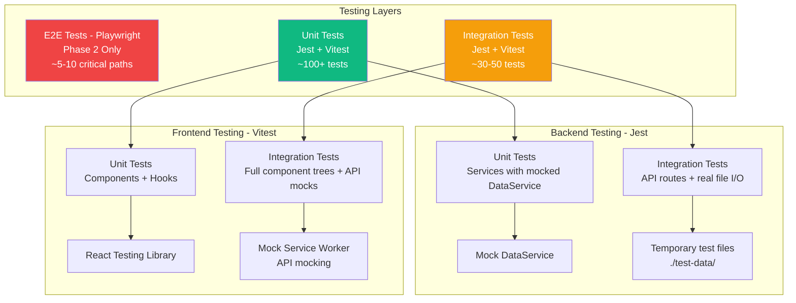

# 10. Testing Strategy

Based on the tech stack selections (Jest for backend, Vitest + React Testing
Library for frontend, Playwright for E2E deferred to Phase 2) and PRD
requirements (70%+ coverage target, NFR8), here's the comprehensive testing
strategy:

## Rationale and Key Decisions:

**1. Testing Pyramid Approach**: Following the classic pyramid with heavy unit
test coverage at the base (fast, cheap), moderate integration tests in the
middle, and minimal E2E tests at the top. For MVP, we're deferring E2E to Phase
2 since manual testing by 5-10 pilot users provides sufficient validation.

**2. Backend Testing with Jest**: Jest chosen for Node.js/TypeScript
compatibility, excellent mocking capabilities (needed for DataService file I/O
mocking), and built-in coverage reporting. The PRD explicitly specifies Jest for
backend testing.

**3. Frontend Testing with Vitest + React Testing Library**: Vitest chosen over
Jest for frontend because it's built on Vite (already in our stack), providing
instant test execution via native ESM. React Testing Library enforces
user-centric testing rather than implementation details.

**4. 70% Coverage Target**: PRD specifies this threshold for business logic
services (TaskService, WIPLimitService, CelebrationService, PromptingService,
AnalyticsService). UI components don't need this threshold for MVP - focus on
critical paths.

**5. Integration Testing Strategy**: Test API endpoints with real DataService
layer (using temporary test files), not mocking file I/O. This catches JSON
serialization bugs, file permission issues, and atomic write correctness that
unit tests would miss.

**6. Test Data Management**: Use factory functions for creating test
tasks/config to avoid brittle tests with hardcoded values. Ensures tests remain
maintainable as data models evolve.

**Testing Architecture Diagram**:



## Test Organization Structure:

**Backend Tests** (`apps/server/tests/`):

```
apps/server/tests/
├── unit/
│   ├── services/
│   │   ├── TaskService.test.ts          # CRUD operations, validation
│   │   ├── WIPLimitService.test.ts      # Limit enforcement, messaging
│   │   ├── CelebrationService.test.ts   # Message variety, rotation
│   │   ├── PromptingService.test.ts     # Scheduling, task selection
│   │   └── AnalyticsService.test.ts     # Metric calculations
│   └── utils/
│       └── TaskHelpers.test.ts          # Duration, age calculations
├── integration/
│   ├── api/
│   │   ├── tasks.test.ts                # Task CRUD endpoints
│   │   ├── config.test.ts               # WIP limit, prompting config
│   │   ├── celebrations.test.ts         # Celebration message endpoint
│   │   └── prompts.test.ts              # SSE stream, snooze endpoint
│   └── data/
│       └── DataService.test.ts          # File I/O, atomic writes
├── fixtures/
│   ├── tasks.json                       # Sample task data
│   └── config.json                      # Sample config
└── helpers/
    ├── testSetup.ts                     # Jest configuration
    └── factories.ts                     # Test data factories
```

**Frontend Tests** (`apps/web/tests/`):

```
apps/web/tests/
├── unit/
│   ├── components/
│   │   ├── TaskCard.test.tsx            # Task rendering, actions
│   │   ├── AddTaskInput.test.tsx        # Input validation, submission
│   │   ├── CelebrationOverlay.test.tsx  # Display, animation, dismiss
│   │   └── PromptToast.test.tsx         # Prompt display, responses
│   └── hooks/
│       ├── useTasks.test.ts             # Task state management
│       └── useSSE.test.ts               # SSE connection handling
├── integration/
│   ├── TaskListFlow.test.tsx            # Add → complete → celebrate flow
│   ├── WIPLimitFlow.test.tsx            # Hit limit → helpful message
│   └── SettingsFlow.test.tsx            # Update config → persist
├── mocks/
│   └── handlers.ts                      # MSW API handlers
└── helpers/
    ├── testSetup.ts                     # Vitest configuration
    └── renderWithProviders.tsx          # Test utilities
```

## Test Examples:

**Backend Unit Test** (TaskService with mocked DataService):

```typescript
// apps/server/tests/unit/services/TaskService.test.ts
import { TaskService } from '../../../src/services/TaskService';
import { DataService } from '../../../src/services/DataService';

jest.mock('../../../src/services/DataService');

describe('TaskService', () => {
  let taskService: TaskService;
  let mockDataService: jest.Mocked<DataService>;

  beforeEach(() => {
    mockDataService = new DataService() as jest.Mocked<DataService>;
    taskService = new TaskService(mockDataService);
  });

  describe('createTask', () => {
    it('should create task with UUID, timestamps, and active status', async () => {
      mockDataService.loadTasks.mockResolvedValue([]);
      mockDataService.saveTasks.mockResolvedValue();

      const task = await taskService.createTask('Buy groceries');

      expect(task.id).toMatch(
        /^[0-9a-f]{8}-[0-9a-f]{4}-[0-9a-f]{4}-[0-9a-f]{4}-[0-9a-f]{12}$/
      );
      expect(task.text).toBe('Buy groceries');
      expect(task.status).toBe('active');
      expect(task.createdAt).toMatch(/^\d{4}-\d{2}-\d{2}T/); // ISO 8601
      expect(task.completedAt).toBeNull();
    });

    it('should reject empty task text', async () => {
      await expect(taskService.createTask('')).rejects.toThrow(
        'Task text cannot be empty'
      );
    });

    it('should reject task text exceeding 500 characters', async () => {
      const longText = 'a'.repeat(501);
      await expect(taskService.createTask(longText)).rejects.toThrow(
        'Task text exceeds maximum length'
      );
    });
  });

  describe('completeTask', () => {
    it('should set status to completed and record completedAt timestamp', async () => {
      const activeTask = createTestTask({
        status: 'active',
        completedAt: null,
      });
      mockDataService.loadTasks.mockResolvedValue([activeTask]);
      mockDataService.saveTasks.mockResolvedValue();

      const completed = await taskService.completeTask(activeTask.id);

      expect(completed.status).toBe('completed');
      expect(completed.completedAt).toMatch(/^\d{4}-\d{2}-\d{2}T/);
      expect(mockDataService.saveTasks).toHaveBeenCalledWith(
        expect.arrayContaining([
          expect.objectContaining({ id: activeTask.id, status: 'completed' }),
        ])
      );
    });
  });
});
```

**Backend Integration Test** (API endpoint with real file I/O):

```typescript
// apps/server/tests/integration/api/tasks.test.ts
import request from 'supertest';
import { app } from '../../../src/app';
import { DataService } from '../../../src/services/DataService';
import fs from 'fs/promises';
import path from 'path';

const TEST_DATA_DIR = path.join(__dirname, '../../test-data');

describe('POST /api/tasks', () => {
  beforeEach(async () => {
    // Create temporary test data directory
    await fs.mkdir(TEST_DATA_DIR, { recursive: true });
    await fs.writeFile(
      path.join(TEST_DATA_DIR, 'tasks.json'),
      JSON.stringify([]),
      'utf-8'
    );
    await fs.writeFile(
      path.join(TEST_DATA_DIR, 'config.json'),
      JSON.stringify({ wipLimit: 7 }),
      'utf-8'
    );
  });

  afterEach(async () => {
    // Clean up test files
    await fs.rm(TEST_DATA_DIR, { recursive: true, force: true });
  });

  it('should create task and persist to file', async () => {
    const response = await request(app)
      .post('/api/tasks')
      .send({ text: 'Test task' })
      .expect(201);

    expect(response.body).toMatchObject({
      text: 'Test task',
      status: 'active',
    });

    // Verify task was written to file
    const fileContent = await fs.readFile(
      path.join(TEST_DATA_DIR, 'tasks.json'),
      'utf-8'
    );
    const tasks = JSON.parse(fileContent);
    expect(tasks).toHaveLength(1);
    expect(tasks[0].text).toBe('Test task');
  });

  it('should enforce WIP limit', async () => {
    // Create 7 tasks (at limit)
    for (let i = 0; i < 7; i++) {
      await request(app)
        .post('/api/tasks')
        .send({ text: `Task ${i}` });
    }

    // 8th task should be blocked
    const response = await request(app)
      .post('/api/tasks')
      .send({ text: 'Task 8' })
      .expect(409);

    expect(response.body.error).toContain('WIP limit');
    expect(response.body.wipLimitMessage).toContain('7 active tasks');
  });
});
```

**Frontend Unit Test** (Component with React Testing Library):

```typescript
// apps/web/tests/unit/components/TaskCard.test.tsx
import { render, screen, fireEvent } from '@testing-library/react';
import { TaskCard } from '../../../src/components/TaskCard';
import { createTestTask } from '../../helpers/factories';

describe('TaskCard', () => {
  it('should render task text', () => {
    const task = createTestTask({ text: 'Buy groceries' });
    render(<TaskCard task={task} onComplete={jest.fn()} onDelete={jest.fn()} />);

    expect(screen.getByText('Buy groceries')).toBeInTheDocument();
  });

  it('should call onComplete when complete button clicked', () => {
    const task = createTestTask();
    const onComplete = jest.fn();
    render(<TaskCard task={task} onComplete={onComplete} onDelete={jest.fn()} />);

    fireEvent.click(screen.getByRole('button', { name: /complete/i }));

    expect(onComplete).toHaveBeenCalledWith(task.id);
  });

  it('should display age indicator for old tasks', () => {
    const oldTask = createTestTask({
      createdAt: new Date(Date.now() - 10 * 24 * 60 * 60 * 1000).toISOString(), // 10 days ago
    });
    render(<TaskCard task={oldTask} onComplete={jest.fn()} onDelete={jest.fn()} />);

    expect(screen.getByText(/10 days/i)).toBeInTheDocument();
  });
});
```

**Frontend Integration Test** (Full flow with MSW):

```typescript
// apps/web/tests/integration/TaskListFlow.test.tsx
import { render, screen, fireEvent, waitFor } from '@testing-library/react';
import { rest } from 'msw';
import { setupServer } from 'msw/node';
import { App } from '../../src/App';

const server = setupServer(
  rest.get('/api/tasks', (req, res, ctx) => {
    return res(ctx.json([]));
  }),
  rest.post('/api/tasks', (req, res, ctx) => {
    return res(ctx.status(201), ctx.json({
      id: '123',
      text: req.body.text,
      status: 'active',
      createdAt: new Date().toISOString(),
      completedAt: null,
    }));
  }),
  rest.patch('/api/tasks/:id/complete', (req, res, ctx) => {
    return res(ctx.json({ status: 'completed' }));
  }),
  rest.get('/api/celebrations/message', (req, res, ctx) => {
    return res(ctx.json({ message: 'Great job!', variant: 'supportive' }));
  })
);

beforeAll(() => server.listen());
afterEach(() => server.resetHandlers());
afterAll(() => server.close());

describe('Task List Flow', () => {
  it('should add task, complete it, and show celebration', async () => {
    render(<App />);

    // Add task
    const input = screen.getByPlaceholderText(/what needs to be done/i);
    fireEvent.change(input, { target: { value: 'Test task' } });
    fireEvent.click(screen.getByRole('button', { name: /add task/i }));

    // Verify task appears
    await waitFor(() => {
      expect(screen.getByText('Test task')).toBeInTheDocument();
    });

    // Complete task
    fireEvent.click(screen.getByRole('button', { name: /complete/i }));

    // Verify celebration appears
    await waitFor(() => {
      expect(screen.getByText('Great job!')).toBeInTheDocument();
    });

    // Verify task removed from list
    expect(screen.queryByText('Test task')).not.toBeInTheDocument();
  });
});
```

## Test Data Factories:

```typescript
// apps/server/tests/helpers/factories.ts
import { Task, TaskStatus } from '@simple-todo/shared/types';
import { v4 as uuidv4 } from 'uuid';

export function createTestTask(overrides: Partial<Task> = {}): Task {
  return {
    id: uuidv4(),
    text: 'Default test task',
    status: 'active' as TaskStatus,
    createdAt: new Date().toISOString(),
    completedAt: null,
    ...overrides,
  };
}

export function createTestConfig(overrides = {}) {
  return {
    wipLimit: 7,
    promptingEnabled: true,
    promptingFrequencyHours: 2.5,
    celebrationsEnabled: true,
    celebrationDurationSeconds: 7,
    ...overrides,
  };
}
```

## Coverage Requirements:

**Minimum Coverage Targets** (per PRD NFR8):

- **TaskService**: 80%+ (core business logic)
- **WIPLimitService**: 75%+ (validation + messaging)
- **CelebrationService**: 70%+ (message rotation)
- **PromptingService**: 75%+ (scheduling logic)
- **AnalyticsService**: 70%+ (calculations)
- **DataService**: 85%+ (critical data integrity)

**Coverage Exclusions**:

- Type definitions (`shared/types`)
- Configuration files
- Development scripts
- UI component styling (CSS)

**CI/CD Coverage Enforcement**:

```yaml
# .github/workflows/ci.yaml (excerpt)
- name: Run tests with coverage
  run:
    npm test -- --coverage
    --coverageThreshold='{"global":{"lines":70,"functions":70,"branches":70,"statements":70}}'

- name: Fail if coverage below threshold
  run: |
    if [ $? -ne 0 ]; then
      echo "Coverage below 70% threshold"
      exit 1
    fi
```

## Testing Commands:

```bash
# Run all tests
npm test

# Run backend tests only
npm run test:server

# Run frontend tests only
npm run test:client

# Watch mode (for development)
npm run test:watch

# Coverage report
npm run test:coverage

# Integration tests only
npm run test:integration

# Specific test file
npm test -- TaskService.test.ts
```

---
