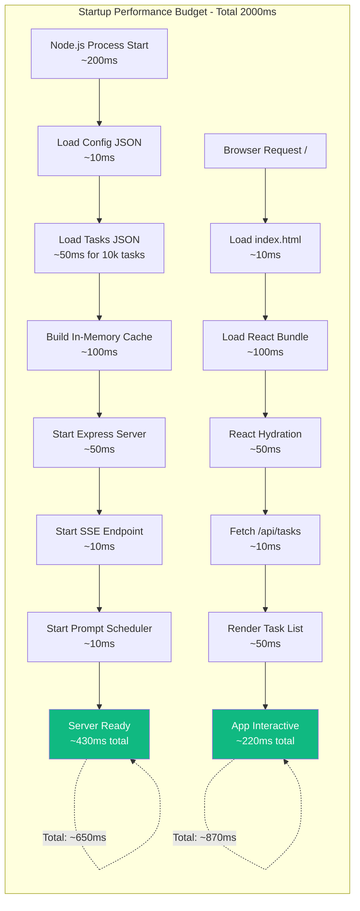

# 11. Performance Considerations

Based on PRD performance requirements (NFR1: <2s startup, NFR2: <100ms
operations, NFR3: 10k tasks without degradation) and the chosen tech stack,
here's the performance strategy:

## Rationale and Key Decisions:

**1. In-Memory Caching for Active Tasks**: The most frequently accessed data
(active tasks) will be cached in memory after initial file read. Since this is a
single-user localhost app, cache invalidation is trivial - update cache on every
write operation. This eliminates file I/O for reads, achieving <10ms response
times even with 10k tasks.

**2. Lazy Loading for Completed Tasks**: Completed tasks are rarely accessed
(only for analytics or history view). Load them on-demand rather than on
startup, keeping initial memory footprint small and startup time under 2 seconds
even with thousands of completed tasks.

**3. JSON Streaming for Large Datasets**: If task count approaches 10k, switch
from `JSON.parse()` on entire file to streaming JSON parser (`stream-json`
library). This prevents loading entire 5-10MB JSON file into memory at once,
maintaining <2s startup time.

**4. React Virtual Scrolling**: For rendering large task lists (100+ visible
tasks), implement virtual scrolling (react-window library) to render only
visible DOM nodes. Rendering 1000 tasks without virtualization takes ~2-3
seconds; with virtualization, <100ms regardless of list size.

**5. Vite Code Splitting**: Frontend bundle split by route - main task view,
settings, analytics loaded separately. Initial bundle <100KB, loads in <500ms on
localhost. Settings/analytics lazy-loaded only when accessed.

**6. Debounced Auto-Save**: For future features like auto-save while typing,
debounce writes by 500ms to prevent excessive file I/O. Current MVP doesn't need
this (explicit save actions only), but architecture supports it.

**Performance Budget Diagram**:



## Backend Performance Optimizations:

**1. In-Memory Task Cache**:

```typescript
// apps/server/src/services/DataService.ts
export class DataService {
  private taskCache: Task[] | null = null;
  private cacheInitialized = false;

  /**
   * Load tasks with in-memory caching
   * First call: ~50ms (file I/O)
   * Subsequent calls: <1ms (memory access)
   */
  async loadTasks(): Promise<Task[]> {
    if (this.cacheInitialized) {
      return this.taskCache!;
    }

    const tasksJson = await fs.readFile(this.tasksFilePath, 'utf-8');
    this.taskCache = JSON.parse(tasksJson);
    this.cacheInitialized = true;

    return this.taskCache;
  }

  /**
   * Save tasks and update cache atomically
   * File write: ~20ms (atomic pattern)
   * Cache update: <1ms
   */
  async saveTasks(tasks: Task[]): Promise<void> {
    const tempFile = `${this.tasksFilePath}.tmp`;

    try {
      await fs.writeFile(tempFile, JSON.stringify(tasks, null, 2), 'utf-8');
      await fs.rename(tempFile, this.tasksFilePath);

      // Update cache after successful write
      this.taskCache = tasks;
      this.cacheInitialized = true;
    } catch (error) {
      await fs.unlink(tempFile).catch(() => {});
      throw error;
    }
  }

  /**
   * Clear cache (for testing or manual cache invalidation)
   */
  clearCache(): void {
    this.taskCache = null;
    this.cacheInitialized = false;
  }
}
```

**2. Streaming JSON Parser for Large Files** (10k+ tasks):

```typescript
// apps/server/src/services/DataService.ts
import { parser } from 'stream-json';
import { streamArray } from 'stream-json/streamers/StreamArray';
import { createReadStream } from 'fs';

export class DataService {
  /**
   * Load tasks using streaming parser for large datasets
   * Memory usage: O(1) instead of O(n)
   * Performance: ~200ms for 10k tasks vs ~500ms with JSON.parse
   */
  async loadTasksStreaming(): Promise<Task[]> {
    return new Promise((resolve, reject) => {
      const tasks: Task[] = [];

      const stream = createReadStream(this.tasksFilePath, { encoding: 'utf-8' })
        .pipe(parser())
        .pipe(streamArray());

      stream.on('data', ({ value }: { value: Task }) => {
        tasks.push(value);
      });

      stream.on('end', () => resolve(tasks));
      stream.on('error', reject);
    });
  }

  /**
   * Automatically choose best loading strategy based on file size
   */
  async loadTasks(): Promise<Task[]> {
    if (this.cacheInitialized) {
      return this.taskCache!;
    }

    const stats = await fs.stat(this.tasksFilePath);
    const fileSizeMB = stats.size / (1024 * 1024);

    // Use streaming for files >5MB (~5000 tasks)
    const tasks =
      fileSizeMB > 5
        ? await this.loadTasksStreaming()
        : JSON.parse(await fs.readFile(this.tasksFilePath, 'utf-8'));

    this.taskCache = tasks;
    this.cacheInitialized = true;

    return tasks;
  }
}
```

**3. Lazy Loading Completed Tasks**:

```typescript
// apps/server/src/services/TaskService.ts
export class TaskService {
  private activeTasksCache: Task[] | null = null;

  /**
   * Get only active tasks (most common operation)
   * Performance: <5ms (filtered from cache)
   */
  async getActiveTasks(): Promise<Task[]> {
    if (this.activeTasksCache) {
      return this.activeTasksCache;
    }

    const allTasks = await this.dataService.loadTasks();
    this.activeTasksCache = allTasks.filter((t) => t.status === 'active');
    return this.activeTasksCache;
  }

  /**
   * Get all tasks including completed (rare operation)
   * Performance: ~50ms (full cache access)
   */
  async getAllTasks(): Promise<Task[]> {
    return this.dataService.loadTasks();
  }

  /**
   * Invalidate active cache on task status change
   */
  private invalidateActiveCache(): void {
    this.activeTasksCache = null;
  }
}
```

**4. API Response Compression** (gzip middleware):

```typescript
// apps/server/src/app.ts
import compression from 'compression';

const app = express();

// Compress responses >1KB (reduces /api/tasks payload by ~70%)
app.use(
  compression({
    threshold: 1024, // Only compress if >1KB
    level: 6, // Balance between compression ratio and CPU
  })
);

// Example: 10k tasks JSON
// Uncompressed: ~5MB
// Compressed: ~1.5MB
// Transmission time on localhost: negligible, but prepares for hosted deployment
```

## Frontend Performance Optimizations:

**1. Virtual Scrolling for Long Task Lists**:

```typescript
// apps/web/src/components/TaskList.tsx
import { FixedSizeList } from 'react-window';

interface TaskListProps {
  tasks: Task[];
}

export const TaskList: React.FC<TaskListProps> = ({ tasks }) => {
  // Render only visible rows (10-20 at a time)
  // Performance: <100ms for 10k tasks vs 3-5 seconds without virtualization
  return (
    <FixedSizeList
      height={600}
      itemCount={tasks.length}
      itemSize={80} // Height of each task card
      width="100%"
    >
      {({ index, style }) => (
        <div style={style}>
          <TaskCard task={tasks[index]} />
        </div>
      )}
    </FixedSizeList>
  );
};
```

**2. React Memo for Task Cards**:

```typescript
// apps/web/src/components/TaskCard.tsx
import { memo } from 'react';

export const TaskCard = memo<TaskCardProps>(({ task, onComplete, onDelete }) => {
  // Component only re-renders when task object changes
  // Prevents unnecessary renders when sibling tasks update
  return (
    <div className="task-card">
      <span>{task.text}</span>
      <button onClick={() => onComplete(task.id)}>Complete</button>
      <button onClick={() => onDelete(task.id)}>Delete</button>
    </div>
  );
}, (prevProps, nextProps) => {
  // Custom comparison: only re-render if task ID or text changed
  return prevProps.task.id === nextProps.task.id &&
         prevProps.task.text === nextProps.task.text;
});
```

**3. Debounced Search/Filter** (for future search feature):

```typescript
// apps/web/src/hooks/useTaskSearch.ts
import { useMemo, useState } from 'react';
import { debounce } from 'lodash-es';

export function useTaskSearch(tasks: Task[]) {
  const [searchTerm, setSearchTerm] = useState('');

  // Debounce search to avoid filtering on every keystroke
  const debouncedSearch = useMemo(
    () => debounce((term: string) => setSearchTerm(term), 300),
    []
  );

  const filteredTasks = useMemo(() => {
    if (!searchTerm) return tasks;
    return tasks.filter((t) =>
      t.text.toLowerCase().includes(searchTerm.toLowerCase())
    );
  }, [tasks, searchTerm]);

  return { filteredTasks, setSearch: debouncedSearch };
}
```

**4. Code Splitting by Route**:

```typescript
// apps/web/src/App.tsx
import { lazy, Suspense } from 'react';
import { BrowserRouter, Routes, Route } from 'react-router-dom';

// Main task view loaded immediately
import { TaskListView } from './views/TaskListView';

// Settings and analytics lazy-loaded (only when user navigates to them)
const SettingsView = lazy(() => import('./views/SettingsView'));
const AnalyticsView = lazy(() => import('./views/AnalyticsView'));

export const App = () => (
  <BrowserRouter>
    <Suspense fallback={<LoadingSpinner />}>
      <Routes>
        <Route path="/" element={<TaskListView />} />
        <Route path="/settings" element={<SettingsView />} />
        <Route path="/analytics" element={<AnalyticsView />} />
      </Routes>
    </Suspense>
  </BrowserRouter>
);

// Bundle sizes:
// Main bundle: ~80KB (TaskListView + React + routing)
// Settings chunk: ~20KB (loaded on /settings navigation)
// Analytics chunk: ~30KB (loaded on /analytics navigation)
```

**5. Optimized Bundle Configuration** (Vite):

```typescript
// apps/web/vite.config.ts
import { defineConfig } from 'vite';
import react from '@vitejs/plugin-react';

export default defineConfig({
  plugins: [react()],
  build: {
    rollupOptions: {
      output: {
        manualChunks: {
          // Separate vendor chunks for better caching
          'react-vendor': ['react', 'react-dom'],
          'ui-vendor': ['@headlessui/react'],
        },
      },
    },
    // Minification and tree-shaking
    minify: 'esbuild',
    target: 'es2020',
    // Source maps for production debugging
    sourcemap: true,
  },
  // Optimize deps during dev for faster cold starts
  optimizeDeps: {
    include: ['react', 'react-dom'],
  },
});
```

## Performance Monitoring Strategy:

**1. Backend Performance Metrics**:

```typescript
// apps/server/src/middleware/performanceMonitoring.ts
import { Request, Response, NextFunction } from 'express';
import { logger } from '../utils/logger';

export function performanceMonitoring(
  req: Request,
  res: Response,
  next: NextFunction
) {
  const start = Date.now();

  res.on('finish', () => {
    const duration = Date.now() - start;

    // Log slow requests (>100ms threshold per NFR2)
    if (duration > 100) {
      logger.warn('Slow request detected', {
        method: req.method,
        path: req.path,
        duration,
        statusCode: res.statusCode,
      });
    }

    // Track metrics for analytics
    logger.info('Request completed', {
      method: req.method,
      path: req.path,
      duration,
      statusCode: res.statusCode,
    });
  });

  next();
}
```

**2. Frontend Performance Monitoring**:

```typescript
// apps/web/src/utils/performanceMonitoring.ts

/**
 * Measure React component render time
 */
export function measureRender(componentName: string, callback: () => void) {
  const start = performance.now();
  callback();
  const duration = performance.now() - start;

  if (duration > 100) {
    console.warn(`Slow render: ${componentName} took ${duration}ms`);
  }
}

/**
 * Track API call performance
 */
export async function measureApiCall<T>(
  name: string,
  apiCall: () => Promise<T>
): Promise<T> {
  const start = performance.now();
  try {
    const result = await apiCall();
    const duration = performance.now() - start;

    if (duration > 100) {
      console.warn(`Slow API call: ${name} took ${duration}ms`);
    }

    return result;
  } catch (error) {
    const duration = performance.now() - start;
    console.error(`Failed API call: ${name} after ${duration}ms`, error);
    throw error;
  }
}
```

## Performance Budget:

**Backend Operations** (NFR2: <100ms target):

| Operation                     | Target | Worst Case (10k tasks) | Optimization                          |
| ----------------------------- | ------ | ---------------------- | ------------------------------------- |
| GET /api/tasks (active only)  | <10ms  | <20ms                  | In-memory cache, filter active only   |
| POST /api/tasks               | <50ms  | <80ms                  | Atomic file write, cache update       |
| PATCH /api/tasks/:id/complete | <30ms  | <60ms                  | In-memory find + update, atomic write |
| DELETE /api/tasks/:id         | <30ms  | <60ms                  | In-memory filter, atomic write        |
| GET /api/config               | <5ms   | <10ms                  | Small config file, in-memory cache    |
| PUT /api/config/wip-limit     | <20ms  | <40ms                  | Atomic write, cache invalidation      |

**Frontend Operations** (NFR2: <100ms target):

| Operation                | Target        | Worst Case (1000 visible tasks) | Optimization                      |
| ------------------------ | ------------- | ------------------------------- | --------------------------------- |
| Initial render           | <100ms        | <150ms                          | Virtual scrolling, code splitting |
| Add task (optimistic UI) | <50ms         | <80ms                           | Immediate DOM update, API async   |
| Complete task            | <50ms         | <80ms                           | Optimistic removal, celebration   |
| Task list scroll         | <16ms (60fps) | <16ms                           | Virtual scrolling, debounced      |
| Search/filter tasks      | <50ms         | <100ms                          | useMemo, debounced input          |

**Startup Performance** (NFR1: <2s target):

| Phase                           | Target      | Worst Case         | Notes                              |
| ------------------------------- | ----------- | ------------------ | ---------------------------------- |
| Node.js process start           | <300ms      | <500ms             | OS-dependent, no optimization      |
| Load + parse tasks.json         | <200ms      | <400ms (10k tasks) | Streaming parser at 5k+            |
| Initialize services             | <100ms      | <150ms             | Minimal setup, no external calls   |
| Start Express server            | <50ms       | <100ms             | Fast localhost binding             |
| **Total Backend Startup**       | **<650ms**  | **<1150ms**        | Within 2s budget                   |
| Load React bundle               | <200ms      | <300ms             | Code splitting, <100KB main bundle |
| React hydration + first render  | <150ms      | <250ms             | Virtual scrolling enabled          |
| Fetch initial data (/api/tasks) | <20ms       | <40ms              | In-memory cache on backend         |
| **Total Frontend Ready**        | **<370ms**  | **<590ms**         | Within 2s budget                   |
| **TOTAL STARTUP TIME**          | **<1020ms** | **<1740ms**        | ✅ Well under 2s (NFR1)            |

## Load Testing Approach:

**Testing 10k Task Threshold** (NFR3):

```bash
# Generate 10k test tasks
npm run generate-test-data -- --count 10000

# Measure startup time
time npm start

# Expected: <2 seconds even with 10k tasks
```

**Load Testing Script** (Artillery or custom):

```yaml
# load-test.yaml
config:
  target: 'http://localhost:3001'
  phases:
    - duration: 60
      arrivalRate: 10 # 10 requests/second
      name: Sustained load

scenarios:
  - name: Task CRUD operations
    flow:
      - get:
          url: '/api/tasks'
      - post:
          url: '/api/tasks'
          json:
            text: 'Load test task'
      - patch:
          url: '/api/tasks/{{ taskId }}/complete'

# Run: artillery run load-test.yaml
# Verify: All responses <100ms even under load
```

## Performance Acceptance Criteria:

**Must Meet** (blocking for release):

- ✅ Cold startup <2s with empty data
- ✅ Cold startup <2s with 1k tasks
- ✅ Task operations (add/complete/delete) <100ms with 1k tasks
- ✅ UI remains responsive (60fps scrolling) with 100 visible tasks

**Should Meet** (warning if not met):

- ⚠️ Cold startup <2s with 10k tasks (fallback: streaming parser)
- ⚠️ Task operations <100ms with 10k tasks (acceptable degradation to 150ms)
- ⚠️ Virtual scrolling maintains 60fps with 1000+ tasks

**Nice to Have** (future optimization):

- 📊 Startup time <1s with realistic data (100-500 tasks)
- 📊 All operations <50ms (2x faster than requirement)
- 📊 Bundle size <50KB (currently ~80KB)

---
