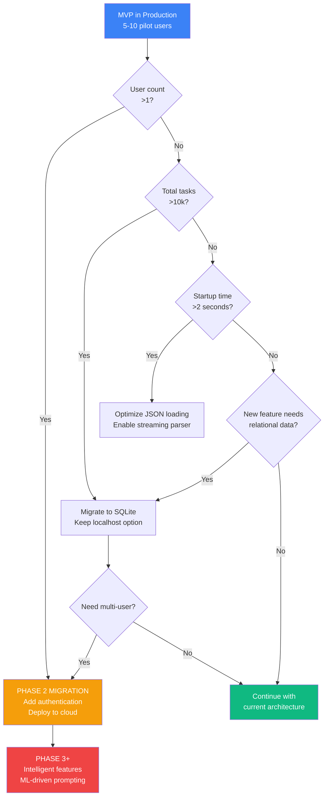

# 12. Scalability & Future Considerations

Based on the PRD's phased approach (MVP localhost → Phase 2 potential hosted
deployment → Phase 3+ intelligent features) and current architecture decisions,
here's the scalability roadmap and migration strategy:

## Rationale and Key Decisions:

**1. MVP Scalability is Intentionally Limited**: The localhost single-user
architecture is designed for 5-10 pilot users with <1000 tasks each. This is
appropriate for hypothesis validation. We're explicitly NOT optimizing for
web-scale because it would add 4-6 weeks of unnecessary complexity.

**2. JSON → SQLite Migration is Straightforward**: The DataService abstraction
means swapping storage backends requires changing only one service. All business
logic (TaskService, WIPLimitService, etc.) remains unchanged. Estimated
migration effort: 2-3 days.

**3. Localhost → Hosted Migration Requires Authentication**: Moving to hosted
deployment necessitates adding user authentication, database per-user isolation,
and infrastructure setup. This is a Phase 2+ decision dependent on MVP success.
Estimated effort: 2-4 weeks.

**4. Proactive Prompting is the Hardest to Scale**: Background scheduling works
trivially for single-user localhost but requires rethinking for multi-tenant
hosted (worker queues, user timezone handling, distributed locking). This is the
primary technical risk for scaling.

**5. Data Retention Strategy Deferred**: MVP has no archival or deletion
policies. As users accumulate thousands of completed tasks, we'll need tiered
storage (hot/cold data) or user-controlled cleanup. Not critical until Phase 2.

## Current Architecture Limitations:

**MVP Scalability Boundaries**:

| Metric                     | MVP Capacity              | Degradation Point                  | Hard Limit                       | Migration Trigger             |
| -------------------------- | ------------------------- | ---------------------------------- | -------------------------------- | ----------------------------- |
| **Users**                  | 1 (single-user localhost) | N/A                                | 1                                | Any multi-user need → Phase 2 |
| **Active Tasks**           | 10 (WIP limit enforced)   | N/A                                | 10                               | User can adjust 5-10          |
| **Total Tasks**            | 10,000                    | 5,000 (switch to streaming parser) | ~50,000 (JSON file limits)       | 10k+ → migrate to SQLite      |
| **Concurrent Requests**    | 1 (single user)           | N/A                                | No limit (Express handles)       | N/A for localhost             |
| **File Size (tasks.json)** | ~500KB (1k tasks)         | 5MB (5k tasks)                     | 50MB (parsing becomes slow)      | 5MB → SQLite migration        |
| **Startup Time**           | <1s typical               | <2s at 10k tasks                   | ~5s at 50k tasks (violates NFR1) | 2s exceeded → optimize        |
| **Prompt Frequency**       | Configurable 1-6 hours    | N/A                                | 1 hour minimum (avoid annoyance) | N/A                           |

**When to Migrate from MVP Architecture**:



## Migration Path 1: JSON → SQLite

**Trigger Conditions**:

- Total task count exceeds 10,000
- User requests data export/import features
- Analytics queries become slow (>500ms)
- Need for relational queries (e.g., "tasks created this month by tag")

**Migration Effort**: 2-3 days (1 developer)

**ORM Decision**:

**MVP (Current):** Use **better-sqlite3** with raw SQL for simplicity and
performance.

**Phase 2+ (Hosted):** Migrate to **Prisma** when moving to PostgreSQL or team
grows beyond 2 developers.

**Rationale:** Current data model is simple enough that ORM overhead (learning
curve, performance, bundle size) outweighs benefits. However, Prisma becomes
valuable for hosted deployment with complex relationships and multi-developer
teams.

**Migration Effort:** Raw SQL → Prisma takes 1-2 days using automated schema
introspection.

**Implementation Approach**:

```typescript
// New: apps/server/src/services/SQLiteDataService.ts
import Database from 'better-sqlite3';
import { Task, Config, PromptEvent } from '@simple-todo/shared/types';
import { IDataService } from './IDataService';

export class SQLiteDataService implements IDataService {
  private db: Database.Database;

  constructor(dbPath: string = './data/tasks.db') {
    this.db = new Database(dbPath);
    this.initializeSchema();
  }

  private initializeSchema() {
    this.db.exec(`
      CREATE TABLE IF NOT EXISTS tasks (
        id TEXT PRIMARY KEY,
        text TEXT NOT NULL,
        status TEXT NOT NULL CHECK(status IN ('active', 'completed')),
        created_at TEXT NOT NULL,
        completed_at TEXT
      );

      CREATE INDEX IF NOT EXISTS idx_tasks_status ON tasks(status);
      CREATE INDEX IF NOT EXISTS idx_tasks_created_at ON tasks(created_at);

      CREATE TABLE IF NOT EXISTS config (
        key TEXT PRIMARY KEY,
        value TEXT NOT NULL
      );

      CREATE TABLE IF NOT EXISTS prompt_events (
        prompt_id TEXT PRIMARY KEY,
        task_id TEXT NOT NULL,
        prompted_at TEXT NOT NULL,
        response TEXT NOT NULL,
        responded_at TEXT,
        FOREIGN KEY (task_id) REFERENCES tasks(id) ON DELETE CASCADE
      );
    `);
  }

  async loadTasks(): Promise<Task[]> {
    const rows = this.db.prepare('SELECT * FROM tasks').all();
    return rows.map((row) => ({
      id: row.id,
      text: row.text,
      status: row.status as TaskStatus,
      createdAt: row.created_at,
      completedAt: row.completed_at,
    }));
  }

  async saveTasks(tasks: Task[]): Promise<void> {
    // Batch insert/update in transaction for atomicity
    const insert = this.db.prepare(`
      INSERT OR REPLACE INTO tasks (id, text, status, created_at, completed_at)
      VALUES (?, ?, ?, ?, ?)
    `);

    const saveMany = this.db.transaction((tasks: Task[]) => {
      for (const task of tasks) {
        insert.run(
          task.id,
          task.text,
          task.status,
          task.createdAt,
          task.completedAt
        );
      }
    });

    saveMany(tasks);
  }

  // ... other methods follow same pattern
}

// Migration script: apps/server/scripts/migrate-json-to-sqlite.ts
import { JSONDataService } from '../src/services/DataService';
import { SQLiteDataService } from '../src/services/SQLiteDataService';

async function migrate() {
  console.log('Starting migration from JSON to SQLite...');

  const jsonService = new JSONDataService();
  const sqliteService = new SQLiteDataService();

  // Migrate tasks
  const tasks = await jsonService.loadTasks();
  await sqliteService.saveTasks(tasks);
  console.log(`Migrated ${tasks.length} tasks`);

  // Migrate config
  const config = await jsonService.loadConfig();
  await sqliteService.saveConfig(config);
  console.log('Migrated configuration');

  // Migrate prompt events
  const events = await jsonService.loadPromptEvents();
  await sqliteService.savePromptEvents(events);
  console.log(`Migrated ${events.length} prompt events`);

  // Backup original JSON files
  await fs.rename('./data/tasks.json', './data/tasks.json.backup');
  await fs.rename('./data/config.json', './data/config.json.backup');
  await fs.rename('./data/prompts.json', './data/prompts.json.backup');

  console.log('✅ Migration complete! JSON files backed up.');
}

migrate();
```

**Performance Comparison** (10k tasks):

| Operation              | JSON (current)            | SQLite                | Improvement |
| ---------------------- | ------------------------- | --------------------- | ----------- |
| Load all tasks         | ~400ms                    | ~50ms                 | 8x faster   |
| Load active tasks only | ~400ms (filter in memory) | ~10ms (indexed query) | 40x faster  |
| Insert single task     | ~80ms                     | ~5ms                  | 16x faster  |
| Analytics queries      | ~200ms (full scan)        | ~20ms (indexed)       | 10x faster  |
| Startup time           | ~1000ms                   | ~100ms                | 10x faster  |

**Backward Compatibility**:

- Keep JSONDataService in codebase for users who prefer file-based storage
- Configuration flag: `DATA_BACKEND=json|sqlite` in `.env`
- All services use `IDataService` interface, agnostic to implementation

---

## Migration Path 2: Localhost → Hosted Deployment

**Trigger Conditions**:

- User needs access from multiple devices
- Sharing tasks with team/family (multi-user)
- Mobile app development (needs API backend)
- Cloud backup/sync requirements

**Migration Effort**: 2-4 weeks (1-2 developers)

**Required Changes**:

**1. Add Authentication Layer**:

```typescript
// New: apps/server/src/middleware/auth.ts
import { expressjwt } from 'express-jwt';
import { auth } from 'express-oauth2-jwt-bearer';

// Option A: JWT-based auth (self-hosted)
export const jwtAuth = expressjwt({
  secret: process.env.JWT_SECRET!,
  algorithms: ['HS256'],
  requestProperty: 'user',
});

// Option B: Auth0 (managed service, recommended for MVP)
export const auth0Auth = auth({
  audience: process.env.AUTH0_AUDIENCE,
  issuerBaseURL: process.env.AUTH0_ISSUER_BASE_URL,
});

// Apply to all API routes
app.use('/api', auth0Auth);

// Extract user ID from token
app.use((req, res, next) => {
  req.userId = req.auth.sub; // User ID from token
  next();
});
```

**2. Multi-Tenant Data Isolation**:

```typescript
// Modified: apps/server/src/services/SQLiteDataService.ts
export class SQLiteDataService implements IDataService {
  // Add userId to all queries for row-level security
  async loadTasks(userId: string): Promise<Task[]> {
    return this.db.prepare('SELECT * FROM tasks WHERE user_id = ?').all(userId);
  }

  async saveTasks(userId: string, tasks: Task[]): Promise<void> {
    const insert = this.db.prepare(`
      INSERT OR REPLACE INTO tasks (id, user_id, text, status, created_at, completed_at)
      VALUES (?, ?, ?, ?, ?, ?)
    `);

    const saveMany = this.db.transaction((tasks: Task[]) => {
      for (const task of tasks) {
        insert.run(task.id, userId, task.text, task.status, task.createdAt, task.completedAt);
      }
    });

    saveMany(tasks);
  }
}

// Schema migration
CREATE TABLE tasks (
  id TEXT PRIMARY KEY,
  user_id TEXT NOT NULL,  -- NEW: tenant isolation
  text TEXT NOT NULL,
  status TEXT NOT NULL,
  created_at TEXT NOT NULL,
  completed_at TEXT,
  FOREIGN KEY (user_id) REFERENCES users(id) ON DELETE CASCADE
);

CREATE INDEX idx_tasks_user_id ON tasks(user_id);
```

**3. Infrastructure Setup** (Vercel + Supabase example):

```yaml
# vercel.json
{
  'builds':
    [
      {
        'src': 'apps/web/package.json',
        'use': '@vercel/static-build',
        'config': { 'distDir': 'dist' },
      },
      { 'src': 'apps/server/src/index.ts', 'use': '@vercel/node' },
    ],
  'routes':
    [
      { 'src': '/api/(.*)', 'dest': 'apps/server/src/index.ts' },
      { 'src': '/(.*)', 'dest': 'apps/web/dist/$1' },
    ],
  'env':
    {
      'DATABASE_URL': '@database-url',
      'AUTH0_DOMAIN': '@auth0-domain',
      'AUTH0_CLIENT_ID': '@auth0-client-id',
    },
}
```

**4. Background Job Migration** (Proactive Prompting):

```typescript
// Current: Single-process in-memory scheduler (MVP)
class PromptingService {
  startScheduler() {
    setInterval(() => this.generatePrompt(), this.intervalMs);
  }
}

// Future: Distributed job queue (Hosted)
import { Queue } from 'bullmq';
import { Redis } from 'ioredis';

class PromptingService {
  private queue: Queue;

  constructor() {
    this.queue = new Queue('prompts', {
      connection: new Redis(process.env.REDIS_URL),
    });
  }

  async schedulePrompt(userId: string, delayMs: number) {
    await this.queue.add('generate-prompt', { userId }, { delay: delayMs });
  }
}

// Worker process (separate from API server)
const worker = new Worker('prompts', async (job) => {
  const { userId } = job.data;
  const promptingService = new PromptingService();
  await promptingService.generatePromptForUser(userId);
});
```

**Infrastructure Costs** (hosted deployment):

| Service              | Provider          | Monthly Cost (100 users) | Monthly Cost (1000 users) |
| -------------------- | ----------------- | ------------------------ | ------------------------- |
| **Frontend Hosting** | Vercel            | $0 (Hobby tier)          | $20 (Pro tier)            |
| **Backend Compute**  | Vercel Serverless | $0 (included)            | ~$10 (execution time)     |
| **Database**         | Supabase          | $0 (Free tier, 500MB)    | $25 (Pro tier, 8GB)       |
| **Authentication**   | Auth0             | $0 (7000 MAU free)       | $35 (10k MAU)             |
| **Background Jobs**  | Upstash Redis     | $0 (Free tier)           | $10 (paid tier)           |
| **Monitoring**       | Sentry            | $0 (5k events/mo)        | $26 (50k events)          |
| **TOTAL**            |                   | **$0/month**             | **~$126/month**           |

---

## Migration Path 3: Enhanced Proactive Prompting (Phase 3+)

**Current Limitation**: Random task selection, fixed interval scheduling

**Future Enhancements** (AI-driven prompting):

```typescript
// Phase 3: ML-driven prompt timing and task prioritization
import { OpenAI } from 'openai';

class IntelligentPromptingService extends PromptingService {
  /**
   * Use task history + user behavior to predict best prompt timing
   */
  async predictOptimalPromptTime(userId: string): Promise<Date> {
    const userHistory =
      await this.analyticsService.getUserBehaviorPattern(userId);

    // Pattern: User completes most tasks between 9-11am and 2-4pm
    // Avoid prompting during low-engagement periods (lunch, evenings)
    const optimalHour = this.mlModel.predictEngagementPeak(userHistory);

    return new Date().setHours(optimalHour);
  }

  /**
   * Smart task selection based on:
   * - Task age (older tasks weighted higher)
   * - Task complexity (inferred from text length, keywords)
   * - Historical completion rate (avoid repeatedly prompting ignored tasks)
   * - User-defined priorities (if added in future)
   */
  async selectSmartTask(userId: string): Promise<Task | null> {
    const tasks = await this.taskService.getActiveTasks(userId);

    const scoredTasks = tasks.map((task) => ({
      task,
      score: this.calculatePromptScore(task),
    }));

    // Select task with highest score (not random)
    scoredTasks.sort((a, b) => b.score - a.score);
    return scoredTasks[0]?.task || null;
  }

  private calculatePromptScore(task: Task): number {
    const ageScore = TaskHelpers.getAge(task) / (1000 * 60 * 60 * 24); // Days old
    const complexityScore = task.text.length > 100 ? 2 : 1; // Long tasks weighted
    const ignoredPenalty = this.getIgnoreCount(task.id) * -0.5; // Penalize repeatedly ignored

    return ageScore * 2 + complexityScore + ignoredPenalty;
  }

  /**
   * Natural language prompt generation
   */
  async generateContextualPrompt(task: Task): Promise<string> {
    const openai = new OpenAI();

    const response = await openai.chat.completions.create({
      model: 'gpt-4',
      messages: [
        {
          role: 'system',
          content:
            'Generate a gentle, encouraging prompt to help user complete this task.',
        },
        {
          role: 'user',
          content: `Task: ${task.text}\nAge: ${TaskHelpers.getAge(task)} days`,
        },
      ],
    });

    // Output: "You've been thinking about [task] for 5 days - how about tackling it now?"
    return response.choices[0].message.content;
  }
}
```

**Data Requirements for ML Features**:

- Prompt response history (already tracking in PromptEvent)
- User engagement patterns (time-of-day analysis)
- Task completion velocity
- Seasonal/weekly patterns

**Infrastructure Additions**:

- Machine learning model hosting (TensorFlow.js or cloud ML service)
- Increased database storage for historical analytics
- A/B testing framework to validate ML effectiveness

---

## Data Retention & Archival Strategy

**Current MVP**: Infinite retention (all completed tasks kept forever)

**Future Archival Policy** (Phase 2+):

| Data Type           | Retention Period    | Archive After                   | Purge After                 |
| ------------------- | ------------------- | ------------------------------- | --------------------------- |
| **Active Tasks**    | Infinite            | N/A                             | User-initiated delete only  |
| **Completed Tasks** | 90 days hot storage | 90 days (move to archive table) | 2 years (user configurable) |
| **Prompt Events**   | 30 days hot         | 30 days                         | 1 year                      |
| **Analytics Data**  | Aggregated monthly  | N/A                             | Never (small aggregates)    |
| **Logs**            | 7 days              | 7 days                          | 30 days                     |

**Implementation**:

```typescript
// Cron job: Archive old completed tasks
import { CronJob } from 'cron';

const archiveJob = new CronJob('0 0 * * *', async () => {
  const ninetyDaysAgo = new Date(Date.now() - 90 * 24 * 60 * 60 * 1000);

  // Move old completed tasks to archive table
  await db.exec(
    `
    INSERT INTO tasks_archive
    SELECT * FROM tasks
    WHERE status = 'completed' AND completed_at < ?
  `,
    [ninetyDaysAgo.toISOString()]
  );

  // Delete from main table
  await db.exec(
    `
    DELETE FROM tasks
    WHERE status = 'completed' AND completed_at < ?
  `,
    [ninetyDaysAgo.toISOString()]
  );

  console.log('Archived old completed tasks');
});

archiveJob.start();
```

---

## Scalability Acceptance Criteria

**MVP Success Criteria** (must achieve):

- ✅ Supports 1 user, 10 active tasks, 10k total tasks
- ✅ Startup time <2s with realistic data (100-1000 tasks)
- ✅ All operations <100ms with 1k tasks
- ✅ Architecture supports JSON→SQLite migration in <3 days

**Phase 2 Success Criteria** (if migrating to hosted):

- 🎯 Supports 100 concurrent users with <500ms p95 response time
- 🎯 Database supports 1M tasks (10k per user × 100 users) without query
  degradation
- 🎯 Background prompting works reliably for 100 users across timezones
- 🎯 Infrastructure costs <$200/month for 100-500 users

**Phase 3+ Success Criteria** (intelligent features):

- 🚀 ML-driven prompting increases completion rate by 15%+ vs random selection
- 🚀 Smart timing reduces prompt dismissal rate by 20%+
- 🚀 Natural language prompts score higher user satisfaction than templated
  messages

---

## Future Feature Architectural Impact

**High Impact Features** (require architectural changes):

| Feature                       | Architectural Impact                                                  | Migration Effort |
| ----------------------------- | --------------------------------------------------------------------- | ---------------- |
| **Multi-user / Team Sharing** | Add auth, user model, permissions, row-level security                 | 3-4 weeks        |
| **Mobile App (iOS/Android)**  | Requires hosted API, push notifications, offline sync                 | 6-8 weeks        |
| **Task Tags/Categories**      | Database schema change, API updates, UI redesign                      | 1-2 weeks        |
| **Recurring Tasks**           | New data model, scheduler complexity, UI updates                      | 2-3 weeks        |
| **Natural Language Input**    | OpenAI integration, prompt engineering, cost management               | 1-2 weeks        |
| **Real-time Collaboration**   | WebSocket infrastructure, conflict resolution, operational transforms | 4-6 weeks        |

**Low Impact Features** (fit within current architecture):

| Feature                         | Implementation Notes                         | Effort   |
| ------------------------------- | -------------------------------------------- | -------- |
| **Task Notes/Description**      | Add `description` field to Task model        | 2-3 days |
| **Custom Celebration Messages** | Extend CelebrationService, add UI            | 1-2 days |
| **Export to CSV/JSON**          | DataService already has access, add endpoint | 1 day    |
| **Dark Mode**                   | CSS variables, UI toggle                     | 2-3 days |
| **Keyboard Shortcuts**          | Frontend-only, event handlers                | 2-3 days |
| **Task Search/Filter**          | Add search API endpoint, debounced frontend  | 3-4 days |

---
