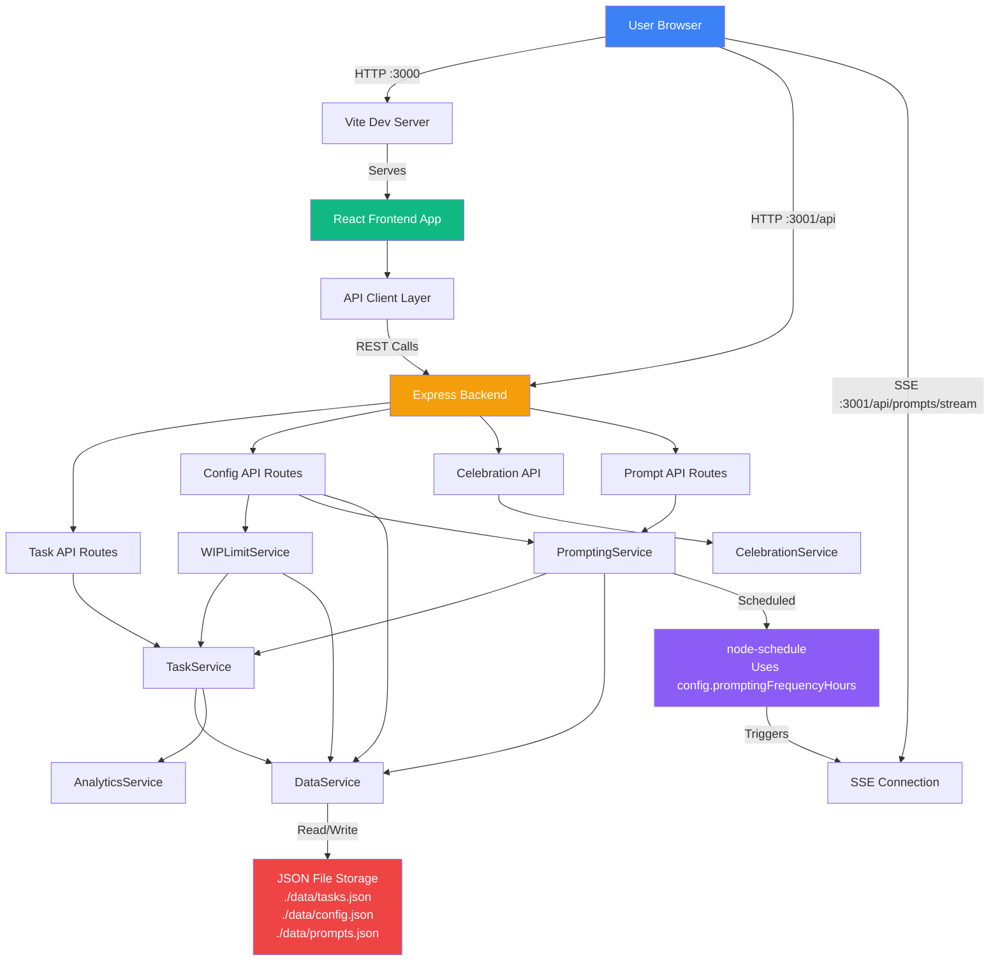

# 2. High Level Architecture

## Technical Summary

The Simple To-Do App implements a **monolithic Node.js/TypeScript architecture** running as a single process on localhost, serving both a React-based web interface and REST API endpoints. The backend executes business logic services (TaskService, CelebrationService, PromptingService, WIPLimitService) in-process, with local JSON file storage for data persistence. A background scheduler manages proactive task prompting via Server-Sent Events (SSE) for real-time browser push notifications. The frontend uses React 18 with TypeScript, Vite for fast builds, and CSS Modules/Tailwind for styling, communicating with the backend through a simple REST API. This architecture achieves the PRD's goal of rapid MVP development (4-6 weeks) while maintaining clean separation of concerns and enabling future migration to hosted deployment.

## Platform and Infrastructure Choice

After reviewing the PRD requirements (localhost-only MVP, 5-10 pilot users, privacy-first, 4-6 week timeline), I recommend the following platform:

**Platform:** Local Development Environment (No Cloud)
**Key Services:**
- **Runtime:** Node.js 18+ LTS (local process)
- **Web Server:** Express.js (serves both static frontend and API)
- **Data Storage:** Local filesystem (JSON files in `./data/` directory)
- **Build System:** Vite (development server + production build)
- **Process Management:** npm scripts (`npm run dev`, `npm start`)

**Deployment Host and Regions:** N/A - Runs locally on user's machine (Windows 10+, macOS 12+, Linux Ubuntu 20.04+)

**Rationale:**
- **No Cloud Hosting Needed:** PRD specifies localhost-only for MVP; hosting adds complexity and cost with zero benefit
- **Privacy Compliance:** All data stays local (NFR4: no external data transmission)
- **Simplicity:** Single process monolith is fastest path to validation within timeline
- **Future Path:** Architecture supports future migration to Vercel/AWS/Azure in Phase 2 if needed

**Alternative Considered:** Vercel + Supabase - Rejected for MVP as it requires authentication, cloud storage, and hosting setup that delays validation of core hypotheses

## Repository Structure

**Structure:** Monorepo with single Git repository
**Monorepo Tool:** npm workspaces (built into npm 7+, no additional tooling needed)
**Package Organization:** Organized by concern with clear boundaries:
- `/apps/web` - React frontend application
- `/apps/server` - Express backend application
- `/packages/shared` - Shared TypeScript types, constants, and utilities
- `/packages/config` - Shared ESLint, TypeScript, and testing configurations

**Rationale:**
1. **MVP Simplicity:** PRD technical assumptions recommend monorepo for ease of development and refactoring
2. **Type Safety:** Shared types package ensures frontend/backend contract consistency
3. **No Over-Engineering:** npm workspaces provide sufficient monorepo features without adding Nx/Turborepo complexity
4. **Fast Iteration:** All code in one place, easy to search and ensure consistency
5. **Future-Ready:** Structure supports extraction of services or deployment as separate packages if needed in Phase 2

### Frontend Directory Structure (`/apps/web`)

**Detailed Organization:**

```
apps/web/
├── public/                          # Static assets served directly
│   ├── favicon.ico
│   ├── robots.txt
│   └── manifest.json
│
├── src/
│   ├── components/                  # Reusable UI components
│   │   ├── TaskCard.tsx            # Individual task display
│   │   ├── TaskCard.module.css     # Component-specific styles
│   │   ├── AddTaskInput.tsx        # Task creation form
│   │   ├── TaskList.tsx            # Task list container
│   │   ├── CelebrationOverlay.tsx  # Celebration modal
│   │   ├── PromptToast.tsx         # Proactive prompt notification
│   │   ├── SettingsModal.tsx       # Settings dialog
│   │   ├── WIPCountIndicator.tsx   # WIP limit progress bar
│   │   ├── EmptyState.tsx          # Empty state displays
│   │   └── shared/                 # Shared/foundational components
│   │       ├── Button.tsx
│   │       ├── Modal.tsx
│   │       └── Icon.tsx
│   │
│   ├── views/                       # Page-level components (routes)
│   │   ├── TaskListView.tsx        # Main task list page (/)
│   │   ├── SettingsView.tsx        # Settings page (/settings)
│   │   └── AnalyticsView.tsx       # Analytics page (/analytics)
│   │
│   ├── hooks/                       # Custom React hooks
│   │   ├── useTasks.ts             # Task state management
│   │   ├── useSSE.ts               # Server-Sent Events connection
│   │   ├── useConfig.ts            # Configuration state
│   │   ├── useTaskSearch.ts        # Search/filter logic (future)
│   │   └── useKeyboardShortcuts.ts # Keyboard navigation
│   │
│   ├── services/                    # API client layer
│   │   ├── api.ts                  # Base API client (fetch wrapper)
│   │   ├── tasks.ts                # Task API calls
│   │   ├── config.ts               # Config API calls
│   │   ├── celebrations.ts         # Celebration API calls
│   │   └── prompts.ts              # Prompt API calls
│   │
│   ├── context/                     # React Context providers
│   │   ├── TaskContext.tsx         # Global task state
│   │   ├── ConfigContext.tsx       # Global config state
│   │   └── UIContext.tsx           # UI state (modals, toasts)
│   │
│   ├── utils/                       # Helper functions and utilities
│   │   ├── announceToScreenReader.ts  # Accessibility helper
│   │   ├── formatDuration.ts       # Time formatting
│   │   ├── performanceMonitoring.ts # Performance tracking
│   │   └── validation.ts           # Client-side validation
│   │
│   ├── styles/                      # Global styles
│   │   ├── global.css              # Global styles and resets
│   │   ├── colors.css              # CSS variables for colors
│   │   ├── typography.css          # Font and text styles
│   │   ├── focus.css               # Focus indicator styles
│   │   ├── accessibility.css       # Accessibility utilities (.sr-only)
│   │   └── animations.css          # Animation utilities
│   │
│   ├── types/                       # Frontend-specific TypeScript types
│   │   └── index.ts                # Extended types not in shared package
│   │
│   ├── App.tsx                      # Root component with routing
│   ├── main.tsx                     # Entry point
│   └── vite-env.d.ts               # Vite type definitions
│
├── tests/                           # Frontend tests
│   ├── unit/
│   │   ├── components/
│   │   │   ├── TaskCard.test.tsx
│   │   │   ├── TaskCard.a11y.test.tsx  # Accessibility tests
│   │   │   └── AddTaskInput.test.tsx
│   │   └── hooks/
│   │       ├── useTasks.test.ts
│   │       └── useSSE.test.ts
│   ├── integration/
│   │   ├── TaskListFlow.test.tsx
│   │   ├── WIPLimitFlow.test.tsx
│   │   └── SettingsFlow.test.tsx
│   ├── mocks/
│   │   └── handlers.ts             # MSW API handlers
│   └── helpers/
│       ├── testSetup.ts
│       └── renderWithProviders.tsx
│
├── index.html                       # HTML entry point
├── vite.config.ts                   # Vite configuration
├── tsconfig.json                    # TypeScript configuration
├── tsconfig.node.json               # TypeScript for Node (Vite config)
└── package.json                     # Frontend dependencies
```

**File Placement Guidelines:**

| New File Type | Where to Place | Naming Convention |
|--------------|----------------|-------------------|
| React Component | `src/components/` | `ComponentName.tsx` |
| Page/Route Component | `src/views/` | `PageNameView.tsx` |
| Custom Hook | `src/hooks/` | `useFeatureName.ts` |
| API Service | `src/services/` | `resourceName.ts` |
| Utility Function | `src/utils/` | `functionName.ts` |
| Context Provider | `src/context/` | `FeatureContext.tsx` |
| Component Styles | Same directory as component | `ComponentName.module.css` |
| Global Styles | `src/styles/` | `purpose.css` |
| Component Test | `tests/unit/components/` | `ComponentName.test.tsx` |
| Integration Test | `tests/integration/` | `FeatureFlow.test.tsx` |

**Import Path Examples:**

```typescript
// Component imports another component (relative)
import { Button } from '../shared/Button';
import styles from './TaskCard.module.css';

// Component uses hook (relative)
import { useTasks } from '../../hooks/useTasks';

// Component uses API service (relative)
import { tasks } from '../../services/tasks';

// Component uses shared types (absolute from package)
import type { Task } from '@simple-todo/shared/types';
import { TaskHelpers } from '@simple-todo/shared/utils';

// Component uses context (relative)
import { useTaskContext } from '../../context/TaskContext';
```

### Backend Directory Structure (`/apps/server`)

**Detailed Organization:**

```
apps/server/
├── src/
│   ├── routes/                      # API route handlers
│   │   ├── tasks.ts                # Task endpoints
│   │   ├── config.ts               # Config endpoints
│   │   ├── celebrations.ts         # Celebration endpoints
│   │   ├── prompts.ts              # Prompt/SSE endpoints
│   │   ├── analytics.ts            # Analytics endpoints (Phase 2)
│   │   └── health.ts               # Health check endpoint
│   │
│   ├── services/                    # Business logic layer
│   │   ├── TaskService.ts          # Task CRUD operations
│   │   ├── WIPLimitService.ts      # WIP limit enforcement
│   │   ├── CelebrationService.ts   # Celebration message generation
│   │   ├── PromptingService.ts     # Proactive prompting logic
│   │   ├── AnalyticsService.ts     # Analytics calculations
│   │   └── DataService.ts          # Data persistence abstraction
│   │
│   ├── middleware/                  # Express middleware
│   │   ├── errorHandler.ts         # Global error handling
│   │   ├── validation.ts           # Zod validation middleware
│   │   ├── performanceMonitoring.ts # Request timing
│   │   └── logging.ts              # Request logging
│   │
│   ├── utils/                       # Helper functions
│   │   ├── logger.ts               # Winston logger setup
│   │   └── asyncHandler.ts         # Async route wrapper
│   │
│   ├── types/                       # Backend-specific types
│   │   └── index.ts                # Extended types
│   │
│   ├── app.ts                       # Express app setup
│   └── index.ts                     # Server entry point
│
├── tests/                           # Backend tests
│   ├── unit/
│   │   ├── services/
│   │   │   ├── TaskService.test.ts
│   │   │   ├── WIPLimitService.test.ts
│   │   │   └── CelebrationService.test.ts
│   │   └── utils/
│   │       └── TaskHelpers.test.ts
│   ├── integration/
│   │   ├── api/
│   │   │   ├── tasks.test.ts
│   │   │   ├── config.test.ts
│   │   │   └── celebrations.test.ts
│   │   └── data/
│   │       └── DataService.test.ts
│   ├── fixtures/
│   │   ├── tasks.json
│   │   └── config.json
│   └── helpers/
│       ├── testSetup.ts
│       └── factories.ts            # Test data factories
│
├── tsconfig.json                    # TypeScript configuration
├── jest.config.js                   # Jest configuration
└── package.json                     # Backend dependencies
```

### Shared Packages Structure

**`/packages/shared` - Shared Types and Utilities:**

```
packages/shared/
├── src/
│   ├── types/                       # Shared TypeScript types
│   │   ├── Task.ts                 # Task interface
│   │   ├── Config.ts               # Config interface
│   │   ├── CelebrationMessage.ts   # Celebration types
│   │   ├── PromptEvent.ts          # Prompt types
│   │   ├── AnalyticsData.ts        # Analytics types
│   │   └── index.ts                # Barrel export
│   │
│   ├── utils/                       # Shared utility functions
│   │   ├── TaskHelpers.ts          # Task computation helpers
│   │   ├── constants.ts            # Shared constants
│   │   └── index.ts                # Barrel export
│   │
│   └── index.ts                     # Main barrel export
│
├── tsconfig.json
└── package.json
```

**`/packages/config` - Shared Configurations:**

```
packages/config/
├── eslint/
│   └── base.js                      # Base ESLint config
├── typescript/
│   ├── base.json                    # Base TypeScript config
│   ├── react.json                   # React-specific overrides
│   └── node.json                    # Node-specific overrides
└── package.json
```

## High Level Architecture Diagram



## Architectural Patterns

**Overall Architecture Patterns:**
- **Monolithic Architecture:** Single Node.js process serves all concerns - _Rationale:_ MVP with 5-10 users doesn't justify microservices complexity; enables rapid development and simple deployment
- **Layered Architecture:** Clear separation of API routes → Services → Data access - _Rationale:_ Testability and future migration flexibility (can extract layers later)

**Frontend Patterns:**
- **Component-Based UI:** Reusable React components with TypeScript - _Rationale:_ Maintainability, type safety, component reuse across screens
- **Unidirectional Data Flow:** React Context API for global state (WIP config, task list) - _Rationale:_ Simpler than Redux for MVP, sufficient for limited global state needs
- **Optimistic UI Updates:** Update UI immediately, revert on API failure - _Rationale:_ Achieves <100ms perceived response time (NFR2)

**Backend Patterns:**
- **Service Layer Pattern:** Business logic encapsulated in services (TaskService, CelebrationService, etc.) - _Rationale:_ Separation of concerns, unit testable, reusable across API endpoints
- **Repository Pattern:** DataService abstracts storage implementation - _Rationale:_ Enables future JSON → SQLite migration without changing business logic (PRD Phase 2 consideration)
- **Singleton Services:** Services instantiated once, shared across requests - _Rationale:_ Localhost single-user app has no concurrency concerns, simplifies architecture

**Integration Patterns:**
- **REST API:** Simple JSON-based HTTP endpoints - _Rationale:_ Standard, well-supported, sufficient for CRUD operations
- **Server-Sent Events (SSE):** Backend pushes prompts to frontend - _Rationale:_ Simpler than WebSockets for one-way server→client push, PRD recommends for proactive prompting
- **Atomic File Writes:** DataService uses temp file + rename pattern - _Rationale:_ Prevents JSON corruption on write failures (NFR6: data integrity)

**Proactive Prompting Pattern:**
- **Event-Driven Scheduling:** Background scheduler emits events via SSE when interval elapsed - _Rationale:_ Decouples prompt generation from HTTP request/response cycle, enables real-time delivery

**Configuration Management Pattern:**
- **Distributed Config Handling:** Config API routes to different services based on business logic needs:
  - `/api/config/wip-limit` → WIPLimitService (validation, business logic, helpful messages)
  - `/api/config/prompting` → PromptingService (update config + restart scheduler)
  - `/api/config/celebrations` → DataService (simple validation + persistence)
  - `/api/config` GET → DataService (read entire config object)
- _Rationale:_ Services own their configuration updates when side effects are needed (scheduler restart, validation logic), otherwise direct DataService access keeps it simple

---
