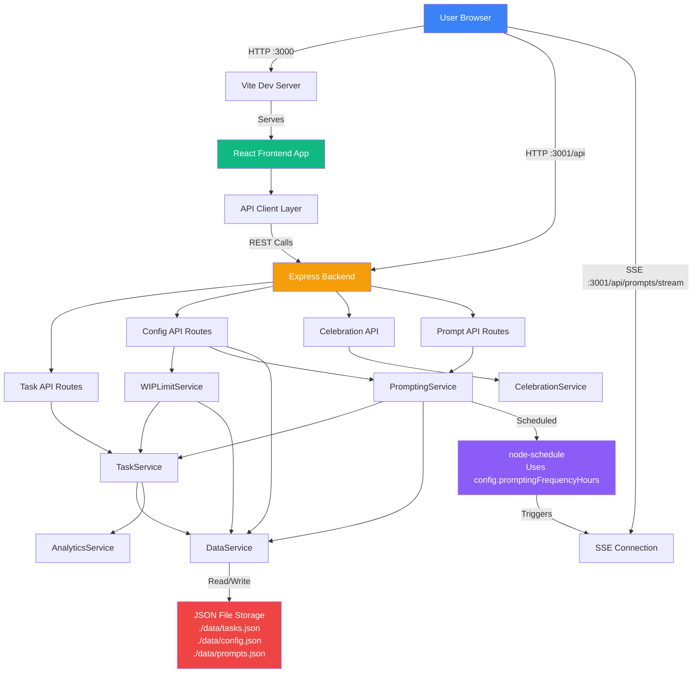

# High Level Architecture Diagram

```mermaid
graph TD
    User[User Browser] -->|HTTP :3000| Vite[Vite Dev Server]
    User -->|HTTP :3001/api| Express[Express Backend]
    User -->|SSE :3001/api/prompts/stream| SSE[SSE Connection]

    Vite -->|Serves| React[React Frontend App]

    Express --> TaskAPI[Task API Routes]
    Express --> ConfigAPI[Config API Routes]
    Express --> CelebAPI[Celebration API]
    Express --> PromptAPI[Prompt API Routes]

    TaskAPI --> TaskSvc[TaskService]
    ConfigAPI --> WIPSvc[WIPLimitService]
    ConfigAPI --> PromptSvc[PromptingService]
    ConfigAPI --> DataSvc[DataService]
    CelebAPI --> CelebSvc[CelebrationService]
    PromptAPI --> PromptSvc

    TaskSvc --> DataSvc
    WIPSvc --> TaskSvc
    WIPSvc --> DataSvc
    PromptSvc --> TaskSvc
    PromptSvc --> DataSvc

    DataSvc -->|Read/Write| JSON[JSON File Storage<br/>./data/tasks.json<br/>./data/config.json<br/>./data/prompts.json]

    PromptSvc -->|Scheduled| Scheduler[node-schedule<br/>Uses config.promptingFrequencyHours]
    Scheduler -->|Triggers| SSE

    TaskSvc --> Analytics[AnalyticsService]

    React --> APIClient[API Client Layer]
    APIClient -->|REST Calls| Express

    style User fill:#3B82F6,color:#fff
    style React fill:#10B981,color:#fff
    style Express fill:#F59E0B,color:#fff
    style JSON fill:#EF4444,color:#fff
    style Scheduler fill:#8B5CF6,color:#fff
```
