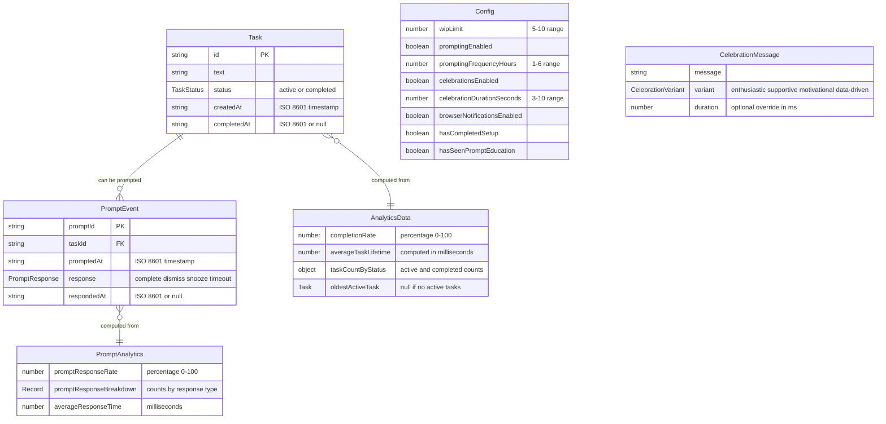

# 4. Data Models

## Task

**Purpose:** Represents a single to-do item with lifecycle tracking

**Key Attributes:**

- **id:** string (UUID) - Unique identifier for the task
- **text:** string - Task description (1-500 characters per PRD validation)
- **status:** TaskStatus - Current state of the task ('active' | 'completed')
- **createdAt:** string (ISO 8601) - Timestamp when task was created (FR13)
- **completedAt:** string | null (ISO 8601) - Timestamp when task was completed
  (FR14), null if active

**Computed Properties (not stored):**

- **duration:** number | null - Milliseconds from creation to completion,
  computed from timestamps
- **age:** number - Milliseconds since creation, computed from current time
- **textLength:** number - Character count, computed from text.length

### TypeScript Interface

````typescript
/**
 * Task status type - single source of truth
 */
export type TaskStatus = 'active' | 'completed';

/**
 * Core task entity - minimal, normalized design
 */
export interface Task {
  id: string;
  text: string;
  status: TaskStatus; // Uses named type, not inline union
  createdAt: string; // ISO 8601 format
  completedAt: string | null; // ISO 8601 format, null if active
}

/**
 * Payload for creating a new task (client sends this)
 */
export interface CreateTaskDto {
  text: string;
}

/**
 * Payload for updating task text (client sends this)
 */
export interface UpdateTaskDto {
  text: string;
}

/**
 * Helper functions for computed task properties
 *
 * Design Note: TaskHelpers provides on-demand computation of derived values
 * from the minimal Task interface. These are NOT stored in the data model.
 *
 * Implementation Status:
 * - ✅ Currently Implemented: getAge(), getAgeCategory(), getTextLength(), getDuration(), isValidISOTimestamp()
 * - 📋 Future: formatDuration() and other display helpers as needed
 */
export const TaskHelpers = {
  /**
   * Calculate task age (creation to now)
   * @returns Age in milliseconds
   * @status Currently Implemented
   */
  getAge(task: Task): number {
    return Date.now() - new Date(task.createdAt).getTime();
  },

  /**
   * Get task age category for visual indicators
   * @status Currently Implemented
   */
  getAgeCategory(task: Task): 'fresh' | 'recent' | 'aging' | 'old' | 'stale' {
    const ageMs = TaskHelpers.getAge(task);
    const ageDays = ageMs / (1000 * 60 * 60 * 24);

    if (ageDays < 1) return 'fresh';
    if (ageDays < 3) return 'recent';
    if (ageDays < 7) return 'aging';
    if (ageDays < 14) return 'old';
    return 'stale';
  },

  /**
   * Calculate character count of task text
   * @param text - The task text string
   * @returns Character count including spaces
   * @status Currently Implemented (Story 2.1)
   */
  getTextLength(text: string): number {
    return text.length;
  },

  /**
   * Calculate task lifetime duration (creation to completion)
   * @param createdAt - ISO 8601 timestamp when task was created
   * @param completedAt - ISO 8601 timestamp when completed, or null if active
   * @returns Duration in milliseconds, or null if task not completed
   * @status Currently Implemented (Story 2.1)
   */
  getDuration(
    createdAt: string,
    completedAt: string | null
  ): number | null {
    if (completedAt === null) {
      return null;
    }
    return new Date(completedAt).getTime() - new Date(createdAt).getTime();
  },

  /**
   * Validates timestamp string is in valid ISO 8601 format
   * @param timestamp - The timestamp string to validate
   * @returns True if valid ISO 8601 format, false otherwise
   * @status Currently Implemented (Story 2.1)
   */
  isValidISOTimestamp(timestamp: string): boolean {
    const parsed = Date.parse(timestamp);
    if (isNaN(parsed)) {
      return false;
    }
    const iso8601Regex = /^\d{4}-\d{2}-\d{2}T\d{2}:\d{2}:\d{2}\.\d{3}Z$/;
    return iso8601Regex.test(timestamp);
  },

  /**
   * Format duration for display (e.g., "2 days", "3 hours")
   * @param milliseconds - Duration in milliseconds
   * @returns Formatted duration string
   * @status Future - To Be Implemented when display formatting needed
   */
  formatDuration(milliseconds: number): string {
    const seconds = Math.floor(milliseconds / 1000);
    const minutes = Math.floor(seconds / 60);
    const hours = Math.floor(minutes / 60);
    const days = Math.floor(hours / 24);

    if (days > 0) return `${days} day${days > 1 ? 's' : ''}`;
    if (hours > 0) return `${hours} hour${hours > 1 ? 's' : ''}`;
    if (minutes > 0) return `${minutes} minute${minutes > 1 ? 's' : ''}`;
    return `${seconds} second${seconds !== 1 ? 's' : ''}`;
  },
};

**Usage Examples:**

```typescript
// Example 1: Get task text length (Story 2.1)
const task: Task = { /* ... */ text: 'Buy groceries' };
const length = TaskHelpers.getTextLength(task.text);
console.log(length); // 14

// Example 2: Calculate task duration (Story 2.1)
const completedTask: Task = {
  /* ... */
  createdAt: '2026-01-20T10:00:00.000Z',
  completedAt: '2026-01-21T15:30:00.000Z'
};
const duration = TaskHelpers.getDuration(
  completedTask.createdAt,
  completedTask.completedAt
);
console.log(duration); // 106200000 (milliseconds)

// Example 3: Calculate age (Currently implemented)
const activeTask: Task = { /* ... */ createdAt: '2026-01-20T10:00:00.000Z' };
const age = TaskHelpers.getAge(activeTask);
const category = TaskHelpers.getAgeCategory(activeTask);
console.log(category); // 'fresh', 'recent', 'aging', 'old', or 'stale'

// Example 4: Validate timestamp (Story 2.1)
const isValid = TaskHelpers.isValidISOTimestamp('2026-01-20T10:00:00.000Z');
console.log(isValid); // true
````

**Why Computed Properties?**

The architecture uses computed properties instead of stored fields for derived
values because:

1. **Data Integrity**: Single source of truth (timestamps) prevents
   inconsistencies
2. **Minimal Storage**: Only essential data is persisted to JSON files
3. **No Migration**: Adding new computed properties doesn't require data
   migration
4. **Always Accurate**: Calculated on-demand from current timestamps
5. **Testable**: Pure functions with no side effects are easy to test

This approach is suitable for the MVP scale (<10k tasks) where on-demand
computation has negligible performance impact.

````

### Relationships

- **One-to-Many with PromptEvents:** A task can be prompted multiple times
  (tracked in PromptEvent model)
- **No foreign keys:** JSON file storage doesn't enforce referential integrity,
  handled in application logic

---

## Config

**Purpose:** User configuration for WIP limits, prompting preferences, and
celebration settings

### TypeScript Interface

```typescript
/**
 * User configuration and preferences
 */
export interface Config {
  wipLimit: number; // 5-10 range
  promptingEnabled: boolean;
  promptingFrequencyHours: number; // 1-6 range
  celebrationsEnabled: boolean;
  celebrationDurationSeconds: number; // 3-10 range
  browserNotificationsEnabled: boolean;
  hasCompletedSetup: boolean;
  hasSeenPromptEducation: boolean;
  hasSeenWIPLimitEducation: boolean; // Track if user has seen WIP limit education
}

/**
 * Payload for updating WIP limit
 */
export interface UpdateWipLimitDto {
  limit: number; // Must be 5-10
}

/**
 * Payload for updating prompting config
 */
export interface UpdatePromptingConfigDto {
  enabled: boolean;
  frequencyHours: number; // Must be 1-6
}

/**
 * Payload for updating celebration config
 */
export interface UpdateCelebrationConfigDto {
  enabled: boolean;
  durationSeconds: number; // Must be 3-10
}

/**
 * Default configuration values
 */
export const DEFAULT_CONFIG: Config = {
  wipLimit: 7,
  promptingEnabled: true,
  promptingFrequencyHours: 2.5,
  celebrationsEnabled: true,
  celebrationDurationSeconds: 7,
  browserNotificationsEnabled: false,
  hasCompletedSetup: false,
  hasSeenPromptEducation: false,
  hasSeenWIPLimitEducation: false,
};
````

---

## CelebrationMessage

**Purpose:** Represents a celebration message variant with metadata for display

### TypeScript Interface

```typescript
/**
 * Celebration message variant type - single source of truth
 */
export type CelebrationVariant =
  | 'enthusiastic'
  | 'supportive'
  | 'motivational'
  | 'data-driven';

/**
 * Celebration message with variant for styling
 */
export interface CelebrationMessage {
  message: string;
  variant: CelebrationVariant; // Uses named type, not inline union
  duration?: number; // Optional override for display duration (ms)
}

/**
 * Example celebration messages pool (at least 10 per FR10)
 */
export const CELEBRATION_MESSAGES: CelebrationMessage[] = [
  { message: 'Amazing! You crushed it! 🎉', variant: 'enthusiastic' },
  { message: "One more done! You're making progress.", variant: 'supportive' },
  {
    message: 'Task completed! Keep the momentum going!',
    variant: 'motivational',
  },
  { message: "Great work! That's progress!", variant: 'supportive' },
  { message: 'Boom! Another one bites the dust! ✨', variant: 'enthusiastic' },
  { message: "Well done! You're on a roll!", variant: 'motivational' },
  {
    message: 'Task complete! Nice job staying focused.',
    variant: 'supportive',
  },
  { message: "Excellent! You're building momentum!", variant: 'motivational' },
  { message: 'Crushed it! Keep going! 🚀', variant: 'enthusiastic' },
  { message: "Progress made! You're doing great.", variant: 'supportive' },
  // Data-driven messages dynamically include task count
];
```

---

## PromptEvent

**Purpose:** Analytics tracking for proactive prompt interactions (FR11-FR12
response tracking)

### TypeScript Interface

```typescript
/**
 * Prompt response type - single source of truth
 */
export type PromptResponse = 'complete' | 'dismiss' | 'snooze' | 'timeout';

/**
 * Proactive prompt event for analytics tracking
 */
export interface PromptEvent {
  promptId: string;
  taskId: string;
  promptedAt: string; // ISO 8601
  response: PromptResponse; // Uses named type, not inline union
  respondedAt: string | null; // ISO 8601, null if timeout
}

/**
 * Payload for prompt generation (server → client via SSE)
 */
export interface ProactivePrompt {
  taskId: string;
  taskText: string;
  promptedAt: string; // ISO 8601
}

/**
 * Payload for snoozing a prompt (client → server)
 */
export interface SnoozePromptDto {
  taskId: string;
}
```

---

## AnalyticsData

**Purpose:** Computed analytics metrics (not persisted, calculated on-demand
from tasks/prompts)

### TypeScript Interface

```typescript
/**
 * Analytics data computed from tasks and prompt events
 */
export interface AnalyticsData {
  completionRate: number; // Percentage (0-100)
  averageTaskLifetime: number; // Milliseconds (computed using TaskHelpers.getDuration)
  taskCountByStatus: {
    active: number;
    completed: number;
  };
  oldestActiveTask: Task | null; // For age indicators
}

/**
 * Prompt analytics (separate from task analytics)
 */
export interface PromptAnalytics {
  promptResponseRate: number; // Percentage (0-100)
  promptResponseBreakdown: Record<PromptResponse, number>; // Uses PromptResponse type
  averageResponseTime: number; // Milliseconds
}
```

---

## Data Model Diagram



---
