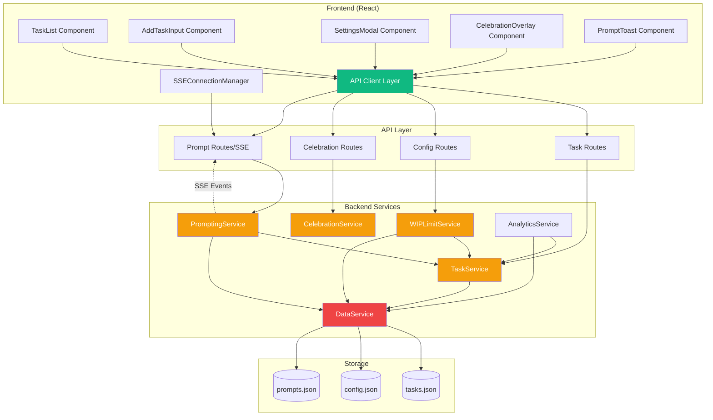

# 6. Components

## Backend Components

### 1. DataService

**Responsibility:** Abstract data persistence layer for JSON file storage. Handles atomic file operations with data integrity guarantees.

**Key Interfaces:**
- `loadTasks(): Promise<Task[]>` - Read tasks from tasks.json
- `saveTasks(tasks: Task[]): Promise<void>` - Write tasks to tasks.json with atomic writes
- `loadConfig(): Promise<Config>` - Read config from config.json
- `saveConfig(config: Config): Promise<void>` - Write config to config.json
- `loadPromptEvents(): Promise<PromptEvent[]>` - Read prompt events from prompts.json
- `savePromptEvents(events: PromptEvent[]): Promise<void>` - Write prompt events
- `ensureDataDirectoryExists(): Promise<void>` - Create ./data directory if missing

**Dependencies:**
- Node.js `fs/promises` module (filesystem operations)
- No service dependencies (lowest layer)

**Technology Stack:** TypeScript, Node.js fs/promises, atomic write pattern (temp file + rename)

**Implementation Details:**
```typescript
// Atomic write pattern to prevent corruption
async saveTasks(tasks: Task[]): Promise<void> {
  const tempFile = `${this.tasksFilePath}.tmp`;
  await fs.writeFile(tempFile, JSON.stringify(tasks, null, 2));
  await fs.rename(tempFile, this.tasksFilePath);
}
```

---

### 2. TaskService

**Responsibility:** Core business logic for task CRUD operations. Encapsulates all task management rules and metadata calculation.

**Key Interfaces:**
- `getAllTasks(status?: TaskStatus): Promise<Task[]>` - Retrieve tasks, optionally filtered
- `getTaskById(id: string): Promise<Task | null>` - Find task by ID
- `createTask(text: string): Promise<Task>` - Create new task (generates UUID, timestamps, metadata)
- `updateTask(id: string, text: string): Promise<Task>` - Update task text
- `deleteTask(id: string): Promise<void>` - Remove task permanently
- `completeTask(id: string): Promise<Task>` - Mark task complete, set completedAt timestamp
- `getActiveTaskCount(): Promise<number>` - Count active tasks for WIP limit checks

**Dependencies:**
- DataService (for persistence)

**Technology Stack:** TypeScript, uuid library for ID generation, date-fns for timestamp handling

**Business Rules Enforced:**
- Task text must be 1-500 characters (validated before creation)
- createdAt set to current ISO timestamp on creation
- completedAt set when status changes to 'completed'
- Only active tasks can be edited (completed tasks are immutable)

---

### 3. WIPLimitService

**Responsibility:** Enforce Work In Progress limit with helpful messaging. Manage WIP configuration.

**Key Interfaces:**
- `canAddTask(): Promise<boolean>` - Check if new task can be added (active count < limit)
- `getCurrentWIPCount(): Promise<number>` - Get current active task count
- `getWIPLimit(): Promise<number>` - Get configured limit
- `setWIPLimit(limit: number): Promise<void>` - Update limit (validates 5-10 range)
- `getWIPLimitMessage(): Promise<string>` - Generate encouraging message when limit reached

**Dependencies:**
- TaskService (to get active task count)
- DataService (to read/write config)

**Technology Stack:** TypeScript

**Sample Messages:**
- "You have 7 active tasks - complete one before adding more to maintain focus!"
- "You have 10 tasks in progress. Research shows limiting WIP improves completion rates."

---

### 4. CelebrationService

**Responsibility:** Generate varied celebration messages with rotation to minimize repetition (FR10: 10+ distinct messages).

**Key Interfaces:**
- `getCelebrationMessage(taskId?: string): CelebrationMessage` - Get random celebration, optionally with task context
- `getRecentMessages(): string[]` - Track last 3-5 messages to avoid immediate repetition

**Dependencies:**
- TaskService (optional, for data-driven messages like "That's 5 tasks this week!")
- No persistence (messages hardcoded, recent tracking in-memory)

**Technology Stack:** TypeScript

**Message Pool Strategy:**
- Maintains array of 10+ CelebrationMessage objects with variants
- Random selection weighted to avoid repeating last 3 messages
- Data-driven variant dynamically inserts task count: "Task completed! That's {count} this week!"

---

### 5. PromptingService

**Responsibility:** Background scheduler for proactive task prompting. Manages prompt lifecycle (schedule, deliver, track responses) and prompting configuration updates.

**Key Interfaces:**
- `startScheduler(): void` - Begin periodic prompting (runs in-process)
- `stopScheduler(): void` - Stop prompting when disabled
- `generatePrompt(): Promise<ProactivePrompt | null>` - Select random active task and create prompt
- `selectTaskForPrompt(): Promise<Task | null>` - Random selection from active tasks
- `snoozePrompt(taskId: string): Promise<void>` - Reschedule prompt for 1 hour later
- `logPromptResponse(promptId: string, response: PromptResponse): Promise<void>` - Track analytics
- `updatePromptingConfig(dto: UpdatePromptingConfigDto): Promise<void>` - Update config and restart scheduler

**Dependencies:**
- TaskService (to get active tasks)
- DataService (to save prompt events for analytics, read/write config)
- node-schedule library (for interval scheduling)
- EventEmitter (to emit prompt events for SSE)

**Technology Stack:** TypeScript, node-schedule, Node.js EventEmitter

**Scheduling Logic (CORRECTED):**
```typescript
// Uses configured frequency from config (1-6 hours per PRD FR17)
async scheduleNextPrompt(): Promise<void> {
  const config = await this.dataService.loadConfig();

  if (!config.promptingEnabled) {
    return; // Don't schedule if disabled
  }

  // Use configured frequency as base, add slight randomness (±15 minutes)
  const baseHours = config.promptingFrequencyHours; // e.g., 2.5
  const randomOffsetMinutes = (Math.random() - 0.5) * 30; // -15 to +15 minutes
  const totalHours = baseHours + (randomOffsetMinutes / 60);

  const milliseconds = totalHours * 60 * 60 * 1000;

  setTimeout(() => this.generatePrompt(), milliseconds);
}
```

---

### 6. AnalyticsService

**Responsibility:** Calculate behavioral metrics on-demand from task and prompt data (no persistence).

**Key Interfaces:**
- `getCompletionRate(): Promise<number>` - Calculate (completed / total) × 100
- `getAverageTaskLifetime(): Promise<number>` - Mean duration using TaskHelpers.getDuration
- `getTaskCountByStatus(): Promise<{active: number, completed: number}>` - Count by status
- `getOldestActiveTask(): Promise<Task | null>` - Find oldest active task for age indicators
- `getPromptResponseRate(): Promise<number>` - Calculate (responses / total prompts) × 100
- `getPromptResponseBreakdown(): Promise<Record<PromptResponse, number>>` - Count by response type
- `getAverageResponseTime(): Promise<number>` - Mean time from prompt to response

**Dependencies:**
- TaskService (read tasks)
- DataService (read prompt events)
- TaskHelpers (compute durations)

**Technology Stack:** TypeScript

**Performance:** Computes from <10k tasks/events in <10ms, acceptable for MVP

---

## Frontend Components

### 7. API Client Layer

**Responsibility:** Centralized HTTP client for all backend communication. Provides type-safe API calls with error handling.

**Key Interfaces:**
- `tasks.getAll(status?: TaskStatus): Promise<Task[]>`
- `tasks.create(dto: CreateTaskDto): Promise<Task>`
- `tasks.update(id: string, dto: UpdateTaskDto): Promise<Task>`
- `tasks.complete(id: string): Promise<Task>`
- `tasks.delete(id: string): Promise<void>`
- `config.getWipLimit(): Promise<{limit: number, currentCount: number, canAddTask: boolean}>`
- `config.updateWipLimit(dto: UpdateWipLimitDto): Promise<void>`
- `celebrations.getMessage(taskId?: string): Promise<CelebrationMessage>`
- `prompts.snooze(dto: SnoozePromptDto): Promise<void>`

**Dependencies:**
- Fetch API (native browser)
- Shared types from `/packages/shared/types`

**Technology Stack:** TypeScript, native fetch, Zod for response validation

---

### 8. Task Management Components (React)

**Responsibility:** UI components for task list display and interactions

**Key Components:**
- **TaskList** - Renders list of tasks with age indicators
- **TaskCard** - Individual task item with actions (edit, complete, delete)
- **AddTaskInput** - Input field and "Add Task" button
- **TaskEditMode** - Inline edit form for task text
- **WIPCountIndicator** - Visual indicator of active tasks vs limit
- **WIPLimitMessage** - Encouraging message when limit reached

**Dependencies:**
- API Client Layer
- React Context (TaskContext for global task state)
- TaskHelpers (for age calculation, duration formatting)

**Technology Stack:** React 18, TypeScript, Tailwind CSS

---

### 9. Settings Components (React)

**Responsibility:** Configuration UI for WIP limit, prompting, and celebrations

**Key Components:**
- **SettingsModal** - Modal container for all settings
- **WIPLimitConfig** - Slider for WIP limit (5-10)
- **PromptingConfig** - Enable/disable toggle, frequency slider (1-6 hours)
- **CelebrationConfig** - Enable/disable toggle, duration slider (3-10s), preview button
- **BrowserNotificationToggle** - Request permission and enable browser notifications

**Dependencies:**
- API Client Layer
- React Context (ConfigContext for global config state)

**Technology Stack:** React 18, TypeScript, Tailwind CSS, Headless UI for accessible controls

---

### 10. Celebration Components (React)

**Responsibility:** Display celebration overlays with animations and confetti

**Key Components:**
- **CelebrationOverlay** - Center-screen modal with celebration message
- **ConfettiEffect** - Canvas-based confetti animation (using canvas-confetti library)
- **InboxZeroCelebration** - Special celebration when all tasks completed

**Dependencies:**
- canvas-confetti library (lazy-loaded when celebration triggers)
- API Client Layer (fetch celebration message)
- ConfigContext (celebration duration setting)

**Technology Stack:** React 18, TypeScript, canvas-confetti, CSS animations

---

### 11. Proactive Prompt Components (React)

**Responsibility:** Display toast notifications for proactive prompts with SSE connection management

**Key Components:**
- **PromptToast** - Toast notification in bottom-right corner with action buttons
- **SSEConnectionManager** - Manages EventSource connection to `/api/prompts/stream`
- **PromptQueue** - Queue multiple prompts, show one at a time

**Dependencies:**
- EventSource API (native browser)
- API Client Layer (for snooze, complete actions)
- TaskContext (to complete task from prompt)

**Technology Stack:** React 18, TypeScript, EventSource, Tailwind CSS

**SSE Connection:**
```typescript
useEffect(() => {
  const eventSource = new EventSource('/api/prompts/stream');

  eventSource.addEventListener('message', (event) => {
    const prompt: ProactivePrompt = JSON.parse(event.data);
    showPromptToast(prompt);
  });

  return () => eventSource.close();
}, []);
```

---

### 12. Empty State Components (React)

**Responsibility:** Display welcoming or celebratory empty states

**Key Components:**
- **QuickStartGuide** - First-time user empty state with 3-step guide
- **InboxZeroState** - Returning user empty state with completion stats

**Dependencies:**
- AnalyticsService (via API for stats)
- ConfigContext (to check hasCompletedSetup flag)

**Technology Stack:** React 18, TypeScript, Tailwind CSS

---

## Component Diagrams



## Sequence Diagram: Task Completion Flow

```mermaid
sequenceDiagram
    participant User
    participant TaskCard
    participant APIClient
    participant TaskAPI
    participant TaskSvc
    participant DataSvc
    participant CelebSvc
    participant Celebration

    User->>TaskCard: Click "Complete" button
    TaskCard->>APIClient: tasks.complete(taskId)
    Note over TaskCard: Optimistic UI: Remove task from list

    APIClient->>TaskAPI: PATCH /api/tasks/:id/complete
    TaskAPI->>TaskSvc: completeTask(taskId)
    TaskSvc->>DataSvc: loadTasks()
    DataSvc-->>TaskSvc: Task[]

    TaskSvc->>TaskSvc: Find task, set status='completed'<br/>Set completedAt timestamp
    TaskSvc->>DataSvc: saveTasks(updatedTasks)
    DataSvc-->>TaskSvc: void

    TaskSvc-->>TaskAPI: completedTask
    TaskAPI-->>APIClient: 200 OK {task}

    APIClient->>APIClient: Fetch celebration message
    APIClient->>CelebAPI: GET /api/celebrations/message
    CelebAPI->>CelebSvc: getCelebrationMessage()
    CelebSvc-->>CelebAPI: {message, variant}
    CelebAPI-->>APIClient: 200 OK {celebration}

    APIClient->>Celebration: Show celebration overlay
    Celebration->>User: Display "Amazing! You crushed it! 🎉"

    Note over TaskCard: If API failed, revert optimistic update
```



---
