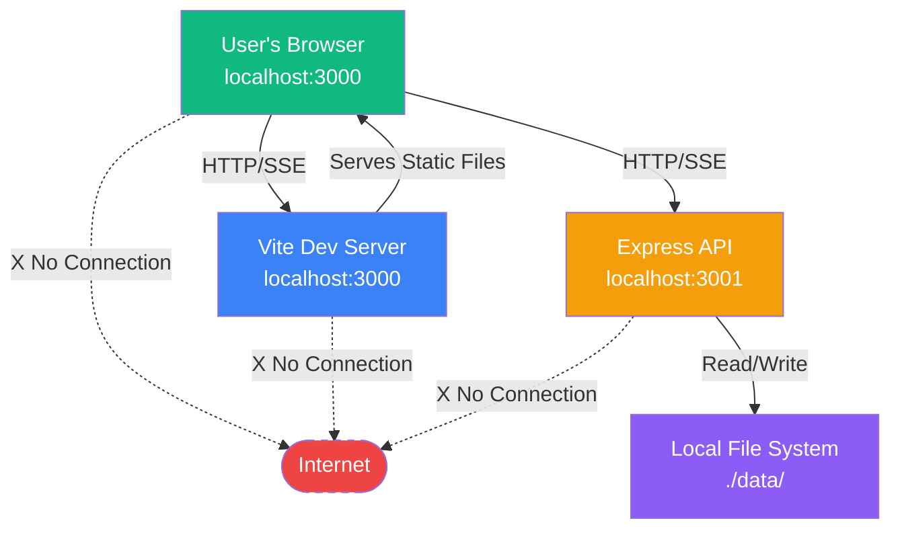

# 7. External APIs & Integrations

## Overview

The Simple To-Do App is designed as a **privacy-first, localhost-only application** with **zero external API dependencies** for MVP. This architectural decision aligns with PRD NFR4 (privacy-first design) and ensures the application functions completely offline.

## External Dependencies: None for MVP

**Current State:** No external APIs or third-party services are used.

**Rationale:**
1. **Privacy First (NFR4):** All data remains local, no transmission to external servers
2. **Offline Capability:** App works without internet connection
3. **Simplicity:** Reduces dependencies, attack surface, and complexity
4. **Rapid MVP:** No API key management, rate limits, or third-party integration testing
5. **Localhost Performance:** No network latency from external calls

## Browser APIs Used (Client-Side Only)

| Browser API | Purpose | Browser Support |
|-------------|---------|-----------------|
| **Fetch API** | HTTP requests to localhost Express API | Modern browsers (Chrome 100+, Firefox 100+, Safari 15+, Edge 100+) |
| **EventSource (SSE)** | Real-time prompt notifications from server | Modern browsers, native auto-reconnection |
| **localStorage** | Potential frontend caching (optional) | Universal browser support |
| **Notification API** | Browser notifications for prompts (opt-in) | Modern browsers, requires user permission |
| **Date API** | Timestamp parsing and formatting | Universal browser support |

**Note:** These are native browser APIs, not external services. No data leaves the user's machine.

## Third-Party JavaScript Libraries

**All libraries run entirely client-side or server-side locally** with no network requests:

**Backend (Node.js):**
- express, uuid, date-fns, zod, winston, node-schedule

**Frontend (Browser):**
- react, react-dom, canvas-confetti

**All libraries:** Run locally, no network requests, no telemetry, no external dependencies.

## Explicitly Excluded Integrations

| Service Type | Examples | Why Excluded |
|--------------|----------|--------------|
| **Analytics** | Google Analytics, Mixpanel | Privacy violation (NFR4), not needed for 5-10 pilot users |
| **Error Tracking** | Sentry, Rollbar | Localhost debugging sufficient |
| **Authentication** | Auth0, Firebase Auth | Single-user localhost app, no auth needed |
| **Cloud Storage** | AWS S3, Google Cloud Storage | Local JSON files sufficient for MVP |
| **Cloud Database** | Supabase, Firebase | JSON file storage meets MVP needs |

## Network Architecture

**Key Points:**
- ✅ All communication stays on localhost (127.0.0.1)
- ✅ No external network requests
- ❌ No internet connection required or used

---
