# 9. Deployment Strategy

## Deployment Model: Local Installation

**Deployment Type:** Developer-style local installation (not traditional
"deployment")

**Target Environment:**

- User's local machine (Windows 10+, macOS 12+, Linux Ubuntu 20.04+)
- Node.js 18+ LTS installed
- No cloud infrastructure
- No containerization (Docker optional for development, not required)

**Rationale:**

- PRD explicitly specifies "localhost-only MVP"
- 5-10 pilot users can run locally
- Fastest path to validation (no deployment infrastructure setup)
- Zero hosting costs
- Complete privacy (NFR4)

---

## Installation Methods

### Method 1: Git Clone + npm install (Recommended)

```bash
# 1. Clone repository
git clone https://github.com/[org]/simple-todo-app.git
cd simple-todo-app

# 2. Install dependencies
npm install

# 3. Build frontend (if needed)
npm run build

# 4. Start application
npm start

# Application runs on:
# - Frontend: http://localhost:3000 (dev) or http://localhost:3001 (prod)
# - Backend API: http://localhost:3001
```

**Prerequisites:**

- Git installed
- Node.js 18+ and npm 8+
- ~100MB disk space for dependencies

---

### Method 2: Pre-built Release Package (Phase 2)

**Future Enhancement:** Package app as standalone executable using pkg, nexe, or
Electron.

**Proposed Installation (Phase 2):**

```bash
# Download release for your platform
# simple-todo-app-v1.0.0-macos.zip
# simple-todo-app-v1.0.0-windows.zip
# simple-todo-app-v1.0.0-linux.tar.gz

# Extract and run
./simple-todo-app

# App starts automatically, opens browser to http://localhost:3000
```

**Current MVP Status:** Git clone method only, pre-built packages deferred to
Phase 2.

---

## Environment Configuration

### Environment Variables

```bash
# .env file (optional, defaults provided)

# Node environment
NODE_ENV=development  # or 'production'

# Server ports
PORT=3001            # Backend API port
VITE_PORT=3000       # Frontend dev server port

# Logging
LOG_LEVEL=info       # error | warn | info | debug

# Data directory (optional override)
DATA_DIR=./data      # Default: ./data

# Frontend API URL (for production build)
VITE_API_URL=http://localhost:3001
```

**No Secrets Required:**

- No API keys
- No database credentials
- No authentication tokens
- Environment variables are for configuration only

---

## Build Process

### Development Build

```bash
# Start both frontend and backend in development mode
npm run dev

# Runs concurrently:
# - Backend: nodemon apps/server/src/index.ts (watches for changes)
# - Frontend: vite (hot module replacement enabled)
```

### Production Build

```bash
# 1. Build frontend (optimized for production)
npm run build:client
# Output: apps/web/dist/ (static files)

# 2. Build backend (TypeScript → JavaScript)
npm run build:server
# Output: apps/server/dist/ (compiled JS)

# 3. Start production server
npm start
# Single server on port 3001 serves both API and frontend
```

**Production Bundle Contents:**

```
simple-todo-app/
├── apps/
│   ├── server/dist/       # Compiled backend
│   └── web/dist/          # Optimized frontend
├── data/                  # Created on first run
│   ├── tasks.json
│   ├── config.json
│   └── prompts.json
├── logs/                  # Created on first run
├── node_modules/
├── package.json
└── .env                   # Optional
```

**Target Bundle Size:**

- Frontend: ~100KB gzipped (including React)
- Backend: N/A (runs locally, not transmitted)

---

## Startup Sequence

```mermaid
sequenceDiagram
    participant User
    participant CLI
    participant Server
    participant FileSystem
    participant Browser

    User->>CLI: npm start
    CLI->>Server: node apps/server/dist/index.js

    Server->>FileSystem: Check ./data directory exists
    alt Data directory missing
        FileSystem-->>Server: Not found
        Server->>FileSystem: Create ./data directory
    end

    Server->>FileSystem: Load config.json
    alt Config not found
        FileSystem-->>Server: Not found
        Server->>FileSystem: Write DEFAULT_CONFIG to config.json
    end

    Server->>FileSystem: Load tasks.json
    alt Tasks not found
        FileSystem-->>Server: Not found
        Server->>FileSystem: Write [] to tasks.json
    end

    Server->>Server: Initialize services<br/>(TaskService, PromptingService, etc.)

    Server->>Server: Start Express server on port 3001
    Server->>Server: Start SSE endpoint

    alt Prompting enabled
        Server->>Server: Start PromptingService scheduler
    end

    Server-->>CLI: Server listening on http://localhost:3001
    CLI-->>User: ✓ Simple To-Do App running

    User->>Browser: Open http://localhost:3001
    Browser->>Server: GET /
    Server-->>Browser: index.html + assets
    Browser->>Browser: React app initializes
    Browser->>Server: GET /api/tasks
    Server-->>Browser: Task[]
    Browser->>Browser: Render task list
```



**Startup Time Target:** <2 seconds (NFR1: Fast startup)

---

## Process Management

### Development Mode

```bash
# Using nodemon for auto-restart on file changes
npm run dev

# Auto-restart on:
# - Backend code changes (*.ts files in apps/server)
# - Frontend code changes (*.tsx, *.css files in apps/web)
```

### Production Mode

```bash
# Simple node process (no process manager for MVP)
npm start

# To run in background (Unix):
nohup npm start > logs/app.log 2>&1 &
```

**Stopping the Server:**

- Development mode: Ctrl+C in terminal
- Production mode (if backgrounded): `kill <PID>`

**Phase 2 Enhancement:** PM2 or systemd for long-running services.

---

## Data Persistence & Backup

### Data Directory Structure

```
./data/
├── tasks.json           # All tasks (active + completed)
├── config.json          # User configuration
├── prompts.json         # Prompt event history (analytics)
└── .backup/             # Optional: automated backups (Phase 2)
```

### Manual Backup Strategy (MVP)

**Recommendation for Users:**

```bash
# Option 1: Simple file copy
cp -r ./data ./data-backup-$(date +%Y-%m-%d)

# Option 2: Create tarball
tar -czf simple-todo-backup-$(date +%Y-%m-%d).tar.gz ./data
```

**Automated Backup:** Deferred to Phase 2.

---

## Deployment Environments

### Local Development

**Configuration:**

```bash
NODE_ENV=development
LOG_LEVEL=debug
```

**Characteristics:**

- Hot module replacement
- Detailed error messages
- Stack traces visible
- Concurrent frontend + backend processes

**Access:** http://localhost:3000 (Vite dev server proxies API to :3001)

---

### Local Production (User Installation)

**Configuration:**

```bash
NODE_ENV=production
LOG_LEVEL=info
```

**Characteristics:**

- Optimized builds
- Minified code
- No stack traces in responses
- Single server process (port 3001)

**Access:** http://localhost:3001 (single server serves both API and static
files)

---

## Monitoring & Health Checks

### Application Health Endpoint

```typescript
// apps/server/src/routes/health.ts
app.get('/api/health', async (req, res) => {
  try {
    // Check data directory accessible
    await fs.access('./data');

    res.json({
      status: 'ok',
      uptime: process.uptime(),
      timestamp: new Date().toISOString(),
      nodeVersion: process.version,
      memoryUsage: process.memoryUsage(),
    });
  } catch (error) {
    res.status(503).json({
      status: 'error',
      error: 'Service unavailable',
    });
  }
});
```

**Usage:**

```bash
# Manual health check
curl http://localhost:3001/api/health
```

### Application Logs

**Log Files:**

```
logs/
├── error.log         # Errors only
├── combined.log      # All log levels
└── app-2026-01-19.log  # Daily rotation (if enabled)
```

**Monitoring logs:**

```bash
# Tail logs in real-time
tail -f logs/combined.log

# Search for errors
grep ERROR logs/combined.log
```

---

## Deployment Checklist

**Pre-Deployment (Before giving to pilot users):**

- [ ] Run full test suite (`npm test`)
- [ ] Build production bundle (`npm run build`)
- [ ] Test production bundle locally (`npm start`)
- [ ] Verify health endpoint responds
- [ ] Test first-launch configuration flow
- [ ] Test WIP limit enforcement
- [ ] Test task CRUD operations
- [ ] Test proactive prompting
- [ ] Test celebration messages
- [ ] Verify data persists across restarts
- [ ] Document installation instructions
- [ ] Document backup recommendations
- [ ] Prepare troubleshooting guide

**Post-Deployment (User receives app):**

- [ ] User installs Node.js 18+
- [ ] User clones repository
- [ ] User runs `npm install`
- [ ] User runs `npm start`
- [ ] User opens http://localhost:3001
- [ ] User completes first-launch setup
- [ ] User creates and completes first task
- [ ] Verify data persists in `./data/`

---

## Troubleshooting Guide

**Common Issues:**

| Issue                          | Cause                        | Solution                                  |
| ------------------------------ | ---------------------------- | ----------------------------------------- |
| `npm start` fails              | Node.js not installed        | Install Node.js 18+ from nodejs.org       |
| Port 3001 already in use       | Another process using port   | Change PORT in .env or kill other process |
| `Cannot find module` error     | Dependencies not installed   | Run `npm install`                         |
| Tasks not persisting           | File permission issue        | Check `./data` directory is writable      |
| Prompts not appearing          | Prompting disabled in config | Check config.json, enable prompting       |
| Blank screen on localhost:3001 | Frontend build failed        | Run `npm run build:client`                |

**Debug Mode:**

```bash
# Enable debug logging
LOG_LEVEL=debug npm start

# Check logs for errors
cat logs/error.log
```

---

## Deployment Summary

**Current MVP Deployment:**

- ✅ **Local installation only** (git clone + npm install + npm start)
- ✅ **Single-process monolith** (Express serves both API and frontend)
- ✅ **No infrastructure required** (no cloud, no containers, no CI/CD)
- ✅ **Simple startup** (npm start, <2 seconds)
- ✅ **Manual backups** (copy ./data directory)
- ✅ **Logs to local files** (Winston)

**Phase 2 Enhancements:**

- 📦 Pre-built executables (pkg/electron)
- 🐳 Docker containerization
- ☁️ Hosted deployment (Vercel/Fly.io)
- 🔄 Automated backups
- 📊 Application monitoring
- 🚀 CI/CD pipeline (GitHub Actions)

**Verdict:** Deployment strategy is **optimized for MVP simplicity** while
maintaining a clear path to hosted deployment in Phase 2.

---
