# Simple To-Do App - Front-End Specification

## Introduction

### Overall UX Goals & Principles

The Simple To-Do App's user experience is designed around one central mission: **be a supportive productivity partner, not a demanding task manager**. Every design decision serves this core principle.

#### Core UX Principles

1. **Calm Over Urgency**
   - The interface uses soothing, neutral colors as its foundation (soft blues, greens, grays)
   - Visual design reduces cognitive load rather than adding to it
   - Notifications are gentle suggestions, never harsh demands
   - The emotional tone is encouraging and supportive, never guilt-inducing or overwhelming

2. **Simplicity Through Thoughtful Design**
   - Users should understand core functionality within 30 seconds of first use
   - Progressive disclosure hides complexity by default
   - Visual hierarchy emphasizes "what to do now" over "everything pending"
   - Every screen has a clear primary action with minimal friction

3. **Delight in Small Wins**
   - Task completions trigger meaningful celebrations with vibrant accent colors (warm oranges, yellows, energetic greens)
   - Positive reinforcement is professional without being patronizing
   - Micro-interactions create moments of joy without disrupting flow
   - The app celebrates progress, building momentum and motivation

4. **Respect User Agency**
   - Proactive features are helpful, not intrusive (non-blocking toast notifications)
   - Users maintain full control over constraints and prompting behavior
   - Every interruption is optional and dismissible
   - Settings are accessible but not front-and-center

5. **Immediate, Honest Feedback**
   - Every action (add task, complete task, hit WIP limit) provides instant visual and textual response
   - Loading states are smooth and informative
   - Error messages are friendly and actionable
   - Success states feel rewarding

6. **Gentle Constraints as Guidance**
   - WIP limits presented as helpful boundaries with encouraging messaging
   - Constraints explained with psychological rationale, not arbitrary rules
   - The interface guides toward focus without feeling restrictive
   - Users can configure boundaries to match their productivity style

#### Design Outcomes

Following these principles creates an experience where:
- **First-time users** feel welcomed and quickly understand the value
- **Returning users** experience a sense of calm control over their tasks
- **Overwhelmed users** find relief through manageable constraints
- **Procrastinators** receive gentle, proactive nudges to make progress
- **All users** feel supported by an intelligent partner, not judged by a passive list

### Target Users & Key Use Cases

#### Primary User Personas

**1. The Overwhelmed Professional (Emma)**
- **Profile:** Knowledge worker juggling multiple projects, constantly context-switching
- **Pain Points:** Task list grows faster than she can complete items, leading to anxiety and procrastination
- **Goals:** Need to maintain focus on what matters most without drowning in an endless backlog
- **How Simple To-Do Helps:** WIP limits prevent list bloat, proactive prompts break through decision paralysis

**2. The Chronic Procrastinator (Marcus)**
- **Profile:** Capable but struggles with initiation, puts off tasks until deadlines loom
- **Pain Points:** Passive to-do lists feel like judgmental reminders of what's undone, easy to ignore
- **Goals:** Need external accountability and gentle nudges to start working on tasks
- **How Simple To-Do Helps:** Proactive prompting initiates interaction, celebrations build positive momentum

**3. The Productivity Optimizer (Sarah)**
- **Profile:** Self-improvement enthusiast, tries multiple productivity systems, data-curious
- **Pain Points:** Existing tools are either too simple (lack insights) or too complex (overwhelming features)
- **Goals:** Want behavioral insights and effective constraints without excessive configuration
- **How Simple To-Do Helps:** Data tracking provides completion metrics, WIP limits are research-backed constraints

#### Key Use Cases

**Use Case 1: First-Time Setup**
- User launches app for first time
- Guided through WIP limit configuration (5-10 tasks)
- Sees welcoming empty state with quick start guide
- Adds first task, completes it, experiences celebration
- **Success Metric:** User understands core features within 30 seconds

**Use Case 2: Daily Task Management**
- User adds tasks as they arise throughout the day
- Task list shows age indicators for older items
- WIP count indicator shows current status (e.g., "5 of 7 tasks")
- User completes tasks with one-click action
- Celebration appears after each completion
- **Success Metric:** Task operations feel instant and rewarding

**Use Case 3: Hitting WIP Limit**
- User attempts to add task when at limit (e.g., 7 active tasks)
- Helpful, encouraging message explains the constraint
- Message guides user to complete or delete a task first
- User completes one task, freeing space
- Can now add the new task
- **Success Metric:** User feels supported by constraint, not frustrated

**Use Case 4: Proactive Prompting Flow**
- User working on other activities, app in background
- Non-blocking toast notification appears: "Could you do [task] now?"
- User has three options: Complete, Dismiss, or Snooze (1 hour)
- If completed: Task marked done, celebration appears
- If dismissed: Toast disappears, no further action
- If snoozed: Same prompt reappears in 1 hour
- **Success Metric:** Prompts feel helpful, not annoying; ≥40% engagement rate

**Use Case 5: Achieving Inbox Zero**
- User completes final active task
- Special "Inbox Zero" celebration appears
- Shows completion statistics and encouragement
- User can add new tasks or bask in accomplishment
- **Success Metric:** User feels motivated and accomplished

**Use Case 6: Customizing Settings**
- User opens settings via accessible icon/link
- Adjusts WIP limit based on personal preference
- Configures prompting frequency (1-6 hours)
- Optionally disables prompting entirely
- Changes take effect immediately
- **Success Metric:** User feels in control of their experience

## Information Architecture

### Site Map / Screen Inventory

The Simple To-Do App has a focused, minimal screen structure to maintain simplicity:

```
Simple To-Do App
│
├── First-Launch Configuration (one-time)
│   └── WIP Limit Setup
│
├── Main Task List View (Primary Screen)
│   ├── Add Task Input
│   ├── Active Tasks List
│   ├── WIP Count Indicator
│   └── Settings Access Icon
│
├── Settings/Preferences Screen (Modal/Overlay)
│   ├── WIP Limit Configuration
│   ├── Proactive Prompts Section
│   │   ├── Enable/Disable Toggle
│   │   ├── Frequency Slider (1-6 hours)
│   │   └── Browser Notifications Opt-In
│   └── Celebration Preferences
│       ├── Enable/Disable Toggle
│       └── Duration Slider (3-10 seconds)
│
├── Empty States (Conditional Views)
│   ├── First-Time User Quick Start Guide
│   └── Inbox Zero Celebration
│
└── Overlays & Notifications (Non-Screen Elements)
    ├── Proactive Prompt Toast (bottom-right corner)
    ├── Celebration Overlay (center screen)
    ├── WIP Limit Message (inline with add task)
    └── Error/Success Toasts (top-right corner)
```

#### Screen Details

**1. First-Launch Configuration**
- **When Shown:** First app launch only (detected by absence of config.json or hasCompletedSetup flag)
- **Purpose:** Guide user through initial WIP limit setup
- **Exit Path:** "Get Started" button → Main Task List View

**2. Main Task List View**
- **When Shown:** Default view after setup, primary interface
- **Key Elements:** Add task input at top, active tasks in chronological order, WIP count indicator in header, settings icon
- **Variations:**
  - Empty state (first-time users) → Quick Start Guide
  - Empty state (returning users) → Inbox Zero Celebration

**3. Settings/Preferences Screen**
- **When Shown:** User clicks settings icon/link
- **Implementation:** Modal overlay or slide-in panel (does not navigate away from main view)
- **Exit Path:** Close button or backdrop click → Returns to Main Task List View

**4. Proactive Prompt Toast**
- **When Shown:** At configured intervals (default 2-3 hours) when active tasks exist
- **Location:** Bottom-right corner of screen
- **Behavior:** Non-blocking, auto-dismisses after 30 seconds
- **Actions:** Complete, Dismiss, Snooze (1 hour)

**5. Celebration Overlay**
- **When Shown:** Immediately after task completion (via manual action or prompt response)
- **Location:** Center screen, prominent but non-blocking
- **Behavior:** Auto-dismisses after 7 seconds (configurable), user can dismiss via click or Escape key

### Navigation Patterns

**Primary Navigation Paradigm:** Single-Page Application (SPA) with minimal navigation

The app intentionally avoids traditional multi-page navigation to maintain focus and reduce cognitive load:

1. **No Traditional Menu/Navigation Bar**
   - Main Task List is always the primary view
   - Settings accessed via icon (gear/cog) in top-right corner
   - Help accessed via "?" icon adjacent to settings

2. **Modal-Based Settings Access**
   - Settings open as overlay/modal on top of main view
   - User can see their task list underneath (semi-transparent backdrop)
   - Closing settings returns immediately to where they were
   - No history navigation needed

3. **Inline Contextual Actions**
   - Task actions (complete, edit, delete) appear directly on each task item
   - WIP limit messages appear inline near add task input
   - No separate "task detail" view needed

4. **Non-Intrusive Overlays**
   - Toasts appear in corners, don't interrupt flow
   - Celebrations appear center-screen but are dismissible
   - User never "loses" their place in the app

5. **Keyboard Navigation Support**
   - Tab through tasks and actions
   - Enter to submit new task
   - Arrow keys to navigate task list (optional enhancement)
   - Escape to dismiss modals/overlays
   - All primary actions accessible via keyboard

**Navigation Flow Examples:**

```
First Launch Flow:
Launch → First-Launch Config → Main Task List (with Quick Start Guide if 0 tasks)

Daily Usage Flow:
Main Task List ← → Settings Modal
     ↓
Task Completion → Celebration Overlay → Returns to Main Task List
     ↓
Toast Prompt → Action (Complete/Dismiss/Snooze) → Returns to previous state

Inbox Zero Flow:
Complete Final Task → Inbox Zero Celebration → Returns to Main Task List (empty state)
```

**State Persistence:**
- App remembers last view state (scroll position, any in-progress task edits)
- Settings changes apply immediately without page reload
- Task operations update UI optimistically (instant feedback)

## User Flows

### Critical User Journeys

The following flows represent the most important user interactions in the Simple To-Do App. These flows are designed to be visualized using Mermaid diagrams for clarity.

#### Flow 1: First-Time User Onboarding

This flow shows how a new user experiences the app from launch through first task completion.

```mermaid
graph TD
    A[Launch App] --> B{Config Exists?}
    B -->|No| C[First-Launch Configuration Screen]
    B -->|Yes| G[Main Task List]
    C --> D[Display WIP Limit Selector<br/>Default: 7 tasks<br/>Range: 5-10]
    D --> E[User Selects WIP Limit]
    E --> F[Click 'Get Started' Button]
    F --> G[Main Task List View]
    G --> H{Has Tasks?}
    H -->|No| I[Show Quick Start Guide<br/>Empty State]
    H -->|Yes| J[Show Task List]
    I --> K[User Reads Guide:<br/>1. Add first task<br/>2. Complete it<br/>3. See celebration]
    K --> L[User Adds First Task]
    L --> M[Task Appears in List]
    M --> N[User Clicks Complete Button]
    N --> O[Celebration Overlay Appears<br/>'First task done! Keep it up!']
    O --> P[Auto-dismiss after 7s<br/>or User Dismisses]
    P --> Q[Returns to Main Task List<br/>User Onboarded ✓]
```



**Key Decision Points:**
- Config existence check determines onboarding path
- Empty state vs populated list determines which view to show
- First completion triggers special celebration message

#### Flow 2: Adding a Task (Happy Path & WIP Limit)

Shows both successful task addition and hitting the WIP limit constraint.


**Key Decision Points:**
- Input validation prevents empty or oversized tasks
- WIP limit check determines whether task creation proceeds
- Error states allow user to retry with corrected input
- WIP limit state provides path to settings or task completion

#### Flow 3: Proactive Prompt Response Flow

Demonstrates the complete lifecycle of a proactive prompt from generation to user response.


**Key Decision Points:**
- Active tasks check prevents prompting when list is empty
- Prompting enabled setting respects opt-out preference
- User has 4 possible outcomes: complete, dismiss, snooze, or timeout
- Snooze creates a feedback loop returning to the same prompt
- All responses logged for analytics

#### Flow 4: Task Completion to Celebration

Shows the emotional reward system that reinforces positive behavior.


**Key Decision Points:**
- Optimistic update provides instant feedback
- API failure gracefully reverts UI state
- User can dismiss celebration or let it auto-dismiss
- Completing last task triggers special Inbox Zero flow
- Inbox Zero celebration is more elaborate and persistent

#### Flow 5: Settings Configuration

Shows how users customize their experience through the settings interface.


**Key Decision Points:**
- Settings open as modal, not navigation away
- Preview button lets users test celebration timing
- Browser notification permission handled gracefully
- Save applies changes immediately
- Cancel/close discards unsaved changes without prompt

## Wireframes & Mockups

Since I can't create actual visual mockups within this text-based format, I'll provide detailed wireframe descriptions and ASCII-style layout sketches for each key screen. These descriptions are detailed enough for a designer to create high-fidelity mockups or for use with AI UI generation tools like v0 or Lovable.

### Screen 1: First-Launch Configuration

**Purpose:** Guide new users through initial WIP limit setup
**Layout Type:** Centered card on neutral background

```
┌─────────────────────────────────────────────────────────────┐
│                                                             │
│                                                             │
│               ╔═══════════════════════════════╗             │
│               ║                               ║             │
│               ║   Welcome to Simple To-Do!    ║             │
│               ║                               ║             │
│               ║  🎯 Focus through limits      ║             │
│               ║  🎉 Celebrate progress        ║             │
│               ║  ⏰ Proactive prompts         ║             │
│               ║                               ║             │
│               ║  ─────────────────────────    ║             │
│               ║                               ║             │
│               ║  How many active tasks feel   ║             │
│               ║  manageable for you?          ║             │
│               ║                               ║             │
│               ║  WIP Limit: [5][6][7][8][9][10]            │
│               ║             (7 recommended)   ║             │
│               ║                               ║             │
│               ║  Most users find 7 tasks      ║             │
│               ║  works well. You can change   ║             │
│               ║  this later in Settings.      ║             │
│               ║                               ║             │
│               ║     [Get Started]             ║             │
│               ║                               ║             │
│               ║  or [Use Default Settings]    ║             │
│               ║                               ║             │
│               ╚═══════════════════════════════╝             │
│                                                             │
│                                                             │
└─────────────────────────────────────────────────────────────┘
```

**Key Elements:**
- **Card Container:** 480px max-width, centered vertically and horizontally, soft shadow
- **Header:** "Welcome to Simple To-Do!" - Large, friendly typography (32px)
- **Feature Icons:** Three core features with icons (emoji or simple SVG)
- **WIP Limit Selector:** 6 clickable number buttons (5-10), default 7 highlighted with accent color
- **Explanation Text:** Small, calming gray text explaining the recommendation
- **Primary CTA:** "Get Started" button - large, prominent, accent color
- **Secondary CTA:** "Use Default Settings" - text link, smaller, less prominent
- **Background:** Very light gray (#F5F7FA) or subtle gradient

**Interactions:**
- Clicking a number highlights it with accent color border
- Hover states on all interactive elements
- "Get Started" saves config and transitions to Main Task List
- "Use Default Settings" bypasses selection, uses 7

### Screen 2: Main Task List View (With Active Tasks)

**Purpose:** Primary interface for viewing and managing tasks
**Layout Type:** Full viewport, single column, responsive

```
┌────────────────────────────────────────────────────────────────┐
│  Simple To-Do                          [5/7]  ⚙️  ❓          │
│  ━━━━━━━━━━━━━━━━━━━━━━━━━━━━━━━━━━━━━━━━━━━━━━━━━━━━━━━━━  │
│                                                                │
│  ┌──────────────────────────────────────────────────────┐    │
│  │ [What needs to be done?                    ] [Add Task] │  │
│  └──────────────────────────────────────────────────────┘    │
│                                                                │
│  Active Tasks                                                  │
│                                                                │
│  ┌──────────────────────────────────────────────────────┐    │
│  │ 🟡 Buy groceries for the week           ✏️  ✓  🗑️   │    │
│  │    Created 5 days ago                                │    │
│  └──────────────────────────────────────────────────────┘    │
│                                                                │
│  ┌──────────────────────────────────────────────────────┐    │
│  │ 🟢 Review project proposal              ✏️  ✓  🗑️   │    │
│  │    Created 2 hours ago                               │    │
│  └──────────────────────────────────────────────────────┘    │
│                                                                │
│  ┌──────────────────────────────────────────────────────┐    │
│  │ 🟢 Schedule dentist appointment         ✏️  ✓  🗑️   │    │
│  │    Created 1 day ago                                 │    │
│  └──────────────────────────────────────────────────────┘    │
│                                                                │
│  ┌──────────────────────────────────────────────────────┐    │
│  │ 🟠 Call mom about birthday plans        ✏️  ✓  🗑️   │    │
│  │    Created 3 days ago                                │    │
│  └──────────────────────────────────────────────────────┘    │
│                                                                │
│  ┌──────────────────────────────────────────────────────┐    │
│  │ 🟢 Update resume with recent project    ✏️  ✓  🗑️   │    │
│  │    Created 8 hours ago                               │    │
│  └──────────────────────────────────────────────────────┘    │
│                                                                │
└────────────────────────────────────────────────────────────────┘
```

**Key Elements:**

**Header Bar:**
- App title "Simple To-Do" (left-aligned, 20px font)
- WIP count indicator "[5/7]" with color coding (green <60%, yellow 60-90%, orange 100%)
- Settings gear icon (clickable)
- Help "?" icon (clickable)
- Subtle bottom border separating header from content

**Add Task Section:**
- Full-width input field with placeholder "What needs to be done?"
- "Add Task" button (right-aligned, accent color)
- Input and button on same row for desktop, stack for mobile

**Task List:**
- "Active Tasks" label (subtle, uppercase, small font)
- Each task card includes:
  - **Age indicator:** Colored circle (🟢 Fresh/Recent, 🟡 Aging, 🟠 Old, 🔴 Stale)
  - **Task text:** Primary content, 16px readable font
  - **Action buttons:** Edit (✏️), Complete (✓ green), Delete (🗑️ red)
  - **Timestamp:** "Created X ago" in small gray text
  - Card has subtle border, slight shadow on hover
  - Generous padding (16px vertical, 20px horizontal)

**Spacing:**
- 24px between task cards
- 32px top margin for add task section
- 16px padding around viewport edges

**Colors:**
- Background: Very light gray (#F9FAFB)
- Task cards: White (#FFFFFF)
- Age indicators: Green (#10B981), Yellow (#F59E0B), Orange (#F97316), Red (#EF4444)
- Complete button: Green accent
- Delete button: Red/pink accent
- Edit button: Neutral gray

### Screen 3: Main Task List - Empty State (First-Time Users)

**Purpose:** Guide new users when they have no tasks yet
**Layout Type:** Centered empty state with quick start guide

```
┌────────────────────────────────────────────────────────────────┐
│  Simple To-Do                          [0/7]  ⚙️  ❓          │
│  ━━━━━━━━━━━━━━━━━━━━━━━━━━━━━━━━━━━━━━━━━━━━━━━━━━━━━━━━━  │
│                                                                │
│  ┌──────────────────────────────────────────────────────┐    │
│  │ [What needs to be done?                    ] [Add Task] │  │
│  └──────────────────────────────────────────────────────┘    │
│                                                                │
│               ╔═══════════════════════════════╗               │
│               ║                               ║               │
│               ║    Welcome! 👋               ║               │
│               ║                               ║               │
│               ║  This app helps you stay      ║               │
│               ║  focused with smart task      ║               │
│               ║  management.                  ║               │
│               ║                               ║               │
│               ║  Quick Start:                 ║               │
│               ║                               ║               │
│               ║  1️⃣ Add your first task above ║               │
│               ║                               ║               │
│               ║  2️⃣ Complete it to see a      ║               │
│               ║     celebration              ║               │
│               ║                               ║               │
│               ║  3️⃣ Your WIP limit is set to  ║               │
│               ║     7 tasks to help you      ║               │
│               ║     stay focused             ║               │
│               ║                               ║               │
│               ║       [Got it!]              ║               │
│               ║                               ║               │
│               ╚═══════════════════════════════╝               │
│                                                                │
│                                                                │
└────────────────────────────────────────────────────────────────┘
```

**Key Elements:**
- Same header and add task section as populated view
- **Centered card** instead of task list
- **Welcoming headline** with friendly emoji
- **3-step guide** clearly numbered and spaced
- **"Got it!" button** dismisses guide, marks user as onboarded
- **Light, encouraging tone** in all copy
- Card uses same styling as First-Launch config (centered, shadowed)

### Screen 4: Main Task List - Empty State (Inbox Zero Celebration)

**Purpose:** Celebrate when returning users complete all tasks
**Layout Type:** Prominent celebration with stats

```
┌────────────────────────────────────────────────────────────────┐
│  Simple To-Do                          [0/7]  ⚙️  ❓          │
│  ━━━━━━━━━━━━━━━━━━━━━━━━━━━━━━━━━━━━━━━━━━━━━━━━━━━━━━━━━  │
│                                                                │
│  ┌──────────────────────────────────────────────────────┐    │
│  │ [What needs to be done?                    ] [Add Task] │  │
│  └──────────────────────────────────────────────────────┘    │
│                                                                │
│             ╔═════════════════════════════════════╗           │
│             ║                                     ║           │
│             ║         🎉 🎊 ✨                   ║           │
│             ║                                     ║           │
│             ║   You completed everything!         ║           │
│             ║                                     ║           │
│             ║   ━━━━━━━━━━━━━━━━━━━━━━━━━━━━    ║           │
│             ║                                     ║           │
│             ║   📊 You completed 12 tasks         ║           │
│             ║      this week                      ║           │
│             ║                                     ║           │
│             ║   ⚡ Average completion time:       ║           │
│             ║      2.3 days per task              ║           │
│             ║                                     ║           │
│             ║   🔥 3-day inbox zero streak!       ║           │
│             ║                                     ║           │
│             ║                                     ║           │
│             ║       [Add New Tasks]               ║           │
│             ║                                     ║           │
│             ╚═════════════════════════════════════╝           │
│                                                                │
│                                                                │
└────────────────────────────────────────────────────────────────┘
```

**Key Elements:**
- Same header with WIP count showing 0/7
- **Larger, more vibrant card** than quick start guide
- **Celebration headline** with multiple emojis
- **Statistics section** with data-driven insights:
  - Tasks completed this week
  - Average completion time
  - Streak information (optional)
- **Vibrant accent colors** (oranges, yellows, greens) instead of calming base
- **"Add New Tasks" CTA** to encourage continued use
- Card persists until dismissed or new task added (no auto-dismiss)

### Screen 5: Settings Modal

**Purpose:** Configure WIP limit, prompting, and celebration preferences
**Layout Type:** Modal overlay with form sections

```
┌────────────────────────────────────────────────────────────────┐
│  Simple To-Do                          [5/7]  ⚙️  ❓          │
│  ━━━━━━━━━━━━━━━━━━━━━━━━━━━━━━━━━━━━━━━━━━━━━━━━━━━━━━━━━  │
│ ░░░░░░░░░░░░░░░░░░░░░░░░░░░░░░░░░░░░░░░░░░░░░░░░░░░░░░░░░░░  │
│ ░░     ╔══════════════════════════════════════════╗     ░░░  │
│ ░░     ║  Settings                           ✕    ║     ░░░  │
│ ░░     ║  ────────────────────────────────────    ║     ░░░  │
│ ░░     ║                                          ║     ░░░  │
│ ░░     ║  WIP Limit Configuration                ║     ░░░  │
│ ░░     ║  ━━━━━━━━━━━━━━━━━━━━━━━━━━━━━━━━━━━  ║     ░░░  │
│ ░░     ║  Work In Progress Limit (5-10 tasks)    ║     ░░░  │
│ ░░     ║  [5]─────●─────[10]  Current: 7         ║     ░░░  │
│ ░░     ║                                          ║     ░░░  │
│ ░░     ║  You currently have 5 active tasks      ║     ░░░  │
│ ░░     ║                                          ║     ░░░  │
│ ░░     ║  Proactive Prompts                      ║     ░░░  │
│ ░░     ║  ━━━━━━━━━━━━━━━━━━━━━━━━━━━━━━━━━━━  ║     ░░░  │
│ ░░     ║  [●] Enable proactive prompts           ║     ░░░  │
│ ░░     ║                                          ║     ░░░  │
│ ░░     ║  Frequency (hours)                      ║     ░░░  │
│ ░░     ║  [1]───●───────[6]  Current: 2.5 hrs   ║     ░░░  │
│ ░░     ║  Next prompt in ~45 minutes             ║     ░░░  │
│ ░░     ║                                          ║     ░░░  │
│ ░░     ║  [○] Enable browser notifications       ║     ░░░  │
│ ░░     ║                                          ║     ░░░  │
│ ░░     ║  Celebration Preferences                ║     ░░░  │
│ ░░     ║  ━━━━━━━━━━━━━━━━━━━━━━━━━━━━━━━━━━━  ║     ░░░  │
│ ░░     ║  [●] Enable celebrations                ║     ░░░  │
│ ░░     ║                                          ║     ░░░  │
│ ░░     ║  Duration (seconds)                     ║     ░░░  │
│ ░░     ║  [3]─────●─────[10]  Current: 7s       ║     ░░░  │
│ ░░     ║                                          ║     ░░░  │
│ ░░     ║  [Preview Celebration]                  ║     ░░░  │
│ ░░     ║                                          ║     ░░░  │
│ ░░     ║               [Cancel]  [Save Changes]  ║     ░░░  │
│ ░░     ║                                          ║     ░░░  │
│ ░░     ╚══════════════════════════════════════════╝     ░░░  │
│ ░░░░░░░░░░░░░░░░░░░░░░░░░░░░░░░░░░░░░░░░░░░░░░░░░░░░░░░░░░░  │
│  (Task list visible but dimmed underneath backdrop)           │
└────────────────────────────────────────────────────────────────┘
```

**Key Elements:**

**Modal Container:**
- 600px max-width, centered vertically and horizontally
- White background, prominent shadow
- Close "✕" button in top-right corner

**Backdrop:**
- Semi-transparent dark overlay (rgba(0,0,0,0.5))
- Clicking backdrop closes modal (discards changes)
- Task list visible but dimmed underneath

**Settings Sections (3 groups):**

1. **WIP Limit Configuration**
   - Section header with bottom border
   - Slider control with min/max labels
   - Current value displayed
   - Shows current active task count for context

2. **Proactive Prompts**
   - Enable/disable toggle (styled checkbox or switch)
   - Frequency slider (1-6 hours)
   - Shows time until next prompt
   - Browser notifications toggle (disabled if no permission)

3. **Celebration Preferences**
   - Enable/disable toggle
   - Duration slider (3-10 seconds)
   - "Preview Celebration" button to test timing

**Footer Actions:**
- "Cancel" button (left, secondary styling)
- "Save Changes" button (right, primary accent color)

### Screen 6: Proactive Prompt Toast Notification

**Purpose:** Non-blocking notification suggesting a task
**Layout Type:** Fixed position toast in bottom-right corner

```
┌────────────────────────────────────────────────────────────────┐
│  Simple To-Do                          [5/7]  ⚙️  ❓          │
│  ━━━━━━━━━━━━━━━━━━━━━━━━━━━━━━━━━━━━━━━━━━━━━━━━━━━━━━━━━  │
│                                                                │
│  ┌──────────────────────────────────────────────────────┐    │
│  │ [What needs to be done?                    ] [Add Task] │  │
│  └──────────────────────────────────────────────────────┘    │
│                                                                │
│  Active Tasks                                                  │
│                                                                │
│  ┌──────────────────────────────────────────────────────┐    │
│  │ 🟡 Buy groceries for the week           ✏️  ✓  🗑️   │    │
│  │    Created 5 days ago                                │    │
│  └──────────────────────────────────────────────────────┘    │
│                                                                │
│  [... more tasks ...]                                          │
│                                                                │
│                                   ┌──────────────────────┐    │
│                                   │  ⏰                   │    │
│                                   │  Could you do this   │    │
│                                   │  task now?           │    │
│                                   │                      │    │
│                                   │  "Buy groceries for  │    │
│                                   │  the week"           │    │
│                                   │                      │    │
│                                   │  ───────────────     │    │
│                                   │                      │    │
│                                   │  [✓] [✕] [💤]       │    │
│                                   │                      │    │
│                                   │  Auto-dismiss: 30s   │    │
│                                   └──────────────────────┘    │
│                                                                │
└────────────────────────────────────────────────────────────────┘
```

**Key Elements:**

**Toast Container:**
- Fixed position: bottom-right corner
- 320px width
- Slides in from right with smooth animation
- Neutral background color (light blue-gray, not vibrant)
- Subtle shadow for elevation

**Content:**
- **Clock icon** (⏰) indicating prompt
- **Prompt text:** "Could you do this task now?"
- **Task text:** Shows full task (truncated if >60 chars with "..." and expansion on click)
- **Divider line** separating text from actions

**Action Buttons (3 equal-width buttons):**
- **Complete (✓):** Green accent, completes task immediately
- **Dismiss (✕):** Neutral gray, removes toast
- **Snooze (💤):** Blue accent, reschedules for 1 hour

**Timer Indicator:**
- Small text "Auto-dismiss: 30s" with countdown
- Helps user understand toast will disappear

**Behavior:**
- Appears with slide-in animation (300ms)
- Clicking action triggers immediate response
- Ignoring causes auto-dismiss after 30 seconds
- Exits with slide-out animation (300ms)

### Screen 7: Celebration Overlay

**Purpose:** Reward task completion with positive reinforcement
**Layout Type:** Center-screen modal overlay

```
┌────────────────────────────────────────────────────────────────┐
│                                                                │
│                                                                │
│            ╔════════════════════════════════════╗             │
│            ║                                    ║             │
│            ║          ✨ 🎉 ⭐                  ║             │
│            ║                                    ║             │
│            ║      Amazing! You crushed it!      ║             │
│            ║                                    ║             │
│            ║   ──────────────────────────────   ║             │
│            ║                                    ║             │
│            ║  You completed:                    ║             │
│            ║  "Buy groceries for the week"      ║             │
│            ║                                    ║             │
│            ║  That's 3 tasks this week! 📊      ║             │
│            ║                                    ║             │
│            ║                                    ║             │
│            ║        [Click to continue]         ║             │
│            ║                                    ║             │
│            ║    (or press Escape to dismiss)    ║             │
│            ║                                    ║             │
│            ╚════════════════════════════════════╝             │
│                                                                │
│          (Confetti animation in background)                   │
│                                                                │
└────────────────────────────────────────────────────────────────┘
```

**Key Elements:**

**Overlay Container:**
- Center of viewport
- 500px max-width
- **Vibrant background:** Warm orange/yellow gradient
- Large shadow for prominence
- Fade-in animation (200-300ms)

**Content:**
- **Large emojis** at top (✨🎉⭐ or similar celebratory)
- **Celebration message:** Varies (10+ options), large bold text (24-28px)
- **Divider line**
- **Completed task context:** "You completed: [task text]" (truncated if long)
- **Optional data insight:** "That's N tasks this week!" (using AnalyticsService)

**Dismissal Options:**
- **"Click to continue" button** (optional, makes dismissal explicit)
- **Click anywhere** on overlay dismisses
- **Press Escape** key dismisses
- **Auto-dismiss after 7 seconds** (configurable 3-10s)

**Visual Effects:**
- **Confetti animation** (optional, using library like canvas-confetti)
- **Particle effects** around edges
- **Fade-out animation** on dismiss (200-300ms)

**Color Palette:**
- Background: Warm gradient (orange #F97316 to yellow #FCD34D)
- Text: White or very dark for contrast
- Emojis: Full color for vibrancy

### Screen 8: WIP Limit Reached State

**Purpose:** Inform user they've hit limit with encouraging messaging
**Layout Type:** Inline message near add task input

```
┌────────────────────────────────────────────────────────────────┐
│  Simple To-Do                          [7/7]  ⚙️  ❓          │
│  ━━━━━━━━━━━━━━━━━━━━━━━━━━━━━━━━━━━━━━━━━━━━━━━━━━━━━━━━━  │
│                                                                │
│  ┌──────────────────────────────────────────────────────┐    │
│  │ [What needs to be done?               ] [Add Task 🔒] │   │
│  └──────────────────────────────────────────────────────┘    │
│                                                                │
│  ┌──────────────────────────────────────────────────────┐    │
│  │  💡 You have 7 active tasks                          │    │
│  │                                                       │    │
│  │  Complete or delete a task before adding more to     │    │
│  │  maintain focus!                                     │    │
│  │                                                       │    │
│  │  Research shows limiting WIP improves completion     │    │
│  │  rates.                                              │    │
│  │                                                       │    │
│  │  Adjust your limit in [Settings] →                  │    │
│  └──────────────────────────────────────────────────────┘    │
│                                                                │
│  Active Tasks                                                  │
│                                                                │
│  [... 7 tasks displayed ...]                                  │
│                                                                │
└────────────────────────────────────────────────────────────────┘
```

**Key Elements:**

**Modified Add Task Section:**
- Input field remains visible but disabled (grayed out)
- "Add Task" button shows lock icon (🔒) and is disabled
- Visual feedback: grayed-out, cursor: not-allowed

**WIP Limit Message Card:**
- Appears directly below add task input
- **Light bulb icon** (💡) indicating helpful tip
- **Headline:** "You have 7 active tasks" (shows current count)
- **Encouraging explanation:** Guides user to complete or delete
- **Psychological rationale:** "Research shows limiting WIP improves completion rates"
- **Link to Settings:** "[Settings] →" is clickable, opens settings modal
- **Calming color scheme:** Light blue background (#DBEAFE), blue border (#3B82F6)
- **Friendly tone:** Supportive, not restrictive

**Animation:**
- Message slides in with gentle animation (200ms)
- If user tries to add task via Enter key, message pulses briefly

**Removal:**
- Message disappears immediately when task count drops below limit
- Add Task button re-enables smoothly

## Component Library

### Overview

The Simple To-Do App uses a focused set of reusable components to maintain consistency and simplify development. Each component is defined with its variants, states, and technical specifications.

### Core Components

#### 1. Button Component

**Purpose:** Primary action triggers throughout the application

**Variants:**

- **Primary Button**
  - Background: Accent color (#3B82F6 blue or similar)
  - Text: White (#FFFFFF)
  - Padding: 12px 24px
  - Border-radius: 8px
  - Font-weight: 600
  - Hover: Darken background by 10%
  - Active: Darken background by 20%, slight scale (0.98)
  - Disabled: 50% opacity, cursor: not-allowed
  - Example: "Add Task", "Get Started", "Save Changes"

- **Secondary Button**
  - Background: Transparent
  - Text: Neutral gray (#6B7280)
  - Border: 1px solid #D1D5DB
  - Padding: 12px 24px
  - Border-radius: 8px
  - Hover: Background #F3F4F6
  - Example: "Cancel"

- **Icon Button**
  - Square: 44x44px (touch-target compliant)
  - Background: Transparent
  - Icon: 20x20px
  - Border-radius: 8px
  - Hover: Background #F3F4F6
  - Example: Settings gear, Help "?"

- **Action Button (Inline)**
  - Small: 32x32px
  - Icon-only or icon + label
  - Color-coded by action type:
    - Complete: Green (#10B981)
    - Delete: Red (#EF4444)
    - Edit: Gray (#6B7280)
  - Hover: Brighten color by 10%
  - Example: Task action buttons (✓, 🗑️, ✏️)

**States:**
- Default
- Hover (cursor: pointer, visual feedback)
- Active/Pressed (visual depression)
- Disabled (opacity: 0.5, cursor: not-allowed)
- Loading (spinner replaces text/icon)

**Accessibility:**
- All buttons have descriptive aria-labels
- Keyboard accessible (focusable, Enter/Space triggers)
- Focus indicator: 2px outline offset 2px in accent color

#### 2. Input Field Component

**Purpose:** Text input for task entry and form fields

**Variants:**

- **Text Input (Default)**
  - Width: 100% (responsive)
  - Height: 44px
  - Padding: 12px 16px
  - Border: 1px solid #D1D5DB
  - Border-radius: 8px
  - Font-size: 16px
  - Placeholder color: #9CA3AF
  - Background: White (#FFFFFF)

- **Text Input (Disabled)**
  - Background: #F3F4F6
  - Border: 1px solid #E5E7EB
  - Text color: #9CA3AF
  - Cursor: not-allowed

**States:**
- Default
- Focus (border color: accent #3B82F6, 2px border, remove outline)
- Error (border color: red #EF4444, red text for error message below)
- Disabled (grayed out)

**Validation:**
- Error message appears below input in red (#EF4444)
- Font-size: 14px
- Example: "Task cannot be empty"

**Accessibility:**
- Label associated with input (explicit or aria-label)
- Error messages announced by screen readers (aria-describedby)
- Keyboard accessible

#### 3. Task Card Component

**Purpose:** Display individual tasks with metadata and actions

**Structure:**
```
┌──────────────────────────────────────────────────┐
│ [●] Task text here                  [✏️] [✓] [🗑️] │
│     Created X ago                                │
└──────────────────────────────────────────────────┘
```

**Elements:**

- **Age Indicator (left):**
  - Colored circle: 12px diameter
  - Colors: Green (#10B981), Yellow (#F59E0B), Orange (#F97316), Red (#EF4444)
  - Tooltip on hover: "Created X days ago"

- **Task Text (center):**
  - Font-size: 16px
  - Font-weight: 400
  - Color: #111827
  - Line-height: 1.5
  - Word-wrap: break-word

- **Action Buttons (right):**
  - Edit, Complete, Delete icons
  - 32x32px each
  - Aligned horizontally with 8px gap

- **Timestamp (below):**
  - Font-size: 14px
  - Color: #6B7280
  - Format: "Created X ago" (human-readable relative time)

**Styling:**
- Background: White (#FFFFFF)
- Border: 1px solid #E5E7EB
- Border-radius: 8px
- Padding: 16px 20px
- Shadow: 0 1px 2px rgba(0,0,0,0.05)
- Hover shadow: 0 4px 6px rgba(0,0,0,0.1) (elevate on hover)

**States:**
- Default
- Hover (elevated shadow, slightly lighter background)
- Edit mode (shows input field replacing text, Save/Cancel buttons)
- Completing (fade-out animation, 200ms)

#### 4. Toast Notification Component

**Purpose:** Non-blocking notifications for prompts and messages

**Types:**

- **Proactive Prompt Toast**
  - Width: 320px
  - Position: Fixed bottom-right (16px from edges)
  - Background: Light blue-gray (#EFF6FF)
  - Border-left: 4px solid accent blue (#3B82F6)
  - Padding: 16px
  - Border-radius: 8px
  - Shadow: 0 4px 12px rgba(0,0,0,0.15)

- **Error/Success Toast**
  - Width: 320px
  - Position: Fixed top-right (16px from edges)
  - Background:
    - Error: Light red (#FEE2E2)
    - Success: Light green (#D1FAE5)
  - Border-left: 4px solid:
    - Error: Red (#EF4444)
    - Success: Green (#10B981)
  - Padding: 12px 16px
  - Auto-dismiss: 5 seconds

**Content Structure (Proactive Prompt):**
- Icon (⏰)
- Heading: "Could you do this task now?"
- Task text (truncated if long)
- Divider line
- 3 action buttons (Complete, Dismiss, Snooze)
- Timer: "Auto-dismiss: 30s"

**Animations:**
- Enter: Slide in from right (300ms ease-out)
- Exit: Slide out to right (300ms ease-in)

**Accessibility:**
- role="alert" for screen reader announcement
- Focusable action buttons
- Escape key dismisses

#### 5. Modal/Overlay Component

**Purpose:** Settings screen, celebrations, and focused dialogs

**Variants:**

- **Settings Modal**
  - Width: 600px max
  - Height: Auto (scrollable if needed)
  - Position: Centered vertically and horizontally
  - Background: White (#FFFFFF)
  - Border-radius: 12px
  - Shadow: 0 20px 25px rgba(0,0,0,0.25)
  - Backdrop: rgba(0,0,0,0.5) semi-transparent

- **Celebration Overlay**
  - Width: 500px max
  - Height: Auto
  - Position: Centered
  - Background: Gradient (orange #F97316 to yellow #FCD34D)
  - Border-radius: 16px
  - Shadow: 0 25px 50px rgba(0,0,0,0.3)
  - No backdrop (celebrations don't dim background)

**Header:**
- Title text (20px, bold)
- Close button (X) in top-right corner

**Footer (Settings Modal):**
- Two-button layout
- Cancel (left, secondary)
- Save Changes (right, primary)

**Animations:**
- Enter: Fade in + scale from 0.95 to 1.0 (200-300ms)
- Exit: Fade out + scale to 0.95 (200ms)

**Accessibility:**
- role="dialog"
- aria-modal="true"
- Focus trap (Tab cycles within modal)
- Escape key closes modal
- Focus returns to trigger element on close

#### 6. Slider (Range Input) Component

**Purpose:** Adjust numeric values (WIP limit, prompt frequency, celebration duration)

**Styling:**
- Width: 100%
- Height: 6px track
- Thumb: 20px circle
- Track color: Light gray (#E5E7EB)
- Fill color: Accent blue (#3B82F6)
- Thumb color: White with accent border
- Labels: Min/max values on ends
- Current value displayed above or to right

**States:**
- Default
- Hover (enlarge thumb slightly)
- Focus (outline on thumb)
- Active/Dragging (enlarge thumb, show current value)

**Behavior:**
- Click anywhere on track jumps to that value
- Drag thumb for fine control
- Keyboard accessible (arrow keys adjust value)

**Accessibility:**
- role="slider"
- aria-valuenow, aria-valuemin, aria-valuemax
- Keyboard: Left/Right arrows change value

#### 7. Toggle/Switch Component

**Purpose:** Enable/disable binary settings

**Styling:**
- Width: 44px
- Height: 24px
- Border-radius: 12px (pill shape)
- Background (off): Gray (#D1D5DB)
- Background (on): Accent blue (#3B82F6)
- Thumb: 20px white circle
- Thumb position (off): Left
- Thumb position (on): Right
- Transition: 200ms ease

**States:**
- Off (default)
- On
- Disabled (opacity 0.5)

**Label:**
- Text label to right of switch
- Clicking label also toggles switch

**Accessibility:**
- role="switch"
- aria-checked="true/false"
- Keyboard: Space toggles

#### 8. Card Container Component

**Purpose:** Grouping related content (empty states, celebrations, config)

**Variants:**

- **Info Card (Empty States, Quick Start)**
  - Width: 480px max
  - Padding: 32px
  - Background: White (#FFFFFF)
  - Border: 1px solid #E5E7EB
  - Border-radius: 12px
  - Shadow: 0 4px 6px rgba(0,0,0,0.1)
  - Centered horizontally

- **Celebration Card (Inbox Zero)**
  - Width: 520px max
  - Padding: 40px
  - Background: Gradient or solid vibrant color
  - Border-radius: 16px
  - Shadow: 0 10px 15px rgba(0,0,0,0.2)
  - Larger, more prominent than info cards

**Content:**
- Headline (24-32px, bold)
- Body text (16px, regular)
- Optional list or stats
- CTA button at bottom

#### 9. WIP Count Indicator Component

**Purpose:** Display current active task count vs limit

**Styling:**
- Format: "[N/limit]" e.g., "[5/7]"
- Font-size: 16px
- Font-weight: 600
- Padding: 6px 12px
- Border-radius: 8px
- Background color varies by status:
  - Green (#D1FAE5): 0-60% of limit
  - Yellow (#FEF3C7): 60-90% of limit
  - Orange (#FED7AA): 90-100% of limit
- Text color: Darker shade of background for contrast
- Optional: Progress bar visual

**Behavior:**
- Clickable to open settings
- Tooltip: "Work In Progress limit helps you stay focused"
- Updates in real-time as tasks added/completed

#### 10. Age Indicator Badge Component

**Purpose:** Visual indicator of task age

**Styling:**
- Size: 12px diameter circle
- Colors based on age:
  - Fresh (<24h): Green (#10B981) or no indicator
  - Recent (1-3 days): Light blue (#3B82F6)
  - Aging (3-7 days): Yellow (#F59E0B)
  - Old (7-14 days): Orange (#F97316)
  - Stale (14+ days): Red (#EF4444)
- Position: Left side of task card
- Tooltip: "Created X days ago"

**Accessibility:**
- Not relied upon solely (timestamp text also present)
- Tooltip provides text alternative
- Screen readers announce age via timestamp

### Component Specifications Summary Table

| Component | Primary Use | Key Variants | Accessibility Features |
|-----------|-------------|--------------|------------------------|
| Button | Actions, CTAs | Primary, Secondary, Icon, Action | aria-label, keyboard, focus indicator |
| Input Field | Text entry | Default, Disabled, Error | Labels, error messages, validation |
| Task Card | Display tasks | Default, Edit mode, Hover | Semantic HTML, action labels, timestamps |
| Toast | Notifications | Prompt, Error, Success | role="alert", dismissible, timers |
| Modal | Settings, dialogs | Settings, Celebration | Focus trap, Escape closes, aria-modal |
| Slider | Numeric input | WIP, Frequency, Duration | role="slider", keyboard navigation |
| Toggle | Binary settings | On/Off | role="switch", keyboard toggle |
| Card | Content groups | Info, Celebration | Semantic headings, readable text |
| WIP Indicator | Status display | Color-coded by percentage | Tooltip, real-time updates |
| Age Badge | Task age visual | Color by age category | Tooltip, not sole indicator |

## Branding & Style Guide

### Brand Identity

**Brand Personality:**
The Simple To-Do App is your supportive productivity partner—calm, encouraging, intelligent, and approachable. We celebrate progress without being patronizing, provide structure without being rigid, and maintain professionalism while still being warm and human.

**Emotional Tone:**
- **Calm** - Never frantic, urgent, or guilt-inducing
- **Encouraging** - Positive reinforcement, celebrating small wins
- **Supportive** - A partner, not a taskmaster
- **Intelligent** - Thoughtful design based on behavioral science
- **Approachable** - Professional but friendly, never cold or corporate

### Color Palette

#### Base/Neutral Colors (Calming Foundation)

These colors form the primary interface, creating a calm environment that reduces cognitive load.

**Background Colors:**
- **Primary Background:** `#F9FAFB` - Very light gray, main app background
- **Card Background:** `#FFFFFF` - Pure white for task cards and modals
- **Secondary Background:** `#F3F4F6` - Slightly darker gray for disabled states

**Border Colors:**
- **Primary Border:** `#E5E7EB` - Subtle borders on cards and inputs
- **Secondary Border:** `#D1D5DB` - Stronger borders for dividers

**Text Colors:**
- **Primary Text:** `#111827` - Near-black for main content
- **Secondary Text:** `#6B7280` - Medium gray for timestamps, labels
- **Tertiary Text:** `#9CA3AF` - Light gray for placeholders

#### Accent Colors (Vibrant Highlights)

Used for celebrations, positive interactions, and emotional range.

**Primary Accent (Blue):**
- **Main:** `#3B82F6` - Primary actions, links, focus states
- **Light:** `#DBEAFE` - Backgrounds for info messages
- **Dark:** `#1E40AF` - Hover states on primary buttons

**Success/Complete (Green):**
- **Main:** `#10B981` - Complete buttons, success states, fresh tasks
- **Light:** `#D1FAE5` - Success toast backgrounds
- **Dark:** `#059669` - Hover on complete buttons

**Warning/Aging (Yellow-Orange):**
- **Yellow:** `#F59E0B` - Aging tasks (3-7 days)
- **Orange:** `#F97316` - Old tasks (7-14 days), WIP limit warning
- **Light Yellow:** `#FEF3C7` - WIP count indicator approaching limit
- **Light Orange:** `#FED7AA` - WIP count indicator at limit

**Error/Delete (Red):**
- **Main:** `#EF4444` - Delete buttons, error states, stale tasks (14+ days)
- **Light:** `#FEE2E2` - Error toast backgrounds
- **Dark:** `#DC2626` - Hover on delete buttons

**Celebration (Warm Gradient):**
- **Orange:** `#F97316` - Gradient start
- **Yellow:** `#FCD34D` - Gradient end
- Used for celebration overlays and Inbox Zero states

#### Task Age Color Coding

Visual progression showing urgency without anxiety:

| Age Range | Color | Hex | Usage |
|-----------|-------|-----|-------|
| Fresh (<24h) | Green | `#10B981` | Optional indicator or none |
| Recent (1-3 days) | Light Blue | `#3B82F6` | Subtle indicator |
| Aging (3-7 days) | Yellow | `#F59E0B` | Noticeable indicator |
| Old (7-14 days) | Orange | `#F97316` | Prominent indicator |
| Stale (14+ days) | Red | `#EF4444` | Urgent indicator |

### Typography

#### Font Families

**Primary Font:** **Inter** or **-apple-system, BlinkMacSystemFont, "Segoe UI", Roboto** (system font stack)
- Highly readable sans-serif
- Available in multiple weights
- Optimized for screen display
- Fallback to system fonts ensures performance

**Monospace Font (optional):** **"SF Mono", Monaco, Consolas, monospace**
- For technical displays like timestamps or data (if needed)

#### Type Scale

**Headings:**
- **H1 (Page Title):** 32px / 2rem, Font-weight: 700, Line-height: 1.2
  - Example: "Welcome to Simple To-Do!"
- **H2 (Section Header):** 24px / 1.5rem, Font-weight: 600, Line-height: 1.3
  - Example: "Active Tasks"
- **H3 (Subsection):** 20px / 1.25rem, Font-weight: 600, Line-height: 1.4
  - Example: "WIP Limit Configuration"

**Body Text:**
- **Large Body:** 18px / 1.125rem, Font-weight: 400, Line-height: 1.6
  - Example: Empty state descriptions
- **Default Body:** 16px / 1rem, Font-weight: 400, Line-height: 1.5
  - Example: Task text, button labels
- **Small Body:** 14px / 0.875rem, Font-weight: 400, Line-height: 1.5
  - Example: Timestamps, helper text, captions

**Labels & UI:**
- **Label (Emphasized):** 14px / 0.875rem, Font-weight: 600, Line-height: 1.4
  - Example: Form labels, section labels ("Active Tasks")
- **Button Text:** 16px / 1rem, Font-weight: 600, Line-height: 1
  - Example: "Add Task", "Get Started"
- **Caption:** 12px / 0.75rem, Font-weight: 400, Line-height: 1.4
  - Example: "Auto-dismiss: 30s"

#### Font Weight Guidelines

- **Regular (400):** Default body text, descriptions
- **Medium (500):** Subtle emphasis (optional, not required)
- **Semi-Bold (600):** Headings, labels, button text, emphasized content
- **Bold (700):** Large headings, high-impact messages

### Spacing System

Consistent spacing creates visual rhythm and hierarchy.

**Base Unit:** 4px

**Spacing Scale:**
- **4px (0.25rem):** Tiny gaps (between icons in a row)
- **8px (0.5rem):** Small gaps (between action buttons)
- **12px (0.75rem):** Default gap (button padding vertical)
- **16px (1rem):** Medium spacing (card padding, toast spacing)
- **20px (1.25rem):** Comfortable spacing (task card padding horizontal)
- **24px (1.5rem):** Large spacing (between task cards)
- **32px (2rem):** Section spacing (between major sections)
- **40px (2.5rem):** Extra large spacing (celebration card padding)
- **48px (3rem):** Maximum spacing (between page sections)

**Application:**
- **Component Padding:** Use 12-20px for internal padding
- **Component Margins:** Use 16-32px for spacing between components
- **Section Gaps:** Use 32-48px for major sections

### Border Radius

Creates friendly, approachable feel while maintaining professionalism.

- **Small (4px):** Subtle rounding (rarely used)
- **Medium (8px):** Standard for buttons, inputs, task cards
- **Large (12px):** Modal containers, settings panels
- **Extra Large (16px):** Celebration overlays, large cards
- **Pill (9999px or 50%):** Toggle switches, badges

### Shadows & Elevation

Shadows create depth and hierarchy without heavy visual weight.

**Elevation Levels:**

- **Level 0 (Flat):** No shadow
  - Usage: Background elements, some text

- **Level 1 (Subtle):**
  - Shadow: `0 1px 2px rgba(0, 0, 0, 0.05)`
  - Usage: Task cards (default state), input fields

- **Level 2 (Raised):**
  - Shadow: `0 4px 6px rgba(0, 0, 0, 0.1)`
  - Usage: Task cards (hover), dropdowns, toasts

- **Level 3 (Floating):**
  - Shadow: `0 10px 15px rgba(0, 0, 0, 0.15)`
  - Usage: Modals, prominent elements

- **Level 4 (Prominent):**
  - Shadow: `0 20px 25px rgba(0, 0, 0, 0.25)`
  - Usage: Settings modal, major overlays

- **Level 5 (Dramatic):**
  - Shadow: `0 25px 50px rgba(0, 0, 0, 0.3)`
  - Usage: Celebration overlays (maximum impact)

### Iconography

**Icon Style:**
- **Type:** Line icons (outlined, not filled) for consistency
- **Weight:** 2px stroke weight for clarity
- **Size:** 20x20px default, 16x16px small, 24x24px large
- **Library Recommendation:** Heroicons (free, consistent, matches design language)

**Common Icons:**
- **Settings:** Gear/cog icon (⚙️)
- **Help:** Question mark in circle (❓)
- **Complete:** Checkmark (✓)
- **Delete:** Trash bin (🗑️)
- **Edit:** Pencil (✏️)
- **Clock/Time:** Clock icon (⏰)
- **Snooze:** Sleep/zzz icon (💤)
- **Close:** X icon (✕)
- **Success:** Checkmark circle
- **Error:** Exclamation triangle
- **Info:** Info circle (ℹ️ or 💡)

**Emoji Usage:**
- Sparingly and purposefully
- Used in celebrations for emotional impact (🎉✨⭐)
- Used in empty states for friendliness (👋)
- Used in WIP limit message for approachability (💡)
- Never in critical UI elements (buttons, labels)

### Animation Principles

Animations should feel smooth, purposeful, and respectful of user attention.

**Timing:**
- **Fast (100-200ms):** Micro-interactions (button hover, focus states)
- **Standard (200-300ms):** Most transitions (modals opening, toasts sliding)
- **Slow (300-500ms):** Significant state changes (page transitions - rare)
- **Very Slow (500-1000ms):** Celebrations, special moments only

**Easing Functions:**
- **Ease-out:** Most entrances (starts fast, ends slow) - `cubic-bezier(0, 0, 0.2, 1)`
- **Ease-in:** Most exits (starts slow, ends fast) - `cubic-bezier(0.4, 0, 1, 1)`
- **Ease-in-out:** Smooth both ways - `cubic-bezier(0.4, 0, 0.2, 1)`
- **Linear:** Rare, only for continuous loops

**Animation Types:**
- **Fade:** Opacity changes for subtle appearance/disappearance
- **Slide:** Toasts slide in from edges
- **Scale:** Modals scale from 0.95 to 1.0 on open
- **Transform:** Task cards fade + slide out on completion

**Performance:**
- Only animate transform and opacity (GPU-accelerated)
- Avoid animating width, height, top, left (causes layout reflow)
- Use `will-change` sparingly for expensive animations

### Voice & Tone

**Copy Guidelines:**

**DO:**
- Use encouraging language: "Great job!", "You're making progress"
- Explain the "why": "This helps you stay focused"
- Be concise and clear: "Task cannot be empty"
- Celebrate small wins: "That's 3 tasks this week!"
- Use active voice: "Add your first task" (not "Your first task should be added")

**DON'T:**
- Use guilt-inducing language: "You still haven't done this"
- Be vague: "Something went wrong"
- Over-explain: Long paragraphs in UI
- Be patronizing: "Good job, little buddy!"
- Use jargon: Avoid technical terms in user-facing copy

**Example Copy:**

- **Empty state:** "No tasks yet. Add your first task to get started!" (Clear, inviting)
- **WIP limit:** "You have 7 active tasks - complete one before adding more to maintain focus!" (Encouraging, explanatory)
- **Celebration:** "Amazing! You crushed it!" (Enthusiastic, personal)
- **Error:** "Task cannot be empty" (Clear, not blaming)

### Accessibility Standards

**Minimum Requirements:**

- **Color Contrast:** WCAG AA minimum (4.5:1 for body text, 3:1 for large text)
- **Focus Indicators:** 2px outline, offset 2px, using accent color
- **Touch Targets:** Minimum 44x44px for all interactive elements
- **Keyboard Navigation:** All actions accessible via keyboard
- **Screen Reader Support:** Semantic HTML, ARIA labels where needed
- **Motion:** Respect `prefers-reduced-motion` for users sensitive to animation

## Accessibility

### Accessibility Target

**MVP Goal:** Reasonable accessibility practices with keyboard navigation and screen reader support for primary actions. Formal WCAG 2.1 AA compliance is deferred to Phase 2 to maintain MVP timeline, but we'll implement fundamental accessibility patterns that support most users.

### Keyboard Navigation

All primary user actions must be accessible without a mouse.

**Global Shortcuts:**
- **Tab:** Move forward through interactive elements
- **Shift + Tab:** Move backward through interactive elements
- **Enter:** Activate focused button or link
- **Space:** Activate focused button, toggle checkbox/switch
- **Escape:** Close modals, dismiss toasts, cancel edit mode

**Task List Navigation:**
- **Tab:** Navigate through add task input → add button → first task → task actions → next task
- **Enter in input field:** Submit new task (same as clicking "Add Task")
- **Arrow keys (optional enhancement):** Navigate between tasks in list

**Modal/Overlay Navigation:**
- **Focus trap:** Tab cycles within modal, doesn't escape to background
- **Escape:** Closes modal/overlay
- **Focus management:** When modal opens, focus moves to first interactive element; when closed, focus returns to trigger element

**Settings Screen:**
- **Tab:** Navigate through all form controls (sliders, toggles, buttons)
- **Arrow keys:** Adjust slider values (Left/Right for horizontal sliders)
- **Space:** Toggle switches on/off

### Screen Reader Support

**Semantic HTML:**
- Use appropriate HTML elements: `<button>`, `<input>`, `<label>`, `<h1>`-`<h6>`, `<ul>`, `<li>`
- Avoid generic `<div>` or `<span>` for interactive elements
- Use `<main>`, `<nav>`, `<header>`, `<article>` for page structure

**ARIA Labels and Roles:**

**Task Cards:**
```html
<article role="article" aria-label="Task: Buy groceries">
  <span aria-hidden="true">🟡</span>
  <span>Buy groceries for the week</span>
  <button aria-label="Edit task: Buy groceries">✏️</button>
  <button aria-label="Complete task: Buy groceries">✓</button>
  <button aria-label="Delete task: Buy groceries">🗑️</button>
  <span aria-label="Created 5 days ago">Created 5 days ago</span>
</article>
```

**Toast Notifications:**
```html
<div role="alert" aria-live="polite" aria-atomic="true">
  <p>Could you do "Buy groceries" now?</p>
  <button aria-label="Complete task: Buy groceries">Complete</button>
  <button aria-label="Dismiss prompt for: Buy groceries">Dismiss</button>
  <button aria-label="Snooze task: Buy groceries for 1 hour">Snooze</button>
</div>
```

**Note:** Toast buttons include task-specific aria-labels so screen reader users navigating by button have full context, even if they skip the prompt text.

**Modals:**
```html
<div role="dialog" aria-modal="true" aria-labelledby="settings-title">
  <h2 id="settings-title">Settings</h2>
  ...
</div>
```

**Form Controls:**
```html
<label for="wip-limit">Work In Progress Limit</label>
<input type="range" id="wip-limit"
       role="slider"
       aria-valuenow="7"
       aria-valuemin="5"
       aria-valuemax="10"
       aria-label="WIP limit slider, currently 7 tasks">
```

**Live Regions:**
- Task completion announcements: `aria-live="polite"`
- Error messages: `aria-live="assertive"`
- Status updates (WIP count): `aria-live="polite"`

### Color Contrast

**Text Contrast (WCAG AA):**
- **Primary text (#111827) on white (#FFFFFF):** 16.1:1 ✓ (exceeds 4.5:1)
- **Secondary text (#6B7280) on white (#FFFFFF):** 7.1:1 ✓ (exceeds 4.5:1)
- **Tertiary text (#9CA3AF) on white (#FFFFFF):** 4.6:1 ✓ (meets 4.5:1)
- **White text on primary blue (#3B82F6):** 4.6:1 ✓ (meets 4.5:1)
- **White text on green (#10B981):** 3.8:1 ⚠ (use for large text only or adjust)

**Action Contrast (WCAG AA):**
- **Primary button (blue #3B82F6):** 3:1 against white background ✓
- **Complete button (green #10B981):** 3:1 against white background ✓
- **Delete button (red #EF4444):** 3:1 against white background ✓

**Non-Color Indicators:**
- Task age shown via **both** color circle AND text timestamp
- WIP limit status shown via **both** color coding AND text "[N/limit]"
- Error states shown via **both** red color AND icon + text message
- Never rely on color alone

### Focus Indicators

**Visible Focus States:**
- **Outline:** 2px solid in accent color (#3B82F6)
- **Offset:** 2px from element edge
- **Visibility:** Never remove focus indicators with `outline: none` without providing alternative

**Focus Order:**
- Logical tab order: follows visual layout (top to bottom, left to right)
- Skip links (optional enhancement): "Skip to main content" link for keyboard users
- Focus trapping in modals prevents focus escaping to background

### Touch Targets

**Minimum Size:**
- All interactive elements: **44x44px minimum** (WCAG 2.1 AA Success Criterion 2.5.5)
- This includes: Buttons, task action icons, settings icons, toggle switches

**Spacing:**
- Interactive elements have sufficient spacing to prevent mis-taps
- At least 8px gap between adjacent touch targets where practical

### Motion & Animation

**Reduced Motion Support:**

Respect `prefers-reduced-motion` media query for users with vestibular disorders or motion sensitivity.

```css
@media (prefers-reduced-motion: reduce) {
  * {
    animation-duration: 0.01ms !important;
    animation-iteration-count: 1 !important;
    transition-duration: 0.01ms !important;
  }
}
```

**Implementation:**
- Users who enable "Reduce Motion" in OS settings see instant transitions instead of animations
- Celebrations still appear but without slide/scale animations
- Toasts appear/disappear instantly instead of sliding
- Task completions remove immediately without fade-out

### Form Validation & Error Handling

**Accessible Errors:**

```html
<div>
  <label for="task-input">What needs to be done?</label>
  <input
    id="task-input"
    aria-invalid="true"
    aria-describedby="task-error">
  <span id="task-error" role="alert">Task cannot be empty</span>
</div>
```

**Error Announcement:**
- Error messages associated with inputs via `aria-describedby`
- Errors announced immediately when validation fails
- Error text visible below input with clear language

### Loading States & Async Content

**Loading Indicators:**
- Use `aria-busy="true"` during async operations
- Provide text alternative for loading spinners: "Loading tasks..."
- Disable interactive elements during loading to prevent duplicate actions

**Dynamic Content Updates:**
- Use `aria-live` regions for content that updates without page reload
- Example: Task list updates when new task added, screen reader announces change

### Accessibility Testing Checklist

**Manual Testing:**
- [ ] Navigate entire app using keyboard only (no mouse)
- [ ] Test with screen reader (NVDA on Windows, VoiceOver on Mac)
- [ ] Verify all images/icons have text alternatives
- [ ] Check color contrast using tool (e.g., WebAIM Contrast Checker)
- [ ] Test with browser zoom at 200%
- [ ] Verify focus indicators visible on all interactive elements
- [ ] Test modals for focus trapping and return focus
- [ ] Enable "Reduce Motion" and verify animations disabled

**Automated Testing (Phase 2):**
- Use axe DevTools or Lighthouse accessibility audit
- Integrate accessibility linting into CI/CD (e.g., eslint-plugin-jsx-a11y)

### Known Limitations (MVP)

**Deferred to Phase 2:**
- Full WCAG 2.1 AA compliance audit
- High contrast mode support
- Screen reader testing across multiple screen readers (JAWS, NVDA, VoiceOver)
- Comprehensive keyboard shortcut system (e.g., "c" to complete focused task)
- Skip navigation links
- Advanced ARIA patterns for complex widgets

**Rationale:** MVP focuses on fundamental accessibility (keyboard nav, screen readers, semantic HTML) to validate core product hypotheses within 4-6 week timeline. Phase 2 will conduct formal accessibility audit and remediation.

## Responsiveness

### Responsive Design Strategy

The Simple To-Do App uses a **mobile-first responsive design** that adapts gracefully from narrow sidebars (300px) to full-screen displays (1920px+). The primary target is desktop/laptop browsers, but the design accommodates window tiling, split-screen layouts, tablets, and mobile devices.

### Breakpoints

**Defined Breakpoints:**

| Breakpoint | Min Width | Target Use Case | Layout Changes |
|------------|-----------|-----------------|----------------|
| **XSmall** | 0-479px | Mobile phones, very narrow sidebars | Stacked layout, minimal chrome |
| **Small** | 480-767px | Large phones, narrow sidebars | Compact layout, reduced spacing |
| **Medium** | 768-1023px | Tablets, half-screen desktop | Comfortable spacing, full features |
| **Large** | 1024px+ | Full desktop, wide layouts | Generous spacing, optimal layout |

**Implementation (CSS):**
```css
/* Mobile-first base styles (XSmall) */
.component { ... }

/* Small screens and up */
@media (min-width: 480px) { ... }

/* Medium screens and up */
@media (min-width: 768px) { ... }

/* Large screens and up */
@media (min-width: 1024px) { ... }
```

### Layout Adaptations by Breakpoint

#### XSmall (0-479px) - Mobile/Narrow

**Header:**
- App title: "Simple To-Do" (abbreviated or icon only if needed)
- WIP indicator: "[5/7]" compact format
- Settings and help icons: 40x40px (still touch-accessible)
- Stack vertically if space constrained

**Add Task Section:**
- Input field: Full width (100%)
- "Add Task" button: Full width below input (stacked vertically)
- Padding: 12px horizontal margins

**Task Cards:**
- Full width with 12px margins
- Task text: Wraps to multiple lines
- Action buttons: Remain 44x44px for touch targets
- Buttons stack vertically if horizontal space too tight
- Timestamp: Below task text, smaller font (12px)

**Modals:**
- Full-screen overlay (no margins)
- Settings modal: Full viewport height, scrollable
- Celebration: Reduced padding (24px instead of 40px)

**Toasts:**
- Width: calc(100vw - 32px) - 16px margins on each side
- Position: Bottom center instead of bottom-right
- Buttons: Stack vertically if needed for clarity

#### Small (480-767px) - Large Phone/Narrow Sidebar

**Header:**
- Full app title visible: "Simple To-Do"
- WIP indicator and icons in single row
- Comfortable spacing between elements

**Add Task Section:**
- Input field: 70% width
- "Add Task" button: 30% width, same row
- Or: Input full width with button below (depends on design preference)

**Task Cards:**
- Width: calc(100% - 24px) with 12px margins
- Action buttons: Horizontal row at right
- All features visible

**Modals:**
- Settings: 90vw max-width, centered with small margins
- Scrollable if content exceeds viewport height

**Toasts:**
- Width: 320px (fixed)
- Position: Bottom-right corner

#### Medium (768-1023px) - Tablet/Half-Screen Desktop

**Header:**
- Full layout with generous spacing
- All elements visible and comfortable

**Add Task Section:**
- Input: 75% width
- Button: 25% width or auto-width (e.g., 120px)
- Horizontal layout

**Task Cards:**
- Max-width: 700px, centered
- Padding: 16px vertical, 20px horizontal
- All elements comfortably spaced

**Modals:**
- Settings: 600px max-width, centered
- Celebration: 500px max-width, centered

**Toasts:**
- 320px width
- Fixed bottom-right corner (16px from edges)

#### Large (1024px+) - Full Desktop

**Header:**
- Optimal spacing (24px margins)
- All elements with maximum breathing room

**Add Task Section:**
- Max-width: 800px, centered within viewport
- Comfortable padding and spacing

**Task Cards:**
- Max-width: 800px, centered
- Generous padding and margins
- Hover effects fully visible

**Modals & Overlays:**
- Standard sizes as defined in wireframes
- Centered with ample backdrop space

### Component-Specific Responsive Behavior

#### Task Cards

**XSmall:**
```
┌─────────────────────────────┐
│ 🟡 Buy groceries for week   │
│                         ✏️  │
│                         ✓   │
│                         🗑️  │
│ Created 5 days ago          │
└─────────────────────────────┘
```
- Actions stack vertically on right

**Small and up:**
```
┌───────────────────────────────────────┐
│ 🟡 Buy groceries       ✏️  ✓  🗑️     │
│    Created 5 days ago                 │
└───────────────────────────────────────┘
```
- Actions in horizontal row

#### Settings Modal

**XSmall:**
- Full screen overlay
- Vertical scrolling for content
- Sliders full width
- Section spacing reduced to 24px

**Medium and up:**
- 600px max-width, centered
- All content visible without scroll (if possible)
- Standard spacing (32px between sections)

#### First-Launch Configuration

**XSmall:**
- Card full width (minus 16px margins)
- WIP selector: 3 columns × 2 rows (for 5-10)
- Font size slightly reduced (28px headline)

**Medium and up:**
- 480px card, centered
- WIP selector: Single row (6 buttons)
- Standard font sizes

### Typography Responsiveness

**Fluid Typography (Optional Enhancement):**

Use `clamp()` for responsive font sizes without media queries:

```css
h1 {
  font-size: clamp(24px, 5vw, 32px);
}

body {
  font-size: clamp(14px, 2.5vw, 16px);
}
```

**Or Media Query Approach:**

```css
/* XSmall: Slightly reduced sizes */
h1 { font-size: 28px; }
h2 { font-size: 20px; }
body { font-size: 14px; }

/* Medium and up: Standard sizes */
@media (min-width: 768px) {
  h1 { font-size: 32px; }
  h2 { font-size: 24px; }
  body { font-size: 16px; }
}
```

### Spacing Responsiveness

**Mobile (XSmall/Small):**
- Reduce margins: 12-16px instead of 24-32px
- Component padding: 12px instead of 16-20px
- Between elements: 16px instead of 24px

**Tablet/Desktop (Medium/Large):**
- Standard spacing as defined in design system
- Generous margins and padding for comfortable UX

### Images & Icons

**All Breakpoints:**
- Icons remain fixed size (20x20px default, 44x44px for touch targets)
- SVG icons scale without quality loss
- Emoji render at native size (typically 16-24px depending on system)

**Responsive Considerations:**
- No images in MVP (icon-only or emoji-based)
- If images added later: Use responsive images (`srcset`) or CSS `background-size: cover`

### Touch vs. Mouse Considerations

**Touch Devices (typically Small and below):**
- Minimum 44x44px touch targets (already standard)
- Hover states don't apply (use `:active` instead)
- No tooltips on hover (show info persistently or on tap)

**Mouse Devices (typically Medium and up):**
- Hover states visible on buttons, cards
- Tooltips appear on hover (age indicators, WIP count)
- Cursor changes to pointer on interactive elements

**Detection:**
```css
/* Touch-specific styles */
@media (hover: none) and (pointer: coarse) {
  .tooltip { display: none; }
  button:active { /* active state */ }
}

/* Mouse-specific styles */
@media (hover: hover) and (pointer: fine) {
  button:hover { /* hover state */ }
  .tooltip { display: block; }
}
```

### Orientation Support

**Portrait (typical mobile):**
- Vertical layout, content scrolls
- Modals full-screen
- Toasts at bottom

**Landscape (tablets, wide phones):**
- More horizontal space available
- Modals can be smaller (not full-screen)
- Consider max-height for modals to prevent awkward tall layouts

### Testing Strategy

**Manual Testing Viewports:**
1. **320px width** - iPhone SE, very narrow sidebar
2. **375px width** - iPhone 12/13/14
3. **768px width** - iPad portrait, half-screen desktop
4. **1024px width** - iPad landscape, small desktop
5. **1440px width** - Standard desktop
6. **1920px width** - Large desktop

**Browser DevTools:**
- Use responsive design mode
- Test both portrait and landscape
- Verify touch target sizes (Chrome DevTools has overlay)

**Real Devices (Phase 2):**
- iPhone (Safari)
- Android phone (Chrome)
- iPad (Safari)
- Various desktop browsers at different window sizes

### Container Strategy

**Recommended Approach:**

```css
.app-container {
  width: 100%;
  max-width: 800px; /* Prevents overly wide content */
  margin: 0 auto; /* Centers content */
  padding: 0 16px; /* Horizontal margins */
}

@media (min-width: 768px) {
  .app-container {
    padding: 0 24px; /* Wider margins on larger screens */
  }
}
```

This ensures:
- Content never touches viewport edges on any device
- Content doesn't become uncomfortably wide on large screens
- Consistent centering across breakpoints

### Performance Considerations

**Responsive Images (if added later):**
- Use `srcset` and `sizes` attributes
- Serve appropriately sized images for device
- Consider WebP format with fallbacks

**CSS:**
- Single CSS file with media queries (no separate mobile/desktop CSS)
- Minimize layout shifts during resize
- Use `contain` and `content-visibility` for performance (optional)

**JavaScript:**
- Use `matchMedia` to detect breakpoints if needed
- Debounce resize events if doing calculations
- Avoid reflows during animations

## Animation & Micro-interactions

### Motion Design Philosophy

The Simple To-Do App uses motion purposefully to enhance usability, provide feedback, and create delightful moments—never as decoration. Every animation serves one of these goals:

1. **Provide Feedback** - Confirm user actions (button press, task completion)
2. **Guide Attention** - Direct focus to important changes (new toast, celebration)
3. **Explain Transitions** - Show what's happening (modal opening, task disappearing)
4. **Express Personality** - Reinforce brand tone (celebratory confetti, gentle fades)
5. **Reduce Cognitive Load** - Smooth transitions prevent jarring changes

**Core Animation Principles:**

- **Purposeful, Not Decorative** - Every animation has a functional reason
- **Fast but Not Instant** - 200-300ms feels responsive without being abrupt
- **Consistent Timing** - Similar actions use similar durations
- **Natural Easing** - Ease-out for entrances (starts fast), ease-in for exits (ends fast)
- **Respectful of Attention** - Motion attracts focus, so use sparingly
- **Performance First** - GPU-accelerated properties only (transform, opacity)
- **Reduce Motion Support** - Honor user's accessibility preferences

---

### Global Animation Timing Reference

| Duration | Use Case | Examples |
|----------|----------|----------|
| **100-150ms** | Micro-interactions | Button hover, focus ring appearance |
| **200-300ms** | Standard UI transitions | Modal open/close, toast slide-in/out, task fade-out |
| **300-500ms** | Significant state changes | Empty state transitions, filter animations |
| **500-700ms** | Celebratory moments | Celebration overlay entrance with scale |
| **700-1000ms** | Special effects | Confetti animation, particle effects |

---

### Component-Specific Animations

#### 1. Button Animations

**Hover State (100ms ease-out)**
```css
.button {
  transition: background-color 100ms ease-out,
              transform 100ms ease-out,
              box-shadow 100ms ease-out;
}

.button:hover {
  background-color: /* 10% darker */;
  transform: translateY(-1px);
  box-shadow: 0 2px 4px rgba(0,0,0,0.1);
}
```

**Active/Pressed State (100ms ease-in)**
```css
.button:active {
  transform: translateY(0) scale(0.98);
  box-shadow: 0 1px 2px rgba(0,0,0,0.1);
}
```

**Loading State (continuous)**
```css
@keyframes spin {
  to { transform: rotate(360deg); }
}

.button-spinner {
  animation: spin 600ms linear infinite;
}
```

**Micro-interactions:**
- **Ripple effect (optional):** On click, circular ripple expands from click point (300ms)
- **Icon pulse:** For icon buttons, subtle scale pulse on hover (0.95 → 1.0, 150ms)

---

#### 2. Input Field Animations

**Focus State (200ms ease-out)**
```css
.input {
  transition: border-color 200ms ease-out,
              box-shadow 200ms ease-out;
}

.input:focus {
  border-color: #3B82F6;
  border-width: 2px;
  box-shadow: 0 0 0 3px rgba(59, 130, 246, 0.1);
}
```

**Error State (entrance: 200ms, shake: 400ms)**
```css
@keyframes shake {
  0%, 100% { transform: translateX(0); }
  10%, 30%, 50%, 70%, 90% { transform: translateX(-4px); }
  20%, 40%, 60%, 80% { transform: translateX(4px); }
}

.input-error {
  animation: shake 400ms ease-in-out;
  border-color: #EF4444;
}
```

**Error Message Appearance (200ms slide-down + fade)**
```css
@keyframes error-slide-in {
  from {
    opacity: 0;
    transform: translateY(-8px);
  }
  to {
    opacity: 1;
    transform: translateY(0);
  }
}

.error-message {
  animation: error-slide-in 200ms ease-out;
}
```

---

#### 3. Task Card Animations

**Entrance (when added to list): Slide-down + fade (300ms ease-out)**
```css
@keyframes task-enter {
  from {
    opacity: 0;
    transform: translateY(-16px);
  }
  to {
    opacity: 1;
    transform: translateY(0);
  }
}

.task-card-enter {
  animation: task-enter 300ms ease-out;
}
```

**Hover State (200ms ease-out)**
```css
.task-card {
  transition: box-shadow 200ms ease-out,
              background-color 200ms ease-out;
}

.task-card:hover {
  box-shadow: 0 4px 6px rgba(0,0,0,0.1);
  background-color: #FAFBFC; /* Slightly lighter */
}
```

**Completion Exit (300ms ease-in)**
```css
@keyframes task-complete {
  0% {
    opacity: 1;
    transform: translateX(0) scale(1);
  }
  50% {
    opacity: 0.5;
    transform: translateX(24px) scale(0.95);
  }
  100% {
    opacity: 0;
    transform: translateX(48px) scale(0.9);
    height: 0;
    margin: 0;
    padding: 0;
  }
}

.task-card-exit {
  animation: task-complete 300ms ease-in forwards;
}
```

**Edit Mode Transition (200ms)**
- Task text fades out (100ms)
- Input field fades in (100ms, delayed 100ms)
- Action buttons swap (fade cross-dissolve, 200ms)

**Age Indicator Pulse (when aging category changes)**
```css
@keyframes age-pulse {
  0%, 100% { transform: scale(1); }
  50% { transform: scale(1.3); }
}

.age-indicator-change {
  animation: age-pulse 400ms ease-in-out;
}
```

---

#### 4. Toast Notification Animations

**Entrance: Slide-in from right + fade (300ms ease-out)**
```css
@keyframes toast-enter {
  from {
    opacity: 0;
    transform: translateX(100%);
  }
  to {
    opacity: 1;
    transform: translateX(0);
  }
}

.toast-enter {
  animation: toast-enter 300ms ease-out;
}
```

**Exit: Slide-out to right + fade (300ms ease-in)**
```css
@keyframes toast-exit {
  from {
    opacity: 1;
    transform: translateX(0);
  }
  to {
    opacity: 0;
    transform: translateX(100%);
  }
}

.toast-exit {
  animation: toast-exit 300ms ease-in forwards;
}
```

**Button Hover within Toast (150ms)**
- Background color transition
- Slight scale (1.0 → 1.05)

**Auto-dismiss Timer Indicator (optional)**
- Progress bar that shrinks from 100% to 0% over 30 seconds
- Linear animation, no easing

---

#### 5. Modal/Overlay Animations

**Settings Modal Entrance (250ms ease-out)**
```css
@keyframes modal-enter {
  from {
    opacity: 0;
    transform: scale(0.95) translateY(-20px);
  }
  to {
    opacity: 1;
    transform: scale(1) translateY(0);
  }
}

.modal-enter {
  animation: modal-enter 250ms ease-out;
}

/* Backdrop fades in simultaneously */
@keyframes backdrop-enter {
  from { opacity: 0; }
  to { opacity: 1; }
}

.backdrop-enter {
  animation: backdrop-enter 250ms ease-out;
}
```

**Modal Exit (200ms ease-in)**
```css
@keyframes modal-exit {
  from {
    opacity: 1;
    transform: scale(1) translateY(0);
  }
  to {
    opacity: 0;
    transform: scale(0.95) translateY(-20px);
  }
}

.modal-exit {
  animation: modal-exit 200ms ease-in forwards;
}
```

**Celebration Overlay Entrance (500ms with bounce)**
```css
@keyframes celebration-enter {
  0% {
    opacity: 0;
    transform: scale(0.7);
  }
  50% {
    transform: scale(1.05);
  }
  70% {
    transform: scale(0.95);
  }
  100% {
    opacity: 1;
    transform: scale(1);
  }
}

.celebration-enter {
  animation: celebration-enter 500ms ease-out;
}
```

**Celebration Exit (300ms ease-in)**
```css
@keyframes celebration-exit {
  to {
    opacity: 0;
    transform: scale(0.9);
  }
}

.celebration-exit {
  animation: celebration-exit 300ms ease-in forwards;
}
```

---

#### 6. Slider (Range Input) Animations

**Thumb Hover/Active (150ms)**
```css
.slider-thumb {
  transition: transform 150ms ease-out,
              box-shadow 150ms ease-out;
}

.slider-thumb:hover {
  transform: scale(1.2);
  box-shadow: 0 2px 8px rgba(59, 130, 246, 0.4);
}

.slider-thumb:active {
  transform: scale(1.3);
}
```

**Value Change (smooth drag)**
- Track fill animates smoothly as thumb drags (no explicit animation needed, native behavior)
- Current value display updates in real-time with slight fade transition (100ms)

---

#### 7. Toggle/Switch Animations

**Toggle Transition (200ms ease-in-out)**
```css
.toggle-switch {
  transition: background-color 200ms ease-in-out;
}

.toggle-thumb {
  transition: transform 200ms ease-in-out;
}

/* When toggled ON */
.toggle-switch.on {
  background-color: #3B82F6;
}

.toggle-switch.on .toggle-thumb {
  transform: translateX(20px); /* Moves thumb to right */
}
```

**Micro-interaction: Slight thumb scale on click (100ms)**
```css
.toggle-thumb:active {
  transform: scale(1.1);
}
```

---

#### 8. WIP Count Indicator Animations

**Color Transition (when count changes, 300ms)**
```css
.wip-indicator {
  transition: background-color 300ms ease-out,
              color 300ms ease-out;
}
```

**Pulse when WIP limit reached (400ms)**
```css
@keyframes wip-limit-pulse {
  0%, 100% { transform: scale(1); }
  50% { transform: scale(1.1); }
}

.wip-indicator-at-limit {
  animation: wip-limit-pulse 400ms ease-in-out;
}
```

**Number increment/decrement (flip animation, 300ms)**
```css
@keyframes number-flip {
  0% {
    transform: rotateX(0deg);
    opacity: 1;
  }
  50% {
    transform: rotateX(90deg);
    opacity: 0;
  }
  51% {
    transform: rotateX(-90deg);
    opacity: 0;
  }
  100% {
    transform: rotateX(0deg);
    opacity: 1;
  }
}

.wip-count-change {
  animation: number-flip 300ms ease-in-out;
}
```

---

#### 9. WIP Limit Message Card Animations

**Entrance: Slide-down + fade (200ms ease-out)**
```css
@keyframes wip-message-enter {
  from {
    opacity: 0;
    transform: translateY(-16px);
    max-height: 0;
  }
  to {
    opacity: 1;
    transform: translateY(0);
    max-height: 200px; /* Adjust based on content */
  }
}

.wip-message-enter {
  animation: wip-message-enter 200ms ease-out;
}
```

**Exit: Slide-up + fade (200ms ease-in)**
```css
@keyframes wip-message-exit {
  from {
    opacity: 1;
    transform: translateY(0);
    max-height: 200px;
  }
  to {
    opacity: 0;
    transform: translateY(-16px);
    max-height: 0;
  }
}

.wip-message-exit {
  animation: wip-message-exit 200ms ease-in forwards;
}
```

**Pulse when user tries to add task while at limit (300ms)**
```css
@keyframes wip-message-pulse {
  0%, 100% {
    box-shadow: 0 0 0 0 rgba(59, 130, 246, 0.4);
  }
  50% {
    box-shadow: 0 0 0 8px rgba(59, 130, 246, 0);
  }
}

.wip-message-pulse {
  animation: wip-message-pulse 300ms ease-out;
}
```

---

#### 10. Empty State / Celebration Card Animations

**Entrance: Fade + gentle scale (400ms ease-out)**
```css
@keyframes empty-state-enter {
  from {
    opacity: 0;
    transform: scale(0.95);
  }
  to {
    opacity: 1;
    transform: scale(1);
  }
}

.empty-state-enter {
  animation: empty-state-enter 400ms ease-out;
}
```

**Inbox Zero Confetti (700-1000ms, using canvas-confetti library)**
- Confetti bursts from center/top
- Multiple particle colors (matching celebration gradient)
- Gravity and spread for natural effect
- Auto-stops after 1 second

---

### Special Effect Animations

#### Confetti (Task Completion Celebration)

**Implementation:** Use [canvas-confetti](https://www.npmjs.com/package/canvas-confetti) library

**Configuration:**
```javascript
confetti({
  particleCount: 100,
  spread: 70,
  origin: { y: 0.6 },
  colors: ['#F97316', '#FCD34D', '#10B981', '#3B82F6'],
  duration: 1000,
  gravity: 1.2,
  scalar: 1.0
});
```

**Trigger:** On task completion, after celebration overlay appears (delay: 100ms)

**Performance:** Canvas-based, GPU-accelerated, minimal impact

---

### Page-Level Transitions

**Initial Page Load (First-Launch Config or Main Task List)**

**Stagger entrance for multiple elements (100ms delay between each):**
1. Header fades in (200ms)
2. Add task section slides down (200ms, delay 100ms)
3. Task cards appear one by one (200ms each, 100ms stagger)

```css
.stagger-enter-1 { animation: fade-in 200ms ease-out 0ms forwards; }
.stagger-enter-2 { animation: fade-in 200ms ease-out 100ms forwards; }
.stagger-enter-3 { animation: fade-in 200ms ease-out 200ms forwards; }
/* etc. */

@keyframes fade-in {
  from { opacity: 0; transform: translateY(-8px); }
  to { opacity: 1; transform: translateY(0); }
}
```

**Empty State ↔ Task List Transition (300ms cross-fade)**
- Empty state fades out (200ms)
- First task fades in (200ms, delay 100ms)
- Subsequent tasks stagger in (100ms delay each)

---

### Loading States

**Skeleton Screens (for task list loading)**

**Shimmer effect (1500ms loop)**
```css
@keyframes shimmer {
  0% {
    background-position: -1000px 0;
  }
  100% {
    background-position: 1000px 0;
  }
}

.skeleton {
  background: linear-gradient(
    to right,
    #F3F4F6 0%,
    #E5E7EB 20%,
    #F3F4F6 40%,
    #F3F4F6 100%
  );
  background-size: 1000px 100%;
  animation: shimmer 1500ms linear infinite;
}
```

**Spinner (for button loading states, 600ms rotation)**
```css
@keyframes spin {
  to { transform: rotate(360deg); }
}

.spinner {
  animation: spin 600ms linear infinite;
}
```

---

### Focus Indicators (Accessibility)

**Focus Ring Appearance (100ms)**
```css
.focusable {
  transition: outline 100ms ease-out,
              outline-offset 100ms ease-out;
}

.focusable:focus {
  outline: 2px solid #3B82F6;
  outline-offset: 2px;
}
```

**Focus ring should never animate out** - it disappears instantly when focus is lost for accessibility.

---

### Reduced Motion Support

**Implementation:** Disable all non-essential animations for users with `prefers-reduced-motion: reduce`

```css
@media (prefers-reduced-motion: reduce) {
  *,
  *::before,
  *::after {
    animation-duration: 0.01ms !important;
    animation-iteration-count: 1 !important;
    transition-duration: 0.01ms !important;
  }
}
```

**What remains with reduced motion:**
- Instant state changes (no fade, no slide, no scale)
- Functional feedback (still show completion, but instant)
- Focus indicators (instant appearance/disappearance)
- Color changes (instant, not transitioned)

**What's disabled:**
- All entrance/exit animations
- Hover transitions
- Confetti and particle effects
- Skeleton shimmer
- Any decorative motion

**User Experience:** Users with reduced motion still get full functionality, just without motion-based transitions.

---

### Animation Performance Checklist

- **✓ Use GPU-accelerated properties only:** transform, opacity
- **✗ Avoid animating:** width, height, top, left, margin, padding (causes layout reflow)
- **✓ Use `will-change` sparingly:** Only for expensive animations that happen frequently
- **✓ Remove `will-change` after animation completes:** Prevents memory overhead
- **✓ Limit simultaneous animations:** Max 3-4 elements animating at once
- **✓ Test on low-end devices:** Ensure 60fps on older hardware
- **✓ Use CSS animations over JavaScript:** Better performance, native optimization
- **✓ Debounce scroll/resize listeners:** Prevent animation jank during scroll

---

### Animation Testing Strategy

**Manual Testing:**
- [ ] Verify all animations run at 60fps (use Chrome DevTools Performance tab)
- [ ] Test with reduced motion enabled (should see instant transitions)
- [ ] Test on low-end device (e.g., older mobile device)
- [ ] Verify animations feel consistent across different components
- [ ] Check that animations don't block interaction (e.g., can click during modal entrance)

**Automated Testing (Phase 2):**
- Use Lighthouse performance audit
- Monitor animation frame drops in CI/CD
- Automated visual regression testing for animation states

## Performance

### Performance Goals & Targets

The Simple To-Do App prioritizes performance to maintain the calm, responsive experience central to its UX goals. Performance is a feature—not an afterthought.

**Target Metrics (MVP):**

| Metric | Target | Critical Threshold | Notes |
|--------|--------|-------------------|-------|
| **First Contentful Paint (FCP)** | <800ms | <1.5s | User sees content quickly |
| **Largest Contentful Paint (LCP)** | <1.2s | <2.5s | Main content fully visible |
| **Time to Interactive (TTI)** | <2s | <3.5s | App is fully interactive |
| **Total Blocking Time (TBT)** | <150ms | <300ms | Main thread remains responsive |
| **Cumulative Layout Shift (CLS)** | <0.05 | <0.1 | Minimal visual instability |
| **JavaScript Bundle Size** | <100KB gzipped | <150KB | Fast parse and execution |
| **CSS Bundle Size** | <20KB gzipped | <30KB | Quick style application |
| **Task Operation Response** | <100ms | <200ms | Instant feedback on interactions |

**Performance Budget:**
- Total page weight (initial load): <300KB gzipped
- Total page weight (with assets): <500KB gzipped
- Maximum API response time: <300ms (p95)
- Frame rate during animations: 60fps minimum

---

### Code Splitting & Lazy Loading

**Strategy:** Split code to minimize initial bundle size and defer non-critical features.

**Core Bundle (loaded immediately):**
- Main task list view
- Add task functionality
- Task completion
- Basic routing
- Essential utilities

**Lazy-Loaded Modules:**
- **Settings Modal** - Only loaded when user opens settings
- **Celebration System** - Loaded on first task completion
- **Confetti Library** - Loaded only when celebration occurs
- **Analytics Service** - Non-blocking, loads after TTI
- **Help Documentation** - Only when user clicks help icon

**Implementation Example (React):**
```javascript
// Lazy load settings modal
const SettingsModal = React.lazy(() => import('./components/SettingsModal'));

// Lazy load confetti
const loadConfetti = () => import('canvas-confetti');

// Usage with Suspense
<Suspense fallback={<LoadingSpinner />}>
  {isSettingsOpen && <SettingsModal />}
</Suspense>
```

**Benefits:**
- Initial bundle ~60-80KB instead of ~150KB
- Faster initial page load
- Settings modal (~25KB) only loads when needed
- Confetti (~15KB) only loads when celebrating

---

### Asset Optimization

**JavaScript Optimization:**
- **Minification:** Use Terser or esbuild for production builds
- **Tree-shaking:** Remove unused code (especially from libraries)
- **Compression:** Serve gzipped or Brotli-compressed assets
- **Modern builds:** Ship ES2015+ to modern browsers, legacy builds for old browsers

**CSS Optimization:**
- **Minification:** Remove whitespace, comments, redundant rules
- **Critical CSS:** Inline critical styles for above-the-fold content
- **Unused CSS removal:** Use PurgeCSS or similar tools
- **Compression:** Gzip CSS files

**Font Loading:**
- **System fonts preferred:** Use native font stack (Inter fallback to system fonts)
- **If custom fonts:** Use `font-display: swap` to prevent FOIT (Flash of Invisible Text)
- **Subset fonts:** Only include necessary character sets (Latin only for MVP)
- **Preload critical fonts:**
  ```html
  <link rel="preload" href="/fonts/Inter-var.woff2" as="font" type="font/woff2" crossorigin>
  ```

**No Images in MVP:**
- Use SVG icons or emoji (no image loading overhead)
- If images added later: WebP format with JPEG fallback, responsive images with `srcset`

---

### Rendering Optimization

**Virtual Scrolling (Phase 2):**
- Not needed for MVP (WIP limit of 5-10 tasks)
- If task limits increase: Use virtual scrolling library (e.g., react-window)
- Only render visible tasks in viewport

**Optimistic UI Updates:**
- Update UI immediately on user action
- Don't wait for API response to show feedback
- Revert if API fails

**Example: Task Completion**
```javascript
// Optimistic update
const handleComplete = async (taskId) => {
  // 1. Immediately remove from UI
  setTasks(tasks.filter(t => t.id !== taskId));

  // 2. Trigger celebration immediately
  showCelebration();

  // 3. Call API in background
  try {
    await api.completeTask(taskId);
  } catch (error) {
    // 4. Revert UI if API fails
    setTasks([...tasks, failedTask]);
    showErrorToast('Could not complete task');
  }
};
```

**Debouncing & Throttling:**
- **Task age updates:** Throttle to once per minute (not every render)
- **Auto-save draft task text:** Debounce 500ms after typing stops
- **Window resize listeners:** Debounce to 150ms

**Memoization (React example):**
```javascript
// Memoize expensive calculations
const wipPercentage = useMemo(() =>
  (activeTasks.length / wipLimit) * 100
, [activeTasks.length, wipLimit]);

// Memoize task list to prevent re-renders
const TaskList = React.memo(({ tasks, onComplete, onDelete }) => {
  return tasks.map(task => <TaskCard key={task.id} {...task} />);
});
```

---

### API & Data Fetching

**Caching Strategy:**
- **Task list:** Cache in memory, refresh on visibility change (Page Visibility API)
- **Config:** Cache in localStorage, sync with server only on change
- **Celebration messages:** Cache all messages on first fetch

**Request Optimization:**
- **Batch requests:** If adding multiple tasks, batch into single API call
- **Prefetch:** Preload celebration messages after first task added
- **Abort stale requests:** Cancel pending requests if new request made

**HTTP/2 or HTTP/3:**
- Use multiplexing for concurrent requests
- Server push for critical assets (optional)

**Service Worker (Phase 2 - PWA):**
- Cache static assets (HTML, CSS, JS)
- Cache-first for assets, network-first for API
- Offline support with queue for failed requests

**SSE (Server-Sent Events) for Proactive Prompts:**
- Keep connection alive, minimal overhead
- Reconnect automatically on disconnect
- Close connection when prompting disabled

---

### State Management Performance

**Minimize Re-renders:**
- Use fine-grained state updates (only update what changed)
- Avoid unnecessary global state
- Use local state for UI-only concerns (modal open/closed)

**Example State Structure:**
```javascript
// Good: Separate state by concern
const [tasks, setTasks] = useState([]);
const [config, setConfig] = useState({});
const [isSettingsOpen, setIsSettingsOpen] = useState(false);

// Avoid: Monolithic state object
// const [state, setState] = useState({ tasks, config, ui: {...} });
```

**Computed Values:**
- Derive don't duplicate (e.g., active task count from task array)
- Use selectors or computed properties

---

### Animation Performance

**GPU Acceleration:**
- Only animate `transform` and `opacity` (already specified in Animation section)
- Use `will-change` for frequently animated elements, remove after animation completes

**Animation Frame Budget:**
- Target 16ms per frame (60fps)
- Profile animations in Chrome DevTools Performance tab
- Reduce complexity if frames drop below 60fps

**Disable Animations on Low-End Devices (optional):**
```javascript
// Detect low-end device
const isLowEndDevice = navigator.hardwareConcurrency <= 2 ||
                        navigator.deviceMemory <= 2;

if (isLowEndDevice) {
  document.body.classList.add('reduce-motion');
}
```

---

### Third-Party Dependencies

**Dependency Audit:**
- Review bundle size of all dependencies
- Avoid large libraries for simple tasks
- Consider alternatives or custom implementations

**Recommended Libraries (with sizes):**
- **canvas-confetti:** ~15KB gzipped (celebration effects)
- **date-fns:** ~2-3KB per function (time formatting) - use tree-shaking
- **Optional: Zustand or Jotai:** ~2-3KB (state management, lighter than Redux)

**Avoid:**
- Moment.js (large, use date-fns or native Intl)
- Lodash (use native ES6 methods or import specific functions)
- jQuery (use native DOM APIs)

---

### Build Optimization

**Production Build Configuration:**

**Webpack (example):**
```javascript
module.exports = {
  mode: 'production',
  optimization: {
    minimize: true,
    splitChunks: {
      chunks: 'all',
      cacheGroups: {
        vendor: {
          test: /[\\/]node_modules[\\/]/,
          name: 'vendors',
          priority: 10,
        },
      },
    },
  },
  performance: {
    maxAssetSize: 150000, // 150KB warning threshold
    maxEntrypointSize: 300000, // 300KB warning threshold
  },
};
```

**Vite (example):**
```javascript
export default defineConfig({
  build: {
    target: 'es2015',
    minify: 'terser',
    rollupOptions: {
      output: {
        manualChunks: {
          vendor: ['react', 'react-dom'],
          confetti: ['canvas-confetti'],
        },
      },
    },
  },
});
```

**Source Maps:**
- Generate source maps for production debugging
- Store separately, don't serve to all users
- Only load when DevTools open

---

### Monitoring & Measurement

**Real User Monitoring (RUM):**
- Use Web Vitals library to capture Core Web Vitals
- Send metrics to analytics service (Phase 2)
- Monitor p75 and p95 percentiles, not just averages

**Performance API Usage:**
```javascript
// Measure task operation time
const startTime = performance.now();
await completeTask(taskId);
const duration = performance.now() - startTime;
console.log(`Task completion took ${duration}ms`);

// Report if slow
if (duration > 200) {
  analytics.trackSlowOperation('task_complete', duration);
}
```

**Lighthouse CI (Phase 2):**
- Automated Lighthouse audits in CI/CD pipeline
- Fail builds if performance score drops below threshold (e.g., <90)
- Track performance trends over time

**Key Metrics to Monitor:**
- FCP, LCP, TTI, TBT, CLS (Core Web Vitals)
- Bundle sizes (JS, CSS)
- API response times (p50, p95, p99)
- Task operation latency (add, complete, delete)
- Animation frame rate

---

### Browser Performance API Features

**Page Visibility API:**
- Pause expensive operations when tab hidden
- Resume task age calculations when tab visible
- Pause SSE connection when app not visible

```javascript
document.addEventListener('visibilitychange', () => {
  if (document.hidden) {
    // Pause updates
    stopAgeUpdates();
  } else {
    // Resume updates, refresh data
    startAgeUpdates();
    refreshTaskList();
  }
});
```

**requestIdleCallback:**
- Schedule non-critical work during idle periods
- Example: Update task age indicators, sync analytics

```javascript
requestIdleCallback(() => {
  updateAllTaskAges();
  syncAnalyticsData();
});
```

**Intersection Observer:**
- Lazy load below-the-fold content (if task list grows large in Phase 2)
- Trigger animations when elements enter viewport

---

### Performance Checklist

**Build-Time:**
- [ ] Minify and compress all assets (JS, CSS)
- [ ] Enable tree-shaking for unused code removal
- [ ] Code-split into core and lazy-loaded modules
- [ ] Generate production source maps (stored separately)
- [ ] Analyze bundle size with webpack-bundle-analyzer or similar
- [ ] Set performance budgets in build configuration

**Runtime:**
- [ ] Use optimistic UI updates for instant feedback
- [ ] Implement debouncing for frequent events (typing, resize)
- [ ] Memoize expensive calculations and components
- [ ] Use GPU-accelerated animations only (transform, opacity)
- [ ] Profile with Chrome DevTools Performance tab
- [ ] Verify 60fps during all animations

**Network:**
- [ ] Enable gzip or Brotli compression on server
- [ ] Set appropriate cache headers for static assets
- [ ] Use HTTP/2 or HTTP/3 for multiplexing
- [ ] Minimize number of API requests (batch where possible)
- [ ] Implement request caching strategy

**Testing:**
- [ ] Test on low-end devices (e.g., older Android phone)
- [ ] Test on slow 3G network (Chrome DevTools Network throttling)
- [ ] Run Lighthouse audit (target score: >90)
- [ ] Monitor Core Web Vitals in development
- [ ] Verify bundle sizes stay within budget

---

### Performance Anti-Patterns to Avoid

**DON'T:**
- ❌ Animate properties that cause layout reflow (width, height, top, left)
- ❌ Fetch data synchronously or block rendering
- ❌ Include large dependencies for simple functionality
- ❌ Re-render entire component tree on every state change
- ❌ Load all features upfront (no code splitting)
- ❌ Use large polyfills for modern browsers
- ❌ Ignore performance budgets and warnings

**DO:**
- ✅ Animate transform and opacity only
- ✅ Fetch data asynchronously, show loading states
- ✅ Use small, focused libraries or native APIs
- ✅ Optimize renders with memoization and fine-grained state
- ✅ Lazy load non-critical features
- ✅ Ship modern code to modern browsers
- ✅ Monitor and maintain performance budgets

---

### Phase 2 Performance Enhancements

**Deferred for MVP, consider for Phase 2:**
- Progressive Web App (PWA) with service worker
- Virtual scrolling for large task lists (if WIP limits removed)
- IndexedDB for offline data storage
- Web Workers for heavy computations (analytics processing)
- Advanced prefetching strategies (predictive)
- CDN for global edge caching
- Image optimization pipeline (if images added)

**Rationale:** MVP focuses on core performance metrics that ensure a fast, responsive experience within the 4-6 week timeline. Advanced optimizations can be added based on real user data.

---

## Conclusion

This front-end specification provides a comprehensive blueprint for building the Simple To-Do App's user interface. The design prioritizes:

1. **User-Centric Experience** - Calm, supportive, and encouraging interactions
2. **Accessibility** - Keyboard navigation, screen readers, and WCAG AA foundations
3. **Responsive Design** - Adapts from 300px sidebars to 1920px+ displays
4. **Performance** - Fast load times, smooth animations, instant feedback
5. **Simplicity** - Focused feature set, progressive disclosure, minimal cognitive load

**Next Steps:**
1. **Handoff to Development** - Provide this spec to the Architect for technical design
2. **Design Asset Creation** - Create high-fidelity mockups or use AI UI generation (v0, Lovable)
3. **Component Library Development** - Build reusable components following specifications
4. **Accessibility Testing** - Implement keyboard nav and screen reader support from day one
5. **Performance Budget Setup** - Configure build tools with specified performance budgets

**Success Criteria:**
- User understands core functionality within 30 seconds of first use
- Task operations feel instant (<100ms response time)
- Lighthouse performance score >90
- Keyboard navigation works for all primary actions
- Responsive design tested across 6 viewport sizes
- WIP limit feels supportive, not restrictive

This specification serves as the authoritative reference for all UI/UX decisions during implementation. When questions arise, refer back to the core UX principles: **be a supportive productivity partner, not a demanding task manager**.
