# User Flows

## Critical User Journeys

The following flows represent the most important user interactions in the Simple
To-Do App. These flows are designed to be visualized using Mermaid diagrams for
clarity.

### Flow 1: First-Time User Onboarding

This flow shows how a new user experiences the app from launch through first
task completion.

```mermaid
graph TD
    A[Launch App] --> B{Config Exists?}
    B -->|No| C[First-Launch Configuration Screen]
    B -->|Yes| G[Main Task List]
    C --> D[Display WIP Limit Selector<br/>Default: 7 tasks<br/>Range: 5-10]
    D --> E[User Selects WIP Limit]
    E --> F[Click 'Get Started' Button]
    F --> G[Main Task List View]
    G --> H{Has Tasks?}
    H -->|No| I[Show Quick Start Guide<br/>Empty State]
    H -->|Yes| J[Show Task List]
    I --> K[User Reads Guide:<br/>1. Add first task<br/>2. Complete it<br/>3. See celebration]
    K --> L[User Adds First Task]
    L --> M[Task Appears in List]
    M --> N[User Clicks Complete Button]
    N --> O[Celebration Overlay Appears<br/>'First task done! Keep it up!']
    O --> P[Auto-dismiss after 7s<br/>or User Dismisses]
    P --> Q[Returns to Main Task List<br/>User Onboarded ✓]
```

**Key Decision Points:**

- Config existence check determines onboarding path
- Empty state vs populated list determines which view to show
- First completion triggers special celebration message

### Flow 2: Adding a Task (Happy Path & WIP Limit)

Shows both successful task addition and hitting the WIP limit constraint.

**Key Decision Points:**

- Input validation prevents empty or oversized tasks
- WIP limit check determines whether task creation proceeds
- Error states allow user to retry with corrected input
- WIP limit state provides path to settings or task completion

### Flow 3: Proactive Prompt Response Flow

Demonstrates the complete lifecycle of a proactive prompt from generation to
user response.

**Key Decision Points:**

- Active tasks check prevents prompting when list is empty
- Prompting enabled setting respects opt-out preference
- User has 4 possible outcomes: complete, dismiss, snooze, or timeout
- Snooze creates a feedback loop returning to the same prompt
- All responses logged for analytics

### Flow 4: Task Completion to Celebration

Shows the emotional reward system that reinforces positive behavior.

**Key Decision Points:**

- Optimistic update provides instant feedback
- API failure gracefully reverts UI state
- User can dismiss celebration or let it auto-dismiss
- Completing last task triggers special Inbox Zero flow
- Inbox Zero celebration is more elaborate and persistent

### Flow 5: Settings Configuration

Shows how users customize their experience through the settings interface.

**Key Decision Points:**

- Settings open as modal, not navigation away
- Preview button lets users test celebration timing
- Browser notification permission handled gracefully
- Save applies changes immediately
- Cancel/close discards unsaved changes without prompt
