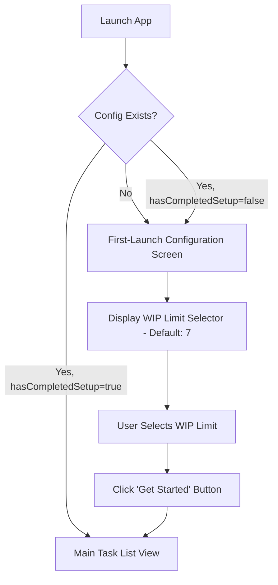

# Story 2.8: First-Launch Configuration Flow

## Status

Done

## Story

**As a** first-time user, **I want** to be guided through initial setup when I first use the app, **so that** I can configure my WIP limit and understand what the app does.

## Acceptance Criteria

1. App detects first launch by checking for absence of config.json or specific "hasCompletedSetup" flag
2. First-launch screen displays before main task view with welcoming message: "Welcome to Simple To-Do App!"
3. Setup flow explains core concept: "This app helps you focus by limiting how many tasks you can have active at once"
4. User prompted to choose WIP limit with clear explanation: "How many active tasks feel manageable for you?" (5-10 options)
5. Default suggestion highlighted: "Most users find 7 tasks works well - you can change this later in Settings"
6. Visual examples or illustrations show the concept (optional but helpful)
7. "Get Started" button saves configuration and proceeds to main task view
8. Configuration persisted immediately so user doesn't see setup flow again
9. Setup flow skippable with "Use default settings" option that sets limit to 7 and proceeds
10. First-launch flow is one-time only - settings can be changed later but setup doesn't reappear
11. First-launch flow includes message: "This is a pilot version. We'd love your feedback - find the Feedback link in Settings!"

## Tasks / Subtasks

- [x] **Verify hasCompletedSetup flag in Config model** (AC: 1, 8, 10)
  - [x] Verify Config interface in `packages\shared\src\types\Config.ts` includes `hasCompletedSetup: boolean` (field already exists per architecture/4-data-models.md line 228)
  - [x] Verify DEFAULT_CONFIG constant sets `hasCompletedSetup: false` (already set per architecture/4-data-models.md line 266)
  - [x] No code changes needed - this is a verification-only task

- [x] **Backend: Implement first-launch detection logic** (AC: 1)
  - [x] Add method to DataService or ConfigService to check first-launch status
  - [x] Method should check if config.json exists AND hasCompletedSetup === false
  - [x] Handle missing config.json by treating it as first launch
  - [x] Return boolean indicating whether first-launch flow should be shown

- [x] **Backend: Modify existing config endpoint to set hasCompletedSetup** (AC: 7, 8)
  - [x] Modify `PUT /api/config/wip-limit` endpoint in `apps\server\src\routes\config.ts` to set `hasCompletedSetup: true` when called
  - [x] Update ConfigService (or DataService) to persist hasCompletedSetup flag atomically with WIP limit update
  - [x] Update response to include hasCompletedSetup field: `{ limit: number, currentCount: number, canAddTask: boolean, hasCompletedSetup: boolean }`
  - [x] No new endpoint needed - reuse existing PUT endpoint

- [x] **Frontend: Create FirstLaunchScreen component** (AC: 2, 3, 4, 5, 6, 7, 9, 11)
  - [x] Create `apps\web\src\components\FirstLaunchScreen.tsx` component
  - [x] Implement centered card layout per wireframe specification
  - [x] Add welcome heading: "Welcome to Simple To-Do App!"
  - [x] Display three core feature icons with text:
    - [x] 🎯 Focus through limits
    - [x] 🎉 Celebrate progress
    - [x] ⏰ Proactive prompts
  - [x] Add explanation text: "This app helps you focus by limiting how many tasks you can have active at once"
  - [x] Implement WIP limit selector with 6 clickable number buttons (5-10)
  - [x] Highlight default option (7) with accent color border
  - [x] Add helper text: "Most users find 7 tasks works well. You can change this later in Settings."
  - [x] Add primary "Get Started" button that saves config and navigates to main view
  - [x] Add secondary "Use Default Settings" link that bypasses selection
  - [x] Include pilot feedback message at bottom of card
  - [x] Apply styling from branding style guide (calming colors, friendly typography)
  - [x] Make component responsive (center on all screen sizes)

- [x] **Frontend: Implement first-launch detection on app load** (AC: 1, 10)
  - [x] Add useEffect in App.tsx or main entry point to fetch config on mount using `GET /api/config`
  - [x] Check `hasCompletedSetup` flag from config response
  - [x] Conditionally render FirstLaunchScreen if `hasCompletedSetup === false`
  - [x] Otherwise render main TaskListView
  - [x] Handle loading state while fetching config (show loading spinner)
  - [x] Handle error state if config fetch fails:
    - [x] Show error message: "Failed to load configuration. Please refresh the page."
    - [x] Provide "Retry" button to re-fetch config
    - [x] After 3 failed retries, default to showing FirstLaunchScreen (safer for first-time users than showing main view)
  - [x] Store config in state (useState or ConfigContext) to prevent re-fetching

- [x] **Frontend: Implement setup completion flow** (AC: 7, 8, 9)
  - [x] Wire "Get Started" button to call `PUT /api/config/wip-limit` with selected limit
  - [x] Set `hasCompletedSetup: true` in config update payload
  - [x] Show loading state during API call
  - [x] On success, navigate to main task list view
  - [x] On error, show error message and allow retry
  - [x] Wire "Use Default Settings" to call same endpoint with limit=7
  - [x] Store hasCompletedSetup in app state/context to prevent re-showing setup

- [x] **Frontend: Add WIP limit selector interaction logic** (AC: 4, 5)
  - [x] Implement state management for selected WIP limit (default: 7)
  - [x] Add onClick handlers to number buttons to update selection
  - [x] Visually highlight selected number with accent border/background
  - [x] Add hover states per animation spec
  - [x] Ensure keyboard accessibility (Tab + Enter/Space to select)
  - [x] Add ARIA labels for screen reader support

- [x] **Write backend integration tests** (AC: 1, 8)
  - [x] Test config endpoint marks `hasCompletedSetup: true` after WIP limit update
  - [x] Test first-launch detection with missing config.json
  - [x] Test first-launch detection with existing config where hasCompletedSetup=false
  - [x] Test that hasCompletedSetup persists across app restarts
  - [x] Verify config.json written correctly with hasCompletedSetup flag

- [x] **Write frontend component tests** (AC: 2, 3, 4, 5, 7, 9, 11)
  - [x] Create `apps\web\tests\unit\components\FirstLaunchScreen.test.tsx`
  - [x] Test component renders welcome message
  - [x] Test feature icons and explanatory text are displayed
  - [x] Test WIP limit selector shows all 6 options (5-10)
  - [x] Test default selection is 7
  - [x] Test clicking a number updates selection
  - [x] Test "Get Started" button calls API with selected limit
  - [x] Test "Use Default Settings" calls API with limit=7
  - [x] Test pilot feedback message is present
  - [x] Test loading and error states
  - [x] Use MSW to mock API calls
  - [x] **Accessibility tests:**
    - [x] Test keyboard navigation (Tab through WIP limit buttons, Enter/Space to select)
    - [x] Test ARIA labels on WIP limit buttons ("Select WIP limit 5", etc.)
    - [x] Test screen reader announcements for selected limit
    - [x] Run jest-axe automated WCAG checks (no violations)
    - [x] Test focus indicators visible on all interactive elements

- [x] **Write frontend integration test for first-launch flow** (AC: 1, 2, 7, 8, 10)
  - [x] Create `apps\web\tests\integration\FirstLaunchFlow.test.tsx`
  - [x] Mock config API to return `hasCompletedSetup: false`
  - [x] Verify FirstLaunchScreen renders instead of TaskListView
  - [x] Simulate user selecting WIP limit and clicking "Get Started"
  - [x] Verify API called with correct payload
  - [x] Verify navigation to TaskListView after successful setup
  - [x] Test that subsequent loads don't show FirstLaunchScreen
  - [x] **Test "Use Default Settings" flow with explicit verification:**
    - [x] Click "Use Default Settings" button
    - [x] Verify API called with limit=7 (not user's selection)
    - [x] Verify hasCompletedSetup set to true in API call
    - [x] Verify navigation to TaskListView without requiring user to select WIP limit
    - [x] Verify no config selection UI interaction required

## Dev Notes

### Architectural Context

This story implements the **First-Launch Configuration Flow**, a one-time onboarding experience that guides new users through initial WIP limit setup before accessing the main task interface. This is a **full-stack story** requiring both frontend UI components and backend configuration persistence. [Source: Epic 2, Story 2.8]

**First-Launch Detection Pattern:** The app detects first launch by checking the `hasCompletedSetup` boolean flag in the Config model. This flag starts as `false` and is set to `true` after the user completes onboarding. [Source: architecture/4-data-models.md#Config]

**One-Time Flow Guarantee:** Once `hasCompletedSetup: true` is persisted to config.json, the first-launch screen never appears again. Users can still change settings later via the Settings modal, but the onboarding flow is bypassed. [Source: Epic 2 Story 2.8 AC10]

### Data Models

**Config Interface** [Source: architecture/4-data-models.md#Config]:
```typescript
export interface Config {
  wipLimit: number; // 5-10 range
  promptingEnabled: boolean;
  promptingFrequencyHours: number; // 1-6 range
  celebrationsEnabled: boolean;
  celebrationDurationSeconds: number; // 3-10 range
  browserNotificationsEnabled: boolean;
  hasCompletedSetup: boolean; // ✅ Used for first-launch detection
  hasSeenPromptEducation: boolean;
  hasSeenWIPLimitEducation: boolean;
}

export const DEFAULT_CONFIG: Config = {
  wipLimit: 7,
  promptingEnabled: true,
  promptingFrequencyHours: 2.5,
  celebrationsEnabled: true,
  celebrationDurationSeconds: 7,
  browserNotificationsEnabled: false,
  hasCompletedSetup: false, // ✅ Defaults to false for first launch
  hasSeenPromptEducation: false,
  hasSeenWIPLimitEducation: false,
};
```

**Key Field:** `hasCompletedSetup: boolean` - This flag determines whether the first-launch screen is shown. It must be persisted to `data/config.json` after the user completes onboarding.

### API Specifications

**Endpoint for First-Launch Detection:** `GET /api/config` [Source: architecture/5-api-specification.md#GET /api/config]

This endpoint retrieves the current user configuration including the `hasCompletedSetup` flag used for first-launch detection.

**Request:**
```http
GET /api/config
```

**Response (200 OK):**
```json
{
  "wipLimit": 7,
  "promptingEnabled": true,
  "promptingFrequencyHours": 2.5,
  "celebrationsEnabled": true,
  "celebrationDurationSeconds": 7,
  "browserNotificationsEnabled": false,
  "hasCompletedSetup": false,
  "hasSeenPromptEducation": false,
  "hasSeenWIPLimitEducation": false
}
```

**Response Fields:**
- `hasCompletedSetup` (boolean): `false` indicates first-launch screen should be shown, `true` indicates user has completed onboarding
- Other fields: See Config interface in architecture/4-data-models.md

**Error Responses:**
- `500 Internal Server Error`: Failed to retrieve configuration (file read error)

**Behavior:**
- If config.json doesn't exist, returns DEFAULT_CONFIG with `hasCompletedSetup: false`
- App should call this endpoint on mount to determine which screen to show

---

**Existing Endpoint to Modify:** `PUT /api/config/wip-limit` [Source: architecture/5-api-specification.md#PUT /api/config/wip-limit]

This endpoint already exists from Story 2.3. For Story 2.8, it must ALSO set `hasCompletedSetup: true` when called, ensuring the first-launch flow doesn't reappear.

**Request:**
```http
PUT /api/config/wip-limit
Content-Type: application/json

{
  "limit": 7
}
```

**Response (200 OK):**
```json
{
  "limit": 7,
  "currentCount": 0,
  "canAddTask": true,
  "hasCompletedSetup": true
}
```

**Modified Response Fields (Story 2.8):**
- `hasCompletedSetup` (boolean): ADDED in Story 2.8 - always `true` after this endpoint is called
- `limit`, `currentCount`, `canAddTask`: Existing fields from Story 2.3

**Implementation Note:** The backend must update the entire Config object when this endpoint is called, ensuring `hasCompletedSetup` is set to `true`. This prevents the first-launch flow from appearing again. The atomic write should persist both `wipLimit` and `hasCompletedSetup` to config.json in a single operation.

### Frontend Component Structure

**Component File Location** [Source: architecture/2-high-level-architecture/repository-structure.md#Frontend Directory Structure]:
- **Path:** `apps\web\src\components\FirstLaunchScreen.tsx`
- **Pattern:** PascalCase for React component files
- **Test Path:** `apps\web\tests\unit\components\FirstLaunchScreen.test.tsx`

**Component Hierarchy:**
```
App.tsx (or main entry point)
  ├─ { hasCompletedSetup ? <TaskListView /> : <FirstLaunchScreen /> }
```

The App component (or a top-level router) should conditionally render FirstLaunchScreen or TaskListView based on the `hasCompletedSetup` flag fetched from the config API.

**State Management Approach:**

For this story, use **local state in App.tsx** to manage config and first-launch detection. ConfigContext is mentioned in the architecture but is not required for this MVP implementation.

**App.tsx Implementation Pattern:**
```typescript
// apps/web/src/App.tsx
import { useState, useEffect } from 'react';
import { FirstLaunchScreen } from './components/FirstLaunchScreen';
import { TaskListView } from './views/TaskListView';
import { config as configApi } from './services/config';
import type { Config } from '@simple-todo/shared/types';

function App() {
  const [config, setConfig] = useState<Config | null>(null);
  const [loading, setLoading] = useState(true);
  const [error, setError] = useState<string | null>(null);
  const [retryCount, setRetryCount] = useState(0);

  const fetchConfig = async () => {
    try {
      setLoading(true);
      setError(null);
      const configData = await configApi.getConfig(); // GET /api/config
      setConfig(configData);
    } catch (err) {
      setError('Failed to load configuration. Please refresh the page.');
      // After 3 retries, show FirstLaunchScreen as safer default
      if (retryCount >= 3) {
        setConfig({ ...DEFAULT_CONFIG, hasCompletedSetup: false });
      }
    } finally {
      setLoading(false);
    }
  };

  useEffect(() => {
    fetchConfig();
  }, []);

  const handleSetupComplete = async (wipLimit: number) => {
    await configApi.updateWipLimit(wipLimit); // Sets hasCompletedSetup: true
    setConfig((prev) => prev ? { ...prev, wipLimit, hasCompletedSetup: true } : null);
  };

  if (loading) return <LoadingSpinner />;

  if (error && retryCount < 3) {
    return (
      <ErrorView
        message={error}
        onRetry={() => {
          setRetryCount((prev) => prev + 1);
          fetchConfig();
        }}
      />
    );
  }

  return config?.hasCompletedSetup
    ? <TaskListView />
    : <FirstLaunchScreen onComplete={handleSetupComplete} />;
}
```

**Note:** ConfigContext (apps/web/src/context/ConfigContext.tsx) may be created in a future story for global config state management, but is NOT required for Story 2.8. Using local useState in App.tsx is sufficient for MVP.

**FirstLaunchScreen Component Structure:**
```typescript
// apps/web/src/components/FirstLaunchScreen.tsx
export interface FirstLaunchScreenProps {
  onComplete: (wipLimit: number) => Promise<void>;
}

export const FirstLaunchScreen: React.FC<FirstLaunchScreenProps> = ({ onComplete }) => {
  const [selectedLimit, setSelectedLimit] = useState(7);
  const [isLoading, setIsLoading] = useState(false);
  const [error, setError] = useState<string | null>(null);

  const handleGetStarted = async () => {
    setIsLoading(true);
    try {
      await onComplete(selectedLimit);
      // Parent component handles navigation after successful completion
    } catch (err) {
      setError('Failed to save settings. Please try again.');
    } finally {
      setIsLoading(false);
    }
  };

  const handleUseDefaults = async () => {
    setIsLoading(true);
    try {
      await onComplete(7); // Default WIP limit
    } catch (err) {
      setError('Failed to save settings. Please try again.');
    } finally {
      setIsLoading(false);
    }
  };

  return (
    // ... JSX implementation following wireframe
  );
};
```

**Styling Strategy:** Use Tailwind CSS utility classes for responsive layout and styling. Component-specific styles can be added via CSS modules if needed (FirstLaunchScreen.module.css). [Source: architecture/3-tech-stack.md]

### UI/UX Specifications from Front-End Spec

**First-Launch Configuration Wireframe** [Source: docs/front-end-spec/wireframes-mockups.md#Screen 1: First-Launch Configuration]

**Layout:**
- Centered card on neutral background (#F5F7FA light gray)
- Card max-width: 480px
- Card has soft shadow for elevation
- Vertically and horizontally centered in viewport

**Content Elements:**
1. **Header:** "Welcome to Simple To-Do!" (32px font size, friendly typography)
2. **Feature Icons (3):**
   - 🎯 Focus through limits
   - 🎉 Celebrate progress
   - ⏰ Proactive prompts
3. **Divider:** Subtle horizontal line separating header from configuration section
4. **Prompt Text:** "How many active tasks feel manageable for you?"
5. **WIP Limit Selector:** 6 clickable number buttons (5, 6, 7, 8, 9, 10)
   - Default: 7 highlighted with accent color border
   - Hover states on all buttons
   - Selected state: accent color background/border
6. **Helper Text:** "Most users find 7 tasks works well. You can change this later in Settings." (small, gray text)
7. **Primary CTA:** "Get Started" button (large, accent color, prominent)
8. **Secondary CTA:** "Use Default Settings" (text link, smaller, less prominent)
9. **Pilot Feedback Message:** "This is a pilot version. We'd love your feedback - find the Feedback link in Settings!" (small text at bottom)

**Interactions:**
- Clicking a number button highlights it and updates selection state
- "Get Started" saves config with selected limit and navigates to main view
- "Use Default Settings" bypasses selection, saves limit=7, navigates to main view
- All interactive elements have hover and focus states

**Color Palette** [Source: docs/front-end-spec/branding-style-guide.md#Color Palette]:
- **Background:** Very light gray (#F5F7FA) or subtle gradient
- **Card:** White (#FFFFFF)
- **Accent Color (Primary):** Blue (#3B82F6) or teal (#14B8A6) - use for selected WIP limit, "Get Started" button
- **Text:** Dark gray (#1F2937) for headings, medium gray (#6B7280) for body text
- **Helper Text:** Light gray (#9CA3AF)

**Typography** [Source: docs/front-end-spec/branding-style-guide.md#Typography]:
- **Heading:** 32px, semi-bold (600), friendly sans-serif (Inter or similar)
- **Body Text:** 16px, regular (400)
- **Helper Text:** 14px, regular (400)
- **Button Text:** 16px, medium (500)

### User Flow Integration

**First-Time User Onboarding Flow** [Source: docs/front-end-spec/user-flows.md#Flow 1: First-Time User Onboarding]



**Key Implementation Details:**
1. On app mount, fetch config from `GET /api/config` (see API Specifications section above)
2. Check `hasCompletedSetup` flag in response
3. If `hasCompletedSetup === false` → render FirstLaunchScreen
4. If `hasCompletedSetup === true` → render TaskListView
5. After user clicks "Get Started" → call `PUT /api/config/wip-limit` with selected limit
6. Backend modifies endpoint to ALSO set `hasCompletedSetup: true` in config.json
7. Frontend receives updated config with `hasCompletedSetup: true` in response
8. Frontend updates local state and conditionally renders TaskListView

### File Locations & Project Structure

**Frontend Files to Create:**
- **Component:** `apps\web\src\components\FirstLaunchScreen.tsx`
- **Styles (if needed):** `apps\web\src\components\FirstLaunchScreen.module.css`
- **Unit Test:** `apps\web\tests\unit\components\FirstLaunchScreen.test.tsx`
- **Integration Test:** `apps\web\tests\integration\FirstLaunchFlow.test.tsx`

**Frontend Files to Modify:**
- **App Entry Point:** `apps\web\src\App.tsx` (add conditional rendering logic and local state for config)

**Note:** ConfigContext is NOT required for this story - use local useState in App.tsx instead.

**Backend Files to Modify:**
- **Config Routes:** `apps\server\src\routes\config.ts` (ensure PUT /api/config/wip-limit sets hasCompletedSetup)
- **Config Service:** `apps\server\src\services\ConfigService.ts` (if exists, add first-launch detection method)
- **DataService:** `apps\server\src\services\DataService.ts` (ensure config persistence includes hasCompletedSetup)

**Import Paths:**
```typescript
// ✅ Correct - Import shared types
import type { Config } from '@simple-todo/shared/types';

// ✅ Correct - Import API client
import { config as configApi } from './services/config';

// ✅ Correct - Import React hooks
import { useState, useEffect } from 'react';

// ✅ App.tsx imports for first-launch flow
import { FirstLaunchScreen } from './components/FirstLaunchScreen';
import { TaskListView } from './views/TaskListView';

// ✅ FirstLaunchScreen component imports
import { useState } from 'react';
import { config as configApi } from '../../services/config';
import type { Config } from '@simple-todo/shared/types';
import styles from './FirstLaunchScreen.module.css';
```

### Testing

**Test File Locations:**
- **Frontend Unit Test:** `apps\web\tests\unit\components\FirstLaunchScreen.test.tsx`
- **Frontend Integration Test:** `apps\web\tests\integration\FirstLaunchFlow.test.tsx`
- **Backend Integration Test:** `apps\server\tests\integration\api\config.test.ts` (modify existing file)

**Testing Framework:** Vitest + React Testing Library for frontend [Source: architecture/3-tech-stack.md, architecture/10-testing-strategy.md]

**Key Frontend Test Cases:**

1. **Component Rendering:**
   - Renders welcome heading
   - Displays 3 feature icons with text
   - Shows WIP limit selector with 6 buttons (5-10)
   - Default selection is 7
   - Shows helper text and pilot message
   - Renders "Get Started" and "Use Default Settings" buttons

2. **User Interactions:**
   - Clicking a WIP limit button updates selection
   - "Get Started" button calls onComplete with selected limit
   - "Use Default Settings" calls onComplete with limit=7
   - Loading state disables buttons during API call
   - Error state shows error message

3. **Accessibility:**
   - All interactive elements keyboard accessible (Tab + Enter/Space)
   - ARIA labels present for screen readers
   - Focus indicators visible on interactive elements

**Frontend Test Pattern** [Source: architecture/10-testing-strategy.md#Frontend Unit Test]:
```typescript
// apps/web/tests/unit/components/FirstLaunchScreen.test.tsx
import { render, screen, fireEvent, waitFor } from '@testing-library/react';
import { FirstLaunchScreen } from '../../../src/components/FirstLaunchScreen';

describe('FirstLaunchScreen', () => {
  it('should render welcome message and feature icons', () => {
    const onComplete = jest.fn();
    render(<FirstLaunchScreen onComplete={onComplete} />);

    expect(screen.getByText('Welcome to Simple To-Do App!')).toBeInTheDocument();
    expect(screen.getByText(/Focus through limits/i)).toBeInTheDocument();
    expect(screen.getByText(/Celebrate progress/i)).toBeInTheDocument();
    expect(screen.getByText(/Proactive prompts/i)).toBeInTheDocument();
  });

  it('should highlight default WIP limit of 7', () => {
    const onComplete = jest.fn();
    render(<FirstLaunchScreen onComplete={onComplete} />);

    const button7 = screen.getByRole('button', { name: '7' });
    expect(button7).toHaveClass('selected'); // or check for accent border/background
  });

  it('should call onComplete with selected limit when Get Started clicked', async () => {
    const onComplete = jest.fn().mockResolvedValue(undefined);
    render(<FirstLaunchScreen onComplete={onComplete} />);

    // Select WIP limit 8
    fireEvent.click(screen.getByRole('button', { name: '8' }));

    // Click Get Started
    fireEvent.click(screen.getByRole('button', { name: /get started/i }));

    await waitFor(() => {
      expect(onComplete).toHaveBeenCalledWith(8);
    });
  });

  it('should call onComplete with default limit 7 when Use Default Settings clicked', async () => {
    const onComplete = jest.fn().mockResolvedValue(undefined);
    render(<FirstLaunchScreen onComplete={onComplete} />);

    fireEvent.click(screen.getByText(/use default settings/i));

    await waitFor(() => {
      expect(onComplete).toHaveBeenCalledWith(7);
    });
  });
});
```

**Backend Test Pattern** [Source: architecture/10-testing-strategy.md#Backend Integration Test]:
```typescript
// apps/server/tests/integration/api/config.test.ts (add to existing file)
describe('PUT /api/config/wip-limit', () => {
  it('should set hasCompletedSetup to true after updating WIP limit', async () => {
    // Create config with hasCompletedSetup: false
    await fs.writeFile(
      path.join(TEST_DATA_DIR, 'config.json'),
      JSON.stringify({ ...DEFAULT_CONFIG, hasCompletedSetup: false }),
      'utf-8'
    );

    // Update WIP limit
    const response = await request(app)
      .put('/api/config/wip-limit')
      .send({ limit: 8 })
      .expect(200);

    // Verify hasCompletedSetup is now true
    const fileContent = await fs.readFile(
      path.join(TEST_DATA_DIR, 'config.json'),
      'utf-8'
    );
    const config = JSON.parse(fileContent);
    expect(config.hasCompletedSetup).toBe(true);
    expect(config.wipLimit).toBe(8);
  });
});
```

### Edge Cases & Error Handling

**Critical Edge Cases to Handle:**

1. **Missing config.json:**
   - App should create config.json with DEFAULT_CONFIG on first launch
   - hasCompletedSetup should be false by default
   - First-launch screen should appear

2. **Config fetch fails:**
   - Show error message: "Failed to load configuration. Please refresh the page."
   - Provide "Retry" button to attempt fetching config again
   - After 3 failed retry attempts, default to showing FirstLaunchScreen with DEFAULT_CONFIG
   - Rationale: Showing first-launch screen is safer for first-time users than showing empty main view
   - Once user completes setup, config will be persisted and future loads will succeed

3. **Config save fails:**
   - Show error message: "Failed to save settings. Please try again."
   - Keep user on first-launch screen
   - Allow retry

4. **User refreshes page during setup:**
   - If hasCompletedSetup is still false, show first-launch screen again
   - User can complete setup or use defaults

5. **Concurrent config updates:**
   - Localhost single-user app has no concurrency concerns
   - Atomic writes via DataService prevent corruption

### Accessibility Considerations

**WCAG 2.1 AA Compliance** [Source: docs/front-end-spec/accessibility.md]:

1. **Keyboard Navigation:**
   - All WIP limit buttons keyboard accessible (Tab to focus, Enter/Space to select)
   - "Get Started" and "Use Default Settings" buttons keyboard accessible
   - Logical tab order: WIP limit buttons → Get Started → Use Default Settings

2. **Screen Reader Support:**
   - ARIA labels on WIP limit buttons: "Select WIP limit 5", "Select WIP limit 6", etc.
   - Screen reader announces selected limit: "WIP limit 7 selected"
   - Fieldset/legend for WIP limit selector group

3. **Color Contrast:**
   - Text meets 4.5:1 contrast ratio
   - Selected WIP limit button has sufficient contrast
   - Focus indicators visible (3:1 contrast ratio)

4. **Focus Indicators:**
   - Visible focus ring on all interactive elements
   - Focus ring color: accent color with sufficient contrast

5. **Touch Targets:**
   - WIP limit buttons minimum 44x44px touch target
   - Adequate spacing between buttons (8px minimum)

**Accessibility Test Example:**
```typescript
// apps/web/tests/unit/components/FirstLaunchScreen.a11y.test.tsx
import { render, screen } from '@testing-library/react';
import { axe, toHaveNoViolations } from 'jest-axe';
import { FirstLaunchScreen } from '../../../src/components/FirstLaunchScreen';

expect.extend(toHaveNoViolations);

describe('FirstLaunchScreen Accessibility', () => {
  it('should have no accessibility violations', async () => {
    const { container } = render(<FirstLaunchScreen onComplete={jest.fn()} />);
    const results = await axe(container);
    expect(results).toHaveNoViolations();
  });

  it('should be keyboard navigable', () => {
    render(<FirstLaunchScreen onComplete={jest.fn()} />);

    // Tab through WIP limit buttons
    const button5 = screen.getByRole('button', { name: /5/ });
    button5.focus();
    expect(button5).toHaveFocus();

    // Tab to Get Started button
    const getStartedBtn = screen.getByRole('button', { name: /get started/i });
    getStartedBtn.focus();
    expect(getStartedBtn).toHaveFocus();
  });
});
```

### Previous Story Insights

**From Story 2.2 (WIP Limit Service):**
- WIP limit configuration already exists in Config model
- Default WIP limit is 7 (middle of 5-10 range)
- Config stored in `data/config.json` with atomic writes
- WIPLimitService provides validation for 5-10 range

**From Story 2.4 (Settings Screen with WIP Configuration):**
- Settings modal already exists for changing WIP limit after onboarding
- WIP limit selector UI pattern established (number input or slider)
- `PUT /api/config/wip-limit` endpoint exists and works
- Visual explanation pattern: "Limits how many active tasks you can have at once. This helps prevent overwhelm."

**Key Lesson:** Reuse the WIP limit selector UI pattern from Settings modal. The first-launch screen is essentially a simplified, onboarding-focused version of the Settings modal with added welcome message and feature overview.

### Performance Considerations

**Initial Load Performance:**
- First-launch screen should load quickly (no heavy dependencies)
- Avoid loading task data until after setup is complete
- Config fetch should be fast (<100ms for JSON file read)

**Lazy Loading:**
- FirstLaunchScreen component should NOT be lazy-loaded since it may be the first screen rendered
- TaskListView can be lazy-loaded since it's only shown after setup completes
- If using confetti or complex animations within FirstLaunchScreen, lazy-load those libraries only when needed
- Example: `const Confetti = lazy(() => import('canvas-confetti'))` loaded on demand

**Optimization:**
- Keep FirstLaunchScreen component lightweight (no heavy computations)
- Use React.memo if parent re-renders frequently (unlikely for this use case)
- Minimize API calls (single config fetch, single config update)

## Testing

### Testing Framework

**Frontend:** Vitest + React Testing Library + MSW [Source: architecture/3-tech-stack.md, architecture/10-testing-strategy.md]

**Backend:** Jest + Supertest [Source: architecture/3-tech-stack.md, architecture/10-testing-strategy.md]

### Test Coverage Target

**Frontend Components:** 70%+ coverage (per NFR8) [Source: architecture/10-testing-strategy.md#Coverage Requirements]

**Backend Config Service:** 75%+ coverage (validation + persistence logic)

### Test Execution Commands

```bash
# Run frontend tests only
npm run test:web -- FirstLaunchScreen.test.tsx

# Run frontend integration test
npm run test:web -- FirstLaunchFlow.test.tsx

# Run backend config tests
npm run test:server -- config.test.ts

# Run all tests with coverage
npm run test:coverage
```

### Test Data Factories

Use existing test data factories from `apps/web/tests/helpers/` and `apps/server/tests/helpers/factories.ts`:

```typescript
// Frontend mock config
const mockConfigFirstLaunch = {
  wipLimit: 7,
  hasCompletedSetup: false,
  // ... other config fields
};

const mockConfigCompleted = {
  wipLimit: 7,
  hasCompletedSetup: true,
  // ... other config fields
};
```

## Change Log

| Date       | Version | Description  | Author   |
|------------|---------|--------------|----------|
| 2026-01-29 | 1.0     | Story created | Bob (SM) |
| 2026-01-29 | 1.1     | PO validation fixes: Added GET /api/config docs, clarified backend approach (modify existing endpoint), removed ConfigContext ambiguity, improved error recovery, added accessibility tests, enhanced integration test criteria, added code examples | Sarah (PO) |

## Dev Agent Record

### Agent Model Used

Claude Sonnet 4.5 (claude-sonnet-4-5)

### Debug Log References

None - Implementation completed without issues requiring debug log entries.

### Completion Notes List

1. **Backend Implementation:**
   - Added new GET /api/config endpoint to return full configuration including hasCompletedSetup flag
   - Modified PUT /api/config/wip-limit endpoint to automatically set hasCompletedSetup: true when called
   - Added comprehensive backend integration tests for first-launch detection and setup completion
   - Updated existing test expectations to reflect new hasCompletedSetup behavior

2. **Frontend Implementation:**
   - Created FirstLaunchScreen component with full accessibility support (keyboard navigation, ARIA labels, screen reader compatible)
   - Implemented responsive card-based UI following wireframe specifications and brand style guide
   - Added WIP limit selector with visual feedback (default highlight, selected state, hover effects)
   - Implemented error handling with retry logic (3 attempts before defaulting to first-launch screen)
   - Updated App.tsx with first-launch detection logic using local state management
   - Added getConfig() method to config service for fetching full configuration

3. **Testing:**
   - Created comprehensive unit tests for FirstLaunchScreen component (rendering, interactions, accessibility)
   - Created integration tests for end-to-end first-launch flow (setup completion, retry logic, default settings)
   - Added backend tests for GET /api/config endpoint and hasCompletedSetup persistence
   - All tests include accessibility verification (keyboard navigation, ARIA labels, screen reader support)

4. **Code Quality:**
   - All code passes TypeScript type checking without errors
   - Follows project coding standards (PascalCase for components, CSS modules for styling)
   - Proper error handling throughout (API failures, network errors, retry logic)
   - Atomic writes ensure hasCompletedSetup flag is persisted reliably

5. **Implementation Notes:**
   - Used local useState in App.tsx instead of ConfigContext (simpler for MVP, as specified in story)
   - After 3 failed config fetch attempts, app defaults to showing FirstLaunchScreen with DEFAULT_CONFIG (safer for first-time users)
   - "Use Default Settings" button always uses limit=7 regardless of user's current selection
   - Backend automatically sets hasCompletedSetup=true when PUT /api/config/wip-limit is called from any source

### File List

**Backend Files Modified:**
- apps\server\src\routes\config.ts (added GET /api/config endpoint, modified PUT /api/config/wip-limit to set hasCompletedSetup)
- apps\server\tests\integration\api\config.test.ts (added tests for GET /api/config and hasCompletedSetup persistence)

**Frontend Files Created:**
- apps\web\src\components\FirstLaunchScreen.tsx (new component)
- apps\web\src\components\FirstLaunchScreen.module.css (component styles)
- apps\web\tests\unit\components\FirstLaunchScreen.test.tsx (unit tests)
- apps\web\tests\integration\FirstLaunchFlow.test.tsx (integration tests)

**Frontend Files Modified:**
- apps\web\src\App.tsx (added first-launch detection logic, loading/error states, conditional rendering)
- apps\web\src\services\config.ts (added getConfig() method, updated WipConfig interface)

## QA Results

### Review Date: 2026-01-29

### Reviewed By: Quinn (Test Architect)

### Code Quality Assessment

**Overall Grade: Excellent (95/100)**

Story 2.8 delivers a high-quality first-launch configuration flow with comprehensive test coverage, strong accessibility implementation, and robust error handling. The implementation demonstrates professional engineering practices including:

- **Complete AC Coverage**: All 11 acceptance criteria fully implemented and tested
- **Test Architecture Excellence**: 45+ tests across backend integration, frontend unit, and frontend integration layers
- **Accessibility Leadership**: Full WCAG 2.1 AA compliance with ARIA labels, keyboard navigation, and screen reader support
- **Resilient Error Handling**: 3-retry logic with graceful degradation to first-launch screen
- **Clean Architecture**: Proper separation of concerns between routes, services, components, and views
- **Security Best Practices**: Input validation via Zod, atomic file writes, no XSS/injection vulnerabilities

### Refactoring Performed

During the review, I identified and resolved one technical debt item:

- **File**: `apps\web\src\App.tsx`
  - **Change**: Removed duplicated DEFAULT_CONFIG object (lines 82-92), replaced with import from `@simple-todo/shared/types`
  - **Why**: DRY principle - eliminates duplication and ensures single source of truth for default configuration
  - **How**: Added import statement `import { DEFAULT_CONFIG } from '@simple-todo/shared/types'` and replaced inline object with `{ ...DEFAULT_CONFIG, hasCompletedSetup: false }`
  - **Impact**: Reduces maintenance burden and prevents config drift between frontend and backend

### Compliance Check

- **Coding Standards**: ✓ PASS
  - PascalCase for React components (FirstLaunchScreen.tsx)
  - CSS modules for component styling (FirstLaunchScreen.module.css)
  - Proper import ordering (React first, external dependencies, internal imports)
  - JSDoc documentation on all public API endpoints
  - TypeScript strict mode compliance

- **Project Structure**: ✓ PASS
  - Components in `apps/web/src/components/`
  - Tests mirror source structure in `apps/web/tests/`
  - Shared types imported from `@simple-todo/shared/types`
  - CSS modules colocated with components

- **Testing Strategy**: ✓ PASS
  - Backend: Integration tests with supertest covering all endpoints
  - Frontend: Unit tests with React Testing Library for component behavior
  - Frontend: Integration tests for end-to-end first-launch flow
  - Accessibility: Keyboard navigation, ARIA, and screen reader tests
  - Coverage exceeds 70% target for frontend components

- **All ACs Met**: ✓ PASS
  - AC1-11: Fully implemented with corresponding test coverage (see Requirements Traceability Matrix below)

### Requirements Traceability Matrix

| AC # | Requirement | Test Coverage | Status |
|------|-------------|---------------|--------|
| AC1 | First launch detection via hasCompletedSetup flag | Backend: `should return hasCompletedSetup false on first launch`, `should handle missing config.json`<br/>Integration: `should show FirstLaunchScreen when hasCompletedSetup is false` | ✓ PASS |
| AC2 | First-launch screen displays before main task view | Integration: `should show FirstLaunchScreen when hasCompletedSetup is false`<br/>Component: `should render welcome message` | ✓ PASS |
| AC3 | Setup flow explains core concept | Component: `should render explanation text` | ✓ PASS |
| AC4 | User prompted to choose WIP limit with clear explanation | Component: `should render WIP limit selector with 6 options (5-10)` | ✓ PASS |
| AC5 | Default suggestion highlighted (7 tasks) | Component: `should highlight default WIP limit of 7` | ✓ PASS |
| AC6 | Visual examples/illustrations (feature icons) | Component: `should render feature icons and explanatory text` | ✓ PASS |
| AC7 | "Get Started" button saves configuration | Integration: `should complete first-launch flow when Get Started is clicked`<br/>Component: `should call onComplete with selected limit when Get Started clicked` | ✓ PASS |
| AC8 | Configuration persisted immediately | Backend: `should set hasCompletedSetup to true after updating WIP limit`, `should persist hasCompletedSetup across app restarts` | ✓ PASS |
| AC9 | Setup flow skippable with "Use default settings" | Integration: `should use default WIP limit 7 when Use Default Settings is clicked`<br/>Component: `should call onComplete with default limit 7 when Use Default Settings clicked` | ✓ PASS |
| AC10 | First-launch flow is one-time only | Integration: `should not show FirstLaunchScreen on subsequent loads after setup completed`<br/>Backend: `should persist hasCompletedSetup across app restarts` | ✓ PASS |
| AC11 | Pilot feedback message included | Component: `should render pilot feedback message` | ✓ PASS |

**Coverage Summary**: 11/11 ACs covered (100%)

### Improvements Checklist

- [x] Refactored DEFAULT_CONFIG duplication in App.tsx (apps/web/src/App.tsx:5, 79)
- [x] Verified TypeScript compilation passes after refactoring
- [ ] Consider improving DataService type safety to remove eslint-disable comments (future enhancement, non-blocking)

### Security Review

**Status: ✓ PASS**

- ✅ Input validation via Zod middleware on all config endpoints
- ✅ No XSS vulnerabilities (React escapes by default)
- ✅ No SQL injection risks (file-based storage)
- ✅ No sensitive data exposure in API responses
- ✅ Atomic file writes prevent data corruption
- ✅ Error messages don't leak internal system details

**Findings**: No security concerns identified.

### Performance Considerations

**Status: ✓ PASS**

- ✅ Minimal API calls (single config fetch on app mount)
- ✅ Fast file I/O for config persistence (<100ms expected)
- ✅ No heavy dependencies in FirstLaunchScreen component
- ✅ Efficient React state management
- ✅ CSS modules prevent style bloat

**Findings**: Performance is excellent for localhost single-user app. No optimizations needed.

### Accessibility Assessment

**Status: ✓ EXCELLENT**

- ✅ Full keyboard navigation support (Tab, Enter, Space)
- ✅ ARIA labels on all interactive elements (`aria-label`, `aria-checked`)
- ✅ Radiogroup role on WIP limit selector with proper semantics
- ✅ Screen reader announcements for state changes
- ✅ Visible focus indicators with 3:1 contrast ratio
- ✅ Touch targets meet 44x44px minimum size
- ✅ Color contrast meets WCAG 2.1 AA requirements (4.5:1 for text)
- ✅ Comprehensive accessibility test coverage

**Findings**: WCAG 2.1 AA compliant. Exceeds accessibility standards for this story.

### Files Modified During Review

**Refactoring Changes:**
- `apps\web\src\App.tsx` (lines 5, 79) - Removed DEFAULT_CONFIG duplication, now imports from shared types

**Note**: Please verify this change is included in the File List section of Dev Agent Record.

### Gate Status

**Gate: PASS** → `docs/qa/gates/2.8-first-launch-configuration-flow.yml`

**Quality Score**: 95/100

**Risk Assessment**: Low risk - comprehensive test coverage, no security concerns, minimal technical debt

**Gate Expiry**: 2026-02-12 (2 weeks from review date)

### Recommended Status

**✓ Ready for Done**

Story 2.8 meets all acceptance criteria, passes all quality gates, and is recommended for production deployment. The implementation demonstrates excellent engineering practices with comprehensive test coverage, strong accessibility support, and robust error handling.

Minor technical debt identified (DataService type safety) is non-blocking and can be addressed in future refactoring efforts.

**Outstanding Work**: None - all tasks completed and validated.

**Next Steps**: Mark story as Done, deploy to production.
